## 数据日志快速入门

数据日志文件按照标准 CSV 格式存储在 S7-1200 CPU 装载存储器或 S7-1200 SIMATIC 存储卡中。分别可通过 PLC Web 服务器或将数据文件传送到 PC 进行管理、查看。

### **测试目的**

下面以数据日志文件存储在 S7-1200 CPU 装载存储器中，使用PLC Web 服务器进行管理为例，实现下述功能：

（1）执行“DataLogging”指令将产品型号“Type”，长度“Length”，宽度“Width”三个变量值写入到 “Product”数据日志文件；

（2）当写入的条数达到设定的3条日志条数时，自动关闭“Product”数据日志文件 ；

（3）当写入的条数达到设定的3条日志条数时，可选择以下两种情况之一再分别写入数据日志：

情况一：如果旧的变量值允许被新的变量值覆盖，再打开“Product”数据日志文件，循环写入1条数据日志；

情况二：如果想保存之前的变量值，创建一个新的“NewProduct”数据日志文件，再写入1条新的数据日志。

（4）数据日志管理，先清空“Product”数据日志文件内的数据日志，然后直接删除“Product”数据日志文件。

### **测试环境**

软件：TIA V16 Professional

硬件：CPU1215C DC/DC/DC V4.4 订货号:6ES7 215-1AG40-0XB0

### 实现步骤

**1\. 启用 Web 服务器**

按照以下路径和方法为要连接的 CPU 启用 Web 服务器：“设备视图”->“鼠标选中CPU”->“属性”->“Web服务器”->“启用模块上的Web服务器”前打钩。如下图1所示：

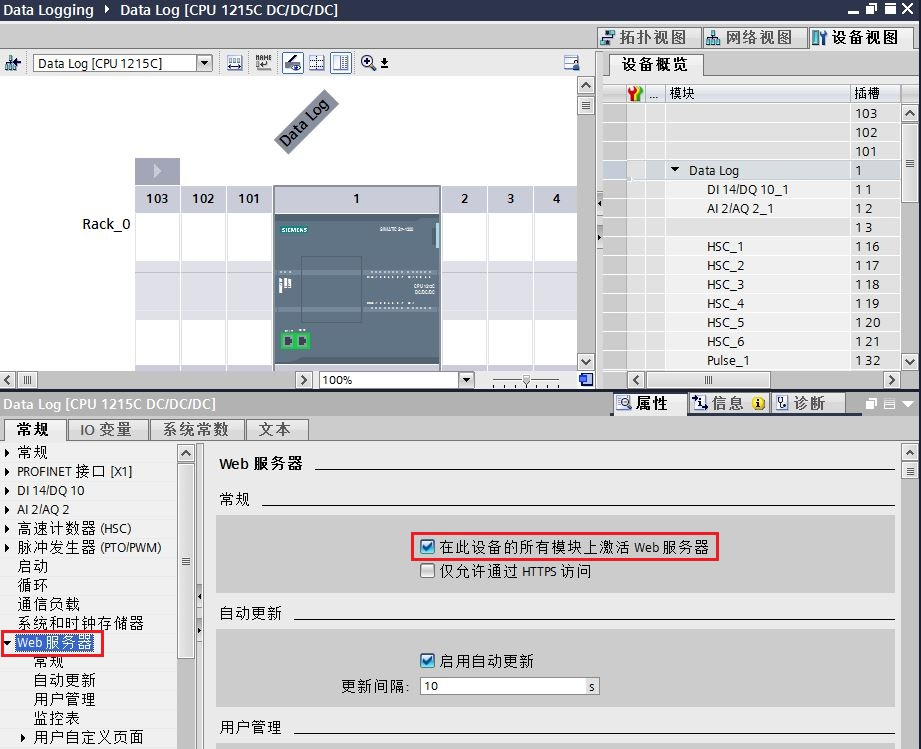

图1.启用Web服务器

**2\. 创建数据日志参数DB**

数据日志名称和日志内所有数据元素的数据类型、列标题参数，分别由 Name、Data 和 Header 分配。因此需先创建数据日志参数DB 块，支持优化或非优化DB块，此处使用的为优化DB块。

在该 DB 中，创建数据日志名称（如Product）、新名称（如NewProduct），标题（如Type，Length，Width）， Data 结构和DataLogID数组用于存放数据日志的ID，以便多个日志文件的管理。如下图2所示：

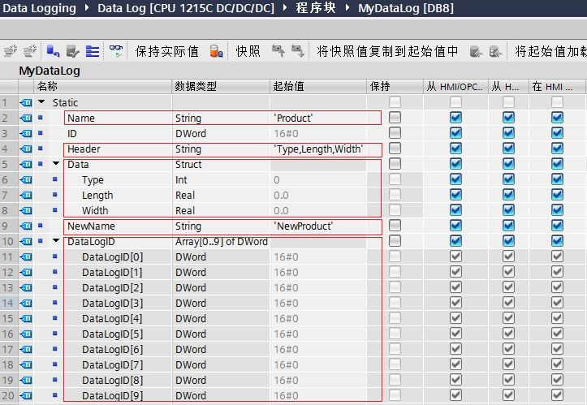

图2.创建数据日志参数DB

 注：  
a. 数据日志名称：此变量仅支持 String 数据类型。  
（该名称应符合 Windows 文件名称的限制，不允许使用以下字符：“\\”、“/”、“：”、“*”、“?”、“&lt;”、“&gt;”、“|”、“空格”）

b. 数据日志标题：Header 参数指向数据日志文件中第一行的列标题名称，各列名称需要用逗号分隔；如果未设置该值，则不会在数据日志文件中创建标题行。

c. 数据日志 Data 结构：指定数据日志的各个数据元素（列）及其数据类型：用户自定义类型 (UDT) 或数组。可以分配的最大数据元素个数为253（带时间戳）或 255（不带时间戳）。

d.新名称（创建新日志时使用，命名方法同a)

e.ID：数据日志数字标识符，保存每个生成数据日志的ID值以便与其它数据日志指令配合使用，方便数据日志的管理，比如清空或删除数据日志等。

**3．创建和初始化数据日志文件**

创建数据日志需调用“DataLogCreate”指令。按照上图2所创建数据日志参数DB 为“DataLogCreate”指令分配输入、输出参数。当触发该指令输入参数 REQ 时，创建数据日志文件。如下图3所示：

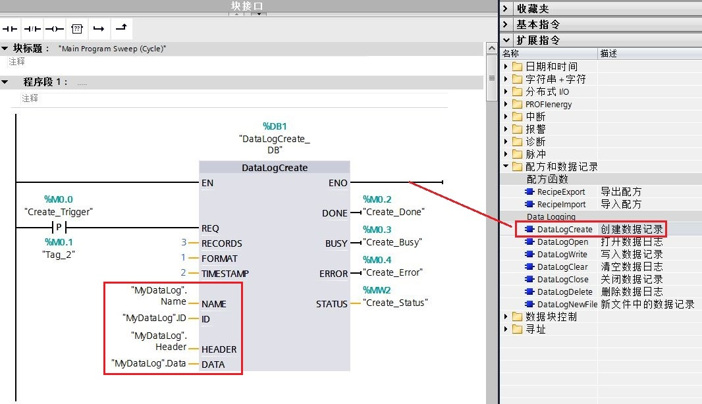

图3.调用“DataLogCreate”指令

“DataLogCreate”指令重要参数说明如下表1所示：

表1.“DataLogCreate”指令重要参数说明

|     |     |     |
| --- | --- | --- |
| 输入参数 | 数据类型 | 说明  |
| REQ | BOOL | 上升沿信号时创建数据日志文件 |
| RECORDS | UDINT | 数据日志可存储的最大数据日志数 |
| FORMAT | UINT | 数据格式：0：内部格式（不支持） 1：逗号分隔值CSV |
| TIMESTAMP | UINT | 时间戳：  0：无时间戳  1：系统时间 ，格式：mm/dd/yyyy, hh:mm:ss（月/日/年,时:分:秒）  2：本地时间 ，V4.2 开始支持，格式：mm/dd/yyyy, hh:mm:ss（月/日/年,时:分:秒）  3：系统时间 ，V4.5 开始支持，格式：mm/dd/yyyy, hh:mm:ss（月/日/年,时:分:秒）  4：本地时间 ，V4.5 开始支持，格式：yyyy-mm-dd, hh:mm:ss（年-月-日,时:分:秒）  5：系统时间 ，V4.5 开始支持，格式：yyyy-mm-dd, hh:mm:ss（年-月-日,时:分:秒） |
| NAME | VARIANT | 数据日志的名称（如上图2定义） |
| ID  | DWORD | 数据日志的对象 ID（如上图2定义） |
| HEADER | VARIANT | 数据日志文件中第一行列标题（如上图2定义），一般定义为 String 类型，名称用","隔开 |
| DATA | VARIANT | 数据日志的数据缓冲区（如上图2定义） |

完成数据日志的创建需多个扫描周期，且 DONE 位仅在一个扫描周期内有效，因此可编程捕获“DataLogCreate”指令的 DONE 信号位，同时将新建数据日志文件的ID存储。如下图4所示：

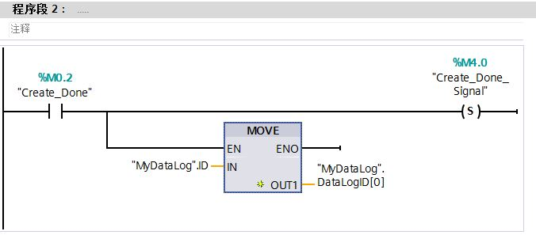

图4.“DataLogCreate”指令的DONE信号位和ID存储

**4\.** **写入数据日志**

数据日志创建成功后，使用“DataLogCreate”指令的 Done=1 信号使能“DataLogWrite”指令，并触发该指令 REQ，将产品型号“Type”，长度“Length”，宽度“Width”三个变量值写入到数据日志文件。如下图5所示：

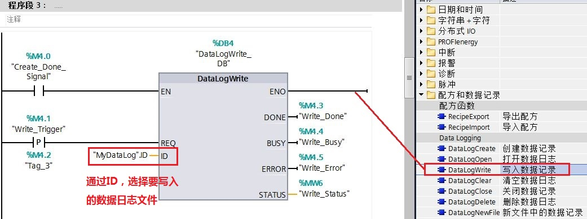

图5.“DataLogWrite”指令

 注：执行“DataLogWrite”指令前需确保已经打开数据日志文件。 “DataLogCreate”指令隐式打开数据日志文件。

**5\. 关闭打开的数据日志文件**

当写入的条数达到设定的3条日志条数时，数据日志已满“DataLogCreate”指令的输出参数 STATUS=1。因此，可编程使用该状态字节自动关闭该数据日志文件。如下图6所示：

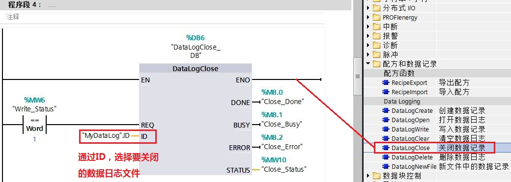

图6.“DataLogClose”指令

**6\. 当写入的条数达到设定的日志条数时，可选择以下两种情况之一再分别写入数据日志**

**情况一：打开已有数据日志文件**

当写入的条数达到设定的3条日志条数时，如果旧的变量值允许被新的变量值覆盖，可再调用“DataLogOpen”指令打开这个数据日志文件，如下图7所示：

打开该数据日志文件成功后，可按照如上图5所示再写入一条新的数据日志，此时第一条旧的数据日志将被覆盖。

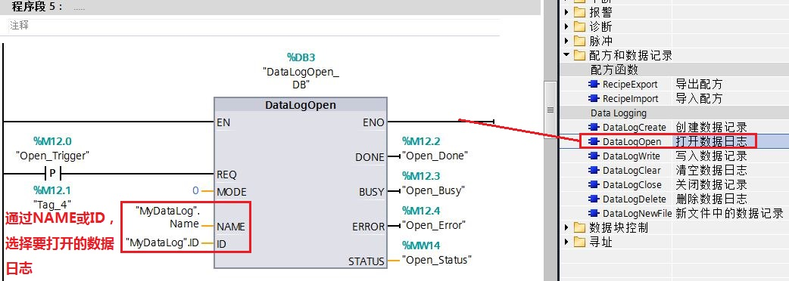

图7.“DataLogOpen”指令

表2.“DataLogOpen”指令重要参数说明

|     |     |     |
| --- | --- | --- |
| 输入参数 | 数据类型 | 说明  |
| MODE | UINT | 打开数据日志的方式：   MODE= "0" 保留数据日志的数据日志；   MODE= "1" 删除数据日志的数据日志，但保留标题； |

 注：如果同时提供 NAME 和 ID 这两个参数，但有效的 ID与NAME 数据日志不对应，则使用ID，而忽略 NAME；NAME 必须是 DataLogCreate 指令创建的数据日志的名称。如果只提供 NAME 且 NAME 指定一个有效数据日志，将返回对应的 ID。

**情况二： 新建数据日志**

当写入的条数达到设定的3条日志条数时，如果想保存之前的变量值，可调用“DataLogNewFile”指令创建一个新的数据日志文件。如下图8所示：

新建数据日志文件成功后，可按照如上图5所示再写入一条新的数据日志。

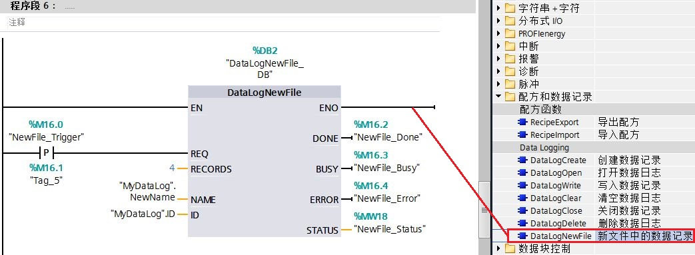

图8.“DataLogNewFile”指令

表3\. “DataLogNewFile”指令重要参数说明

|     |     |     |
| --- | --- | --- |
| 输入参数 | 数据类型 | 说明  |
| RECORDS | UDINT | 新数据日志中的数据日志数目 |
| NAME | VARIANT | 新数据日志的文件名称（如上图2定义） |
| ID  | VARIANT | 执行时，ID 输入标识有效数据日志。将从该数据日志复制新数据日志组态；   执行后，ID 参数成为返回新建数据日志文件的 ID 的输出； |

 注：“DataLogNewFile”指令，将从原始数据日志复制标题以及原始数据日志属性（DATA 记录缓冲区、数据格式和时间戳设置）。隐式关闭原始数据日志文件并隐式打开新数据日志文件。

当新建数据日志指令完成后，存储新建数据日志的ID，如图9所示。

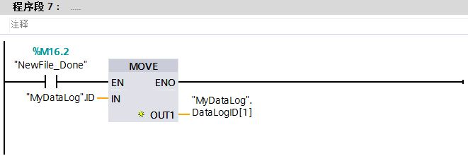

图9.保存新数据日志文件ID

**7\. 查看数据日志**

在“WEB服务器内”功能内，设置用户名和密码，选择“读取文件”和“写入/删除文件”访问权限，如图10所示。

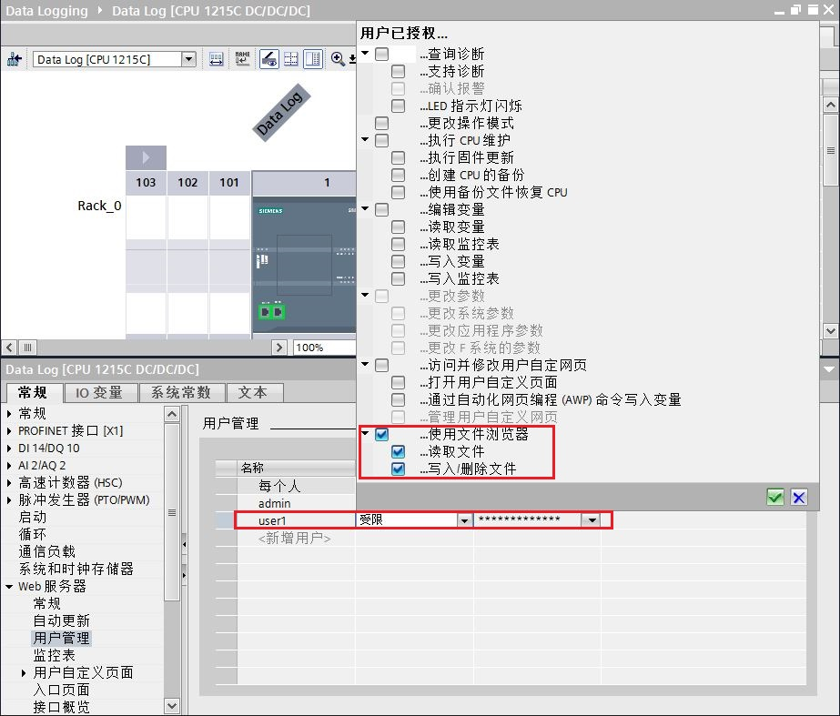

图10.设置WEB服务器用户密码和权限

通过PC访问标准 Web 页面，在Web浏览器地址栏中输入 S7-1200 CPU 的 IP 地址（如192.168.0.12）。登录 Web 服务器，如下图11所示：

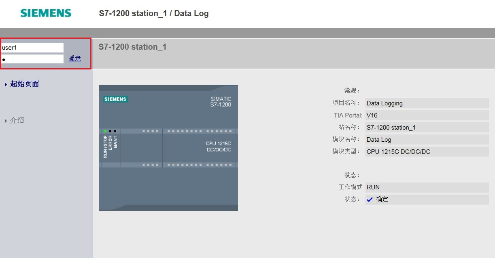

图11.登录WEB服务器

登录后可在 Web 服务器的 文件浏览器->DataLogs文件夹内查看到数据日志，并且可下载、删除或重命名数据日志文件。如下图12-13所示：

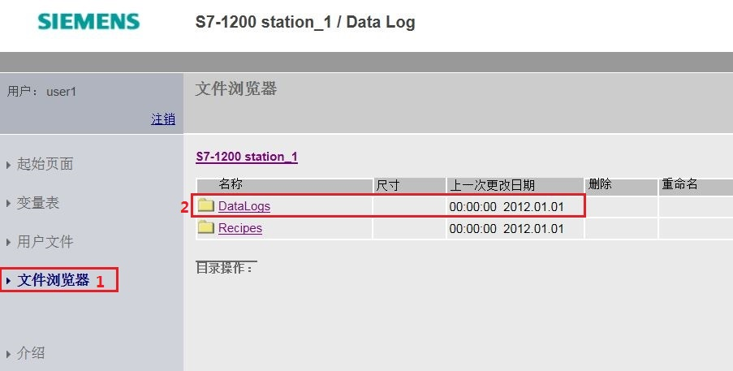

图12.打开数据日志

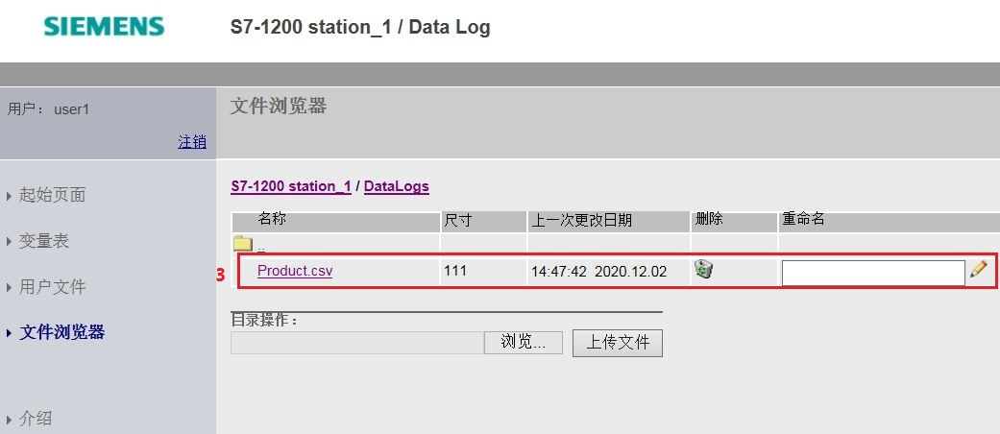

图13.查看数据日志

按上图13所示，下载该数据日志文件（如 Product ），然后通过EXCEL表格打开。写入了预定义的3条记录的数据日志文件，如下图14所示：

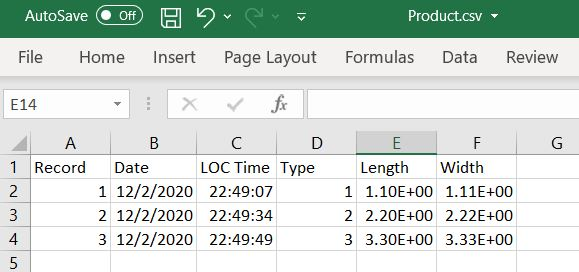

图14\. 3条数据日志

**情况一结果：**

如果旧的变量值允许被新的变量值覆盖，写入一条新日志后，再次下载并打开“Product”这个数据日志文件。如上图13将发生变化，第一条旧记录将被覆盖，如下图15所示：

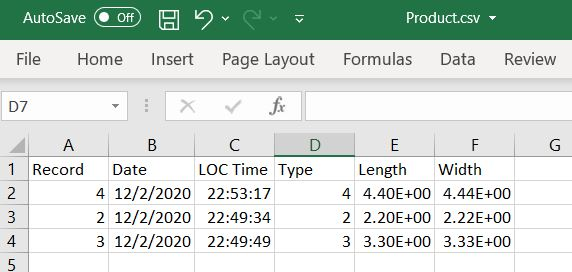

图15.循环写入的数据日志

**情况二结果：**

如果想保存之前的变量值，创建一个新的数据日志文件，再写入新的数据记录。如下图16所示：

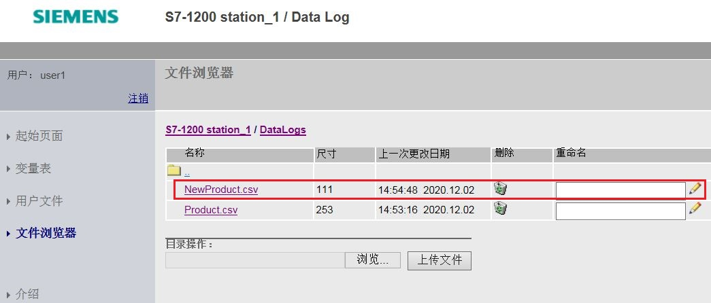

图16.查看新数据日志

这种情况下，将创建一个新的数据日志文件，写入一条新记录，下载并打开“NewProduct”这个新数据日志文件。如上图13不会发生变化，新的数据日志文件及记录如下图17所示：

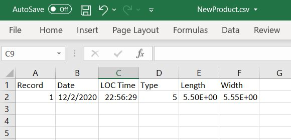

图17\. 新数据日志文件及记录

 注：数据日志不再采用 //END 标志对未满的数据日志文件末尾进行标记。在 S7-1200 CPU V4.1之前的版本中，未满的数据日志都包含一个 //END 标志。

**8.清空“Product”数据日志文件内的数据记录****（S7-1200 V4.2开始支持）**

使用“DataLogClear”指令清空“Product”内的数据记录，ID参数关联之前已存好的ID值，并触发该指令 REQ清空数据记录。如下图18所示：

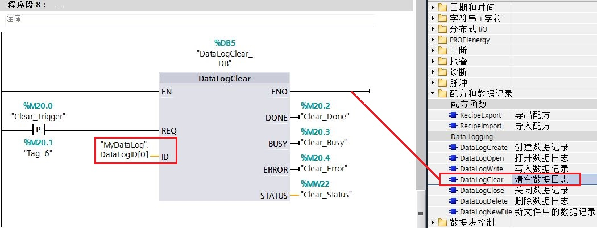

图18\. “DataLogClear”指令

  **注意** : 因“DataLogNewFile”指令可隐式关闭原始数据日志文件并隐式打开新数据日志文件。所以在使用“DataLogClear”指令前，确保数据日志为打开状态，若数据日志关闭可使用 “DataLogOpne”指令重新打开，如图19所示。

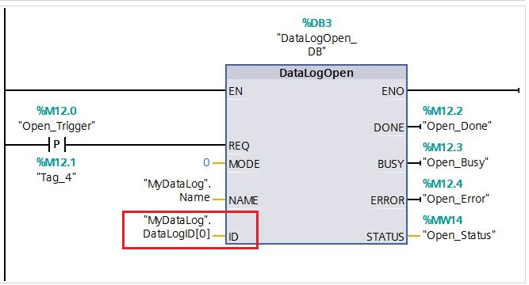

图19.使用 “DataLogOpen”指令打开数据日志

清空完数据记录后，通过WEB查看结果，如图20所示。

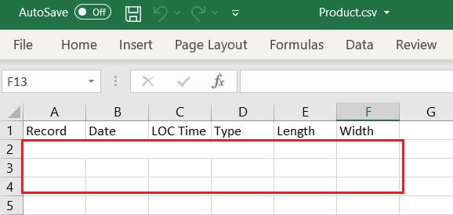

图20.“Product”数据日志文件内数据记录被清空

**9.删除“Product”数据日志文件（S7-1200 V4.2开始支持）**

使用“DataLogDelete”指令，DelFile置1，ID参数关联之前已存好的ID值，并触发该指令 REQ删除数据日志并删除数据记录。如图21所示。

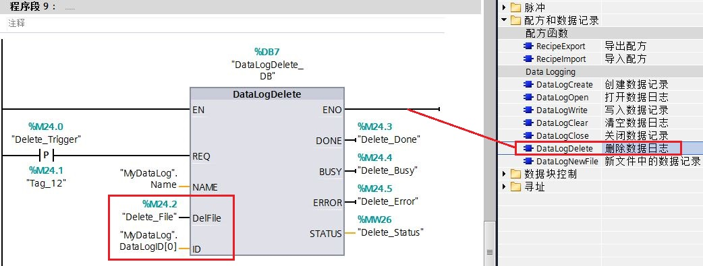

图21\. “DataLogDelete”指令

表4\. “DataLogDelete”指令重要参数说明

|     |     |     |
| --- | --- | --- |
| 输入参数 | 数据类型 | 说明  |
| DelFile | BOOL | DelFile= "0" 删除数据日志，但保留数据记录；   DelFile= "1" 删除数据日志，并且删除数据记录； |

删除完数据日志后，通过WEB查看结果，如图22所示。

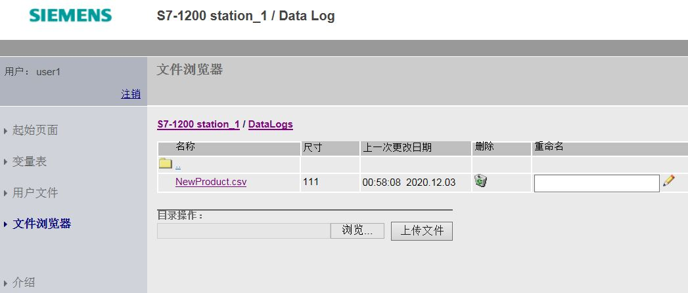

图22.“Product”数据日志文件被删除