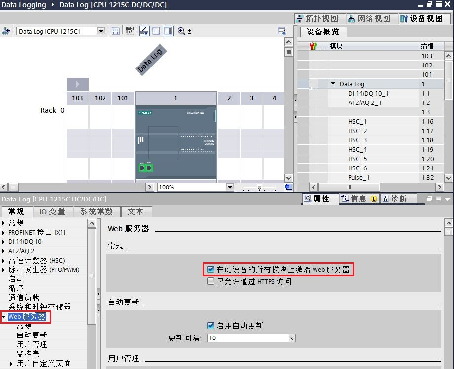

## 数据日志的使用

数据日志文件以 CSV 格式存储在永久性闪存中。 可以使用以下两种方法管理、查看数据日志：

**1\. PLC Web 服务器功能；**

**2\. 查看 PLC 存储卡中的数据日志；**

S7-1200 SIMATIC 存储卡如下：

|     |     |
| --- | --- |
| **存储卡** | **订货号** |
| SIMATIC MC 4 MB | 6ES7 954-8LC03-0AA0 |
| SIMATIC MC 12 MB | 6ES7 954-8LE03-0AA0 |
| SIMATIC MC 24 MB | 6ES7 954-8LF03-0AA0 |
| SIMATIC MC 256 MB | 6ES7 954-8LL03-0AA0 |
| SIMATIC MC 2G | 6ES7 954-8LP03-0AA0 |
| SIMATIC MC 32G | 6ES7 954-8LT03-0AA0 |

### 使用 PLC Web 查看数据日志

如果 PLC PROFINET 端口和 PC 连接到网络，则可使用 PC Web 浏览器访问内置 PLC Web 服务器。操作步骤如下：

**1.启用Web服务器功能**

在目标 CPU 的设备配置中启用 Web 服务器，“设备视图”->“鼠标选中CPU”->“属性”->“Web服务器”->“启用模块上的Web服务器”前打钩。如下图1所示：

图1.启用Web服务器

**2.设置用户密码和权限**

在“WEB服务器内”功能内，设置用户名和密码，选择“读取文件”和“写入/删除文件”访问权限，如图2所示。

图2.设置WEB服务器用户密码和权限

**3\. PC端登录内置 Web 服务器**

通过 PROFINET 网络将 PC 连接到 PLC。然后通过PC访问标准 Web 页面，在Web浏览器地址栏中输入 S7-1200 CPU 的 IP 地址（如192.168.0.12）。登录 Web 服务器，如下图3所示：

图3.登录WEB服务器

**4\. WEB服务器数据日志管理**

登录后可在 Web 服务器的 文件浏览器->DataLogs文件夹内查看到数据日志，并且可下载、删除或重命名数据日志文件。如下图4-5所示：

图4.浏览数据日志

图5.查看数据日志

**5\. 下载并查看数据日志**

将数据日志文件下载到 PC 后，可使用电子表格应用程序（如 Microsoft Excel）打开 .csv 文件，查看写入的每条数据记录。如下图6-8所示：

图6.下载数据日志文件

图7.保存数据日志文件到 PC

图8.在 Excel中查看数据日志文件

### 查看 PLC 存储卡中的数据日志

如果 S7-1200 CPU 中插入了“程序”型 S7-1200 存储卡，则可以取出该存储卡，然后将该卡插入 PC 或 PG 上的标准 SD 卡槽或 MMC 卡槽中。在 Windows 资源管理器中导航至存储卡中的 \\DataLog 目录，复制数据日志文件到PC的本地驱动器中，使用 Microsoft Excel 打开即可。 操作步骤如下：

 注：以下第1步必须在创建数据日志文件之前执行！

**1.更改存储卡属性为“程序卡”**

将插好 S7-1200 存储卡的读卡器插入 PC，在 STEP7 V16 软件中按照以下路径和方法打开存储卡：“项目树”->“SIMATIC卡读卡器”->“鼠标选中需要打开的存储卡盘符”->“鼠标右键”→属性”，如下图8所示：

图8.打开读卡器

鼠标选中“属性”后打开存储卡，设置卡类型：程序。如下图9所示：

图9.设置程序卡

**2\. 将存储卡插入PC**

数据日志完成后，需要从 S7-1200 CPU 中取出存储卡，插入 PC 或 PG 上的标准 SD 卡槽或 MMC 卡槽中，然后插入 PC。

**3\. PC端查看卡内数据日志文件**

在 Windows 资源管理器中导航至存储卡中 \\DataLogs 目录。如下图10所示：

图10.PC端查看数据日志文件

**4\. 使用 Excel 打开数据日志**

使用 Excel 打开如上图10所示的数据日志文件，查看写入的每条数据日志，如下图11所示：

图11.在 Excel 中查看数据日志文件