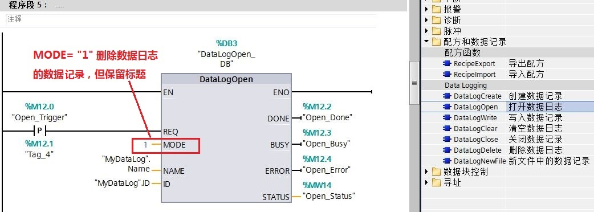
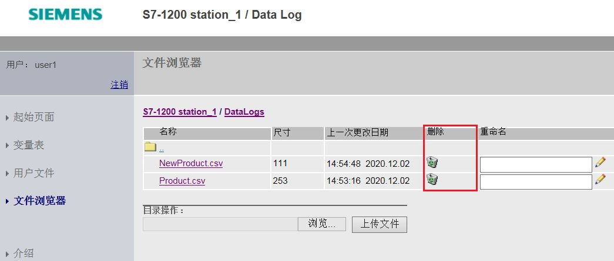
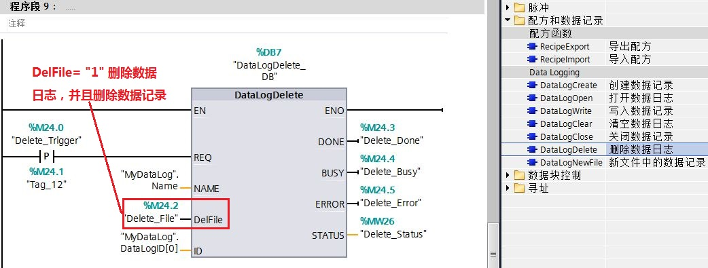

### 数据日志常见问题

 ** 当S7-1200 CPU使用数据日志时，记录次数会影响CPU的使用寿命吗？**

会影响。装载存储器的使用寿命受写装载存储器的次数限制。如果使用CPU内部装载存储器，则记录次数会影响CPU的使用寿命，CPU写入数据记录的使用寿命为5亿次；如果使用存储卡，其记录次数会影响卡的使用寿命。

一个数据日志最多可包含256个元素，尽量将多个数据元素记录在一个数据日志中，不建议程序使用多个数据日志，每个数据日志只记录少量的数据元素。

 注：需要注意写入记录的频率，如果需要高频率写入数据记录，请考虑使用存储卡，以便于更换。

 ** S7-1200 系列所有型号的 CPU 是否都支持数据日志功能？**

S7-1200 CPU 版本为V2.0以上及编程软件版本为 STEP 7 V11 以上才支持数据日志功能。

 **使用S7-1200 CPU 是否就能实现数据日志功能？是否还需要增加其余的硬件？**

使用S7-1200 CPU 能实现数据日志功能，数据日志文件存储在 S7-1200 CPU 装载存储器中。

也可以增加 S7-1200 SIMATIC 存储卡，将其设置为“程序”卡类型，也能实现数据日志功能；此时，数据日志文件存储在 S7-1200 SIMATIC 存储卡中。

 **调用“DataLogCreate”指令创建的数据日志文件个数是否有限制？**

调用“DataLogCreate”指令创建的数据日志文件个数没有限制。如果仅使用 S7-1200 CPU，数据日志文件的个数受限于 S7-1200 CPU 装载存储器大小的限制；如果使用“程序”卡类型的 S7-1200 SIMATIC 存储卡，数据日志文件的个数受限于 S7-1200 SIMATIC 存储卡大小的限制。

 **对每个数据日志文件写入的最大数据日志条数是否有限制？**

“DataLogCreate”指令的“RECORDS”输入参数是“UDINT”数据类型，限值是4,294,967,295。 RECORD 参数的实际限值取决于单个日志的大小、其它数据日志的大小及装载存储器的可用资源。 此外，Microsoft Excel 对Excel 工作表中允许的行数限制为65536行。

 **对每个数据日志文件声明的最大数据元数个数是否有限制？**

所声明数据元素的个数与标题参数中指定的列数相对应。可以分配的最大数据元素个数为253（带时间戳）或 255（不带时间戳）。 这一限制使日志始终处于 Microsoft Excel 工作表的256列限制范围内。

 **如何打开数据日志文件？打开的数据日志个数是否有限制？**

执行“DataLogCreate”和“DataLogNewFile”操作后会自动打开数据日志文件。此外，对于已经关闭的数据日志文件，执行“DataLogOpen”指令可重新打开数据日志文件。

最多可同时打开8个数据日志文件。 可能存在8个以上数据日志文件，但必须关闭一些数据日志文件，使打开的文件数不超过8个。

 ** 如何关闭数据日志文件？**

S7-1200 PLC执行RUN-STOP切换或PLC循环上电后会自动关闭数据日志文件。此外，执行“DataLogClose”指令可关闭已经打开的数据日志文件。

 **如何清除数据日志文件中的数据记录？**

可采取以下两种方法之一清除数据日志文件中的数据记录：

 注：以下方法是用于清除数据记录，不是数据日志文件！

1\. 设置“DataLogOpen”指令输入参数 MODE=1，并且需要在数据日志关闭情况下，执行“DataLogOpen”指令，触发输入“REQ”可清除数据日志文件的数据日志。如下图1所示：

图1.执行“DataLogOpen”指令清除数据记录

2\. 使用“DataLogClear”指令，清除指定ID对应数据日志文件内的数据记录。如下图2所示：

图2\. 执行“DataLogClear”指令清除数据记录

 ** 如何删除已经建立的数据日志文件以减小 S7-1200 CPU 装载存储器空间的占用？**

可采取以下两种方法之一删除数据日志文件：

1.登录 PLC内置 Web 服务器，直接删除数据日志文件。如下图3所示：

图3\. 通过Web 服务器删除数据日志文件

2\. 使用“DataLogDelete”指令，DelFile置1，删除数据日志并删除数据记录。如下图4所示：

图4\. 执行“DataLogDelete”指令删除数据日志文件