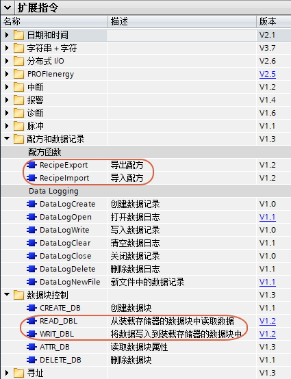

# 14 配方功能

## 配方功能介绍

配方通常有两种使用场景，一种是生产不同的产品，使用不同的工艺参数，一种是在生产一种产品过程中有很多步骤，每个步骤都是有不同的参数。

通常这些参数数据存放在CPU工作存储器的DB块或M区，但是很多时候这些数据的数据量特别大，数值却是固定不变的，或者只是偶尔在需要的时候小做改动。

而对于S7-1200来说，工作存储器最大也只有150kB（S7-1217C），所以可以考虑将这些数据，放入更大的装载存储器。对于S7-1200，内置装载存储器有1MB（S7-1211C、S7-1212C）、2MB（S7-1214C
V3.0以下）和4MB（S7-1214C
V3.0以上、S7-1215C、S7-1217C）三种，如果通过存储卡扩展，理论上可以最多到32GB。

从 TIA PORTAL STEP 7 V11 SP2 开始，S7-1200 固件版本 V2.0
开始，S7-1200支持将DB块仅存储在装载内存中。并且提供指令READ_DBL将仅存储在装载存储器的数据复制到工作存储器，WRIT_DBL将工作存储器的数据复制到仅存储在装载存储器的数据块。这样就可以在需要时获取配方数据与修改配方数据。但是这时通常只能在TIA
PORTAL软件的DB块中编辑配方数据，不是很方便。

从 TIA PORTAL STEP 7 V13 开始，S7-1200 CPU 固件版本 V4.0
开始，又提供了两条配方函数指令，使得配方数据可以导入、导出，得以在PC上使用EXCEL等软件更方便的编辑。

其中RecipeExport指令将完整的配方数据块导出，存储在 CPU
装载存储器的永久性配方数据文件中。配方数据文件按照标准 CSV 格式存储在
S7-1200 CPU 装载存储器中。

而RecipeImport指令将配方数据从装载存储器上的 CSV
文件导入到装载存储器上的配方数据块中。此过程会覆盖之前数据块中的值。

注意：以上四个指令都不支持使用PLCSIM进行仿真，只能使用真实CPU。

## 配方相关指令

配方相关指令位于以下路径：扩展指令---\>配方和数据记录---\>配方函数以及扩展指令---\>数据块控制，具体位置参见图
1 红框。

{width="425" height="554" longdesc="1.JPG"}

图1 配方相关指令


```{toctree}
:maxdepth: 2

02-Getting_start
03-Use
04-instruction
05-FAQ

```