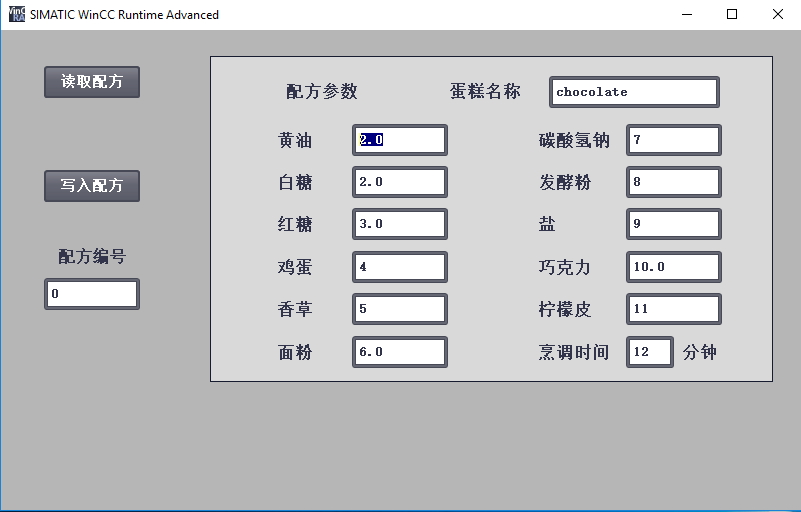

## 配方功能快速入门

配方数据文件按照标准 CSV 格式存储在 S7-1200 CPU 装载存储器或 S7-1200
SIMATIC 存储卡"程序卡"中。分别可通过 PLC Web
服务器或对于存储卡文件操作，将数据文件传送到 PC
进行管理和查看。也可将修改过后的配方数据文件上传至PLC，再通过"RecipeImport"配方导入指令更新PLC装载存储器中配方数据块的数值。\

### 测试实例：

SIMATIC S7-1200 系列 CPU 使用配方数据功能，需要注意以下几两点：

-   程序中创建一个配方数据块，此 DB 块必须存储在 CPU
    装载存储器中，可以使用 CPU 内部装载存储器或程序卡
-   程序中创建一个活动配方数据块，此 DB 块必须在 CPU
    工作存储器中，使用程序逻辑读取或写入一个活动配方记录\

下面，举例说明用 S7-1200
实现配方的写入和读取功能。为方便配方数据操作，按照下图思路进行项目编程：

{width="850" height="428" longdesc="2.JPG"}

图1 配方项目框图

### 测试环境：

操作系统：Win 10 64bit Pro 1703

软件：TIA PORTAL V15 Update 4

测试软件：Notepad++ V7.5.8

硬件：S7-1215C DC/DC/DC V4.2.3

订货号：6ES7215-1AG40-0XB0

### 实现步骤

**1.定义一个 PLC 数据类型（UDT）**

配方数据块必须包含数组，可以是一维的也可以是多维的，数组元素是 PLC
数据类型或结构。在这个配方实例中使用 PLC 数据类型创建配方数据块。

在此，创建一个 PLC
数据类型，以定义一个配方记录中的所有组成，以制造蛋糕为例，建立UDT过程参见[**链接**](../../07-Program/02-basic/01-Data_Type/03-UDT.html)，建好后如图2所示。

{width="622" height="287" longdesc="3.JPG"}\

图2.定义 PLC 数据类型

数据类型是一个数据模板，它在每个配方数据块以及活动配方数据块中重复使用。输入所有实例配方共用的成分名称和数据类型，根据分配给配方成分的数值不同而产生不同的产品配方。

**2.使用 PLC 数据类型创建配方数据块**

创建一个配方数据块，为全局数据块，并启用数据块属性\"仅存储在装载内存中\"，如图3红圈所示。本例中，配方数据
DB 块名称为
\"DB1_蛋糕配方"，如图4所示，插入一个数组类型变量，数组元素的数据类型为\"蛋糕配方\"，本例中设置数组限值0..7，即可创建8个配方，可根据实际情况调整。

**[注意，如果需要使用RecipeExport和RecipeImport导入导出，配方DB块的名称中尽量不出现中文字符，否则在WEB页面操作会略微麻烦一些，具体详见配方数据的管理。本例为显示直观，所以使用了"DB1_蛋糕配方"的名字。]{.underline}**

{width="452" height="349" longdesc="7.JPG"}

图3.定义数据块属性

{width="765" height="208" longdesc="4.JPG"}

图4.创建配方数据块

对于图3的优化的块访问选项，一般默认激活，因为从S7-1200
V4.2起，对于仅存储于装载存储器的优化块的大小限制为256kB，而仅存储于装载存储器的非优化块仅有64kB，显然优化块可以存储更多的配方记录，如果单个配方数据太多，需要放在多个DB中，也可以减少DB块个数。

**3.在工作存储器中创建活动配方
DB，并通过"READ_DBL"和"WRIT_DBL"指令实现对装载存储区配方数据块的读写操作**\
\
在工作存储器中准备一个活动配方数据块，用于配方数据的写入和读取。在本例中，在工作存储器中创建了一个全局数据块，名称为
\"DB2_活动配方"，类型为"蛋糕配方"，如图5所示。

{width="693" height="603"}

图5.添加活动配方块

确定后，就可以得到活动配方数据块，该块只由一组配方组成，如图6所示。

{width="637" height="308" longdesc="6.JPG"}

图6.活动配方数据块

**[注意，因为指令"READ_DBL"和"WRIT_DBL"的缘故，要求活动配方数据块与配方数据块的优化属性必须相同，即都同时是优化数据块，或者同时是非优化数据块。]{.underline}**

将这个 DB
块作为与装载存储器中配方数据块的接口，分别通过指令"WRIT_DBL"能实时将存于工作存储器的活动配方数据写入至装载存储器的配方数据块，或者通过指令"READ_DBL"实时读取装载存储器的配方数据块到工作存储区中活动配方数据。\

**4.导出配方数据块**

对于S7-1200
V4.0及其以后版本的CPU，可以使用指令RecipeExport和RecipeImport对配方数据块进行导入和导出，在电脑上使用EXCEL、ASCII编辑器等工具编辑。

对于S7-1200
V4.0以前的版本，一般建议直接在配方数据块的起始值输入配方，这一部分用户可以直接跳过下面4-6步，直接看第7步。

在本例中，直接在OB1使用LAD语言调用RecipeExport和后面的RecipeImport块，实际使用时可以在FC/FB，或者FB的多重背景中使用，语言也可以使用FBD、SCL。

首先新建DB块，用于调用块的请求与状态位等，名称为\"DB3_操作\"，建立结构体\"Export\"，以及相关变量，如图7所示。

{width="310" height="213"}

图7. 建立结构体

在 OB1 调用RecipeExport，以及捕捉是否完成及错误代码等程序，如图8所示。

{width="556" height="862"}

图8.调用RecipeExport指令

**5.配方csv文件的导入和导出**

可以使用Web服务器或者存储卡的方式对csv文件进行导入和导出，在电脑上的Excel等软件上进行配方数据的编辑，具体操作详见[**配方数据的管理**](03-Use.md)。

**6.导入配方数据块**

当配方文件通过WEB上载完成，或通过存储卡重新导入文件后，就可以导入配方数据块。和第4步类似，在DB块\"DB3操作\"，中建立结构体\"Import\"，以及相关变量，结构同\"Export\"，如图9所示，用于RecipeImport的请求与状态位。

{width="311" height="230"}

图9. 建立结构体

在 OB1
调用RecipeImport，以及捕捉是否完成及错误代码等程序，如图10所示。思路同第4步。

{width="556" height="862"}

图10.调用RecipeImport指令

**7.读取配方数据**

经过使用配方指令或者直接在配方数据块的编辑，此时配方数据已经保存在PLC的装载存储器中，需要使用READ_DBL指令读取出来。可以在DB块\"DB3操作\"，建立一个Int类型变量Index用作配方编号。对于本例，配方数组限值为0-7，所以该配方编号变量取值范围也是0-7，可以在HMI画面上设置该值，也可以在程序中设置该值。此外同样在DB块\"DB3_操作\"，建立结构体\"Read\"，以及相关变量，用于READ_DBL的请求与状态位，如图11所示。

{width="310" height="193"}

图11.建立Index变量及结构体

然后利用数组的索引寻址功能，将配方数组指定索引的变量读取到活动配方，即如果需要配方0送到活动配方数据块，则Index赋值为0，需要配方1送到活动配方数据块，则Index赋值为1，\...\...，具体程序如图12所示。

{width="555" height="409"}

图12.读配方

然后就可以直接使用活动配方了，不论是程序中，还是HMI画面中。例如本例中，当Index=0时，读出的活动配方DB，如图13所示。

{width="555" height="386"}

图13.活动配方数据

**8.在线修改配方**

通常配方功能使用到第7步就可以结束了，如果需要偶尔小范围修改配方数据，不想大规模导入导出，或者不想打开程序修改配方数据起始值，可以使用WRIT_DBL指令实现该功能。

对于本例依然利用DB块\"DB3_操作\"的变量Index，确定需要修改的配方编号，实际编程可以根据需要使用和读配方不一样的配方编号变量。

通常在HMI画面上指定需要修改的配方编号，并且将活动配方的变量与HMI的IO域关联，使用一个按钮触发READ_DBL的REQ将该配方编号对应的参数都读取到活动配方，即映射到了IO域，然后再修改其中需要修改的变量，最后再使用另外一个按钮触发WRIT_DBL的REQ实现将改后的活动配方写入该指定配方编号对应的配方，参考画面如图14。

{width="802" height="555"}

图14.HMI画面

同样在DB块\"DB3_操作\"，建立结构体\"Write\"，以及相关变量，结构同\"Read\"，用于WRIT_DBL的请求与状态位，如图15所示。

{width="311" height="211"}

图15.建立结构体

最后同样，利用数组的索引寻址功能，将活动配方写入到配方数组指定索引的变量，即如果需要修改配方0，则将Index赋值为0，修改活动配方数据块后写入，需要修改配方1，则将Index赋值为1，修改活动配方数据块后写入，\...\...，具体程序如图16所示。

{width="556" height="431"}

图16.写配方

本例如图17所示，读出Index为0的配方，然后修改黄油数据为2.0，点击"写入配方"按钮即可修改配方DB的值。

{width="801" height="512"}

图17.HMI修改数据
