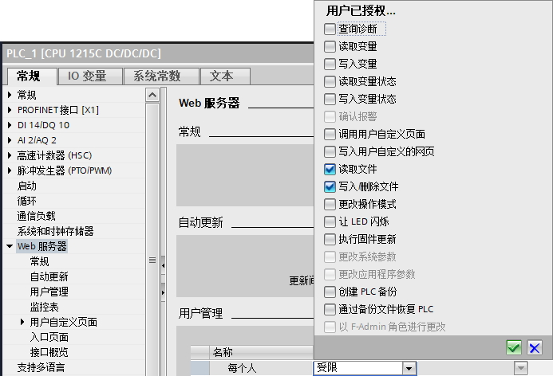
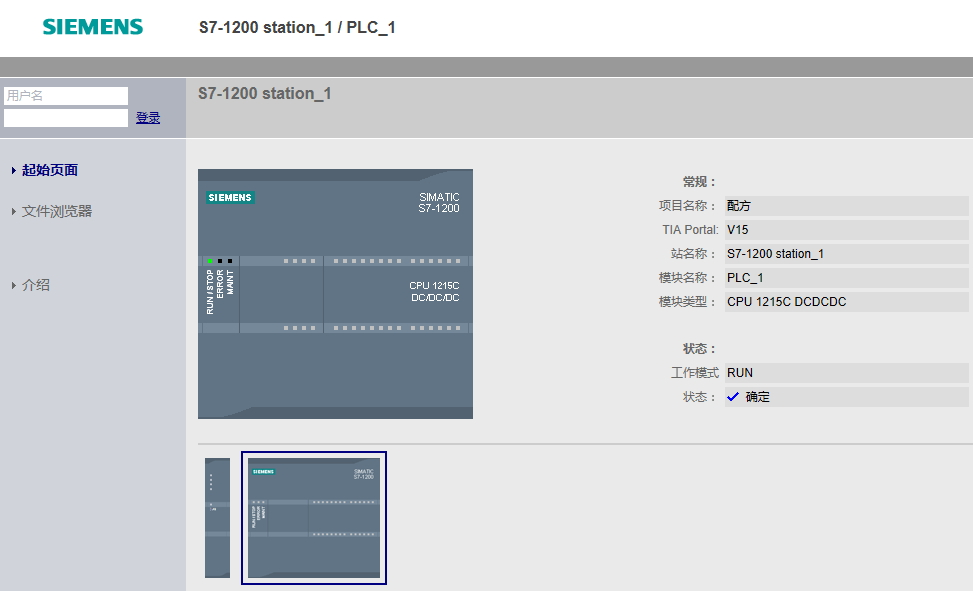
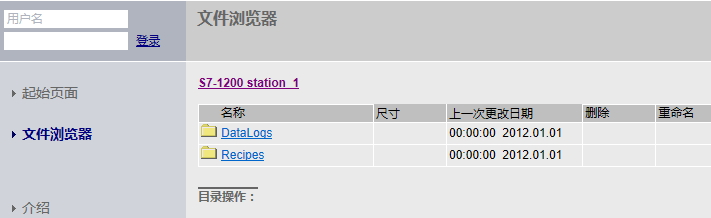
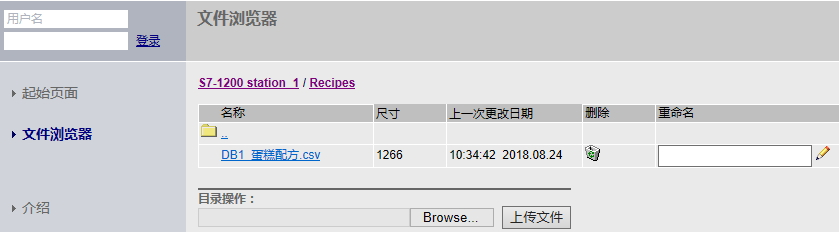
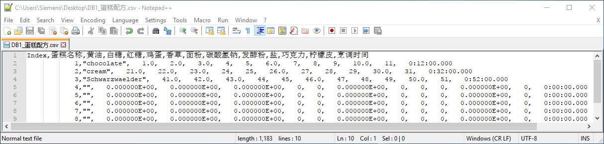
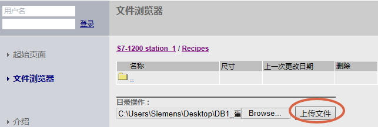
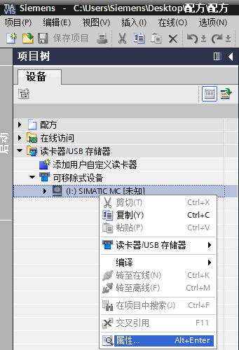
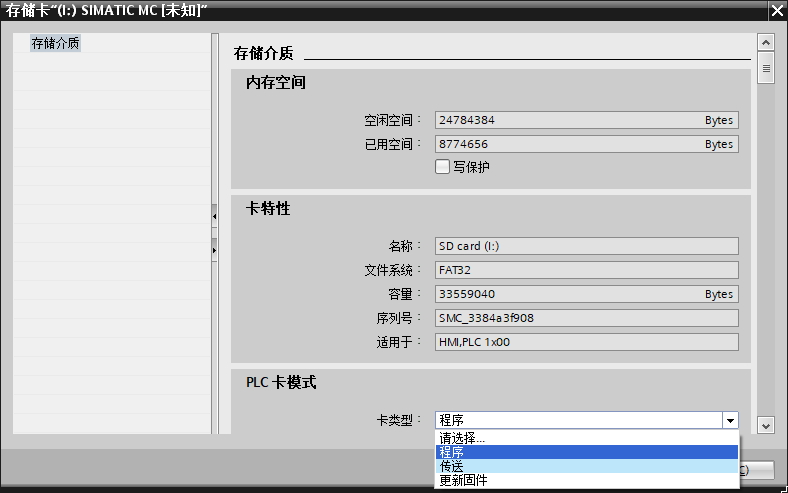
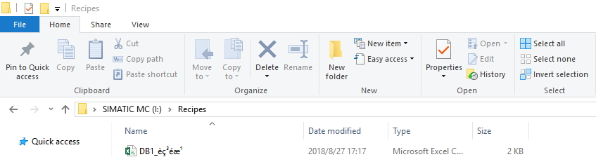

## 配方数据的管理

配方数据文件以 CSV 格式存储在永久性存储器中。
可以使用以下两种方法查看、管理配方数据：

**1. 通过内置的 PLC Web 服务器功能；**

**2. 通过电脑查看 PLC 存储卡中的配方文件；**

S7-1200 SIMATIC 最新存储卡订货号如下：

  订货号               容量
  -------------------- -------
  6ES7954-8LC03-0AA0   4MB
  6ES7954-8LE03-0AA0   12MB
  6ES7954-8LF03-0AA0   24MB
  6ES7954-8LL03-0AA0   256MB
  6ES7954-8LP03-0AA0   2GB
  6ES7954-8LT03-0AA0   32GB

### []{#a}使用 PLC Web 服务器查看配方数据

激活CPU的Web服务器功能，则可以使用电脑网口连接CPU的PROFINET接口或者扩展CP1243-1的网口，然后使用电脑的IE浏览器访问
PLC 内置的 Web 服务器。

**1.启用 Web 服务器**

在目标 CPU 的设备配置中启用 Web 服务器，具体参考Web服务器配置。

使用配方功能，需要具有"读取文件"和"写入/删除文件"功能。若要求更多访问功能，可以勾选相应权限。本例中只用默认用户，实际可以根据需要设置用户及权限，如图
1 所示：

{width="693" height="472" longdesc="10.JPG"}

图1.定义 Web 服务器的用户权限

**2. 通过 PROFINET 网络将 PC 连接到 PLC**

通常情况下，电脑网口网线或通过交换机连接CPU的PROFINET接口或者扩展CP1243-1的网口。

**3. 登录内置 Web 服务器**

在 IE 浏览器地址栏中，本例中输入 192.168.1.3 或者输入 CP1243-1的
192.168.1.28。通过 Web 服务器的文件浏览器页面来读取配方数据文件，
浏览器操作界面如图 2 所示：

{width="973" height="591" longdesc="17.JPG"}

图2.Web 服务器的用户界面首页

在左侧项目栏中，选择\"文件浏览器\"，如图 3 所示：

{width="711" height="218" longdesc="18.JPG"}

图3.Web 服务器的文件浏览器页面

进入\"Recipes\"文件夹后，即看到与 PLC
设置的配方数据块名称相同的配方数据文件，如图 4 所示：

{width="839" height="232" longdesc="19.JPG"}

图4.配方数据文件名称

此时左键单击csv文件即可以下载，[**下载后记得点击删除按钮**]{.underline}，将该配方文件删除。

**[注意：如果配方DB名称含有中文字符，例如本例的\"DB1_蛋糕配方\"，如果TIA
PORTAL版本在V14以前，则无法下载，可以通过右边重命名为只有字母和数字的名称后下载，修改后上传文件前，需要将文件名改为原来正确的名字。]{.underline}**

[**TIA
PORTAL版本V14及其以后，中文名称的文件可以下载，但是下载的文件名将为乱码，本例中如图5所示。保存至本地前将文件名改为正确的名字。**]{.underline}

**[正因如此，建议配方DB名称最好不出现中文。]{.underline}**

{width="959" height="62"}

图5.下载乱码文件名

**4.编辑配方文件**

配方条目名称的编码，String，WString数据类型的编码各有不同，如果需要导出变量到CSV文件编辑会带来以下问题，注意：

1\. 不要在配方中使用WChar与WString数据类型。

2\.
如果配方条目名称中出现中文，或果配方条目的String类型出现中文，都不要使用Excel进行编辑，例如本例。

3\.
配方条目名称中出现中文，与配方条目的String类型出现中文，不要同时出现。

**[所以最好在配方中不出现任何中文，这样导入导出不会出现任何问题，还可以使用Excel进行编辑。]{.underline}**否则就需要使用ASCII编辑器，例如Windows自带的文本文档，或者本例中使用的Notepad++。

编辑好的CSV如图6所示。

{width="1215" height="291"}

图6.CSV文件

在修改时需要注意：

1\. 配方DB包含的条目数不能再增加，数组的限值限制了配方的条目数。

2\. 只能修改配方内容，不要修改第一行的配方条目名称以及第一列的索引。

3\.
使用ASCII编辑器容易数据错位，所以最好配方全部内容使用英文字母+数字，然后使用EXCEL等工具编辑。

**5.上载配方文件**

编辑好配方文件，即可以上载该文件，如图7所示。

{width="643" height="217"}

图7.上载修改的CSV文件

### 查看 PLC 存储卡中的配方

如果 S7-1200 CPU 中插入了存储卡，则可以取出该存储卡，然后将该卡插入
PG/PC 上的标准 SD 卡槽或 MMC 卡槽中。在 Windows
资源管理器中导航至存储卡中的 \\Recipes
目录，复制配方文件到PC的本地驱动器中，使用ASCII编辑器或者Excel
打开即可。 操作步骤如下：

1\. 将插好 S7-1200 存储卡的读卡器插入
PC，以U盘形式打开该卡，全选删除所有文件。

2\. 在 TIA PORTAL
软件中按照以下路径和方法打开存储卡："项目树"→"读卡器/USB
存储器"→"鼠标选中需要打开的存储卡盘符"（如下图所示的
I:）→"鼠标右键"→属性"，如图 8所示：

{width="341" height="500" longdesc="23.JPG"}

图8.打开读卡器

3\. 鼠标选中"属性"后打开存储卡，设置卡类型：程序。如图9 所示：

{width="788" height="493" longdesc="24.JPG"}

图9.设置"程序卡"

4\. 将该卡插入S7-1200卡槽，下载程序后，程序即保存到程序卡中。

5\.
配方数据块使用指令导出后，会在存储卡中生成对应的配方文件，例如本例中的"DB1_蛋糕配方.csv"。

6\. CPU断电，将存储卡取出，将插好 S7-1200 存储卡的读卡器插入
PC，以U盘形式打开该卡，打开 \\Recipes
目录，找到配方文件。本例中和图6问题相同，中文名称出现乱码，如图 10
所示。但是这里注意，**不要修改该名称**。

{width="847" height="224" longdesc="25.JPG"}

图10.程序卡文件夹

7\.
此时即可以对该配方文件进行编辑，编辑文件注意事项参见通过Web导出的步骤4，编辑后重新拷贝回\\Recipes文件夹，执行配方导入指令。
