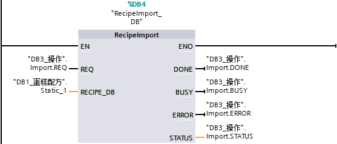

## 配方相关指令介绍

配方功能主要使用4个指令，READ\_DBL和WRIT\_DBL用于对配方数据块的读写，RecipeExport和RecipeImport用于配方数据块和CSV文件之间的转化，下面分别介绍这4个指令的使用。  

### READ_DBL

指令的目的是将数据块变量中的装载存储器部分的值，传送到数据块变量中的工作存储器部分中。 如图1所示。

通常用于配方中，将仅存储在装载存储器的配方数据读取到活动配方。

图1 READ\_DBL与WRIT\_DBL原理

表1 参数列表

| 参数  | 声明  | 数据类型 | 说明  |
| --- | --- | --- | --- |
| REQ | Input | Bool | REQ = 1：读取请求，通常建议沿触发 |
| SRCBLK | Input | Variant | 待读取的数据块变量 |
| RET_VAL | Return | Int | 状态、错误信息 |
| BUSY | Output | Bool | BUSY = 1：读取中 |
| DSTBLK | Output | Variant | 待写入的数据块变量，和SRCBLK数据类型一致，优化属性一致 |

以配方功能快速入门的例子程序为例

图2 READ_DBL应用

如图2所示，SRCBLK的实参为“DB1_蛋糕配方”.Static\_1\["DB3\_操作".Index\]，其中DB1_蛋糕配方”.Static\_1是UDT类型（蛋糕配方）的数组，而带上后面的\["DB3\_操作".Index\]，就变成了数组中的一个元素，也就是说“DB1_蛋糕配方”.Static\_1\["DB3\_操作".Index\]是一个UDT类型（蛋糕配方）。

而DSTBLK的实参是“DB2_活动配方”，“DB2_活动配方”是基于UDT类型（蛋糕配方）建立的DB，也就是说“DB2_活动配方”可以看做UDT类型。

SRCBLK和DSTBLK的实参都是UDT类型，可以使用READ\_DBL指令，是将“DB1\_蛋糕配方”.Static\_1\["DB3\_操作".Index\]也就是配方中的一组读取到活动配方中。

### WRIT_DBL

指令的目的是将数据块变量中的工作存储器部分写入到数据块变量中的装载存储器部分。 如图1所示。

通常用于配方中，将活动配方写入到仅存储在装载存储器的配方数据。

表2 参数列表

| 参数  | 声明  | 数据类型 | 说明  |
| --- | --- | --- | --- |
| REQ | Input | Bool | REQ = 1：写入请求，通常建议沿触发 |
| SRCBLK | Input | Variant | 待读取的数据块变量 |
| RET_VAL | Return | Int | 状态、错误信息 |
| BUSY | Output | Bool | BUSY = 1：读取中 |
| DSTBLK | Output | Variant | 待写入的数据块变量，和SRCBLK数据类型一致，优化属性一致 |

以配方功能快速入门的例子程序为例

图3 WRIT_DBL应用

如图3所示，SRCBLK的实参是“DB2_活动配方”，“DB2_活动配方”是基于UDT类型（蛋糕配方）建立的DB，也就是说“DB2_活动配方”可以看做UDT类型。

而DSTBLK的实参为“DB1_蛋糕配方”.Static\_1\["DB3\_操作".Index\]，其中“DB1_蛋糕配方”.Static\_1是UDT类型（蛋糕配方）的数组，而带上后面的\["DB3\_操作".Index\]，就变成了数组中的一个元素，也就是说“DB1_蛋糕配方”.Static\_1\["DB3\_操作".Index\]是一个UDT类型（蛋糕配方）。

SRCBLK和DSTBLK的实参都是UDT类型，可以使用WRIT\_DBL指令，是将活动配方写入到“DB1\_蛋糕配方”.Static\_1\["DB3\_操作".Index\]也就是配方中的一组中。

### RecipeExport

指令的目的是将仅存储在工作存储器中的配方数据（UDT数组）导出成为.csv文件，方便在电脑上的EXCEL或者ASCII编辑器编辑。

表3 参数列表

| 参数  | 声明  | 数据类型 | 说明  |
| --- | --- | --- | --- |
| REQ | Input | Bool | 沿触发：激活请求 |
| RECIPE_DB | InOut | Variant | 待导出的配方数据块变量，通常是配方UDT的数组 |
| DONE | Output | Bool | DONE= 1：导出完成，只维持一个扫描周期 |
| BUSY | Output | Bool | BUSY = 1：导出中 |
| ERROR | Output | Bool | ERROR= 1：导出错误，只维持一个扫描周期，错误代码参见STATUS |
| STATUS | Output | Word | 状态或错误代码，错误代码只维持一个扫描周期 |

以配方功能快速入门的例子程序为例

图4 RecipeExport应用

“DB1_蛋糕配方”.Static\_1是UDT类型（蛋糕配方）的数组，导出后生成DB1\_蛋糕配方.csv文件。

### RecipeImport

指令的目的是将在电脑上的EXCEL或者ASCII编辑器编辑过后的.csv文件导入成为仅存储在工作存储器中的配方数据（UDT数组）。

表4 参数列表

| 参数  | 声明  | 数据类型 | 说明  |
| --- | --- | --- | --- |
| REQ | Input | Bool | 沿触发：激活请求 |
| RECIPE_DB | InOut | Variant | 导入后的配方数据块变量，通常是配方UDT的数组 |
| DONE | Output | Bool | DONE= 1：导入完成，只维持一个扫描周期 |
| BUSY | Output | Bool | BUSY = 1：导入中 |
| ERROR | Output | Bool | ERROR= 1：导入错误，只维持一个扫描周期，错误代码参见STATUS |
| STATUS | Output | Word | 状态或错误代码，错误代码只维持一个扫描周期 |

以配方功能快速入门的例子程序为例

图5 RecipeImport应用

需要将DB1_蛋糕配方.csv文件导入后，将“DB1_蛋糕配方”.Static_1这个UDT类型（蛋糕配方）的数组的值覆盖。