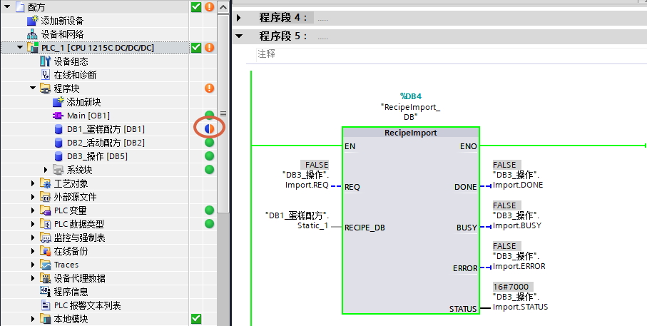
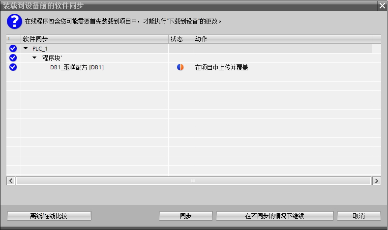
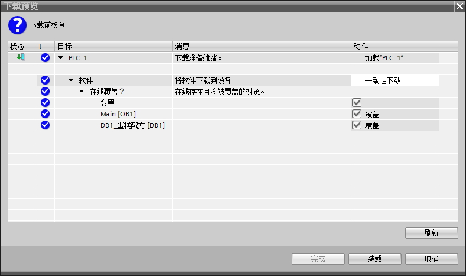
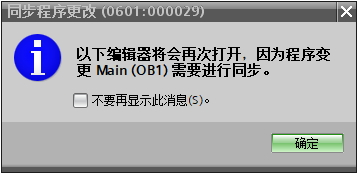
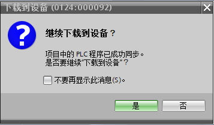
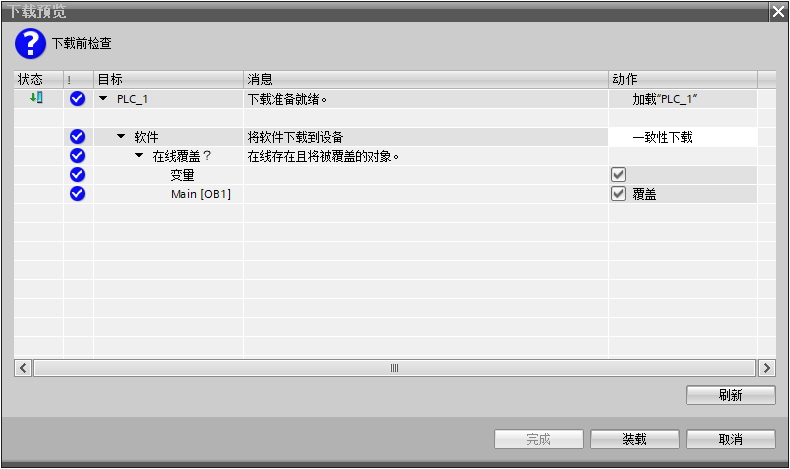
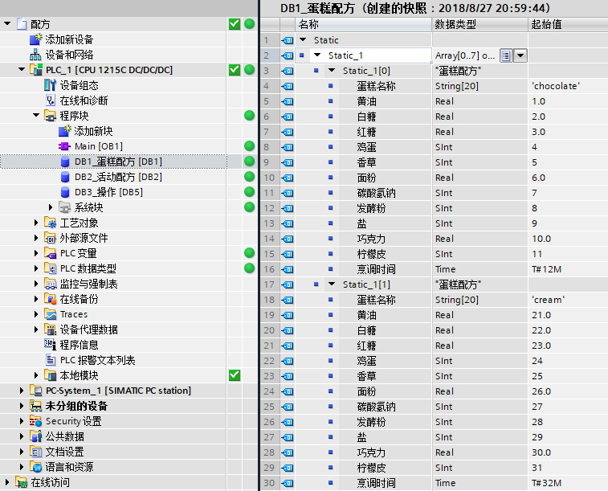

### 配方功能常见问题 {#配方功能常见问题 .n}

**1.S7-1200 系列所有型号的 CPU 是否都支持配方函数功能？**

S7-1200 CPU 版本为 V4.0 及以上支持配方函数指令。

但是广义上的配方功能，从TIA PORTAL V11 SP2，S7-1200
V2.0固件版本开始即支持。

**2.使用 S7-1200 CPU
是否就能实现配方功能？是否还需要增加其余的硬件（存储卡）？**

仅使用 S7-1200 CPU 能实现配方功能，配方数据文件存储在 S7-1200 CPU
本体的装载存储器中。

或者，也可以增加 S7-1200 SIMATIC
存储卡，将其设置为"程序"卡类型，也能实现配方功能；此时，配方数据文件存储在
S7-1200 SIMATIC 存储卡中。

**3.调用指令创建的配方文件个数是否有限制？**

使用"RecipeExport"指令将完整的配方记录导出存储于装载存储器，首先需要在
PLC
装载存储区建立配方数据块，为便于操作还需建立活动配方数据块。所以，PLC
的存储器大小及支持的数据块个数对此有限制。如果使用"程序"卡类型的 S7-1200
SIMATIC 存储卡，文件个数受限于 S7-1200 SIMATIC 存储卡大小的限制。

**4.对每个配方文件声明的元素个数、配方的条目数、导出的配方文件个数是否有限制？**

每个配方文件声明的元素个数等于已建立的配方数据类型中的元素个数，配方的条目数等于"仅存储在装载存储区"中数据块一维数组的个数，导出配方文件的个数受
PLC 的 DB
块及装载存储器的可用资源限制。此外，生成的配方文件通过Microsoft Excel
打开， Excel 工作表中允许的行数限制为 65535 行。

**5.单个配方DB大小限制是多少？**

在S7-1200
V4.2之前，单个DB，无论优化非优化，无论是否仅存储在装载内存中，都是64kB。

在S7-1200
V4.2开始，其他都还是64kB，对于仅存储在装载内存中的优化DB提升到256kB。

**5.如何删除、管理配方数据文件？**

管理配方文件需要使用 Web 服务器，或者直接对"程序卡"存储卡文件进行操作。

1\. 以管理员身份登录 PLC 内置 Web
服务器，或者定义用户的访问权限，需要具有"读取文件"和"写入/删除文件"功能。在
Recipes 页面下可下载、清除、上传配方文件。

2\. 用读卡器读取存储卡文件，配方文件在 \\Recipes
目录中，可直接删除文件。

3\. 通过 ASCII 文本编辑器修改配方数据后再通过 Web 服务器上传文件至
PLC、或存储于存储卡 \\Recipes 目录中。

注意：以上方法是用于删除装载存储器的配方数据文件，而不是删除装载存储器中的配方数据块！

**6.为什么通过WRIT_DBL修改配方数据或者RecipeImport导入配方数据后，修改程序再次下载，之前修改的配方数据丢失？**

通过WRIT_DBL或者RecipeImport指令，修改的是仅存储在装载存储器的DB变量的在线起始值，这样就会和离线起始值不同，所以再次下载程序时，在线起始值会被离线起始值覆盖。

在S7-1200
V4.2之前，需要先将程序块上传，也就是用装载存储器的在线值覆盖离线项目的值，操作可以参考[上传文档](../../07-Program/01-operation/07-upload_program.html)。然后再进行其他的程序下载。

在S7-1200
V4.2后，下载发生了变化。当导入配方后，此时仅装载存储器的DB变量的在线起始值和离线起始值不同时，如图1的DB1_蛋糕配方所示，DB右边的颜色变成半蓝半红。

{width="907" height="457"}

图1.DB的半蓝半红标识

此时随意修改程序，然后点击下载，会出现如图2的下载对话框。

{width="789" height="468"}

图2.下载对话框

如果点击按钮\"在不同步的情况下继续\"，会弹出如图3的对话框，可以发现修改的程序、变量和DB1_蛋糕配方都将被覆盖，即在线起始值会被离线起始值覆盖。

{width="788" height="467"}

图3.下载预览

回到图2，点击按钮\"同步\"，会出现如图4的对话框，提示"同步程序更改"，点击确定后，很快就弹出新的对话框，如图5所示，提示\"项目中的PLC程序已成功同步\"，点击按钮\"是\"后，会弹出如图6的对话框，此时可以发现修改的程序、变量将被覆盖，图3中的DB1_蛋糕配方已经消失。

{width="357" height="173"}

图4.同步对话框

{width="357" height="208"}

图5.同步完成对话框

{width="790" height="469"}

图6.下载预览

当装载成功后，打开DB1_蛋糕配方，会发现其实同步相当于对DB1_蛋糕配方做了快照，并将快照值复制到了起始值，如图7所示。

{width="757" height="611"}

图7.DB1
