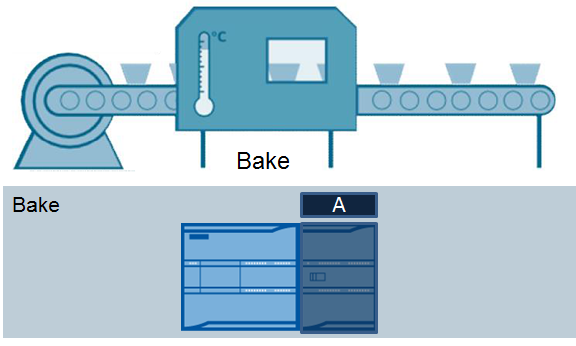
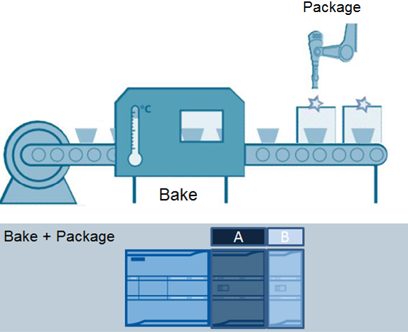
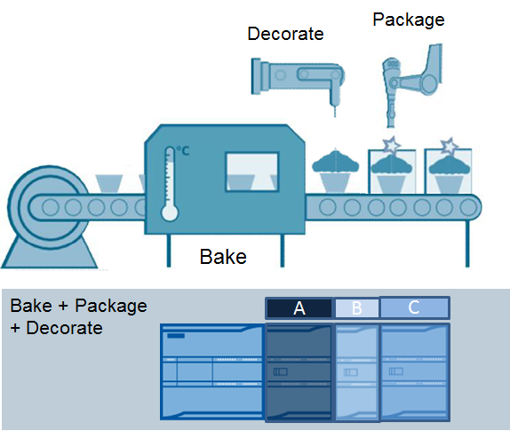

# 15 组态控制

S7-1200 CPU
从固件版本V4.1起开始支持组态控制功能，使模块的组态和安装更加灵活。

## 组态控制的优势和应用

组态控制功能可以用来创建一个要在多种不同安装中使用的自动化解决方案（机器），各种硬件组态可以保存在CPU
中，通过用户程序改变硬件组态与实际安装对应。

下面通过一个实际案例说明一下组态控制的优势和应用。

比如一个蛋糕生产线的OEM设备提供商，有些工厂需要烘焙的生产线，那么该设备提供商需要组态一个烘焙项目，需要S7-1200
CPU 和I/O模块A来负责蛋糕加热的工艺。如图1-1所示。

{width="576" height="346"}

图1-1  烘焙生产线

同时，有的工厂在烘焙的基础上，还需要添加包装工艺，如果没有组态控制功能，那么该设备提供商需要建立另外一个烘焙与包装项目，在原先S7-1200
CPU 和I/O模块A的基础上添加I/O模块B来负责包装工艺，如图1-2。

{width="574" height="467"}

图1-2  烘焙与包装生产线

另外，这个设备提供商的有些客户还需要蛋糕装饰工艺，在原先烘焙和包装基础上添加例如裱花或打奶油工艺，同样如果没有组态控制功能，该设备提供商还需要针对此类客户创建一个新项目，再增加一个I/O
模块C 来负责装饰工艺环节，如图1-3。

{width="574" height="485"}

图1-3 烘焙、包装与装饰生产线

由此可见，在没有组态控制之前，设备提供商需要针对不同客户的不同需求配置多个项目，但是其实这些项目都是基于同一个烘焙设备上添加了不同的组件。利用现在的组态控制功能就可以组态一个最全的配置，然后根据不同需要，通过用户程序灵活调整组态。

```{toctree}
:maxdepth: 1

02-Configuration
03-Example
04-Application_Example


```