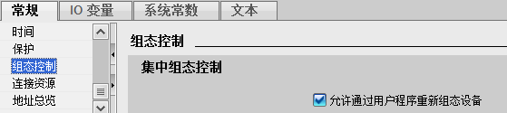
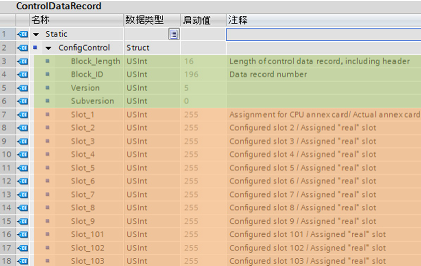
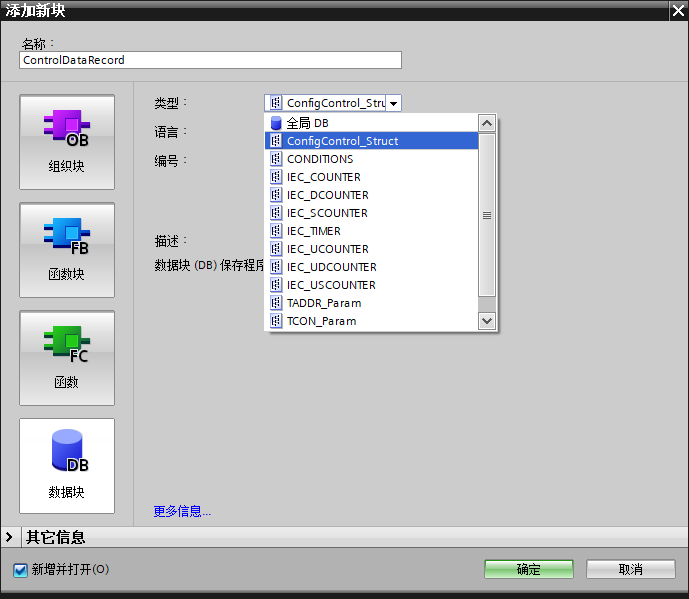
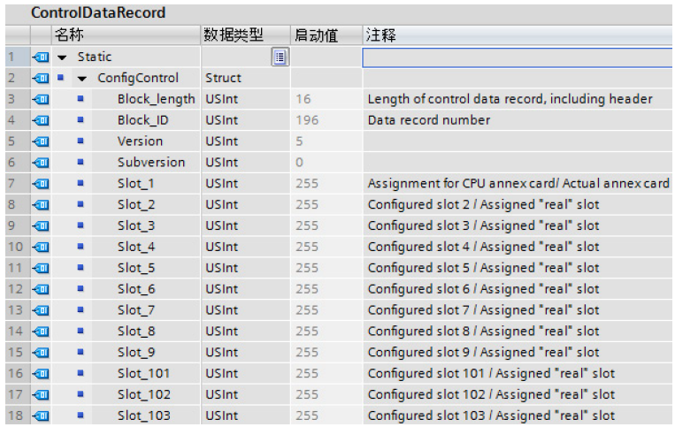
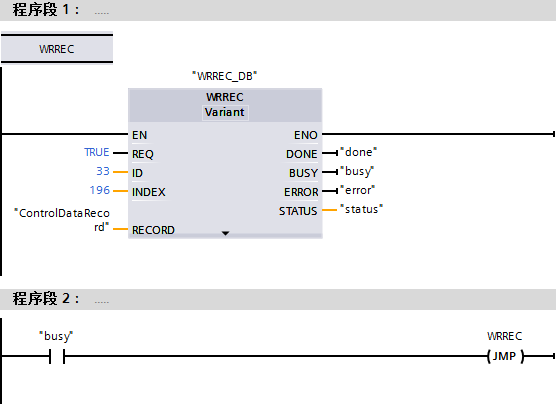
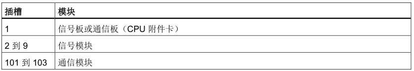
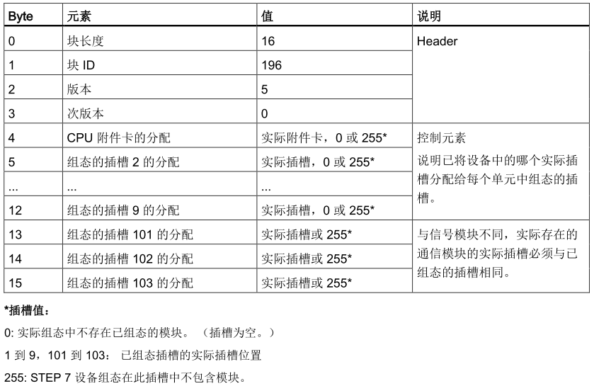

# 组态控制功能组态

S7-1200 CPU 从固件版本V4.1起开始支持组态控制功能，其组态过程如下所述。

## 组态控制功能启用

使用组态控制功能之前，需要在CPU
设备组态的属性里选择"允许通过用户程序重新组态设备"复选框来启动组态控制功能。如图2-1。

{width="559" height="125"}

图2-1 启动组态控制功能

## 创建新数据类型

在博途的PLC数据类型中添加新的数据类型，创建一个用于包含控制数据记录的PLC数据类型，其中前4个USInt变量用于存储组态控制信息，后面12个USInt变量对应于S7-1200最大组态时的各个插槽的实际状态，具体如2-2所示：

{width="826" height="522"}

图2-2 新数据类型

## 创建控制数据块

用刚刚创建的数据类型创建一个包含控制数据的数据块，如图2-3 。

{width="689" height="599"}

图2-3  添加新的数据块

在新生成的数据块中，按图2-4所示组态
Block_length、Block_ID、版本以及次版本。

根据是否存在插槽以及其在实际安装中的位置组态插槽的值：

-   0：实际组态中不存在已组态的模块。 （插槽为空。）
-   1 到 9，101 到 103： 已组态插槽的实际插槽位置
-   255：STEP 7 设备组态在此插槽中不包含模块。

{width="763" height="483"}

图2-4  数据块组态

## 编程传送控制数据记录

在启动OB中，调用扩展的WRREC（写入数据记录）指令，将创建的控制数据记录传送到硬件
ID 33 的索引 196。使用标签和 JMP（跳转）指令等待 WRREC 指令完成。

{width="556" height="405"}

图2-5  启动OB中程序

**  注意，WRREC 指令在启动 OB
中传送完控制数据记录后组态控制才会生效。如果已启用组态控制但 CPU
不具有控制数据记录，则在退出 STARTUP 模式时会转到 STOP
模式。所以需要确保启动 OB 中包含传输控制数据记录的程序。**

## 控制数据记录

图2-6中列出了插槽号分配情况：

{width="836" height="144"}

图2-6 插槽号分配

控制数据记录196包含插槽分配并表示实际组态，如下所示：

{width="839" height="545"}

图2-7 数据记录196结构

修改控制数据记录时请遵守以下准则：

-   组态控制不支持通信模块的位置更改。 插槽 101 到 103
    的控制数据记录插槽位置必须与实际安装对应。
    如果没有为插槽配置模块，请为该插槽位置输入 255。
-   在已填充（已使用）的插槽之间不能有嵌入式空（未使用）插槽。
    例如，如果实际组态在插槽 4 中有一个模块，则实际组态在插槽 2 和 3
    中也必须有模块。相应地，如果实际组态在插槽 102
    中有一个通信模块，则实际组态在插槽 101 中也必须有一个模块。
-   如果已启用组态控制，却没有控制数据记录，则 CPU 仍未做好运行准备。
    如果启动 OB 未传送一个有效的控制数据记录，则 CPU 从启动模式返回到
    STOP 模式。 CPU 在这种情况下不会初始化集中式
    I/O，并将在诊断缓冲区中输入转到 STOP 模式的原因。
-   CPU
    将成功传送的控制数据记录保存在保持性存储器中，也就是说，在不更改组态的情况下重启时无需重新写入控制数据记录
    196。
-   每个实际插槽只能在控制数据记录中出现一次。
-   只能将一个实际插槽分配给一个已组态插槽。

 
