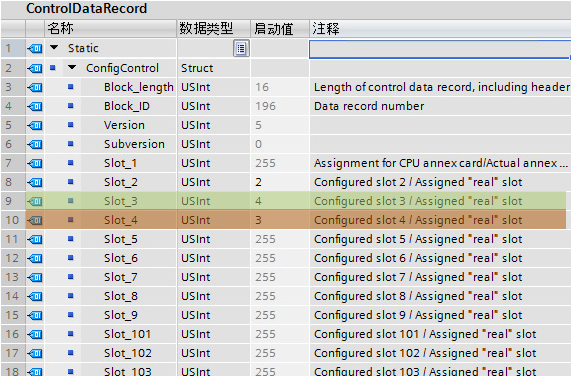

### 组态控制示例

本示例介绍了由一个 CPU 和三个 I/O
模块组成的配置。在第一次实际安装中，插槽 3
处的模块并不存在，因此可使用组态控制将其"隐藏"。 

第二次安装时，应用将包括最初隐藏的模块，但现在该模块位于最后一个插槽中。

修改后的控制数据记录可提供有关模块插槽分配的信息。

#### 示例1---已组态但未使用模块

设备组态包含实际安装中可能存在的所有模块（最大组态）。 如图3-1所示。

{width="639" height="258"}

图3-1  最大安装的设备组态

实际情况下，在设备组态中应位于插槽 3
中的模块不存在，而插槽4组态的模块实际位于插槽3中。如图3-2所示。

{width="492" height="267"}

图3-2  实际设备安装

要指示实际安装模块的不存在，必须在控制数据记录中使用 0 组态插槽
3，即Slot_3 =
0，而插槽4组态的模块实际位于插槽3中，所以Slot_4=3。如图3-3所示。

{width="611" height="381"}

图3-3 示例1的数据记录

#### 示例2---模块位置颠倒

项目最大组态仍如示例1中图3-1所示，但在实际安装时，原本位于插槽3的模块与位于插槽4的模块颠倒了位置。如图3-4所示。

{width="724" height="625"}

图3-4  实际安装时模块位置颠倒

要将设备组态与实际安装关联，可编辑控制数据记录Slot_3=4，将模块分配到正确的插槽位置。

{width="571" height="379"}

图3-5   示例2的数据记录
