# 16 TIA Portal 交叉引用

交叉引用列表提供项目中对象的使用概况。 可以看到哪些对象相互依赖以及各对象所在的位置。 因此，交叉引用是项目文档的一部分。还可以直接跳到对象的使用位置。可以在交叉引用列表中显示和定位的对象取决于所安装的产品。

在 TIA Portal V15 及更高版本中，交叉引用中将显示带有版本标识的指令。不带版本标识的指令则不显示。

可以同时打开多个引用对象的交叉引用。如果选择的对象超过了 50 个，则在交叉引用列表中折叠显示。如果选择的对象少于 50 个，则在交叉引用列表中展开显示。

## 打开交叉引用的方法

打开交叉引用的方法：

1、选中需要查询的目标，在"工具"(Tools) 菜单中，选择"交叉引用"(Cross-reference) 命令。如图1.所示。

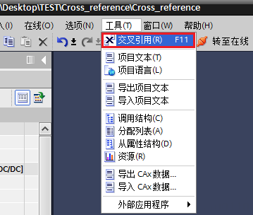

图1.工具菜单打开交叉引用

2、选中需要查询的目标（可以是某个程序，某个块，某个程序段，某个变量，某个块接口，某个PLC数据类型等），在快捷菜单中，选择"交叉引用"(Cross-references)。如图2.所示。

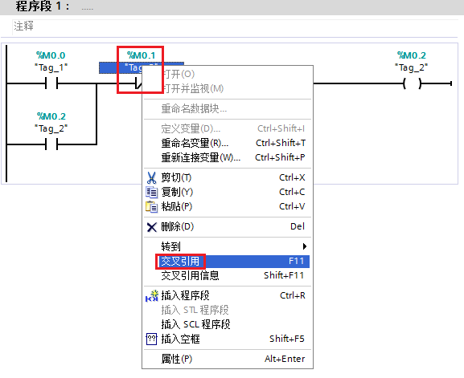

图2.下拉菜单中选择交叉引用

3、选中需要查询的目标，单击工具栏中的交叉引用图标。如图3.所示。

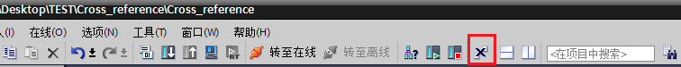

图3.快捷菜单打开交叉引用

4、选中需要查询的目标，在项目树中，选择一个对象并单击"F11"。

5、选中需要查询的目标，在"指令"(Instructions) 任务卡中选择一个带有版本标识的指令，并单击"F11"。如图4.所示。

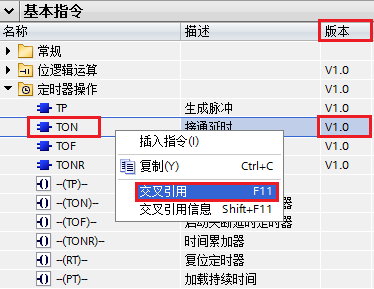

图4.带有版本表示的指令交叉引用

  **注意** :

> a.带有版本标识的指令，在程序中使用才可以显示交叉引用，如果交叉引用为灰色，说明该指令没有调用。
> 
> b.如果不了解程序中是否使用过某些指令，可以直接对该指令交叉引用（前提是该指令是带有版本标识的）

## 交叉引用列表

程序中编辑FB1"电机控制"在OB1"Main"中调用，生成背景数据块DB2“电机控制_DB”，如图5.所示。

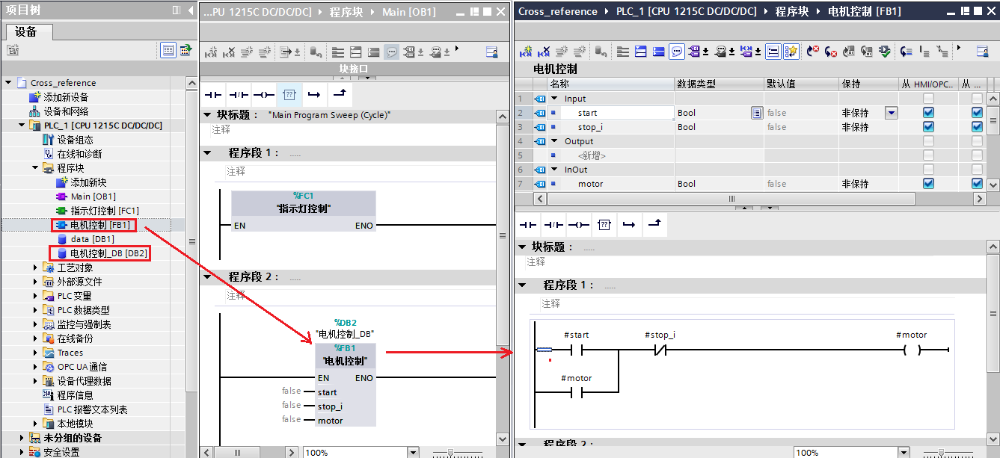

图5.程序编写

同时选中FB1和DB2，右键，交叉引用，打开交叉引用列表，表中内容显示如图6.所示。

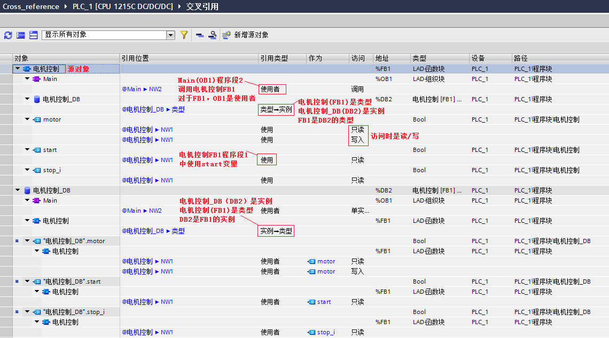

图6.交叉引用列表

## 交叉引用过滤器

为了快速搜索特定的交叉引用并进行合理排列，可对交叉引用列表进行过滤筛选。博途软件安装后，交叉引用列表中集成了系统过滤器。系统过滤器通常位于过滤器选择的下拉列表中，且无法删除。博途默认设置的交叉引用过滤器为“显示带有引用的对象”。如图7.所示。

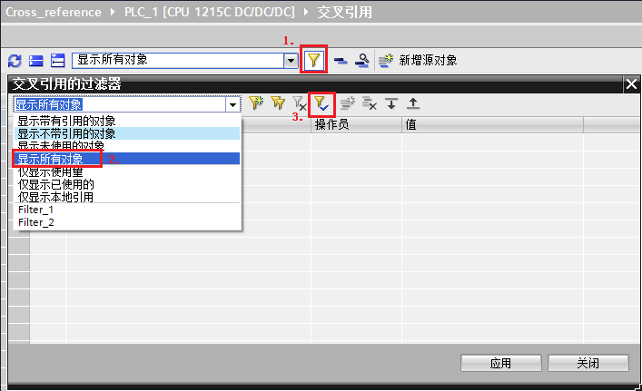

图7.设置默认应用所选过滤器

如需要可以添加自定义过滤器。自定义的过滤器创建后将显示在过滤器选择下拉列表中，位于系统过滤器之后，且可根据需要进行修改、重命名和删除。如图8.所示。

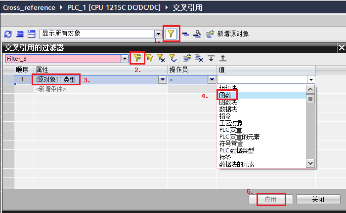

图8.自定义过滤器

选择PLC\_1文件夹，点击工具栏的交叉引用的按钮打开交叉引用窗口，将过滤器切换为自定义的Filter\_3，交叉引用的结果及操作步骤如图9.所示。

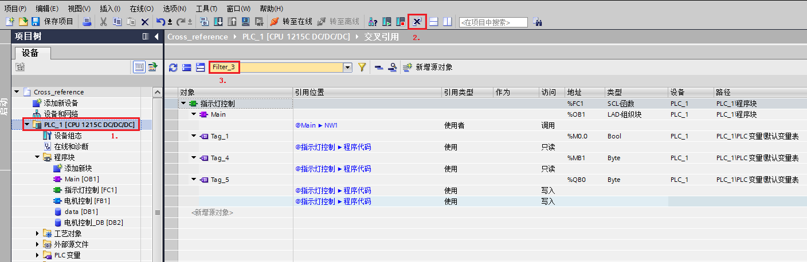

图9.使用自定义过滤器交叉引用

如果自定义的过滤器不需要了，可以将其删除，操作步骤如图10.所示。

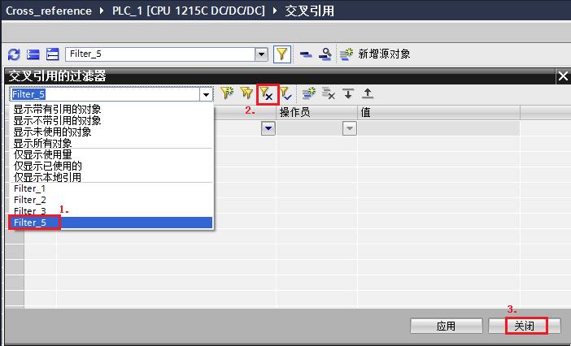

图10.删除自定义过滤器

## 重叠访问

在实际编程过程中，随着程序量的增加，变量使用也会越来越多，如果没有仔细规划过，很容易导致变量使用出现冲突。此处举例说明如何查看变量重叠访问。

在OB1中简单编程，程序段1中将MW18的数值传送到MW20中。序段2中使用M20.0对输出线圈M20.1赋值，其中，M20.0和MW20地址重叠。如图11.所示。

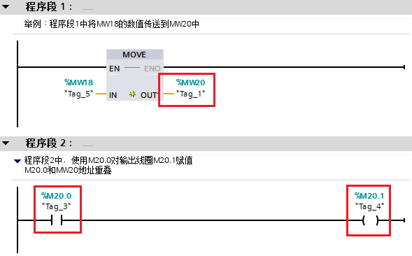

图11.编程中出现变量使用重叠

鼠标选中MW20，右键，下拉菜单中选择交叉引用，交叉引用列表的工具栏中选择显示重叠访问按钮，如图12.所示。

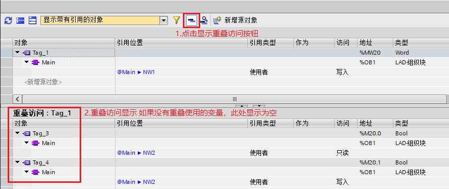

图12.显示重叠访问的变量