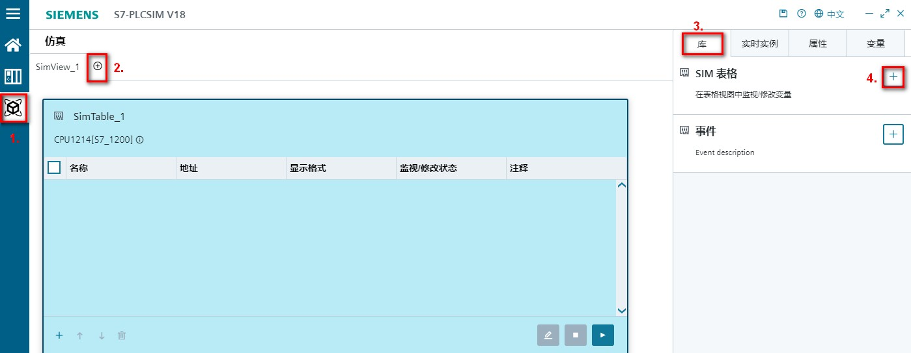

# PLCSIM

PLCSIM 从 V18 版本对用户界面进行了很大的变化，下面将对其使用进行介绍。

如果需要查阅 V18 以下 PLCSIM 版本使用方法，请查看[链接](02-PLCSIM_Archive.html)。

## 适用 PLCSIM 的硬件和固件：

1、固件版本为 4.0 或更高版本的 S7-1200 PLC

2、固件版本为 4.1 或更高版本的 S7-1200F PLC

具体每个 PLCSIM 版本支持情况，取决于对应 TIA Portal 对 CPU 固件版本的支持情况

要使用 PLCSIM 仿真 S7-1200 故障安全 CPU，必须使用与 CPU 固件版本兼容的安全系统版本，参见表 1

表 1.

|     |     |
| --- | --- |
| CPU 固件版本 | 系统安全版本 |
| ≤V4.2 | ≤V2.1 |
| ≥V4.3 | 任何版本 |

## PLCSIM 仿真 S7-1200 支持的功能及局限性

**仿真支持的功能**

* 支持仿真绝大多数 S7-1200 / S7-1200F 的指令，行为与物理 PLC 一致
* 支持仿真 S7-1200 集成 PN 口通信：
    * S7-1200 集成 PN 口和 S7-1200/1500/300/400 的基于以太网的 S7 通信
    * S7-1200 集成 PN 口和 S7-1200/1500 的 TCP/IP 通信（支持程序连接，不支持组态连接）
    * S7-1200 集成 PN 口和 S7-1200/1500 的 ISO ON TCP 通信（支持程序连接，不支持组态连接）
    * S7-1200 集成 PN 口和 WinCC 以及仿真 HMI 触摸屏的通信
* 支持仿真的中断：
    * 程序循环（OB1）
    * 时间中断（OB10）
    * 延时中断（OB20）
    * 循环中断（OB30）
    * 硬件中断（OB40）
    * 诊断错误中断（OB82）
    * 拔出或插入模块中断（OB83）
    * 机架或站故障中断（OB86）
    * 启动 OB（OB100）
* 支持专有技术保护块仿真

**仿真受限的功能：**

* 目前不支持配方、数据日志、Trace、装载存储器的读写、时间错误中断（OB80）、存储卡功能
* 目前不支持对工艺对象的仿真：高速计数器、PID、运动控制
* 目前不支持访问保护和防拷贝保护

## PLCSIM 使用入门

[**启动 PLCSIM 的两种方法**](01-PLCSIM.HTML#AA)

[**修改界面语言及查看帮助信息**](01-PLCSIM.HTML#BB)

[**添加/删除 SIM 表，添加/删除变量，修改监视值**](01-PLCSIM.HTML#FF)

[**添加事件，仿真中断事件**](01-PLCSIM.HTML#GG)

## 启动 PLCSIM 的两种方法

**方法 1：手动创建 PLC 实例**

> 1.安装 PLCSIM 后默认在桌面生成快捷方式，双击 PLCSIM 快捷方式，如图 1 所示

图 1.PLCSIM 快捷方式

> [**2.创建/打开/删除工作区**](01-PLCSIM.HTML#CC)
> 
> [**3.添加/删除 PLC 实例**](01-PLCSIM.HTML#DD)
> 
> [**4.下载程序至 PLC 实例**](01-PLCSIM.HTML#EE)

**方法 2：由 TIA Portal 启动仿真并自动创建 PLC 实例**

> 1.在 TIA PORTAL 项目视图，项目树中选中 CPU1214 文件夹
> 
> 2.鼠标点击开始仿真按钮，PLCSIM 将会自动开启并创建实例
> 
> 步骤 1-2，如图 2 所示

图 2.开始仿真

> [**3.将自动执行下载程序至 PLC 实例，从步骤 5 开始**](01-PLCSIM.HTML#EEE)

## 修改界面语言及查看帮助信息

打开 PLCSIM 后默认是英文界面，可以切换界面语言并且查看帮助信息，如图 3 所示

点击图中标注 1 处，下拉菜单中选择中文即可切换

点击图中标注 2 处，即可查看中文版本的 PLCSIM 的帮助信息，帮助信息的语言版本与软件所显示的界面语言版本相同

图 3.切换界面语言和查看帮助信息

## 创建/打开/删除 工作区

在打开 PLCSIM 后，需要新建或者打开已有的工作区（可以理解为 PLCSIM 的项目）

**创建工作区，如图 4 所示：**

> 1.点击创建工作区按钮
> 
> 2.出现的创建工作区对话框中新建文件夹
> 
> 3.修改文件夹名称
> 
> 4.选择该文件夹确认新建该工作区

图 4.创建工作区

**打开工作区，如图 5 所示：**

> 1.点击打开工作区按钮
> 
> 2.在弹出的打开工作区对话框中，选择相关路径下已经创建好的工作区
> 
> 3.确认打开

图 5.打开工作区

**如果希望删除工作区，如图 6 所示：**

> 在对应的文件夹中选择要删除的工作区，直接按 delete 键删除或者鼠标右键下拉菜单中选择删除按钮进行删除

图 6.删除工作区

## 添加/删除 PLC 实例

**添加 PLC 实例，如图 7 所示：**

> 1.鼠标点击实例视图图标
> 
> 2.通信模式下方，选择 PLCSIM Softbus（仅限内部）
> 
> 注意：对于 S7-1200 来说，仅支持 PLCSIM Softbus 的通信模式，其他两种通信模式适用于 PLCSIM Advanced 使用，而 PLCSIM Advanced 不支持对 S7-1200 的仿真，所以无法使用
> 
> 3.右侧库下方显示各种可使用的 PLC，在 S7-1200 右侧，点击加号 + ，添加 S7-1200 PLC 实例
> 
> 4.在生成的 S7-1200 实例右上角，点击电源按钮，为 S7-1200 上电

图 7.添加 PLC 实例并上电

**如果希望删除 PLC 实例，如图 8 所示：**

> 1.确保待删除的 PLC 实例已经断电
> 
> 2.在实例右侧属性页面中，点击删除按钮将实例删除

图 8.删除 PLC 实例

## 下载程序至 PLC 实例

1.鼠标选中项目视图项目树的 PLC 文件夹（此处忽略添加硬件及程序编写的步骤）

2.工具栏中点击下载按钮

3.在扩展下载到设备对话框中，点击开始搜索按钮

4.搜索到 CPU 后，点击下载按钮进行下载

步骤 1-4 如图 9 所示

图 9.下载

5.在与设备建立连接对话框中点击连接按钮，如图 10 所示

图 10.连接

6.点击装载，如图 11 所示

图 11.装载

7.点击启动模块后，点击完成按钮结束下载，如图 12 所示

图 12.下载完成启动模块

8.下载完成后可以看到 PLCSIM 中的 CPU 已经处于运行模式，如图 13 所示

图 13.PLC 运行

## 添加/删除 SIM 表，添加/删除变量，修改监视值

**添加/删除 SIM 表，如图 14 和 15 所示**：

> 1.鼠标选中 SIM 视图
> 
> 2.点击加号 +，可以添加 SimView，最少保留 1 个，最多可以添加 8 个
> 
> 3.在库的下方，可以看到 SIM 表格和事件
> 
> 4.点击 SIM 表格右上角的加号 +，添加 SIM 表格，图中添加的为 SimTable_1

图 14.添加 SIM 表

> 5.鼠标选中 SimTable_1
> 
> 6.点击属性下方的删除按钮，即可删除 SIM 表

图 15.删除 SIM 表

**添加/删除变量，如图 16 所示：**

> 1.点击变量按钮
> 
> 2.勾选实例复选框 instance_CPU1214\[S7-1200\]，绑定 SIM 表可访问的 PLC 实例
> 
> 3.区域下方勾选 Input，Output，Memory，DB，筛选可显示的存储区的变量
> 
> 4.显示的变量是：2 中选择的 PLC 实例，3.中勾选区域中的所有定义过的变量，分别点击变量，此时变量会出现在左侧表格中
> 
> 5.点击 +，可以添加空白行
> 
> 6.在添加的空白行中，手动输入变量得名称或者地址以添加变量
> 
> 7.勾选某一行变量前的复选框
> 
> 8.可以点击向上向下的箭头调整位置，也可以点击删除按钮，删除选中的那一行

图 16.添加删除变量

**修改监视值，如图 17 和 18 所示**：

> 1.点击监视按钮
> 
> 2.在监视/修改状态列中输入要修改的值，数值即可发生变化
> 
> 3.点击停止监视按钮，即可停止监视

图 17.修改监视值

> 4.勾选 Consistent Modify
> 
> 5.此时多出“一致修改”列，对想要一起修改数值的变量行勾选复选框，然后在其后方修改数值
> 
> 6.点击立即修改按钮，使修改值生效

图 18.一致性修改

## 添加事件，仿真中断事件

PLCSIM 中可以仿真四类事件：诊断中断、硬件中断、插拔中断以及机架或站错误中断，以下以硬件中断为例，讲解如何使用事件功能。

**硬件中断**

1.CPU 属性中启用通道 0 的上升沿和下降沿，并且关联到 OB40，如图 19 所示

图 19.硬件组态启用上升沿和下降沿中断

2.在 OB40 硬件中断中做累加，用来记录当事件触发时进入 OB40 程序的次数，如图 20 所示

图 20.OB40 编写累加程序

3.在 PLC 变量中，系统常量中查看数字量输入通道 0 对应的硬件标识符，Local~DI\_14\_DQ\_10\_1 是 264，如图 21 所示

图 21.系统常量查看硬件标识符

4.打开 PLCSIM 中的 SIM 视图

5.在库下方，点击事件右上角的 + ，添加事件

步骤 4-5 如图 22 所示。

图 22.添加事件

6.事件类别中选择硬件中断

7.硬件标识符填写 264，与在 TIA Portal 项目中 Local~DI\_14\_DQ\_10\_1 保持一致

步骤 6-7 如图 23 所示

图 23.设置事件类别及标识符

8.鼠标选中默认生成的通道和事件类型

9.设置通道编号和事件类型，保证和硬件组态设置一致

步骤 8-9 如图 24 所示

图 24.设置通道编号和事件类型

10.点击两次事件触发按钮，用于仿真通道 0 的上升沿事件到来 2 次，如图 25 所示

图 25.触发事件

11.监控数据块中用于累加次数的变量 "data1".add 的数值为 2，实际 OB40 执行过 2 次，与 PLCSIM 仿真事件一致，如图 26 所示

图 26.监视数据块累加值

如果希望删除事件

12.选中要删除的事件

13.在属性下方点击删除按钮即可删除事件

步骤 12-13 如图 27 所示

图 27.删除事件