### S7-1200 PLCSIM V18 以下版本

S7-1200 PLC 仿真功能有如下硬件和软件要求：

**硬件要求：**

1、固件版本为 4.0 或更高版本的 S7-1200 PLC

2、固件版本为 4.1 或更高版本的 S7-1200F PLC

**软件要求：**

PLCSIM V13 SP1 及以上

此文档为 PLCSIM V18 以下版本，V18 以上版本参见[链接](01-PLCSIM.html)。

### S7-1200 PLCSIM 支持范围

#### 一、 工艺对象支持

**PLCSIM 不支持 S7-1200 任何工艺对象的仿真。**

#### 二、 指令支持

PLCSIM 几乎支持仿真的 S7-1200 和 S7-1200F
的所有指令（系统函数和系统函数块），支持方式与物理 PLC 相同。PLCSIM
将不支持的块视为**非运行**状态。

某些指令受部分支持。对于这些 SFC 和 SFB，PLCSIM
将验证输入参数并返回有效输出，但不一定是带有实际 I/O 的真实 PLC
将返回的信息。

#### 三、 通信指令支持

PLCSIM 只支持 S7-1200(F)C 的如下通信协议：

-   S7-1200 集成 PN 口和 S7-1200/1500/300/400 的基于以太网的 S7 通信
-   S7-1200 集成 PN 口和 S7-1200/1500 的 TCP/IP
    通信（支持程序连接，不支持组态连接）
-   S7-1200 集成 PN 口和 S7-1200/1500 的 ISO ON TCP
    通信（支持程序连接，不支持组态连接）
-   S7-1200 集成 PN 口和 WinCC 以及仿真 HMI 触摸屏的通信

#### 四、 其他功能

专有技术保护块、配方、数据日志、Trace、装载存储器的读写、时间错误中断（OB80）、存储卡功能
PLCSIM 不支持。

程序循环（OB1）、时间中断（OB10）、延时中断（OB20）、循环中断（OB30）、启动OB（OB100）支持。

硬件中断（OB40）、诊断错误中断（OB82）、拔出或插入模块中断（OB83）、机架或站故障中断（OB86）从
PLCSIM V16 通过事件功能开始支持。

### 使用入门

#### 一、 PLCSIM 的启动与下载

#### **启动方法一**

新建 PLC 程序，然后如图 1 所示，然后执行图中操作。

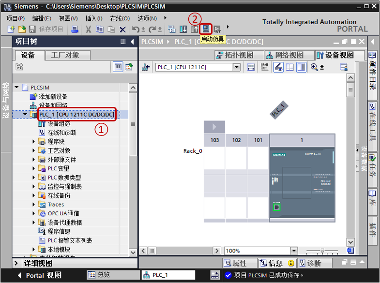{width="785" height="585"}

图 1 启动仿真

①左键单击需要被下载到 PLCSIM 的 CPU

②左键单击"启动仿真"按钮，先后弹出如图 2 和图 3 的窗口。

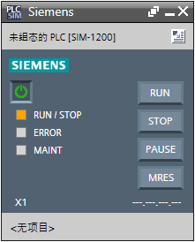{width="221" height="274"}

图 2 精简视图

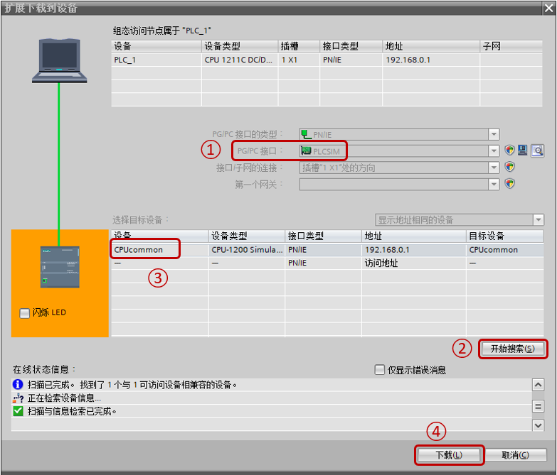{width="783" height="669"}

图 3 下载页面

①PG/PC 接口：默认选择 PLCSIM，此时无法连接真实 CPU

②左键单击"开始搜索"按钮

③选中搜索到的 CPU

④左键单击"下载"按钮

这样就完成了一次下载操作。

#### **启动方法二**

在桌面上找到如图 4 的图标，左键双击该按钮。会自动打开如图 5
的窗口，该窗口和图 2 类似，但有一点区别。此时 PLCSIM 的 CPU
处于没有上电的状态，需要接通电源。

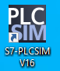{width="77" height="90"}

图 4 PLCSIM 图标

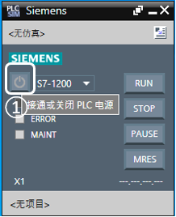{width="218" height="268"}

图 5 未上电仿真界面

①左键单击该图标，即接通了 PLCSIM 的电源，之后，PLCSIM 状态即和图 2
一致。之后正常下载 PLC 程序，参考图 3。

#### 下载完成

下载完成后如果没有错误，仿真界面如图 6 所示。

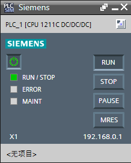{width="218" height="272"}

图 6 已下载仿真界面

正常监视程序和真实 CPU 基本一致。

说明

1\. 在 PLCSIM 中只能建立 2 个实例，也就是说最多同时仿真 S7-1200 与
S7-1500 共 2 个。

#### 二、PLCSIM的精简视图与项目视图

图 6 的界面，叫做精简视图，此时，可以正常对 PLC
进行仿真，启动停止，监视指示灯状态。

如果需要使用一些高级功能，例如对 I
点进行设置，序列功能，事件触发，则需要转至项目视图，如图 7 所示。

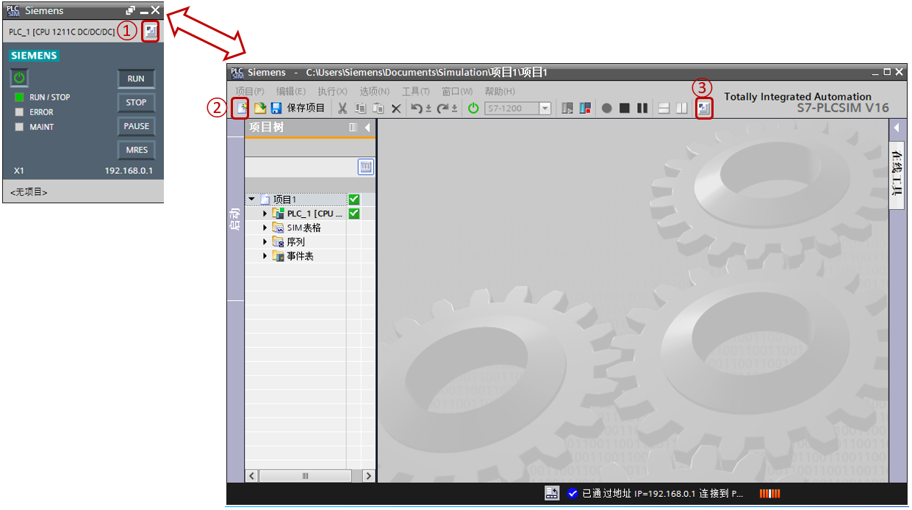{width="1241" height="695"}

图 7 精简视图与项目视图

①在精简视图左键点击该按钮即切换到项目视图

②在项目视图中左键点击该新建按钮，会在项目视图中新建仿真文件，产生仿真视图左边的项目树：SIM
表格、序列、事件表等

③如果希望从项目视图返回精简视图，可以左键点击该按钮

说明

1\. 在 PLCSIM V13SP1 或者 PLCSIM V13SP2
中，必须切换到项目视图，新建仿真文件，仿真功能才可以使用，PLCSIM V14
以后，可以在精简视图、项目视图，新建或者不新建仿真文件，都可以使用仿真功能。

2\. 如果项目视图不新建仿真文件，则使用不了 I
点进行设置，做序列，事件触发等高级功能，但是可以使用扫描控制、设置仿真界面的语言、查询
PLCSIM 的帮助文件等。

#### 三、PLCSIM 项目视图的功能

#### **设备视图**

如图 8 所示，可以打开 PLCSIM 项目视图中的设备视图，在这里可以直观的对
CPU 主机架模块以及 PROFIBUS DP/PROFINET IO/AS-i 的分布式 IO 给定 DI 和
AI 点，显示 DQ 以及 AQ 结果。每次只能显示一个模块的所有 IO。

注：该功能在 PLCSIM V17 取消。

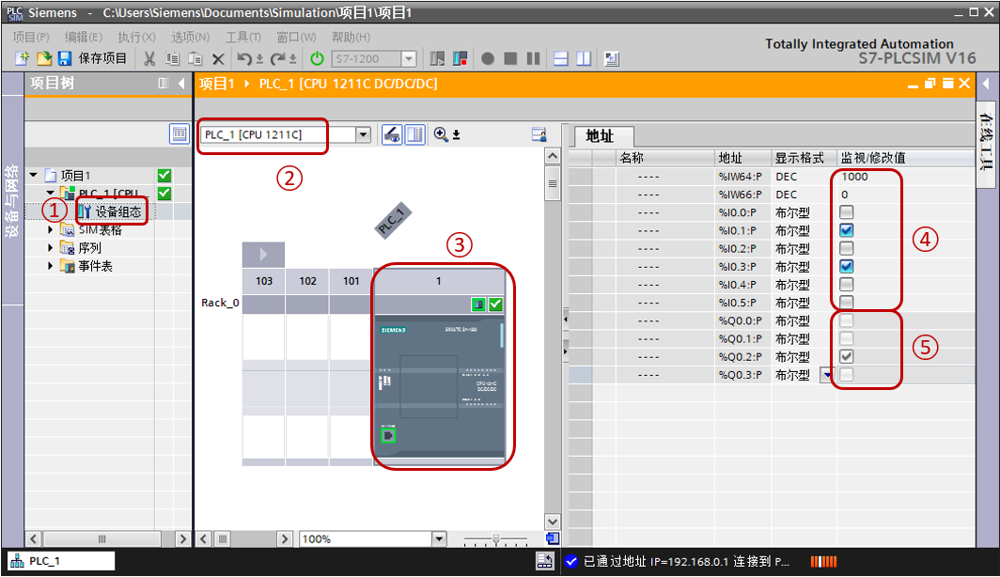{width="1064" height="614"}

图 8 PLCSIM 的设备视图

①左边项目树，展开 PLC，双击"设备组态" ，打开右边的设备视图

②在这里选择机架，默认是 PLC 主机架

③在这里选择需要查看或修改的 IO 模块

④在 DI/AI 给定设置值

⑤ DQ/AQ 显示运算结果

#### **SIM 表格**

如图 9 所示，可以打开 PLCSIM 项目视图的 SIM 表格，在这里可以对 PLC
的全局变量进行修改监视，与 PLC 的监控表不同的是，SIM 表格不可以监视修改
DTL、字符串等复杂数据类型，但是可以对 DI、AI
进行修改监视，并且还有一些和 PLC 监控表不同的地方，见下方说明。

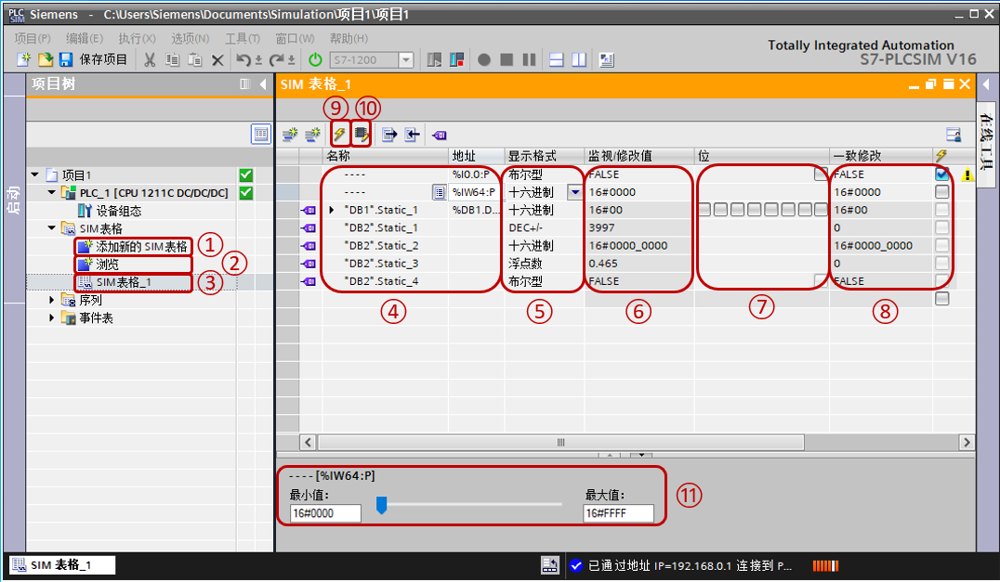{width="1076" height="627"}

图 9 SIM 表格

①展开 SIM 表格，可以看到，点击"添加新的 SIM 表格"，可以新建更多的 SIM
表格。

② PLCSIM V16 以后支持的功能，点击"浏览"，可以导入 PLC 的变量表及监控表。

③点击"SIM 表格_x"可以在右边工作区打开指定的 SIM 表格。

④添加变量名称或绝对地址，注意不支持 DTL、字符串等 PLC
监控表支持的数据类型。

⑤可以修改变量显示的数据格式。

⑥可以执行单个变量的修改，同时显示每个变量的实际值。

⑦如果变量是 Bool 类型，或者是非优化的 Byte
类型时，这里可以设置显示变量中单个位的状态。

⑧如果希望几个变量同时修改，需要在需要同时修改的变量这里设置值，然后激活后面的"√"。

⑨在⑧处修改打钩完毕后，点击该按钮可以同时修改。

⑩该 SIM 表格默认只能修改 DI、AI
的变量，如果需要修改其他变量需要点击该按钮。

?PLCSIM V15
以后支持的功能，当选中的变量的显示格式是布尔型、十六进制、八进制、DEC、DEC+/-、浮点数时，在这里会显示该控制视图。如果是布尔型，则是一个**瞬动**按钮；如果是十六进制、八进制、DEC、DEC+/-，则会是图中所示的滑块，取值范围取决于数据类型，例如
Int 类型，选择 DEC+/- 是从
-32768\~32767；如果是浮点数，则也会是图中所示的滑块，取值范围为
0.0\~1.0。

#### **序列**

如图 10 所示，可以打开 PLCSIM 项目视图的序列功能，对 PLC
全局变量根据时间序列进行值的给定。

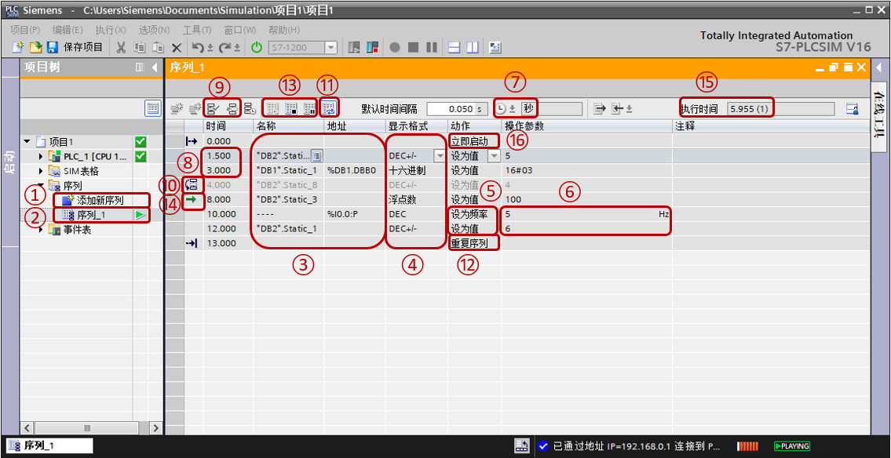{width="1134" height="583"}

图 10 序列

①展开序列，可以看到，点击"添加新序列"，可以新建更多的序列。

②点击"序列_x"可以在右边工作区打开指定的序列。

③添加变量名称或绝对地址。如果该变量为优化块变量，要求该变量必须使能\"可从
HMI/OPC UA
访问\"，并且不支持片段访问；如果该变量为绝对地址访问，则没有上述要求。

④可以修改变量显示的数据格式。

⑤可以设置将变量设为值，还是特殊的对 DI 点设置以脉冲输入的设为频率。

⑥设定的值或者频率。

⑦设置时间的格式或单位，可以设置毫秒、秒、分钟、hh:mm:ss.ms。

⑧设置该步的起始时间与结束时间，以图中第 2 行为例，第 2
行这一步前的时间为该步的起始时间，1.5s，第 3
行这一步前的时间为该步的起始时间也是上一步的结束时间，3s，所以第 2
行这一步总的执行时间是 3-1.5=1.5s。

⑨可以设置某步禁用或重新启用。

⑩选中该步并点击⑨处的禁用步，则为禁用状态。

?点击该按钮可以使整个序列往复执行。

?往复执行的序列则显示"重复序列"，否则显示"停止序列"。

?启动序列、暂停序列、停止序列。

?当前正在执行的步。

?当前步的执行时间，括号内为第几次的重复。

?可以设置步为立即启动或触发条件，如图 11 所示。

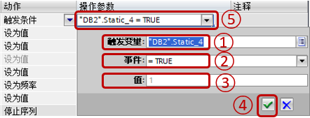{width="442" height="169"}

图 11 触发变量

①设置触发变量，支持的数据类型包括位变量、位序列、整数、浮点数。只支持符号寻址的变量，并且必须使该变量使能\"可从
HMI/OPC UA 访问\"。

②设置触发事件，位变量支持\"=True\"和\"=False\"，位序列和整数支持\"=值\"、\"\<\>值\"，浮点数支持\"\>值\"、\"\<值\"。

③设置比较值。

④点击确认按钮。

⑤最终的触发条件。

#### 事件

PLCSIM V16
增加新功能，事件激活测试。可以通过模拟一个事件，测试程序中的诊断功能是否生效。如图
12 所示，以机架故障为例。

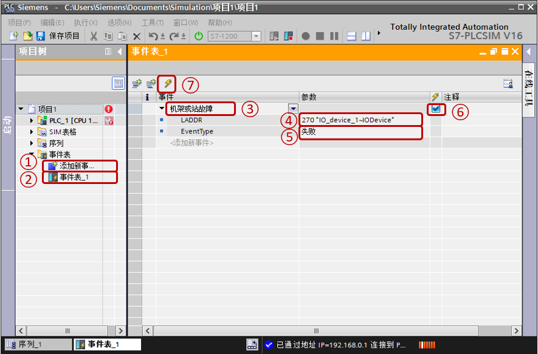{width="885" height="583"}

图 12 事件设置

①展开事件表，可以看到，点击"添加新事件"，可以新建更多的事件。

②点击"事件表_x"可以在右边工作区打开指定的事件。

③选择需要模拟的事件，可以选择拔出或插入模块、机架或站故障、硬件中断、诊断错误中断。图中选择机架或站故障。

④根据不同的事件设置故障影响的设备的硬件标识符。图中为
IO_device_1\~IODevice 这个 IO 设备。

⑤设置事件是故障还是错误返回。

⑥选中需要激活的事件。

⑦激活该事件，激活后，如图13所示，IO 设备报故障，如果有诊断指令或者 OB86
中编写程序，可以读取相关错误信息。

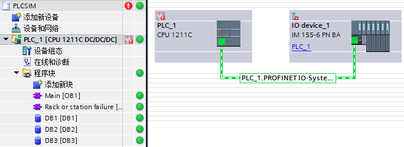{width="684" height="249"}

图 13 仿真结果

#### 扫描控制

PLCSIM V16
增加新功能，扫描控制。可以设置运行若干扫描周期，或者运行多长时间等功能。要求
PLCSIM 处于项目视图，但不要求新建仿真文件，如图 14 所示。

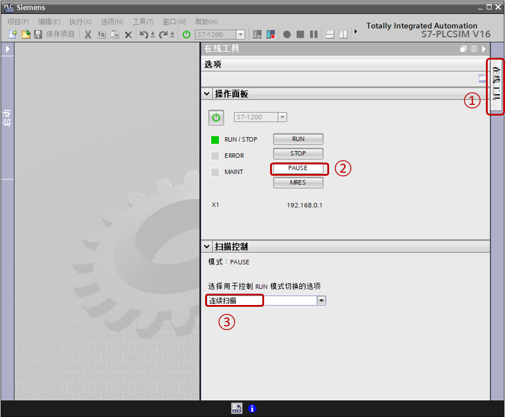{width="847" height="700"}

图 14 扫描控制

①在 PLCSIM 项目视图最右边点击"在线工具"。

②在操作面板中，点击"PAUSE"即暂停按钮。

③在扫描控制中选择模式，默认连续扫描，这时可以选择运行启动 OB
后暂停或指定扫描持续时间，如图 15、16 所示。

对于运行启动 OB 后暂停，如果没有启动
OB，则重启后暂停。如果需要取消扫描控制的功能，需要将扫描控制改为连续扫描，然后点击操作面板的"RUN"即运行按钮。

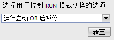{width="223" height="79"}

图15 运行启动OB后暂停

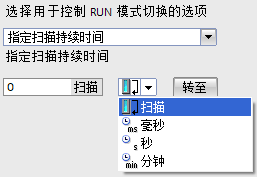{width="257" height="177"}

图 16 指定扫描持续时间

### 仿真 PLC与"真实" PLC之间的区别

#### 1. I/O 设备支持

PLCSIM 不支持专用 I/O 设备功能。仅提供 I/O
寄存器的过程映像和直接访问仿真。
例如，可以通过模拟量输出范围监视来查看此专用功能。在物理设备上，如果
STEP 7
程序将范围外的值写入模拟量输出寄存器，则模拟量模块会返回诊断错误。PLCSIM
中不会发生这种情况。

#### 2. 诊断

PLCSIM 不支持写入诊断缓冲区的所有错误消息。 例如，PLCSIM 不仿真 CPU
中与故障电池相关的消息或 EPROM 错误。 但 PLCSIM 可仿真大多数的 I/O
和程序错误。

#### 3. 基于时间的性能

由于 PLCSIM 软件运行在装有 Windows 操作系统的 PC 上，因此 PLCSIM
中操作的扫描周期时间和确切时间不同于在物理硬件上执行的那些操作所需的时间。
这是因为 PC 的处理资源"竞争"产生了额外开销，具体开销取决于多种因素。

如果程序高度依赖于执行操作所需的时间，则需注意不应仅根据 PLCSIM
仿真的时间结果来评估程序。

#### 4. 受专有技术保护的块

PLCSIM 不支持受专有技术或密码保护的块。 在对 PLCSIM
执行下载操作前，必须删除保护。

#### 5. 访问保护和复制保护

PLCSIM 不会对访问保护或复制保护进行仿真。

#### 6. 仿真通信

PLCSIM 支持仿真实例间的通信。实例可以是 PLCSIM 仿真或 WinCC
运行系统仿真。

可以运行 PLCSIM 的两个实例，而且它们之间可相互通信。

可以运行 PLCSIM V1x的一个实例和 PLCSIM V5.4.6
或更高版本的一个实例，而且它们之间可相互通信。

**[仿真实例间的通信]{.underline}**

所有仿真实例必须在同一 PC 上运行才能相互通信。每个实例的 IP
地址都不得重复。

PLCSIM 支持 TCP/IP 连接。

对于 S7-1200 和 S7-1200F PLC，可使用 PUT/GET 和 TSEND/TRCV (T-block)
指令来仿真通信。\

**[T-block 指令和 UDP]{.underline}**

PLCSIM 不能仿真组态为使用 UDP 协议的 T-block 连接。

[**T-block 指令和数据分段**]{.underline}

PLCSIM 执行 T-block 指令时数据分段为 1024 字节。实际 CPU 的数据分段为
8192 字节。

如果在单个 TSEND 指令中发送的数据超过 1024 字节，并且在 adhoc 模式下通过
TRCV 指令接收数据，则 TRCV 指令生成的新数据只有 1024
字节。此时，必须多次执行 TRCV 指令才能接收额外的字节。

**[T-block 指令和 数据缓冲]{.underline}**

PLCSIM 执行 T-block 指令时无需在接收 CPU 中缓冲数据。

不过在 PLCSIM 中，只有仿真的接收 CPU 中的程序执行 TRCV
指令后，仿真的发送 CPU 才能完成 TSEND 指令。

但是，在 PLCSIM 中执行 TSEND 指令时，只有接收 CPU 上的程序执行 TRCV
指令后，TSEND 指令才能完成。

**[每个仿真的 PLC 的 IP 地址都不得重复]{.underline}**

如果每个仿真的 PLC 都具有相同的 IP 地址，则无法运行多个仿真。每个仿真的
PLC 的 IP 地址都不得重复。

在启动仿真之前，应确保 IP 地址在 STEP 7 中唯一。

#### 7. 使 LED 闪烁

可在 TIA PORTAL 的"扩展的下载到设备"对话框中使 PLC 上的 LED 灯闪烁，但
PLCSIM 无法仿真此功能。 但是通过事件仿真可以使 ER 灯闪烁。

#### 8. 需要 SD 存储卡的功能

PLCSIM 不会仿真 SD 存储卡。 因此，不能仿真需要存储卡的 CPU 功能。
例如，数据记录功能会将所有输出都写入 SD 卡，这样便无法仿真数据记录功能。

#### 9. 数据日志

PLCSIM 不支持数据日志。

#### 10. 配方

PLCSIM 不支持使用配方。

#### 11. Web 服务器

PLCSIM 不支持 Web 服务器功能。

#### 12. PROFIBUS

如果 STEP 7 项目中包含 PROFIBUS 元素，则 PLCSIM 不会仿真 PROFIBUS
元素，但是项目中的其它部分会照常仿真。 启动仿真之前，您无需将 PROFIBUS
元素从项目中移除。只是必须注意，PLCSIM 会忽略 PROFIBUS 元素。

#### 13. F-CPU 仿真

要仿真 F-CPU，必须先在 STEP 7 项目中调整 F-参数
F-监视时间，然后再执行下载到 PLCSIM
。这是因为基于软件的仿真和物理硬件间存在时间差。\
要调整 F 监视时间，请按以下步骤操作：\
1. 在 STEP 7 项目树中，右键单击 F-CPU 并选择\"属性\"(Properties)。\
2. 在\"属性\"(Properties) 对话框中，导航到\"故障安全 \> F 参数 \> 集中式
F-I/O 的默认 F 监视时间\"(Fail-Safe \> F-parameter \> Default
F-monitoring time for central F-I/O)。\
3. 将 F 监视时间从默认值 150 ms 调整为更高值。\
4. 单击\"确定\"(OK)。 可能需要重复该步骤，直至找到可使 F-CPU
仿真无错运行的 F 监视值。

#### 14. 指令支持

PLCSIM 支持仿真的 S7-1200 和 S7-1200F 的大多数指令，就像物理 PLC
一样。可以下载成功编译到虚拟 PLC
中的所有程序。但是，某些指令会调用仅受部分支持的\
SFC（系统函数）或 SFB（系统函数块），并且仿真可能无法按预期工作。
对于具有部分受支持指令的程序，PLCSIM
将验证输入参数并返回有效输出，但不一定返回带有物理 I/O 的实际 PLC
将返回的信息。例如，PLCSIM 不支持 SIMATIC SD
存储卡，因此在执行仿真时，用于将数据保存到存储卡中的程序指令实际上不会保存任何数据。
