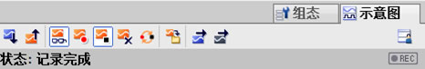
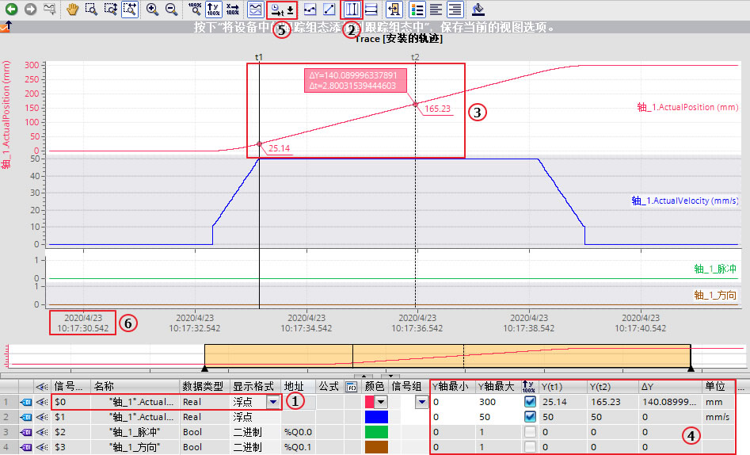
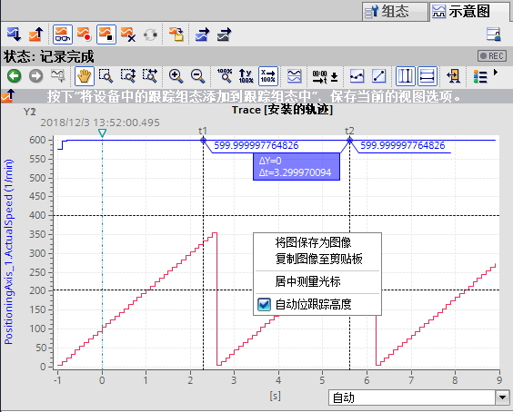

### TRACE功能概述

在TIA博途软件中，通过轨迹功能记录测量值变化，并通过逻辑分析器对记录进行评估分析。
将配置好的TRACE下载到PLC中，从而根据条件采样变量值。多个采样值形成了以时间变化为横坐标的曲线，称为记录。可以将记录保持至离线文件中，并支持不同离线文件的对比分析。此外记录也可保存到存储卡中。\
S7-1200支持装载2个TRACE配置，单个配置的最大存储空间为512KB。每个TRACE配置最多可以组态16个信号。

**支持TRACE功能的硬件：**

> 如果设备支持轨迹和逻辑分析器功能，则可使用项目树中设备下方的
> \"轨迹\"进行选择。 以下设备支持轨迹和逻辑分析器功能：

-   SIMATIC S7-1200 CPU（固件版本 V4.0 及以上版本）
-   SIMATIC S7-1500、ET 200SP、CPU 1513pro-2 PN 和 CPU 1516pro-2 PN CPU
-   SIMATIC S7-1500 软件控制器
-   ET 200SP Open Controller
-   支持 Startdrive 的 SINAMICS 驱动装置
-   SINAMICS V90 + HSP 0185
-   SIRIUS SIMOCODE pro（带 Simocode ES）
-   SIRIUS 软起动器 3RW （带软起动器 ES）

**TRACE功能的运行模式**

> {width="782" height="373"}
>
> 图1. 运行模式
>
> **①** TIA Portal 中编程设备 (PG)
> 上的轨迹组态，可在轨迹组态过程中指定待记录信号、记录时长和触发条件。\
> **②** 将轨迹组态从 PG
> 传输到设备，当建立在线连接时，可将整个轨迹组态传输到设备中。\
> **③** 等待记录，如果激活所记录的轨迹组态，则记录执行与 PG
> 无关。满足触发器条件时，将立即进行记录。\
> **④** 将测量结果从设备传输到 PG 中，保存项目中的测量存储 TIA Portal
> 里已打开项目中的测量。完成记录后可以随时保存测量，与测量时间无关。\
> **⑤**
> 评估，管理和保存测量结果，通过\"曲线图\"和\"信号表\"中的各种选项，对测量结果进行评估。不同测量中的信号可叠加在一起作为组合测量，并进行比较。\

### S7-1200 TRACE功能实验环境

在本应用实例中，通过以下产品进行TRACE功能组态。

> **软件：**
>
> > TIA Professional V16
>
> **硬件：**
>
> > CPU1217C DC/DC/DC V4.4

### S7-1500 TRACE功能组态

**1、TRACE配置**介绍

> 1.1、新建TRACE配置\
> 在TIA博途软件中，双击项目树相应PLC站点下的"Traces"，展开后来实现TRACE的各项功能，TRACE在线视图如图2所示。
>
> {width="353" height="305"}
>
> 图2. 创建TRACE
>
> ①点击"添加新Trace"，用于新建Trace配置；\
> ② {width="15"
> height="15"}为目前离线文件和CPU已装载有相同名称的TRACE；  {width="15"
> height="14"} 为目前仅存在于离线文件的TRACE；  
> {width="14"
> height="13"}为离线文件和CPU已装载的TRACE配置相同；
> {width="14"
> height="14"}为离线文件和CPU已装载的TRACE配置不同；\
> ③保存在离线测量文件夹下的记录文件；\
> ④保存在在线存储卡下的记录文件；\
> ⑤保存在离线组合测量文件夹下的记录文件；\
> 新建TRACE配置后，右边工作区将显示TRACE组态页面。
>
> 1.2、组态记录信号
>
> 一个TRACE配置最多记录16个变量，支持位、位序列、整数、浮点数、时间（Time、Date、TOD）数据类型，支持对过程映像输入、过程映像输出、位存储区以及DB块的变量进行记录。工作区配置变量如图3所示。
>
> {width="587" height="158"}
>
> 图3. TRACE信号配置
>
> 1.3、设置采样条件
>
> 工作区TRACE记录条件如图4所示。
>
> {width="934" height="187"}
>
> 图4. 配置采样
>
> ①采样OB：TRACE记录的是信号在所选采样OB结束处的值，可以选择以下OB作为采样OB：循环OB，时间OB，延时OB，循环中断OB，MC-PreServo
> OB，MC伺服OB，MC插补器 OB，MC-PostServo OB；\
> ②采样频率：每隔1～2^31^-1个采样OB，记录一次所有设置信号的值；\
> ③测量点数量：一次采样作为一个测量点，而TIA博途软件根据TRACE配置信号的数量、数据类型以及采样频率计算出测量点的最大数量；\
> ④如使用计算出测量点的最大数量，则激活选择框；\
> ⑤自行设置测量点数量，但不能超过测量点的最大数量。
>
> 1.4、设置触发条件
>
> 触发器为TRACE采样的起始条件，工作区触发器设置如图5所示。
>
> {width="936" height="284"}
>
> 图5. 配置触发器
>
> ①触发模式包括立即记录、变量触发和无触发器监视（TIA V16
> 及以上版本支持无触发器监视模式，如选择无触发器监视和立即记录模式则没有后面的②～⑤的参数），具体区别参考表1；
>
> 表1 两种触发模式的区别
>
> +-----------------------------------+-----------------------------------+
> | 立即记录                          | ::: {align="left"}                |
> |                                   | 激活记录后，TRACE立即开始记录；   |
> |                                   | :::                               |
> +-----------------------------------+-----------------------------------+
> | 变量触发                          | ::: {align="left"}                |
> |                                   | 激活记录后，                      |
> |                                   | TRACE处于等待记录中，仅当触发变量 |
> |                                   | 满足一定条件后，TRACE才开始记录； |
> |                                   | :::                               |
> +-----------------------------------+-----------------------------------+
> | 无触发器监视                      | ::: {align="left"}                |
> |                                   | 激活记录                          |
> |                                   | 后，TRACE立即开始记录，并不会自动 |
> |                                   | 终止，只有触发停止记录才会停止。  |
> |                                   | :::                               |
> +-----------------------------------+-----------------------------------+
>
> ②触发变量类型包括位、位序列、整数、浮点数、时间（Time、Date、TOD）数据类型，支持过程映像输入、过程映像输出、位存储区以及DB块的变量，该变量和待采样的信号无关；\
> ③变量触发条件参考表2；
>
> 表2 变量触发条件汇总
>
> +-----------------------+-----------------------+-----------------------+
> | \                     | 数据类型              | 说明                  |
> | 变量触发条件          |                       |                       |
> +-----------------------+-----------------------+-----------------------+
> | =TRUE                 | 位                    | 当触发器状            |
> |                       |                       | 态为TRUE时，记录开始  |
> +-----------------------+-----------------------+-----------------------+
> | =FALSE                | 位                    | 当触发器状            |
> |                       |                       | 态为FALSE时，记录开始 |
> +-----------------------+-----------------------+-----------------------+
> | 上升沿                | 位                    | 当触发器状态从FALS    |
> |                       |                       | E变为TRUE时，记录开始 |
> +-----------------------+-----------------------+-----------------------+
> | 下降沿                | 位                    | 当触发器状态从TRUE    |
> |                       |                       | 变为FALSE时，记录开始 |
> +-----------------------+-----------------------+-----------------------+
> | 上升信号              | 整数和浮点数          | 当触发值到            |
> |                       |                       | 达或者超过为此事件配  |
> |                       |                       | 置的数值时，记录开始  |
> +-----------------------+-----------------------+-----------------------+
> | 下降信号              | 整数和浮点数          | 当触发值到            |
> |                       |                       | 达或者低于为此事件配  |
> |                       |                       | 置的数值时，记录开始  |
> +-----------------------+-----------------------+-----------------------+
> | 在范围内              | 整数和浮点数、时间    | 当触发                |
> |                       |                       | 值位于为此事件配置的  |
> |                       |                       | 数值范围内，记录开始  |
> +-----------------------+-----------------------+-----------------------+
> | 不在范围内            | 整数和浮点数、时间    | 当触发                |
> |                       |                       | 值位于为此事件配置的  |
> |                       |                       | 数值范围外，记录开始  |
> +-----------------------+-----------------------+-----------------------+
> | =位模式               | 整数和位序列          | 当触发                |
> |                       |                       | 值与为此事件配置的位  |
> |                       |                       | 模式匹配时，记录开始  |
> +-----------------------+-----------------------+-----------------------+
> | \<\>位模式            | 整数和位序列          | 当触发值              |
> |                       |                       | 与为此事件配置的位模  |
> |                       |                       | 式不匹配时，记录开始  |
> +-----------------------+-----------------------+-----------------------+
> | =值                   | 整数和位序列、时间    | 当                    |
> |                       |                       | 触发值等于为此事件配  |
> |                       |                       | 置的数值时，记录开始  |
> +-----------------------+-----------------------+-----------------------+
> | \<\>值                | 整数和位序列、时间    | 当触                  |
> |                       |                       | 发值不等于为此事件配  |
> |                       |                       | 置的数值时，记录开始  |
> +-----------------------+-----------------------+-----------------------+
> | 改变值                | 所有                  | 当触发值和记录激活时  |
> |                       |                       | 该值不同时，记录开始  |
> +-----------------------+-----------------------+-----------------------+

> ④预触发的测量点个数与总的测量点数量的示意图，即在总的测量点个数中包含若干满足触发条件时刻前测量点的记录；\
> ⑤预触发的测量点个数设置，参考图6-49，记录时长（a）=1000个测量点，即预触发10个测量点，触发条件满足后记录990个测量点；
>
> 1.5、设置存储卡模式
>
> 当触发器为变量触发、并且CPU的存储卡为程序卡时，可以设置将记录存储在存储卡中。每次激活记录，会在存储卡中产生一个带有时间戳的文件夹，该时间为CPU的系统时间，用于保存该次激活记录下的所有TRACE条目。工作区存储卡模式设置如图6所示，
>
> {width="934" height="184"}
>
> 图6. 设置设备上测量
>
> ①选中则激活存储卡模式；\
> ②设置测量数目（1-999），该数目为每个带有时间戳文件夹内保存的最大TRACE条目数；\
> ③根据测量数目、测量点数量以及TRACE配置信号的数量、数据类型计算出的存储空间要求，该值不能超过存储卡的大小；\
> ④当达到测量数目时TRACE可以设置为以下2种响应：\
> （1）禁用记录\
> 此时记录自动去激活。如再次激活记录，将产生新的带有时间戳的文件夹。\
> （2）覆写最早记录\
> 此时一旦再次满足触发条件并记录完成后，将覆盖文件夹内最早的TRACE条目，实现TRACE的往复记录，直到记录被手动去激活。选择该项需注意存储卡的写入寿命。
>
> 注意：\
> 如果TRACE设置存储卡模式，则"自动重复记录"{width="16"
> height="16"} 的功能将不再支持。

**2、安装轨迹配置**

> 上述配置完成后，则可以通过点击"在设备上安装轨迹"
> 按钮{width="16"
> height="16"}实现将TRACE配置下载至CPU如图7所示。
>
> {width="506" height="53"}
>
> 图7. 安装配置

**3、激活记录**

> 下载配置开始后，工作区将切换至"示意图"页面。下载完成后会将CPU自动转至在线，并使得"观察开/关"
> {width="16"
> height="16"}自动激活。此时如果点击"激活记录"{width="16"
> height="16"}按钮
> ，将按照TRACE配置执行开始记录或等待触发条件。当测量点个数达到预设时，则记录完成；如果记录中点击"禁用记录"{width="15"
> height="16"}按钮
> ，可以结束记录，切换为未激活状态。如果点击"自动重复"{width="16"
> height="16"}按钮 ，则记录完成后，将重新开始记录或等待触发条件。\
> 未激活、等待触发条件、记录中以及记录完成的示意显示如图8、9、10、11所示。
>
> {width="466" height="74"}
>
> 图8. 未激活示意图
>
> {width="466" height="73"}
>
> 图9. 等待触发条件示意图
>
> {width="466" height="75"}
>
> 图10. 记录中示意图
>
> {width="466" height="76"}
>
> 图11. 记录完成示意图
>
> 注意：\
> TRACE的下载、上载和CPU组态程序的下载、上载无关，需要在TRACE页面单独执行。
>
> 可通过工具栏中的按钮管理轨迹，下图12列出了各按钮的功能：
>
> {width="559" height="215"}
>
> 图12. TRACE 示意图工具栏

**4、TRACE保存及分析**

> TRACE结束记录后可以在线分析该记录，可以使用工具栏中的按钮对曲线进行分析，如图13所示。\
>
> {width="618" height="26"}
>
> 图13测量示意图工具栏
>
> 曲线图展示了信号表中选定记录信号的轨迹。
> 显示可以按照要求进行缩放，还可以使用测量光标来选择单个数值在信号表中显示出来等功能。
> 曲线图工具栏图标常用功能请看下表3。
>
> 表3.图标功能表
>
>   ---------------------------------------------------- ---------------- --------------------------------------------------------------------------------------
>   图标                                                 功能             说明
>   {width="72" height="21"}   缩放             选中某一缩放按钮，拖拽鼠标选择相应区域，可实现整个选中区域的缩放或垂直水平方向的缩放
>   {width="76" height="24"}   显示             点击某一显示按钮，可实现轨迹的完整显示或是X轴Y轴方向的整体显示
>   {width="38" height="23"}   时间轴单位转换   转换X轴的单位，可以是采样点、相对触发开始时的相对时间、采样点的时间戳三种单位形式
>   {width="25" height="24"}   显示测量点       采样点在曲线上显示为小圈
>   {width="26" height="22"}   插值显示         实现2个采样点之间的线性插补
>   {width="51" height="23"}   显示测量光标     通过测量光标可测量水平或垂直方向某点或两点之间的差值
>   {width="27" height="23"}   更换背景颜色     切换轨迹的背景颜色
>   ---------------------------------------------------- ---------------- --------------------------------------------------------------------------------------
>
> 记录中的每个变量使用单独的Y轴，显示该变量的值；所有变量公用X轴，X轴单位取决于"更改X轴单位"按钮的选择。TRACE记录的分析示例如图14所示。\
>
> {width="947" height="574"}\
>
> 图14 TRACE记录的分析示例
>
> ①指定变量及显示格式；\
> ②选择"显示垂直测量光标"；\
> ③显示①变量在光标处的实时值以及Y轴差值（ΔY）X轴时间差（Δt）；\
> ④显示所有信号在光标处的实时值以及Y轴差值；\
> ⑤设置X轴为采样的时间戳；\
> ⑥时间戳为CPU的本地时间；\
> 通过示意图下方的信号表，可以自定义信号组编号，然后将非位信号编入一个信号组，此时该信号组将使用相同的Y轴，便于整体观察该信号组的数值，比较大小关系，如图15所示。
>
> {width="951" height="529"}\
>
> 图15 TRACE信号组
>
> 信号表列出了所选测量的信号，以及某些属性的设置选项，如图16所示。在线模式下，可更改设备中的轨迹设置。单击\"上传\"按钮，可应用显示方式的更改；否则在切换为离线模式时，系统将丢弃这些更改。\
> 当把设备中轨迹添加到测量时，信号表的当前设置将在测量中保存。可通过拖放操作对信号进行排序，在信号内可以重新排序信号位。
> 常用功能请查看表4。
>
> {width="872" height="58"}
>
> 图16 信号表
>
> +-----------------------------------+-----------------------------------+
> | 功能                              | 说明                              |
> +-----------------------------------+-----------------------------------+
> | 打开位选项                        | 可以把以下数据类型                |
> | {width="18" | {width="21" |
> |                                   | height="18"}                      |
> |                                   | ，使拆分后的信号显示在            |
> |                                   | 轨迹曲线中：Byte、Word、DWord、SI |
> |                                   | nt、USInt、Int、UInt、DInt、UDInt |
> |                                   |                                   |
> |                                   | Byte数据类型已打开位选项示例图：  |
> |                                   | {width="480" |
> |                                   | height="97"}                      |
> +-----------------------------------+-----------------------------------+
> | 显示格式                          | 可以切                            |
> |                                   | 换信号在轨迹中的显示格式，比如十  |
> |                                   | 六进制、十进制、八进制、二进制等  |
> +-----------------------------------+-----------------------------------+
> | 颜色                              | 可以切换信号在轨迹中显示的颜色    |
> +-----------------------------------+-----------------------------------+
> | 信号组                            | 单击{width="22" |
> |                                   | height="19"}链形图标或            |
> |                                   | 在输入栏中输入信号组名称可创建新  |
> |                                   | 的一个信号组并把该信号添加到信号  |
> |                                   | 组，添加到信号组中后图标变为{width="22" |
> |                                   | height="19"}，单击{width="22" |
> |                                   | height="19"}图标可                |
> |                                   | 将信号移除该信号组，注意二进制信  |
> |                                   | 号无法加入信号组。同一信号组的信  |
> |                                   | 号可以显示在一个坐标系中，这样更  |
> |                                   | 容易分析比较，如图15所示。在测量  |
> |                                   | 轨迹中可以对创建的信号组通过单击" |
> |                                   | 使用当前视图为记录的标准视图"{width="25" |
> |                                   | height="20"}按钮                  |
> |                                   | 进行保存，方便下次打开分析使用。  |
> |                                   |                                   |
> |                                   | 创建信号组示例图：                |
> |                                   | {width="533" |
> |                                   | height="58"}                      |
> +-----------------------------------+-----------------------------------+
>
> : 表4.信号表功能
>
> 如果没有新的TRACE记录产生且CPU不断电的情况下，此记录将一直保存；CPU在线后，选择配置的TRACE，点击"观察开/关"{width="16"
> height="16"}按钮 后即可看到在线的TRACE记录。\
> 该TRACE记录可以通过点击"导出轨迹配置"{width="16"
> height="16"}按钮
> ，将记录以TRACE格式或以\*.csv格式导出，前者可以在其它TIA博途项目"Traces\>测量"右键菜单中选择"导入轨迹"进行轨迹的导入，而后者则可以以excel表格形式保存所有测量点的数值。

**5、测量和组合测量**

> 可把获取到的轨迹信息通过"添加到测量"{width="16"
> height="16"}按钮保存到测量轨迹中，在测量轨迹中对信号进行分组、显示格式、颜色等分析，为了日后再次查看测量轨迹，可通过测量视图右下方"创建当前视图的快照"{width="23"
> height="21"}按钮对此次操作进行保存，方便下次分析使用，如图17所示。
>
> {width="565" height="105"}
>
> 图17.快照
>
> 组合测量可应用于项目中，实现对不同测量进行比较的功能。
> 下文说明了如何在\"组合测量\"系统文件夹下创建组合测量，如图18所示。\
> (1) 在 \"测量\" 系统文件夹下选择一个或多个测量。\
> (2) 将测量拖拽到
> \"组合测量\"系统文件夹中后一个新的组合测量将被创建。或者通过快捷菜单命令\"导入轨迹\"导入已保存的测量。
>
> {width="1052" height="280"}
>
> 图18 组合测量创建
>
> 不仅可以同时分析多个记录，还可以将多个TRACE记录的时间轴重新校准后分析。如图19所示。\
> {width="673" height="717"}\
>
> 图19 组合测量
>
> ①轨迹的导入和导出
>
> ②选择测量的校准方式：触发/采样与时间戳（绝对时间），触发/采样的校准是由校准方式与偏移量共同决定，而时间戳（绝对时间）的校准只是由偏移量决定，具体区别参考表5；\
>
> 表5 校准方式区别
>
>   ------------ ----------- ------------- ---------------------- ---------------------- ----------
>                            X轴时间单位                                                 校准方法
>                            采样          时间                   采样的时间戳           
>   测量的校准   触发/采样   支持          支持，可调准偏移时间   不支持                 支持
>                时间戳      不支持        不支持                 支持，可调准偏移时间   不支持
>   ------------ ----------- ------------- ---------------------- ---------------------- ----------
>
> ③设置X轴时间单位，此处设置为时间；\
> ④选择校准方法：触发、触发事件后首次采样、首次采样、上次采样（最后一次采样）；\
> ⑤当不考虑偏移设置时，应该是根据Trace的最后一次采样与Trace_1的满足触发事件时的采样的时间实现校准；\
> ⑥设置精确到纳秒偏移时间；\
> ⑦设置Trace的时间偏移，时间为正为时间轴向后偏移，时间为负为时间轴向前偏移。此处根据Trace设置的偏移5s，实现Trace的最后一次采样后的5s与Trace_1的满足触发事件时的采样的校准；

**6、打印轨迹**\

> 在曲线图中，右键轨迹图可将显示屏保存为图片并将显示屏复制到剪贴板后进行打印，如图20所示。
>
> {width="564" height="454"}
>
> 图20. 打印轨迹

**5、相关文档**

> SIMATIC/SINAMICS
> S7-1500/1200使用轨迹和逻辑分析器功能链接：<https://support.industry.siemens.com/cs/cn/zh/view/64897128>

### 常见问题 {#常见问题 align="left"}

1\. S7-1200 和 S7-1500 有多少个测量点能够存储在轨迹记录中？

> 在配置轨迹记录的条件时，STEP 7 (TIA Portal)
> 软件会计算出记录的最大持续时间和显示最大的测量点数目。测量点数量跟CPU中用于存储轨迹记录的内存大小和记录PLC变量需要的内存大小有关。
>
> **用于轨迹记录功能的存储空间大小**\
> S7-1200 和 S7-1500 的 CPU 提供 512 KB (512 x 1024 字节 = 524288
> 字节)用于轨迹记录功能。因为头部需要 32
> 字节，所以实际上用于测点记录的存储空间仅有 524256 字节 (524288 字节 -
> 32 字节 = 524256 字节)。\
> **轨迹中测量点的内存需求**\
> 单个测量点的存储空间需求是所有 PLC
> 变量记录所占用的存储空间加上用于记录时间戳的 8 个字节。\
> 按照下面的公式可以计算出一个 S7-1200 或者 S7-1500 的 PLC
> 中用于每一个轨迹可记录的最大测量点数：
> 每个轨迹的测量点数=用于测点记录的存储空间有 (524256 字节)/（PLC
> 变量所需要的存储空间 + 8 个字节用于记录时间戳 ）

### S7-1200 Trace 应用例程 

**请参考以下链接：**

 点击下列链接，打开新浏览器窗口。

[**http://www.ad.siemens.com.cn/productportal/Prods/S7-1200_PLC_EASY_PLUS/S7-1200例程合集/功能/Trace.html**](http://www.ad.siemens.com.cn/productportal/Prods/S7-1200_PLC_EASY_PLUS/S7-1200例程合集/功能/Trace.html)\
