# 库功能

TIA Portal 软件提供了强大的库功能，可以将需要重复使用的元素存储在库中。该元素可以是程序块、数据块、硬件组态等。熟练使用库功能，可以在编程过程中事半功倍。

在 TIA Portal 软件中，每个项目都包含一个项目库，可以存储要在项目中多次使用的元素。除了项目库，TIA Portal 软件还可以创建任意多数量的全局库。用户可以将项目库或项目中的元素添加到全局库中，也可以在项目中使用全局库中的对象。

## 库基本介绍

1、库总览

打开 TIA Portal 软件，进入项目视图，在软件的右侧任务卡处单击库，如图 1 所示，从上至下分别是”库视图“和“库管理”按钮、项目库窗格、全局库窗格、元素窗格（默认不开启）、信息窗格。

图 1、 库任务卡

通过“库视图”按钮可以打开库视图，进入库视图后，选择对应的库通过”库管理“按钮可以查看库管理视图，如图 2 所示。

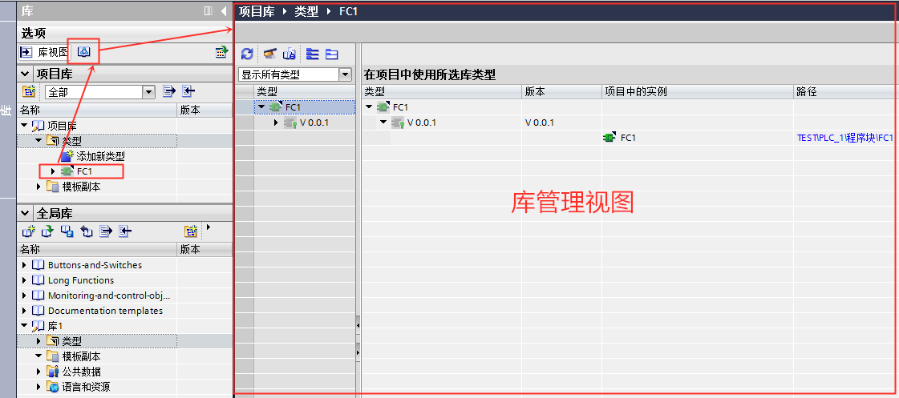

图 2、库管理视图

2、类型

类型是执行用户程序所需的元素。可以对类型进行版本控制，并可以对其进行二次开发。 以下 PLC 的元素可作为类型存储在项目库或全局库中：函数（FC）、函数库（FB）、PLC数据类型（UDT）。

项目库类型来自于项目的程序，而全局库类型不仅可以来自项目的程序而且可以来自于项目库类型；项目中如果使用全局库中的类型，TIA Portal 软件会同时将该类型复制到项目库类型。

注意： 只有 FC、FB、UDT 可以作为类型的元素，可以出现嵌套的 FC、FB、UDT，但在 FC、FB 中不可以出现全局变量。

3、模板副本

模板副本是用于创建常用元素的标准副本。可以创建所需数量的元素，并将其插入到基于模板副本的项目中。这些元素都将具有模板副本的属性。

模板副本既可以位于在项目库中，也可以位于在全局库中。项目库中的模板副本只能在项目 中使用。在全局库中创建模板副本时，模板副本可用于不同的项目中。

可以在库中将以下元素创建为模板副本：带有设备组态的设备、变量表或各个变量、指令配置文件、监控表、文档设置元素（如封面和框架）、块和包含多个块的组、PLC 数据类型 (UDT) 和包含多个 PLC 数据类型的组、文本列表、报警类别、工艺对象。

## 全局库

全局库是一个与具体项目无关的单独文件，可以将程序、组态等保存至库中分享给其它用户。此外随 TIA Portal 软件安装的库也位于全局库中。

1、全局库的创建过程

（1）全局库的建立

打开新的 TIA Portal 项目“TEST”，点击“创建新全局库”按钮，如图 3 所示。

图 3、创建新全局库

（2）添加库元素

通过拖放的方式在库的类型或模板副本中添加元素，在”TEST“项目中添加新 PLC，创建 FC1，将其拖入全局库“库1”的模板副本，如图 4 所示。

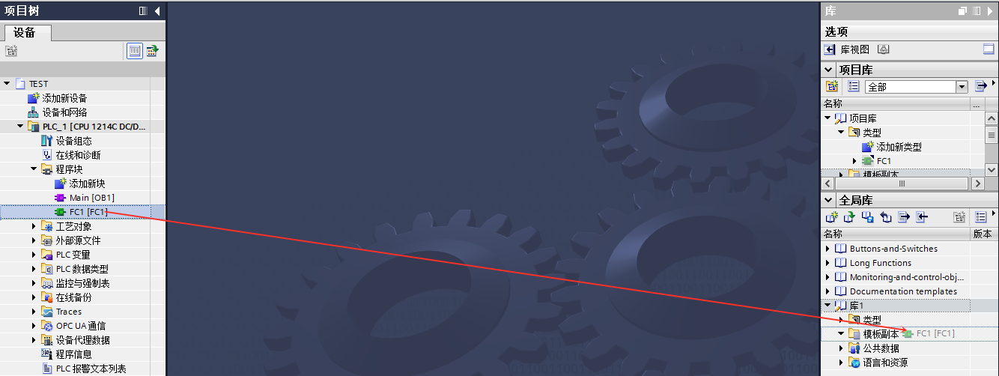

图 4、添加库元素

（3）保存库

选择要保存的库，点击“保存对库所做的更改”按钮保存库，如图 5 所示。

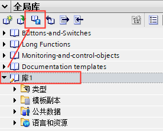

图 5、保存库

（4）关闭库

选择要关闭的库，点击“关闭全局库”按钮关闭库，如图 6 所示。

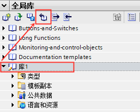

图 6、关闭库

2、全局库的打开与调用

（1）全局库的打开

打开新的 TIA Portal 项目“NEW”，点击“打开全局库”按钮，浏览选择并打开目标全局库文件，如图 7 所示。

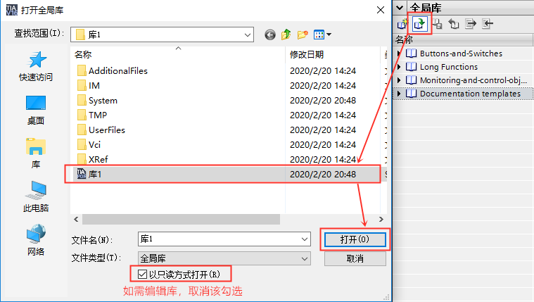

图 7、打开全局库文件

（2）调用库元素

新建 PLC，将全局库“库1”模板副本中的 FC1 拖入 PLC 程序，如图 8 所示。

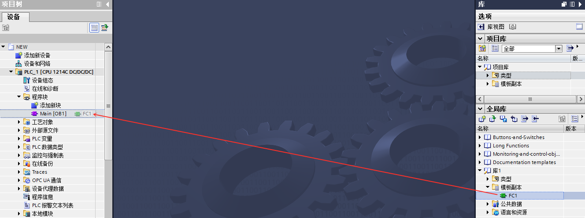

图 8、调用库元素

## 项目库

项目库为每个项目自带的库。在项目库中，可以存储想要在项目中多次使用的对象，也可以将项目库中对象在项目内任意使用。项目库始终随当前项目一起打开、保存和关闭。

如果将元素作为类型添加到项目库中，并且此元素与其它元素相关，则系统也会将相关的元素作为类型进行自动创建。

将一个类型添加到项目库中之后，该类型将与项目中添加的元素象关联。因此，项目中的元素为该类型的实例。

1、添加至项目库类型

新建 PLC，将 FC1 拖入项目库的类型中，如图 9 所示。

图 9、添加项目库类型

2、创建新的类型并发布

拖入项目库类型后自动提示添加类型、版本，如图 10 所示。从图中可见，当将 FC1 拖入项目库类型后，FC1 中调用的 FC2 也同时出现在项目库类型中。

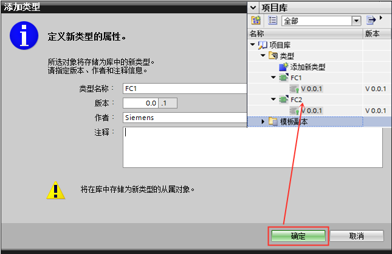

图 10、创建类型并发布

3、项目库类型添加到全局库

项目库类型可以添加到全局库中从而可以分享给其它用户使用，如图 11 所示。

图 11、项目库类型添加到全局库类型

4、修订版本并再次发布

如果需要对类型进行编辑，可以右键点击需要修订的类型，选择“编辑类型”，下图 为对 FC2 "V0.0.1"进行编辑，如图 12 所示。

图 12、编辑类型

当对 FC2 进行修改后，点击发行版本可发布新的类型版本，如图 13 所示。

图 13、FC2 发布新版本

因为 FC2 的变化，导致调用该 FC2 的 FC1 变为“正在测试”模式，因此需要该 FC 检查一致性后，发行新版本。右键点击“V 0.0.2\[正在测试\]”，如图 14 所示。

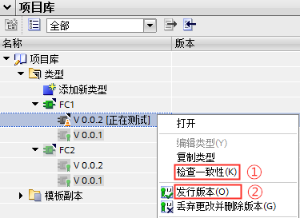

图 14、FC1 检查一致性并发布

4、更新项目

用类型的新版本更新项目中绑定的所有元素，右键点击“类型”，如图 15 所示。

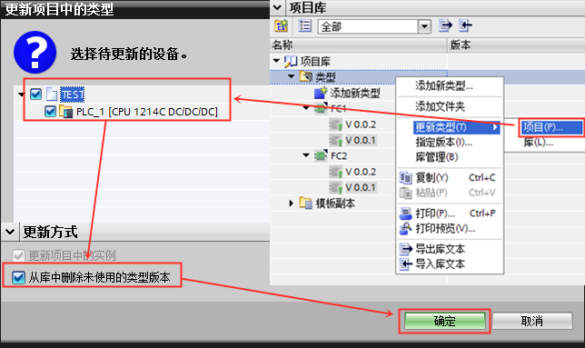

图 15、更新项目程序

最终将项目库类型中没有在程序中使用的版本删除，更新后项目库如图 16 所示。

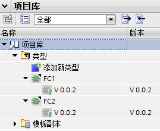

图 16、最终项目库类型

5、更新全局库类型

可以用类型的新版本更新全局库类型，更新之前需要打开全局库，打开方法参见上述全局库介绍，更新方法需要右键点击”类型“，如图 17 所示。

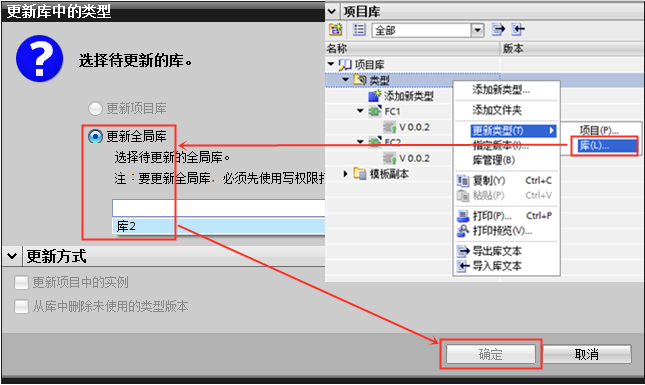

图 17、更新全局库类型

更新完成最终全局库类型如图 18 所示。

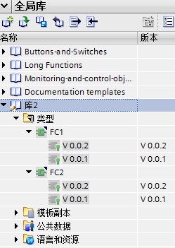

图 18、最终全局库类型

## 常见问题：

为什么打开的库无法编辑？

原因是库的默认打开方式是只读，以避免对用户的库元素的误修改。如果需要编辑库，则在打开时取消勾选“以只读方式打开”，如图 19 所示；

图 19、打开全局库

全局库的兼容性？

1、TIA Portal V13 或更早版本的库

由 TIA Portal V13 或更早版本创建的全局库。首先，需将库升级到 TIA Portal V13 SP1的库版本。之后可以使用更高版本的博图 软件打开该库并进行再次升级。

2、TIA Portal V13 SP1 或更高版本的库

由 TIA Portal V13 SP1 或更高版本创建的全局库可以使用更高版本的博图 软件打开。打开该库时，系统提示需将该库升级到 TIA Portal 的最新版本。该全局库升级后，无法再用早期版本的 TIAPortal 打开。

如何打开全局库归档文件 .zal 后缀的文件？

在 TIA Portal V16 之前，需要如图 20 所示，在 TIA Portal 选项菜单 > 全局库 > 恢复库选中，然后弹出如图 21 所示的窗口。

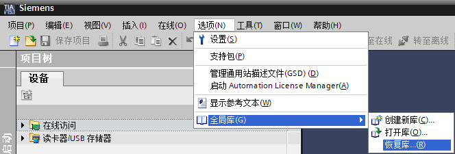

图 20、恢复全局库

然后浏览到归档库文件 .zal 文件，打开，同常见问题 1，默认以只读方式打开。

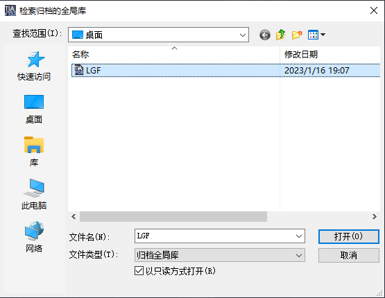

图 21、打开库

然后需要选择恢复项目存储的的文件夹，如图 22 所示。

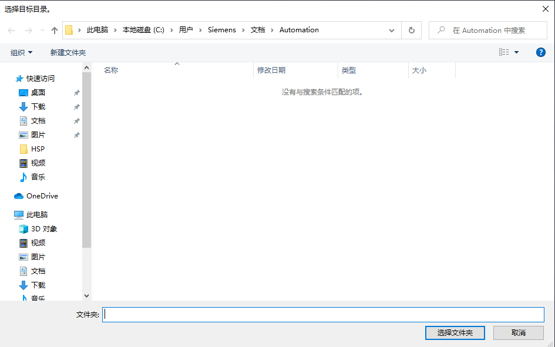

图 22、选择文件夹

之后软件将恢复的项目文件存储在所选择的文件夹。如果归档库文件版本低于当前软件版本，请参考常见问题 2。

在 TIA Portal V16 及其后面的版本，恢复库功能取消，如果需要打开归档库文件，参考图 7 的打开方式，然后在打开的文件类型处选择“已压缩的库”，然后选择所需要的归档库文件。如图 23 所示。

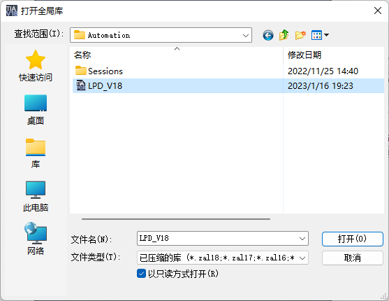

图 23、选择已压缩的库

然后需要选择恢复项目存储的的文件夹，之后软件将恢复的项目文件存储在所选择的文件夹。如果归档库文件版本低于当前软件版本，请参考常见问题 2。

如何对全局库文件进行归档？

如果需要将库文件归档成 .zal 文件，首先需要参考图 7 打开库文件，然后在库文件右键选择“归档库”，如图 24 所示。

图 24、归档库

然后在弹出页面设置归档文件所在的目标路径，以及归档选项，如图 25 所示。最后点击“归档”按钮，即可完成归档。

图 25、完成归档