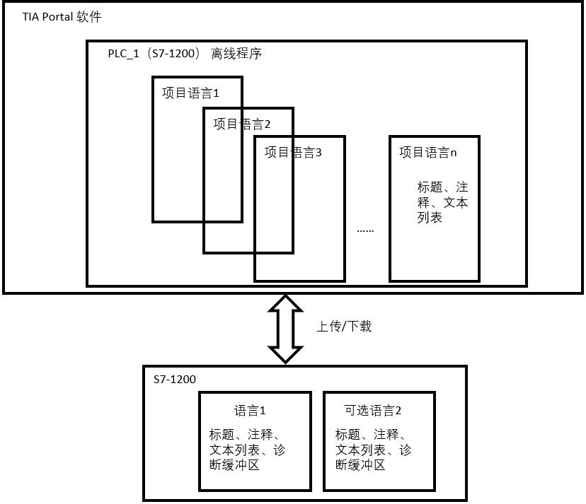
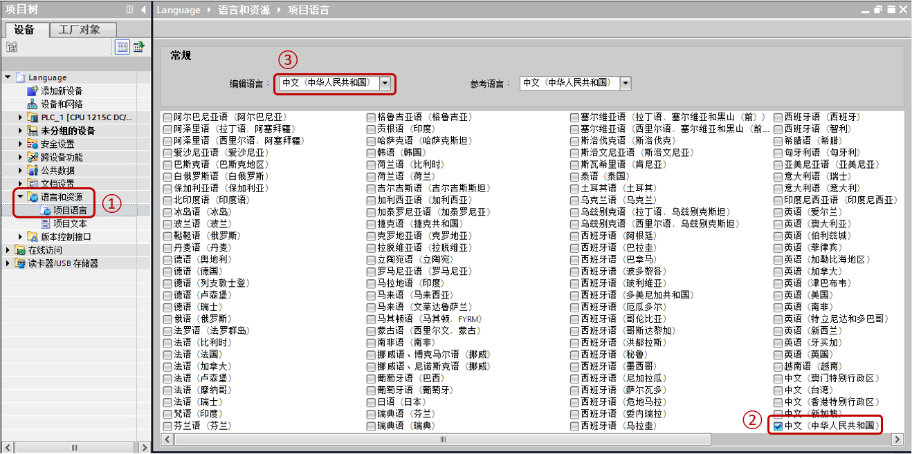
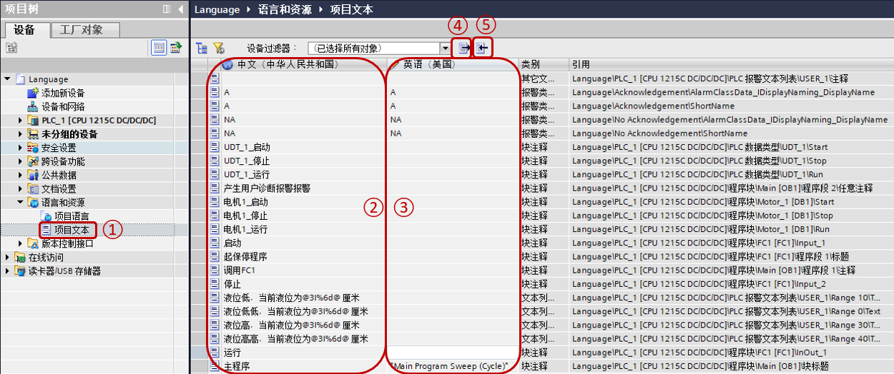
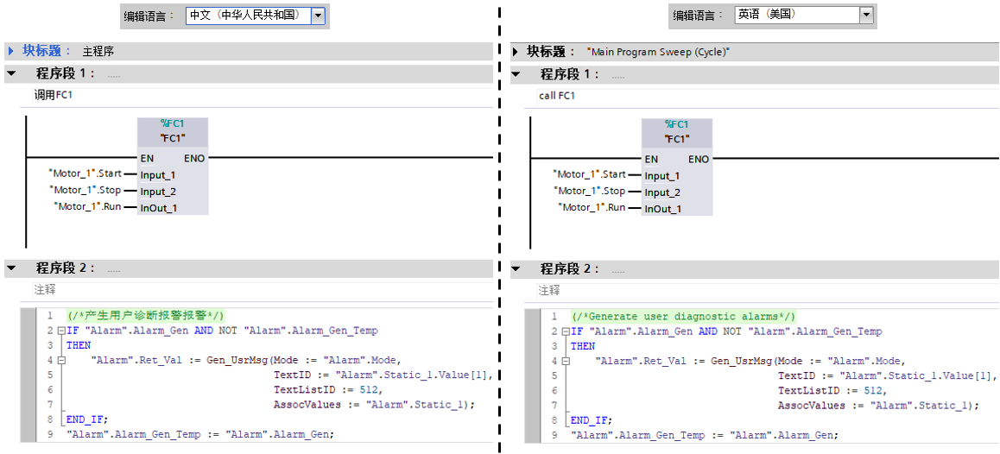
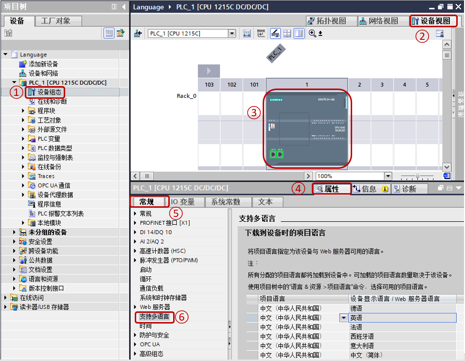
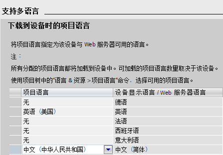
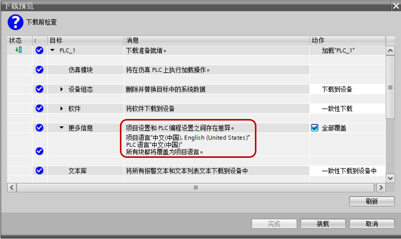
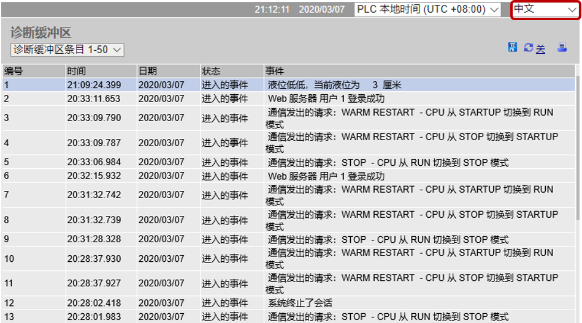
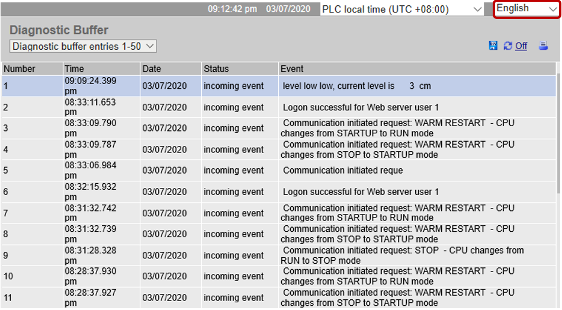
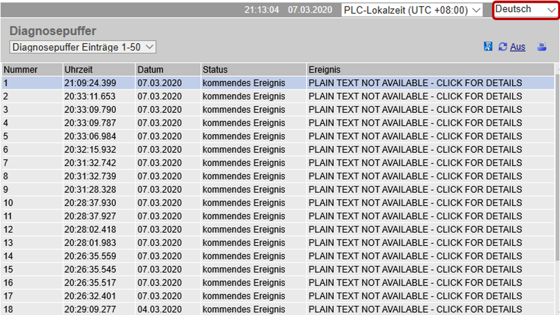

# 20 多语言功能

在很多跨国项目中，开发人员和使用人员不使用一种语言，或者开发人员之间不使用一种语言，需要在一个项目中使用多种注释语言。

从TIA PORTAL V11开始，TIA PORTAL
的PLC离线项目程序中涉及到文本的地方可以支持多语言，例如程序标题、程序注释、变量注释、文本列表等，可以同时支持任意种的语言。

而PLC内部执行的程序同样支持多语言，例如下载进去的注释，还有运行时的诊断缓冲区，对于S7-1200，PLC内部最多同时支持2种文本语言。如图1所示。

{width="828" height="713"}

图1 项目语言示例

这样通过多语言功能，解决了不同语言的人员对同一项目的使用，下面分别介绍多语言项目制作，以及多语言项目的下载和Web
server的使用。

## 多语言项目制作步骤

## 1. 显示编辑语言

新建TIA PORTAL 项目，然后执行如图2中的操作。

{width="1318" height="657"}

图2 项目编辑语言

①将项目树中的"语言和资源"展开，双击"项目语言"

②在右边的语言列表中，看到当前已经设置的所有语言，如图2中所示，中文界面的TIA
PORTAL的默认选择的语言为"中文（中华人民共和国）"

③从这里看到当前的编辑语言也是"中文（中华人民共和国）"

也就是说，在当前环境下编辑的都属于"中文（中华人民共和国）"的项目，即使此时输入的注释等语言为其他语言，例如英语。

## 2. 增加编辑语言

添加英语作为另一种编辑语言，如图3所示。

{width="1100" height="649"}

图3 增加英语

①在语言列表中选中"英语（美国）"

②在编辑语言列表中此时就可以看到"中文（中华人民共和国）"以及"英语（美国）"，但是当前的编辑语言还是"中文（中华人民共和国）"

③从这里看到当前的参考语言是中文（中华人民共和国），这个会在后面导出项目文本时使用。

## 3. 增加程序注释

编辑S7-1200项目，增加一些注释项，如图4所示。

{width="1100" height="647"}

图4 各种文本

①块标题与程序段注释

②接口变量注释

③程序段标题

④UDT变量注释

⑤DB变量注释

⑥SCL多语言注释

⑦文本列表

## 4. 增加另一种语言注释

修改文本语言为英语，一般有以下三种方法：

方法一：如图5所示，将当前编辑语言修改为"英语（美国）"，然后在之会发现之前输入的注释都没有了，重新用英语编辑注释、标题等。

{width="703" height="156"}

图5 修改编辑语言

方法二：如图6所示，打开项目文本列表。

{width="1250" height="524"}

图6 项目文本

①在项目树语言和资源展开后，双击"项目文本"

②可以看到工作区的左边是"中文（中华人民共和国）"，这是项目文本中参考语言的位置，所谓参考语言是用在翻译时做参考的，可以设置参考语言可以参考图3中③

③可以看到工作区的右边是"英语（美国）"，在这里可以直接编辑翻译后的注释、标题

④考虑到直接在TIA
PORTAL中翻译不是很方便，还可以通过导出成Excel文件来翻译，点击该按钮后，如图7所示

⑤在Excel翻译后，可以重新导入

{width="653" height="709"}

图7 导出文本

①选择参考语言

②选择需要翻译的语言

③选择需要翻译的内容

④翻译系统文本，和S7-1200无关

⑤选择导出的文件名和路径

⑥设置完毕，点击"导出"按钮，打开导出的Excel按钮如图8所示

{width="1027" height="584"}

图8 Excel项目文本

在编辑语言下方输入对应的文本，然后保存后，通过图6的⑤处的按钮导入即可。

方法三：
在每一处的注释、标题、文本等下方的属性里面可以直接编辑，以主程序OB1中的文本为例，如图9所示。

{width="748" height="447"}

图9 块内修改

①选择块标题

②选择"属性"

③选择"文本"

④在下方可以看到所有可编辑的语言，可以直接在这里编辑。对于DB变量、UDT、PLC变量等需要V15以后的TIA
PORTAL软件开始支持，SCL多语言需要V16以后的TIA PORTAL软件开始支持。

## 5. 编辑结果

通过以上任意一种操作，可以得到多语言项目，即通过修改当前编辑语言，可以得到对应编辑语言的注释。如图10所示。

{width="1158" height="526"}

图10 不同语言文本

{width="15"
height="15"}需要注意的是，尽量在文本中使用当前的编辑语言，即当前编辑语言为"中文（中华人民共和国）"时，文本使用中文，在当前编辑语言为"英语（美国）"，文本使用英语，避免混乱。

## 多语言项目下载

## 1. 编辑组态

打开S7-1200设备视图，找到属性中的多语言组态，如图11所示。

{width="956" height="742"}

图11 多语言组态

①双击PLC下方的"设备组态"

②打开"设备视图"，能看到PLC主机架的设备

③双击CPU

④在视图下方找到并点击"属性"

⑤在视图下方找到并点击"常规"

⑥在属性列表中点击"支持多语言"，能在右边看到目前支持的六种设备显示语言/Web服务器语言，以及对应的项目语言

## 2. 设置多语言

对于S7-1200 ，只关心Web服务器语言，和左边的项目语言。

**[对于默认情况项目，项目语言取决于建立设备时，TIA
PORTAL软件的用户界面语言。如果用户界面语言是中文，默认的项目语言以及初始编辑语言是中文。]{.underline}**

按照图11下载后，项目语言只有"中文（中华人民共和国）"。

当使用Web server功能时，将Web页面切换任何语言时，诊断缓冲区也只有中文。

如果希望Web页面切换到中文（简体）时显示中文诊断缓冲区，切换到英语时显示英文诊断缓冲区，切换到其他语言时不显示诊断缓冲区，可以按照图12设置。

{width="447" height="311"}

图12 语言设置

## 3. 下载组态

这样修改项目语言后下载，可以看到下载预览中的提示，如图13所示。

{width="796" height="474"}

图13 下载组态

红线中的意思是当前PLC的项目语言为中文，而即将下载的项目语言是中文和英语。

## 4. Web server测试

使用Web server查看诊断缓冲区可以看到，如图14-16所示。

{width="949" height="528"}

图14 中文Web页面

{width="949" height="523"}

图15 英语Web页面

{width="948" height="533"}

图16 德语Web页面

可以从图14-16中看出，中文页面显示中文缓冲区，英语页面显示英语缓冲区，德语页面不显示。
