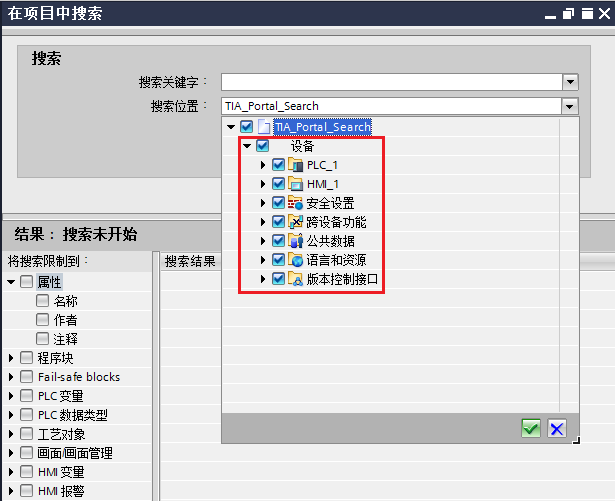

# TIA Portal在项目中搜索功能

使用博途软件编程/调试时，可能会需要查看某一变量在何处使用过或者快速定位到变量使用的位置。此时，可以通过博途软件集成的在项目中搜索的功能，快速定位变量都在何处使用过，并且可以跳转到使用的程序段中。

可在打开的项目中搜索特定文本（搜索关键字）。搜索关键字可以是一个字、多个字或是句子的一部分。长度是限定搜索内容的唯一条件。可搜索的关键字最大长度为 255 个字符。可以使用通配符创建各种复杂的搜索条目。还可将搜索范围限定为特定区域、对象或对象属性。搜索时不区分大写和小写字母。

更改 STEP 7 对象（如，变量名称、PLC 数据类型或块）时，在项目中进行搜索前需更新这些对象的使用点，以确保这些变更结果可搜索到。为此，可对项目进行重新编译。

搜索编辑器帮助搜索，在编辑器中，可以指定搜索选项并开始搜索。搜索完成后，在搜索编辑器中将列出包含搜索文本的各个对象。可以直接在搜索编辑器中打开独立的对象。如果对象具有可查看属性，则可以将其显示在巡视窗口中。

在项目中搜索功能从TIA PORTAL V14开始支持。

## 启用/禁用在项目中搜索

TIA Portal软件安装后，默认启用在项目中搜索功能，如果需要查看或者需要禁用该功能，可以在选项菜单-->设置-->常规-->在项目中搜索，激活/取消复选框 启用“在项目中搜索”。如图1和图2所示。

图1.选项设置

图2.启用“在项目中搜索复选框”

## 打开在项目中搜索的方法

打开在项目中搜索的方法有2种：

方法1：选择菜单栏“编辑”菜单，下拉菜单中点击“在项目中搜索”，如图3.所示。

图3.打开在项目中搜索方法1

使用菜单栏，打开在项目中搜索的对话框，**搜索范围为整个项目**，如图4.所示。

图4.在项目中搜索范围1

方法2：在项目树中，选中PLC_1文件夹，如图5.所示，使用快捷键 “Ctrl+F” 打开在项目中搜索的对话框。

图5.打开在项目中搜索方法2

使用快捷键“Ctrl+F”方式打开的“在项目中搜索”的对话框。**搜索范围取决于，按下快捷键时鼠标所选中的区域。**

在图3中，选中的是PLC_1，打开的在项目中搜索对话框的搜索范围如图6.所示。

图6.在项目中搜索范围2

## 在项目中查找功能的使用

**以搜索M区变量为例说明在项目中查找功能的使用：**

1、在FC1中简单编写程序，MC_POWER 的 Enable 使用变量M100.0，M100.0变量名称为“轴使能”，如图7所示。

图7\. FC1中编程

2、在同一项目中添加HMI画面，在画面中添加轴使能按钮，并且关联PLC1中M100.0/"轴使能"的变量，HMI画面及HMI变量表如图8.所示。

图8.HMI画面及HMI变量表

3、**按照前文中描述方法1打开在项目中搜索对话框**，在搜索关键字处**输入绝对地址 M100.0 (或%M100.0)** ，搜索其使用的位置，仅可以搜索到M100.0在变量表中的定义。

如果图8中访问模式改为绝对地址，此时输入绝对地址，还可以搜索到HMI变量表中对该变量的定义。如图9所示。

图9.使用绝对地址搜索M100.0

> 图9.中标注为4.的方框，可以设置搜索限制，将搜索限制到具体某中类型
> 
> 如果未激活任何过滤器，则将在所设置的搜索区域内能够搜索到的全部对象和属性中搜索该搜索条目。如果激活过滤器，则只针对所选属性或对象进行搜索。

4、**按照前文中描述方法1打开在项目中搜索对话框**，在搜索关键字处**输入符号名称轴使能**， 搜索其使用的位置。如图10.所示。

搜索结果：

PLC_1中：变量表中对该变量的定义，FC1中对该变量的使用；

HMI_1中：变量表定义，及跟画面中对该变量的使用。

**如果关键字输入加双引号的符号名称“轴使能”，仅可搜索到该变量在FC1处的使用**

图10.使用符号名称搜索轴使能

**以下为使用的相关说明：**

a.使用在项目中搜索功能搜索DB块变量，也建议使用符号名称进行搜索。对于非优化数据块，如果使用绝地地址搜索，搜索结果显示&lt;找不到匹配项&gt;。

b.如果打开某个块（例如:打开FC1），再使用快捷键“CTRL+F”,打开的是查找和替换对话框，此功能仅可搜索打开的块中变量的使用位置，无法跨着块或者设备搜索变量使用的位置。

c.禁用查找精确匹配复选框（见图10），将按照关键字进行模糊通配符搜索，会搜索出与关键字相关的使用。如果勾选查找精确匹配复选框，将搜索出与关键字完全一致的使用。**一般使用建议不勾选精确匹配，可以通过设置搜索位置和搜索限制条件来缩小搜索范围。**

## 创建/删除搜索索引

系统会在后台自动创建可在项目中搜索的编辑器文本索引。每次更改后，系统都会更新搜索索引。仅当索引更新完成后，才能进行搜索。搜索仅包括使用设定的编辑语言的文本。更改编辑语言后，将重新生成搜索索引。这可能会占用一些时间，具体取决于项目中的文本数。

用户可随时重新生成搜索索引。请注意，搜索索引与项目一同保存。这样，可能会增加项目文件的大小。如果要传递项目，可以通过项目归档或项目最小化减少文件的大小。此时，应删除搜索索引。必要时，也可在项目中彻底禁用搜索功能。

搜索索引位于博途项目IM文件夹中名为SearchIndex的文件夹，如图11.所示。如需要删除搜索索引，选中此文件夹，右键删除即可。

图11.搜索索引文件夹

删除搜索索引，需要保证在项目已经关闭的情况下操作，否则，无法删除。

搜索索引也可以手动创建，在选项菜单-->设置-->常规-->在项目中搜索，点击“重新创建搜索索引”如图12.所示。

图12.重新创建搜索索引