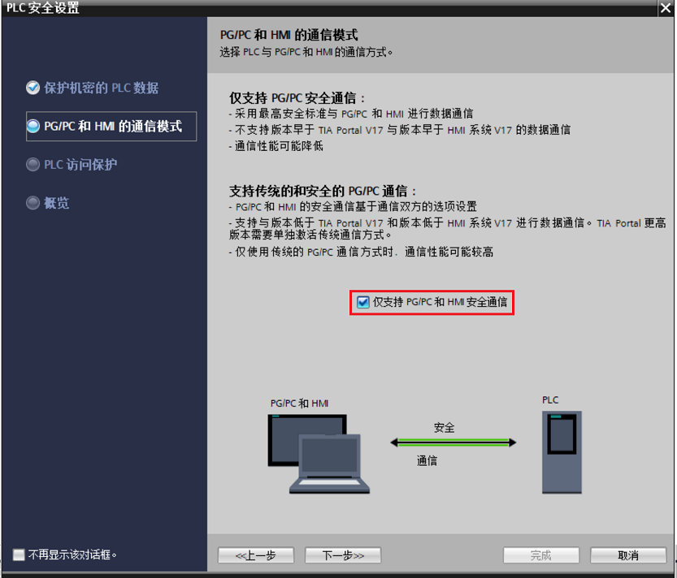
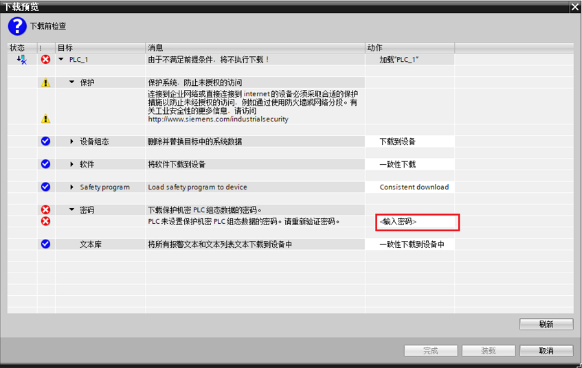

### 使用安全向导进行 PLC 安全设置

自 TIA Portal V17 起，新增了安全向导用于帮助客户快速进行安全相关的设置。

安全向导包括四个部分：

-   保护机密的 PLC 数据
-   PG/PC 和 HMI 通信模式
-   PLC 访问保护
-   概览

### 版本要求

-   软件版本要求： TIA V17 及以上版本
-   CPU 固件版本要求： V4.5 及以上版本

### 组态步骤

使用 TIA V17 及以上版本新添加固件版本 V4.5 及以上 S7-1200 CPU
时，默认会跳出安全向导。可按照以下步骤进行安全向导的组态设置：

#### 1. 添加固件版本 V4.5 及以上的 S7-1200 CPU

{width="985" height="974"}

图 1 添加 CPU

#### 2. 设置保护机密的 PLC 数据

① 如图 2 所示，点击【设置】按钮，进入密码设置窗口

{width="1100" height="944"}

图 2 保护机密的 PLC 数据

② 如图 3 所示，按照密码复杂性要求填写保护密码

默认的密码复杂性要求如下：

-   最短密码长度：8
-   数字字符最小数目：1
-   特殊字符最新小数目：0
-   至少一个大写字母和一个小写字母

{width="592" height="274"}

图 3 密码设置

 注意：**：设置的密码有复杂性要求，密码的复杂性要求可从以下设置中查看修改

如图 4 所示，在项目树中，导航至区域"安全设置 \> 设置 \> 密码策略" 区域。

{width="1242" height="750"}

图 4 密码策略

#### 3. 设置 PG/PC 和 HMI 的通讯方式

PG/PC 和 HMI 通信模式允许使用 PLC 通信证书来保护 CPU 与其它设备（HMI
或者 TIA PORTAL
软件等）之间的通信。当所有设备均支持安全通信时为了提高系统安全性推荐勾选【仅支持
PG/PC 和 HMI 安全通讯】，如果需要与不支持安全通信的设备进行通信，例如
HMI 的版本低于 V17，请取消选择\"仅允许安全 PG/PC 和 HMI 通信\"，此时 PLC
运行在混合模式，既支持安全通讯也支持传统的通讯方式。\

{width="833" height="712"}

图 5 设置 PG/PC 和 HMI 安全通信

#### 4. 设置 PLC 访问保护

为了实现整体安全性，建议设置 PLC 的访问保护等级，
此访问级别组态与设备组态中的相同。相关说明请参考 [**S7-1200 CPU
保护**](05-Protect.html)。{width="981"
height="850"}

图 6 设置 PLC 访问保护

#### 5. 生成概览

在向导最后一步生成 PLC 安全设置的概览。

{width="1100" height="944"}

图 7 生成 PLC 安全设置概览

### 常见问题

#### **1. 完成安全向导后第一次下载程序报错**

在完成安全向导后，如果设置了保护机密 PLC
组态数据密码，则在第一次下载时项目到 PLC
时会提示输入密码，该密码为组态的保护机密 PLC
组态数据密码，必须严格一致。

{width="847" height="536"}

图 8 初次下载界面

#### **2.不小心退出安全向导如何继续完成防护与安全设置**

如图 9 所示，如果不小心退出了安全向导，导致安全配置没有完成，可以在通过
CPU
属性的【常规】-\>【防护与安全】-\>【启动安全向导】重新启动向导。也可以不使用向导，在【防护与安全】下面的相关子项里分别进行组态。

{width="1255" height="877"}

图 9 防护与安全组态

#### **3. 如何取消添加 CPU 时自动跳出安全向导**

如图 10 所示，对 TIA V17 及以上软件，在项目中新添加固件版本 V4.5
及以上固件 CPU 时会自动弹出安全向导 ，如要取消自动弹出，可在TIA
的【项目】-\>【设置】中勾选【添加 PLC 后，该 PLC 的安全设置不显示】。

{width="1064" height="454"}

图 10 PLC 安全的默认设置
