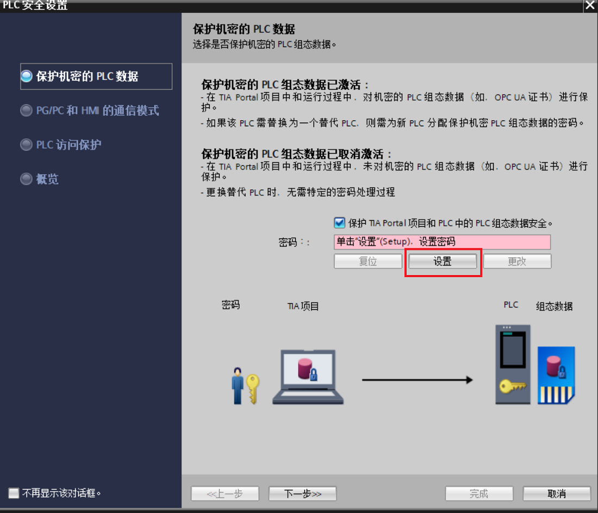
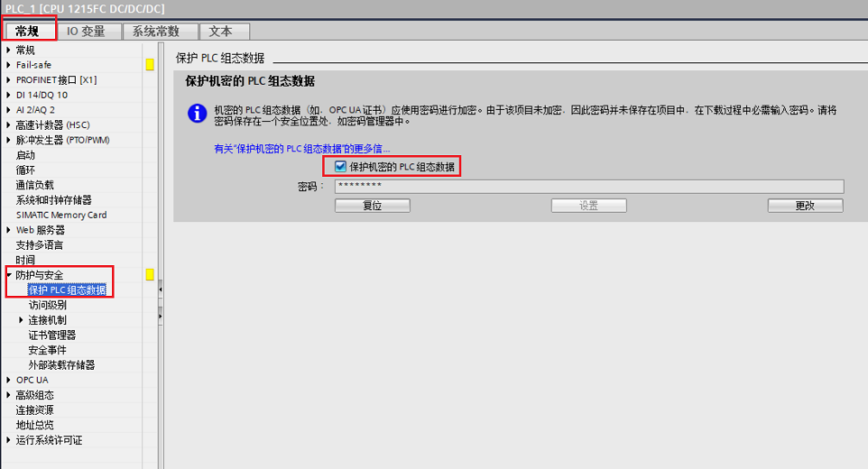
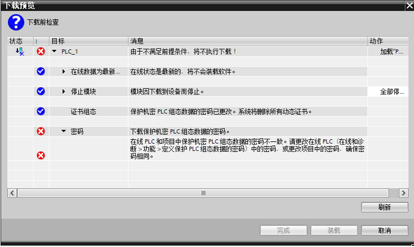
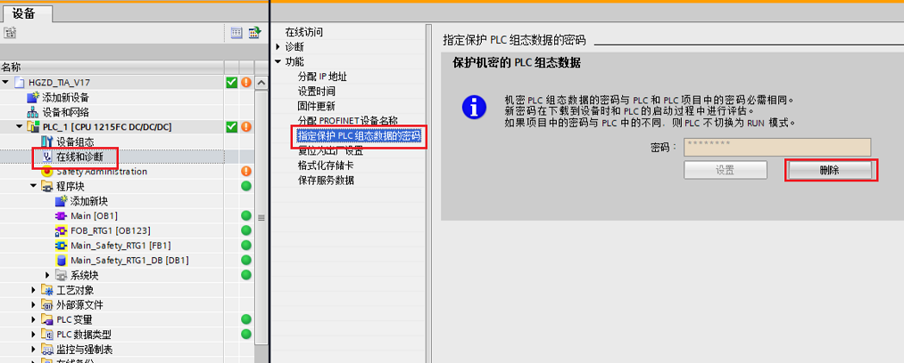
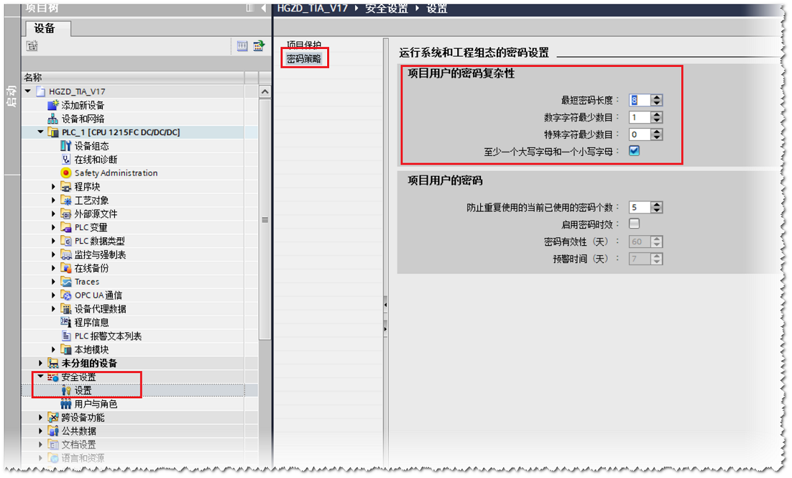
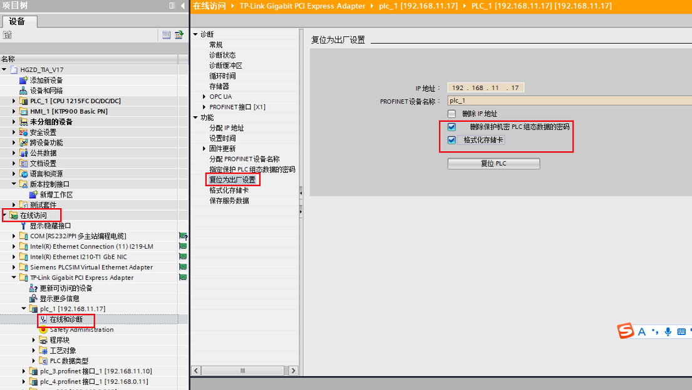
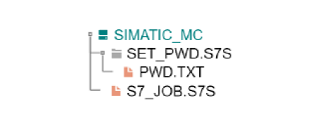
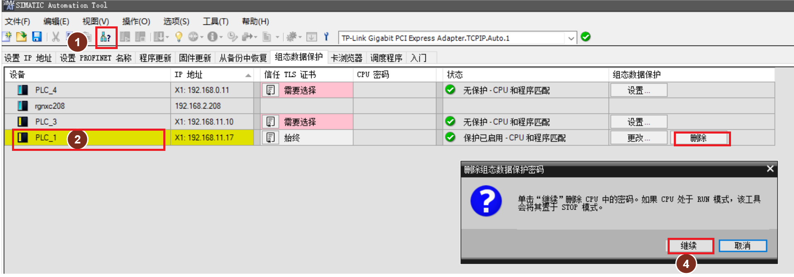
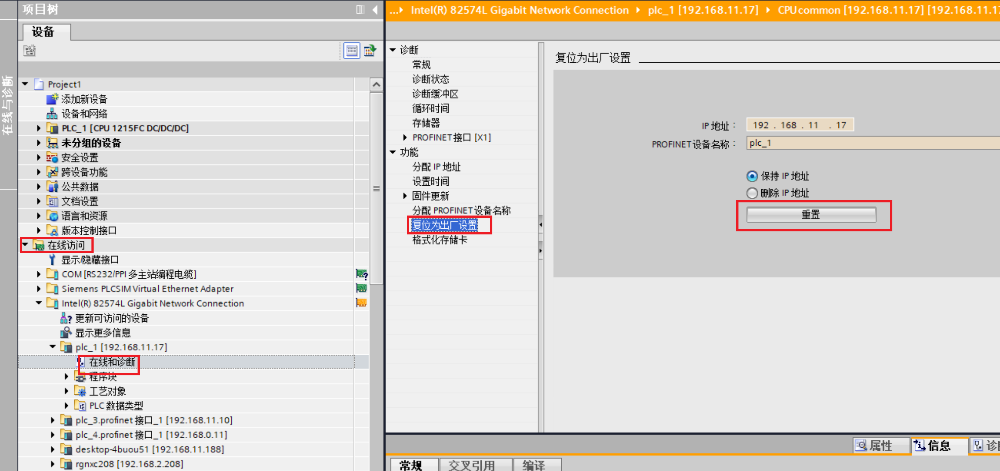

# 23 保护机密的 PLC 组态数据功能

自 TIA Portal V17
起，新增了安全向导用于帮助客户快速进行安全相关的设置。其中保护机密的 PLC
组态数据可为每个 PLC 提供更高的项目存储安全性。

## 版本要求

软件版本要求： TIA V17 及以上版本

CPU 固件版本要求： V4.5 及以上版本

## 组态方式

可以通过安全向导或 CPU 属性中的【保护 PLC 组态数据】进行设置

## 1. 通过安全向导进行设置

使用 TIA V17 及以上版本新添加固件版本 V4.5 及以上 S7-1200 CPU
时，默认会跳出安全向导。在如图 1 所示，安全向导的【保护机密的 PLC
数据】可以设置密码。

{width="1100" height="944"}

图 1 保护机密的 PLC 数据组态

## 2. 通过 CPU 属性进行设置

如图 2 所示可以通过 CPU 属性中的【常规】-\>【防护与安全】-\>【保护 PLC
组态数据】设置保护密码。

{width="962" height="520"}

图 2 CPU 属性中的保护 PLC 组态数据

## 常见问题说明

## 1. 下载机制

① 如果 CPU 中没有加载过此密码，则 TIA Portal
会在第一次下载时提示用户输入保护机密 PLC 组态数据的密码。\
② 如果 CPU 中已经加载过此密码，那么项目和 CPU
中的密码必须匹配。如果密码不匹配，则无法将项目下载到 CPU，出现如图 3
所示提示。必须删除保护机密 PLC
组态数据的密码，或将其设置为设备中的密码。

{width="689" height="411"}

图 3 CPU 属性中的保护 PLC 组态数据

**解决方法：**进入【在线和诊断】中的【指定保护 PLC
组态数据的密码】，点击【删除】按钮，重新下载项目

{width="1013" height="408"}

图 4 删除保护 PLC 组态数据的密码

## 2.密码策略

机密 PLC 组态数据的密码有复杂性要求，默认的复杂性要求如下：

-   最短密码长度：8
-   数字字符最小数目：1
-   特殊字符最新小数目：0
-   至少一个大写字母和一个小写字母

如图 5 所示，可通过以下界面查看和修改密码策略。

在项目树中，导航至区域"安全设置 \> 设置 \> 密码策略" 区域。

{width="1242" height="750"}

图 5 密码策略

## 3. 使用 TIA Portal 更换用于保护机密组态数据的 CPU

**情况1：**CPU 中没有项目组态，或者已组态的密码（保护机密的 PLC
组态数据）与本项目一致

使用 TIA 直接下载项目即可，无需任何其他准备工作

**情况2：**CPU 中已有项目，且已组态的密码（保护机密的 PLC
组态数据）与本项目不同，则需要对 CPU 进行恢复出厂操作。

如图 6 所示， 从【在线访问】进入到对应 PLC
的【在线和诊断】，在【复位为出厂设置】中进行如下选择，并执行复位 PLC：

-- 删除保护机密 PLC 组态数据的密码\
-- 如果 CPU 具有存储卡，则格式化存储卡

{width="1105" height="624"}

图 6 恢复出厂设置

## 4. 在没有 TIA Portal 的情况下如何通过存储卡设置保护机密 PLC 组态数据的密码并完成程序传输

**步骤一：**准备好一张 S7-1200/1500的
存储卡，按以下步骤制作用于密码设置的卡：

①使用计算机中将存储卡中可见的文件全部删除。注意：具有隐藏属性的系统文件不要删！

②在根目录下新建文件夹并命名为"SET_PWD.S7S"

③在建好的文件夹中新建文件"PWD.TXT\"，在该文件中以明文形式写入所需要设置的密码

④在根目录下新建文件\"S7_JOB.S7S\"并使用记事本打开，写入内容 SET_PWD

最后卡中生成的文件如图 7 所示：

{width="450" height="179"}

图 7 生成的文件结构

**步骤二：**将制作好的卡插入到 S7-1200 中，CPU
上电，卡中设置的密码被传送到 CPU 内部存储区存储。

可通过观察 CPU 的指示灯来判断是否设置成功：

RUN/STOP 灯黄色常亮并且 MAINT灯黄色闪烁：传输成功

**步骤三：**断电，拔出卡。将作为传输卡且含有项目的存储卡重新插入到 CPU
并上电，当项目传输完成后，断电拔卡，再重新上电后即可运行 PLC

## 5.如何使用版本低于 TIA V17 下载程序到已设置了保护机密 PLC 组态数据密码的 CPU 中

如果 CPU 中已经设置了保护机密 PLC 组态数据的密码，则使用低版本 TIA
（版本小于 V17 ）往 CPU 下载程序是无法连接 PLC
并下载程序的。需要先清除保护机密 PLC 组态数据密码。

可以采取以下方法：

方法一：使用 TIA V17 版本以上版本软件通过常见问题 3 中的描述对 PLC
进行恢复出厂设置。

方法二：使用 SIMATIC Automation Tool V4.0 SP3
及以上版本删除保护密码，如图 8 所示。

SIMATIC Automation Tool 下载地址：

[**https://support.industry.siemens.com/cs/ww/en/view/98161300**](https://support.industry.siemens.com/cs/ww/en/view/98161300)

{width="958" height="336"}

图 8 使用 SIMATIC Automation Tool 删除密码

①点击【扫描所有选网络】，注意左侧地址栏所选的网卡必须与 PLC
处于同一个局域网内

②在浏览到的设备列表中选择需要清除密码的 S7-1200 CPU

③点击【删除】按钮

④在跳出的对话框点击【继续】完成清除保护机密PLC组态数据密码

方法三：使用常见问题 4 中的方法制作用于密码设置的卡，PWD.TXT
内容为空，表示该卡用于清除密码。

制作好的卡插入到 S7-1200 中，CPU 上电，当 RUN/STOP 灯黄色常亮并且 MAINT
灯黄色闪烁表示清除密码已成功

 注意：**：

使用该方法清除密码后，并不能直接下载程序，还需要使用低版本 TIA
通过【在线访问】浏览到该 CPU，对 S7-1200
进行【复位为出厂设置】操作，如图 9 所示。

如果 S7-1200 CPU 插入了存储卡，则还需要【格式化存储卡】操作。

{width="1137" height="536"}

图 9 复位为出厂设置
