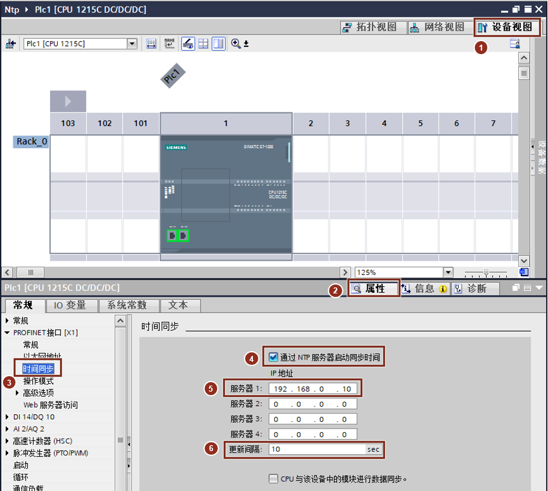
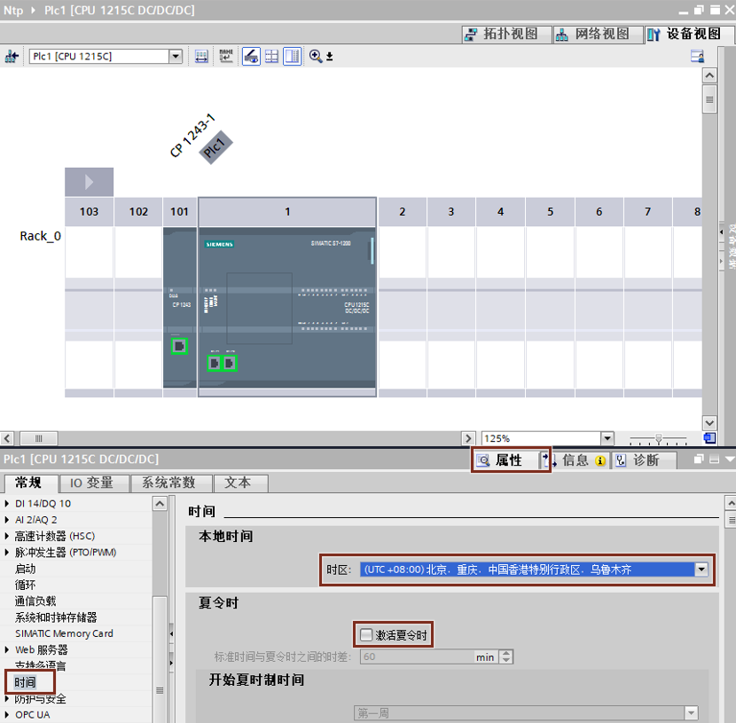

### NTP 功能概述 

#### 什么是 NTP？

网络时间协议 (NTP, Network Time Protocol) 被广泛用于使计算机系统的时钟与
Internet 时间服务器同步。

在 NTP 模式中，CPU 按固定时间间隔将日时钟查询（客户机模式中）发送到子网
(LAN) 的 NTP
服务器。根据服务器的响应，来计算最可靠、最准确的时间，并同步工作站的日时钟。

这种模式的优点是可以跨子网同步时间。

在 NTP 模式下，服务器通常会传送 UTC（协调世界时）至客户端。

一般情况下， CPU 或者 CP 作为 NTP 客户端，NTP 服务器可以是计算机或者是有
NTP 服务器功能的 GPS 等，本文以 CPU 为例介绍 NTP 客户端的组态方法。

**文档链接**

[PLC 侧 NTP 客户机组态](01-NTP_PLC.html#A)

[PC 侧 NTP 服务器组态](02-NTP_PC.html#A)

#### []{#A}PLC 侧 NTP 客户机组态步骤

如图 1 所示步骤将 PLC 组态为 NTP 客户机：

{width="921" height="825"}

图 1. 激活 NTP 功能

1.打开"设备试图"。

2.打开 CPU "属性"。

3.点击"时间同步"。

4.勾选"通过 NTP 服务器启动同步时间"。

5.设置 NTP 服务器的 IP 地址。最多可设置 4 个 NTP 服务器。

6.设置更新间隔。更新时间间隔定义 CPU
发送时间查询请求之间的时间间隔（单位为秒）。时间间隔的值范围在 10
秒到一天之间。

7.组态完成后，下载项目。

当 PC 侧设置 NTP 服务器之后，同步功能即开始。

如图 2 所示设置 PLC 时区：

进入\"设备视图\"，选中 CPU，在 CPU 属性
→时间下，在中国国内通常设置时区为 UTC +08:00。

有些国家可能会采用夏令时，如果需要使用夏令时，正确设置时区之后，勾选"启用夏令时"，PLC
会根据 NTP 服务器时钟所在的时区，自动计算 PLC 的本地时间。

 **注意：如果希望 PC 和 CPU
同步后时间相同，请确保 PC 侧的时区和 CPU 的时区相同。**

{width="830" height="815"}

图 2. 时区设置
