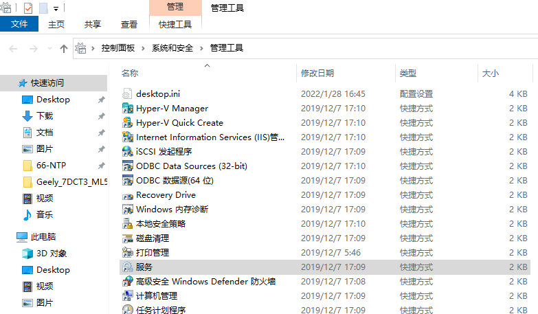
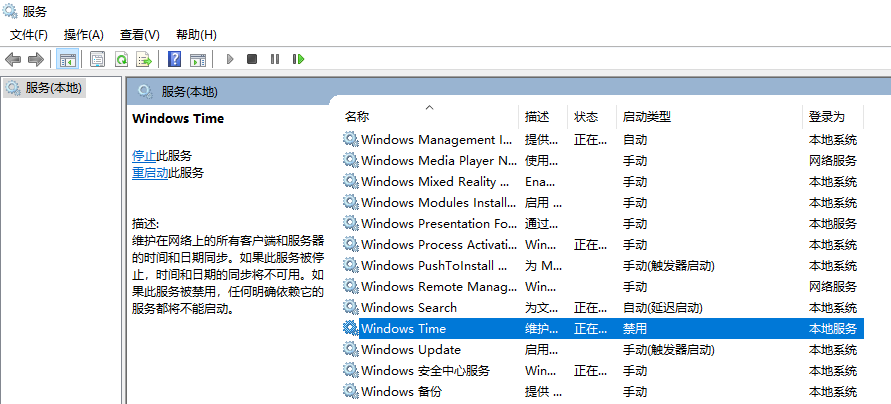
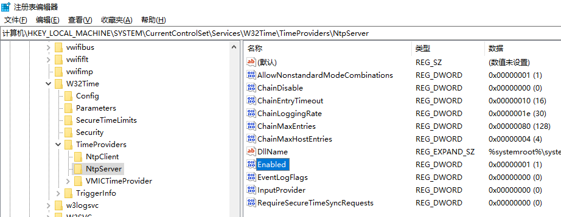

### 什么是 NTP？

网络时间协议 (NTP, Network Time Protocol) 被广泛用于使计算机系统的时钟与
Internet 时间服务器同步。

在 NTP 模式中，CPU 按固定时间间隔将日时钟查询（客户机模式中）发送到子网
(LAN) 的 NTP
服务器。根据服务器的响应，来计算最可靠、最准确的时间，并同步工作站的日时钟。

这种模式的优点是可以跨子网同步时间。

在 NTP 模式下，服务器通常会传送 UTC（协调世界时）至客户端。

一般情况下， CPU 或者 CP 作为 NTP 客户端，NTP 服务器可以是计算机或者是有
NTP 服务器功能的 GPS 等，本文以 PC 为例介绍 Windows 操作系统 NTP
服务器组态方法，其他 NTP 服务器请自行查找方法。

**文档链接**

[PLC 侧 NTP 客户机组态](01-NTP_PLC.html#A)

[PC 侧 NTP 服务器组态](02-NTP_PC.html#A)

#### []{#A}设置 PC 为 NTP 服务器概述

警告：\
更改注册表可能会导致异常问题以至要求重新安装系统。我们不能保证能够解决由于更改注册表而出现的问题。更改注册表的风险完全由用户自行承担。

本文档主要介绍如何将以下 Windows 操作系统的计算机设置为 NTP 服务器：

-   Windows 7 (32-bit and 64-bit)
-   Windows 10 (32-bit and 64-bit)
-   Windows Server 2008 R2 (64-bit)
-   Windows Server 2012 R2 (64-bit)
-   Windows Server 2016 (64-bit)

关于如何将下述操作系统的计算机设置为 NTP 服务器：

-   Windows 2000
-   Windows XP
-   Windows Server 2003
-   Windows Server 2008 (32-bit)

请参考以下链接

{width="15" height="15"} 按住 Shift
键时用鼠标点击下列链接，打开新浏览器窗口。

<https://support.industry.siemens.com/cs/cn/zh/view/22144502>

#### 组态本地计算机为 NTP 服务器

1\. 禁用 \"Windows Time\" 服务

通过开始 \> 控制面板 \> 系统与安全 \> 管理员工具
，打开"管理工具"文件夹，如图 1 所示。

{width="783" height="457"}

图 1. 管理工具

双击"服务"快捷方式，打开 Windows 服务界面，并禁用\"Windows
Time\"服务，如图 2 所示。

{width="891" height="404"}

图 2. 禁用 \"Windows Time\" 服务

2\. 通过以下方式打开注册表： \"Start -\> Regedit\"

3\.
查找以下代码：\"HKEY_LOCAL_MACHINE\\SYSTEM\\CurrentControlSet\\services\\W32Time\\TimeProviders\\NtpServer\"

4\. 设置 \"Enabled\" 的值为 1，如图 3 所示。

{width="922" height="357"}

图 3. 设置 \"Enabled\"

5\.
查找以下代码：\"HKEY_LOCAL_MACHINE\\SYSTEM\\CurrentControlSet\\services\\W32Time\\Config\"

6\. 设置 \"AnnounceFlags\" 的值为 5，如图 4 所示。

{width="929" height="219"}

图 4. 设置 \"AnnounceFlags\"

7\. 重新启动 \"Windows Time\" 服务并设置启动方式为\"自动\"

8\. 检查防火墙是否开启，如果开启请增加允许 NTP 服务的规则（NTP 使用 UDP
协议 端口号 123），或者关闭防火墙，并请重新启动计算机。
