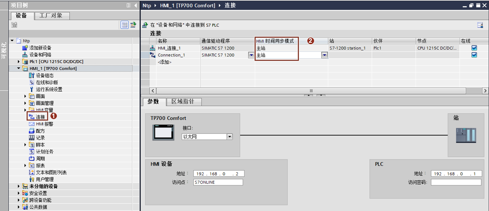

### HMI 时间同步功能

HMI 设备具有时间同步功能，利用 HMI 设备的该功能，可实现 PLC 和 HMI
之间的时间同步，进而实现多个 PLC 之间的时间同步。

**HMI 设备时间同步的属性：**

-   HMI 设备既可作为主站对时间进行定义，也可作为从站来接受 PLC 的时间。

-   在"主站模式"下，在每次建立连接时进行时间同步。

-   在"从站模式"下，在每次建立连接时进行时间同步，之后每 10
    分钟进行一次时间同步。

-   只有在运行系统工作时，才会对 HMI 设备执行时间同步。

精简面板只支持"从站模式"，精致面板既支持"从站模式"，又支持"主站模式"（需要
Windows CE 6.0 以上操作系统）。

本文以精致面板 TP700 Comfort 为例，介绍如何通过"主站模式"实现 HMI 和 PLC
间的时间同步。\

#### HMI 时间同步主站模式组态

1\. 在项目树中，双击 HMI 下面的"连接"

2\. 在"连接"设置页面，对 HMI 和 PLC 之间已经建好的连接进行设置，在 HMI
时间同步模式这一列中，选择"主站"。

本文档中的 HMI 连接了两个 PLC，在这两个连接中分别进行设置即可，如图 1
所示。

3\. 设置完成后，下载 HMI 项目，即可实现 HMI 和 PLC 之间的时间同步。

{width="1289" height="558"}

图 1. HMI 时间同步
