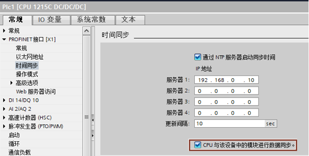
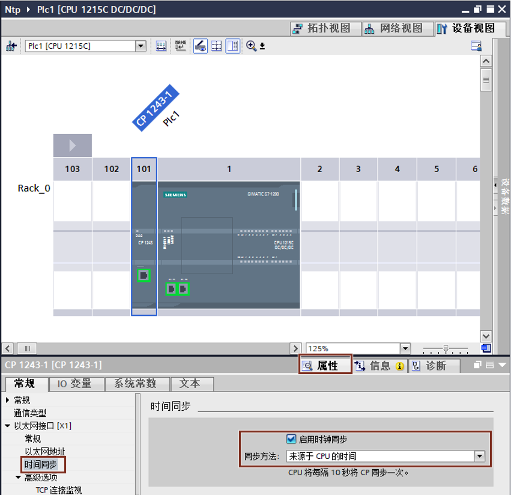
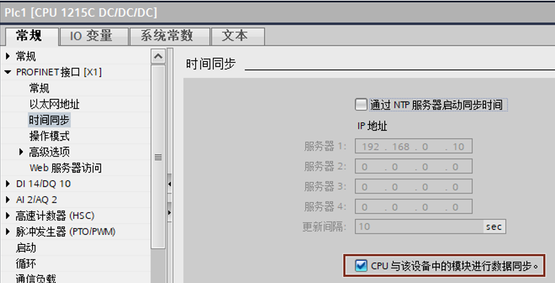
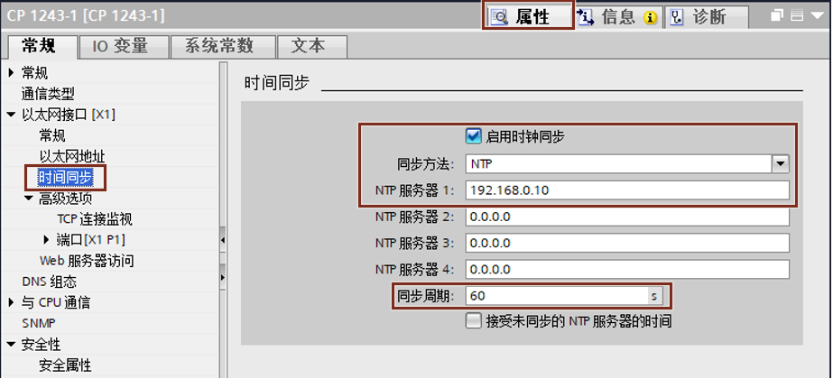

### CPU 时钟与 CP 时钟的同步

如果在主机架中包含 CP1243-1 等 CP 模块，而这些 CP
也是有时钟的，一般情况下需要将 CPU 和 CP
进行时间同步，在一个机架中只需有一个 CPU 或者 CP 作为 NTP
客户端，其余模块只要与该客户端同步即可，下面分别介绍通过 CPU 同步 CP
时钟方法以及 CP 同步 CPU 时钟方法。

#### **CPU 同步 CP 时钟**

将 CPU 时间转发至 CP 的操作取决于 CP 和 CPU 的固件版本。

-   CPU 固件 ≥ V4.2
-   CP 固件 ≥ V3.0

**按如下步骤组态实现 CPU 时钟同步 CP 时钟：**

1\. 在 CPU 属性中激活"通过 NTP 服务器启动同步时间"，同时激活"CPU
与该设备中的模块进行同步"，即实现 CPU 通过 NTP 协议与 NTP
服务器实现时间同步，然后将时间同步至 CP，如图 1 所示。

{width="630" height="319"}

图 1. 模块时间同步

2\. 在 CP1243-1 的"属性"\-\-\--"时间同步"下，勾选"启用时钟同步"，
并设置同步方法为"来源于 CPU 的时间"，如图 2 所示。

{width="851" height="823"}

图 2. CP 设置

#### **CP 同步 CPU 时钟：**

将 CP 时间转发至 CPU 的操作取决于 CP 和 CPU 的固件版本。请注意以下行为：

-   **CP 固件** **≤ V2.1.5**

    采用该固件版本时，CP 可以选择通过 PLC 变量为 CPU 提供时钟。当 CPU
    周期性地读取该 PLC 变量时，CPU 会采用 CP 时间。

-   **CP 固件** **≥ V2.1.7** **和 CPU 固件** **≥ V4.2**

    如果站中的两个模块均具备上述固件版本之一，按照下面方法会将 CP
    的时间自动转发给 CPU。随后，站的所有智能模块将与 CPU 时间进行同步。

1\. 在 CPU 属性中激活"CPU 与该设备中的模块进行同步"，不激活"通过 NTP
服务器启动同步时间"，如图 3 所示。

{width="805" height="411"}

图 3 CPU 设置

2\. 在 CP1243-1 的"属性"\-\-\--"时间同步"下，勾选"启用时钟同步"，
设置同步方法为 "NTP"，并且设置 NTP 服务器地址和"同步周期"，即实现 CP
通过 NTP 协议与 NTP 服务器实现时间同步，然后将时间同步至 CPU，如图 4
所示。

{width="923" height="417"}

图 4. CP 设置
