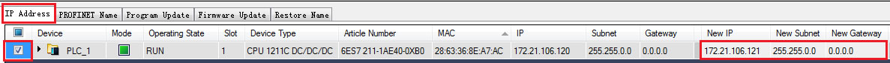
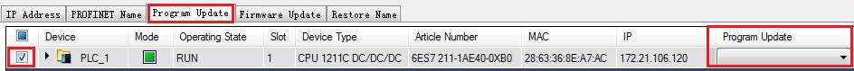

# 01-SIMATIC Automation Tool基本操作

项目程序由TIA Portal软件创建与编译生成后，Simatic Automation Tool可以被用来在现场操作及维护整个自动化的网络。  
目前SIMATIC Automation Tool的最新版本为 V3.1SP3，软件及手册在以下链接下载：  

 按住 Shift 键时用鼠标点击下列链接，打开新浏览器窗口。

<https://support.industry.siemens.com/cs/cn/zh/view/98161300>

该工具软件可实现如下功能：

* 扫描整个网络，识别所有连接到该网络的设备
* 设置CPU的指示灯闪烁，以协助确认具体被操作的CPU
* 设置设备的站地址（IP，Subnet，Gateway）及站名（PROFINET Device）
* 同步PG/PC与CPU的时钟
* 下载新程序到CPU
* 更新一个CPU及其扩展模块的固件
* 设置CPU的运行（RUN）或停止（STOP）模式
* 执行CPU内存复位
* 读取CPU的诊断日志
* 上载CPU的错误信息
* 恢复CPU到出厂设置

该工具软件支持的操作系统：  
Windows 7 (32-bit and 64-bit).  
Windows 8 and 8.1

## S7-1200各个固件版本支持的操作

|     |     |     |     |     |     |     |
| --- | --- | --- | --- | --- | --- | --- |
| S7-1200 | V1.x | V2.x | V3.x | V4.0 | V4.1 | Fail-Safe    V4.1 |
| 扫描设备 | √   | √   | √   | √   | √   | √   |
| 闪烁LED | √   | √   | √   | √   | √   | √   |
| 设置IP地址 | √   | √   | √   | √   | √   | √   |
| 设置PROFINET名称 | √   | √   | √   | √   | √   | √   |
| 同步PG/PC与CPU的时钟 | √   | √   | √   | √   | √   | √   |
| 下载程序 | √   | √   | √   | √   | √   | Χ   |
| 固件更新 | Χ   | Χ   | Χ   | √   | √   | √   |
| 设置CPU的运行（RUN）或停止（STOP）模式 | √   | √   | √   | √   | √   | √   |
| CPU内存复位 | √   | √   | √   | √   | √   | √   |
| 读取CPU的诊断日志 | √   | √   | √   | √   | √   | √   |
| 上载CPU的错误信息 | √   | √   | √   | √   | √   | √   |
| 恢复CPU到出厂设置 | √   | √   | √   | √   | √   | Χ   |

√：支持  
Χ：不支持

## CPU设置保护权限时的操作

|     |     |     |     |
| --- | --- | --- | --- |
| S7-1200 | 读访问权限 | HMI访问权限 | 不能访问（完全保护） |
| 扫描设备 | √   | √   | √   |
| 闪烁LED | √   | √   | √   |
| 设置IP地址 | √   | √   | √   |
| 设置PROFINET名称 | √   | √   | √   |
| 同步PG/PC与CPU的时钟 | √   | √*  | √*  |
| 固件更新 | √*  | √*  | √*  |
| 设置CPU的运行（RUN）或停止（STOP）模式 | √   | √*  | √*  |
| CPU内存复位 | √   | √*  | √*  |
| 读取CPU的诊断日志 | √   | √   | √   |
| 上载CPU的服务数据 | √*  | √*  | √*  |
| 恢复CPU到出厂设置 | √   | √*  | √*  |

√：支持  
Χ：不支持  
√\* ：需要在"Password"输入密码  

## 分配IP

要使用SIMATIC Automation Tool分配IP地址，需要在设备组态中选择”在设备中直接设定IP地址”，如下图 1：

图 1\. 分配 IP

点击“Scan devices on network”  查找CPU，切换至“IP Address”页面，在“New IP”、“New Subnet” 、“New Gateway”中输入新的IP地址、子网掩码以及网关，点击“Download checked items” ，如下图 2：

图 2.IP Address 页面

分配IP地址成功后，会显示新的IP地址，日志中会显示结果为“Success”，如下图 3：

图 3\. 分配 IP 成功

可以选择多台CPU同时修改IP地址。

## 下载程序

可以使用SIMATIC Automation Tool 将项目程序下载到 CPU 中，需要使用TIA软件将项目文件保存至“SIMATIC 存储卡”、“U盘”或者“自定义读卡器”中。具体操作参考以下链接：

如何装载项目数据到存储卡上？以便在没有 TIA Portal 的情况下，使用存储卡向 S7-1200 /S7-1500CPU 传输程序。  
[https://support.industry.siemens.com/cs/cn/zh/view/48711409](https://support.industry.siemens.com/cs/cn/zh/view/48711409)

本文以项目文件保存至“自定义读卡器”为例，操作如下：

1.在项目树中展开文件夹 "读卡器/USB 存储器"。  
2.双击 "添加用户自定义读卡器"，  "浏览文件夹"对话框打开。  
3.选择希望存储配置数据的盘符（比如C盘：），并且点击"新建文件夹"按钮  
4.分配名称（此列中为"SAT"）并且点击确定。如下图 4：

图 4\. 用户自定义读卡器

     5.  项目树中 "读卡器/USB 存储器" 中创建出条目 "读卡器\_1"并且选中的"(C:\\SAT)" 出现在其下方。项目树中选中CPU 站点,此例中为"PLC\_1 \[CPU 1211C DC/DC/DC\]", 如下图 5:  
     6.  将选中站点拖拽到文件夹 "(C:\\SAT)" 中，然后按照下载对话框提示操作。

图 5\. 创建项目到读卡器

编译不报错，STEP 7 (TIA Portal)将在线存储卡数据保存到 "(C:\\SAT)" 中。文件"S7_JOB.SYS" 和文件夹"SIMATIC.S7S"（包含STEP7程序）被保存在此文件夹中，如下图 6:

图 6\. 保存程序

将文件夹"SIMATIC.S7S"复制到程序更新文件的默认路径文件夹中，如下图 7：

图 7\. 选择默认路径

或者将程序更新文件路径改为C:\\SAT，如下图 8：

图 8.修改程序更新路径

点击“Scan devices on network”  查找CPU，查找到CPU后选中需要下载程序的CPU，选择“Program Update”，注意：在“Program Update”处无需再选择任何文件！再点击“Download checked items”，如下图 9：

图 9.程序更新页面

下载程序前会提示“CPU停机”，如下图 10：

图 10.程序更新提示

下载程序成功后，日志中会显示结果为“Success”。

## 多台CPU同时下载程序

选择多台CPU下载程序时，需要建在“C:\\ProgramData\\Siemens\\SIMATIC Automation Tool\\Programs”中建不同文件夹，本例中建“plc1211”和“plc1214”两个文件夹，如下图 11：

图 11.建立多个程序文件

分别将1211和1214的程序文件"SIMATIC.S7S"复制到对应的“plc1211”和“plc1214”文件夹中， 打开“SIMATIC Automation Tool”，点击“Scan devices on network”  查找CPU，切换至“Program Update”页面，在“Program Update”的下拉菜单中选择PLC程序的程序文件夹，如下图：PLC\_1选择“plc1211”，PLC\_2选择“plc1214”，再点击“Download checked items”。 如下图 12:

图 12.更新多台 CPU 程序

## 读诊断信息

点击“Scan devices on network”  查找CPU，查找到CPU后选中需要读诊断信息的CPU，再点击“Diagnostics”，如下图 13：

图 13.查找 CPU

读取到的诊断信息，如下图 14：

图 14\. 读诊断信息

不能同时读取多台CPU的诊断消息，“Diagnostics”为灰色，如下图 15：

图 15.不允许多台 CPU 诊断  

## 恢复出厂设置

点击“Scan devices on network”  查找CPU，查找到CPU后选中需要读诊断信息的CPU，再点击“Reset factory defaults” ，如下图 16，17：

图16\. 恢复出厂设置

恢复出厂设置成功后，CPU会停机，在日志中会显示结果为“Success”。

  

图17\. 恢复出厂设置成功

可以选择多台CPU同时恢复出厂设置。  

## 固件更新

将CPU或者模块的固件版本文件复制到固件更新文件的默认路径文件夹中，如下图 18：

图 18\. 选择固件更新路径

点击“Scan devices on network”  查找CPU，切换至“Firmware Update”页面，选中需要更新固件的CPU或者模块，在“New Firmware Version”的下拉菜单中选择CPU或者模块的固件版本，再点击“Download checked items”，如下图 19：

图 19\. 固件更新

固件更新成功后，会显示新的固件版本，日志中会显示结果为“Success”，如下图20：

图20\. 固件更新成功

**注意：**更新S7-1200通信模块固件时必须先将设备组态下载至CPU中。