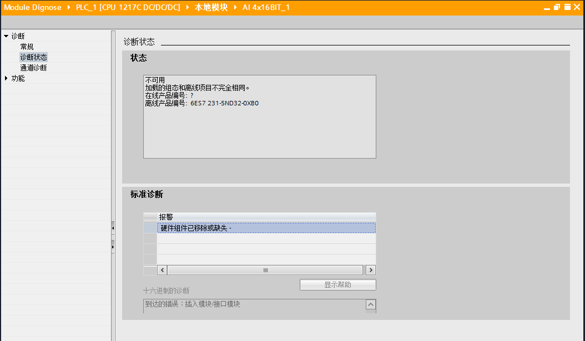

# 02-诊断方法

S7-1200
提供了多种诊断方法，例：读取CPU及模块的状态LED，这种方法最直观；读取CPU及模块的诊断缓冲区，需要博图软件能够与PLC建立通讯；通过OB组织块或诊断指令获得诊断信息。\

## 读取CPU以及模块的状态LED

### CPU 状态指示灯

CPU 提供以下状态指示灯:

1.  STOP/RUN\
    -- 黄色常亮指示 STOP 模式\
    -- 纯绿色指示 RUN 模式\
    -- 闪烁（绿色和黄色交替）指示 CPU 处于 STARTUP 模式\
2.  ERROR\
    -- 红色闪烁指示有错误，例如，CPU
    内部错误，存储卡错误或组态错误（模块不匹配）\
    -- 故障状态：\
    纯红色指示硬件出现故障\
    如果固件中检测到故障，则所有 LED 闪烁
3.  MAINT（维护）在每次插入存储卡时闪烁。 然后 CPU 切换到 STOP 模式。 在
    CPU 切换到 STOP 模式后，执行以下操作之一以启动存储卡评估：\
    -- 将 CPU 切换到 RUN 模式\
    -- 执行存储器复位 (MRES)\
    -- CPU 循环上电

CPU上的状态指示灯如下表所示：

{width="694" height="574"}

CPU 还提供了两个可指示 PROFINET 通信状态的 LED。
打开底部端子块的盖子可以看到 PROFINET LED。

-   Link （绿色）点亮指示连接成功
-   Rx/Tx （黄色）点亮指示传输活动

CPU 和各数字量信号模块 (SM) 为每个数字量输入和输出提供了 I/O Channel
LED。 I/O Channel （绿色）通过点亮或熄灭来指示各输入或输出的状态。

### SM 上的状态 LED

各数字量 SM 还提供了指示模块状态的 DIAG LED:

-   绿色指示模块处于运行状态\
-   红色指示模块有故障或处于非运行状态

各模拟量 SM 为各路模拟量输入和输出提供了 I/O Channel LED。\

-   绿色指示通道已组态且处于激活状态\
-   红色指示个别模拟量输入或输出处于错误状态

此外，各模拟量 SM 还提供有指示模块状态的 DIAG LED:

-   绿色指示模块处于运行状态\
-   红色指示模块有故障或处于非运行状态\

SM 可检测模块的通断电情况（必要时，还可检测现场侧电源）。

{width="695" height="274"}

## 读取CPU及模块的诊断缓冲区

诊断缓冲区是 CPU 系统存储器的一部分。 诊断缓冲区包含由 CPU
或具有诊断功能的模块所检测到的错误。 其中包括以下事件：

-   CPU 的每次模式切换（例如，POWER UP、切换到 STOP 模式、切换到 RUN
    模式）

-   每次诊断中断

第一个条目包含最新的事件。
诊断缓冲区中的各条目均包含记录事件的日期和时间以及一段说明。
最大条目数由 CPU 决定。 最多支持 50
个条目，达到最大条目数时，下一个诊断缓冲区事件将导致删除最早的条目，所有条目随后向后移动一个位置。
这意味着最新条目总是诊断缓冲区中的第一个条目。 将 CPU
复位为工厂设置会通过删除条目的方式 复位诊断缓冲区。

可以阅读有关事件的详细信息，并使用"关于事件的帮助"按钮来获得各条目的更多信息以及可能的原因。下图说明了诊CPU断缓冲区的详细结构。

{width="999" height="756"}

如果诊断事件由模块触发，"在编辑器中打开"功能可以打开涉及模块的设备视图，下图为模块诊断缓冲区的示意图，可以查看模块的诊断状态以及具体通道的诊断信息。

{width="1054" height="615"}

下面列出了进入/离开状态以及事件严重度图标的含义。

{width="852" height="177"}

{width="1026" height="180"}

## 诊断中断组织块

如果具有诊断功能的模块（已为其启用了诊断中断）检测到诊断状态更改，则如果存在诊断错误中断
OB (OB 82)，那么诊断错误事件将触发中断执行。 如果不存在，CPU
将忽略该错误。 诊断错误中断 OB
包含的启动信息可帮助您确定事件发生原因是错误的出现还是清除所致，以及确定报告错误的设备和通道。
可以在诊断错误中断 OB 中编写指令，以检查这些启动值并采取适当的措施。

请参见 **S7-1200 诊断错误组织块**
章节：[链接](../07-Program/02-basic/02-OB/07-OB82.htm)

## 诊断指令

获取错误指令提供有关程序块执行错误的信息。 如果在代码块中添加了
GET_ERROR 或 GET_ERROR_ID 指令，便可在程序块中处理程序错误。

请参见 **GetError 与 GetErrorID**
章节：[链接](../07-Program/03-instruction/01-Basic/05-Program_Control/01-GetError_GetErrorID.html)

## 常见问题

Q：怎样解决S7-1200 CPU 下无法下载的问题？

A：根据下载时博图软件提示的错误信息，进行相应的修改，下面列举了一些情况。

-   当 CPU 处于强制状态时(此时，MAINT
    灯常亮)，无法下载程序（如下图所示）。需要停止变量的强制后，才能正常下载。

{width="790" height="464"}

-   当博图软件所组态的 CPU 固件版本高于实际所用CPU版本，如将组态为V4.1
    CPU的项目下载到实际固件为V4.0
    CPU，提示如下图，需要修改项目CPU固件版本或是升级CPU固件版本到实际版本。

{width="792" height="466"}

如果 CPU 升级固件后还是不能下载程序，可以考虑将 CPU
重置为出厂设置然后再进行下载。

Q:如何通过博图软件将CPU重置为出厂设置？

A：要将 CPU 复位为出厂设置，请按以下步骤操作：\
1. 打开 CPU 的\"在线和诊断\"(Online and Diagnostics) 视图。\
2. 从\"功能\"(Functions) 文件夹中选择\"重置为出厂设置\"(Reset to factory
settings)。\
3. 如果要保留 IP 地址，请选中\"保留 IP 地址\"(Retain IP address)
复选框；如果要删除 IP 地址，则选中\"删除 IP 地址\"(Delete IP address)
复选框。\
4. 单击\"重置\"(Reset) 按钮，然后\"确定\"(OK) 接受确认提示。

{width="1050" height="633"}
