# 03-诊断指令 

## LED、GET\_DIAG、RDREC、RALRM、Gen\_UsrMsg诊断指令的使用

在TIA STEP7 V16版本中，可以通过相应的诊断指令去实现对S7-1200 CPU(固件版本V4.4)和扩展模块的诊断操作。

* [读取LED状态的操作。（LED）](03-Diag_Instruction.md#读取led状态)
* [读取诊断信息的操作。（GET_DIAG）](03-Diag_Instruction.md#读取诊断信息)
* [读取数据记录的操作。（RDREC）](03-Diag_Instruction.md#读取数据记录)
* [接收中断的操作。 （RALRM）](03-Diag_Instruction.md#接收中断)
* [生成用户诊断报警的操作。 （Gen_UsrMsg）](03-Diag_Instruction.md#生成用户诊断报警)
* [常见问题](03-Diag_Instruction.md#常见问题)

本文将详细介绍上述各个指令的使用。

## 读取LED状态

1\. 读取LED状态指令的调用，如图1所示。

  
图1\. 读取LED状态指令

2\. 读取LED状态指令的使用。

**说明：**可以使用“LED”指令，读取CPU上面LED的状态。

* 通过LADDR参数，可以寻址CPU。
    
* 通过LED参数，可以选择要通过该指令读取当前状态的模块LED指示灯。
    
* 调用该指令时，RET_VAL参数将输出所选LED的状态。根据所选的LED，将仅显示指定的状态信息。如表1所示：
    

表1 "LED"指令的参数

| 参数  | 声明  | 数据类型 | 说明  |
| --- | --- | --- | --- |
| LED | Input | UINT | LED 的标识号：  * 1：STOP/RUN * 2：ERROR * 3：MAINT（维护） * 5：Link（绿色） * 6：Rx/Tx（黄色） |
| RET_VAL | Return | INT | LED 的状态：  * 0 = LED 不存在或状态信息不可用 * 1 = 永久关闭 * 2 = 颜色 1（例如，对于 LED STOP/RUN：绿色）永久点亮 * 3 = 颜色 2（例如，对于 LED STOP/RUN： 橙色） 永久点亮 * 4 = 颜色 1 将以 2 Hz 的频率闪烁 * 5 = 颜色 2 将以 2 Hz 的频率闪烁 * 6 = 颜色 1 和 2 将以 2 Hz 的频率交替闪烁 * 7 = LED 正在运行，颜色 1 * 8 = LED 正在运行，颜色 2 * 9 = LED 不存在或状态信息不可用 |

**示例：**下面的示例中，显示了如何读取CPU上面的LED状态。

在全局DB中创建两个变量，用来保存数据，如图2所示：

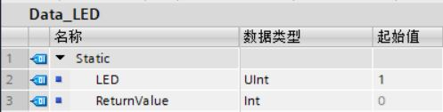  
图2\. 在全局DB中创建变量

在OB1中调用"LED"指令，并连接参数，其中参数LADDR指向CPU的硬件标识符(在"PLC变量->系统常量"中，名称为"Local~Common")，如图3所示：

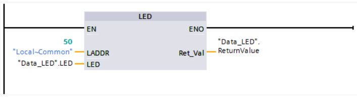  
图3\. 在OB1中调用"LED"指令

通过参数LED("LED")指向待监视CPU的LED。示例一中参数LED("LED"=1)表示查询CPU的LED(STOP/RUN)状态。如果CPU的操作模式从STOP转入RUN，则在输出参数RET_VAL("ReturnValue")中的值为"6"(绿色和橙色交替闪烁)。如图4所示：

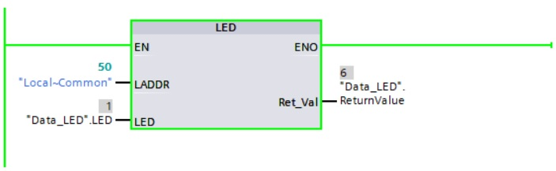  
图4\. "LED"指令执行结果(示例一)

通过参数LED("LED")指向待监视CPU的LED。示例二中参数LED("LED"=2)表示查询CPU的LED(ERROR)状态。如果CPU中发生错误，则在输出参数RET_VAL("ReturnValue")中的值为"4"(红色闪烁)。如图5所示：

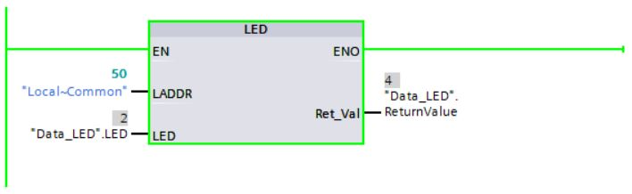

图5\. "LED"指令执行结果(示例二)

## 读取诊断信息

1\. 读取诊断信息指令的调用，如图6所示。

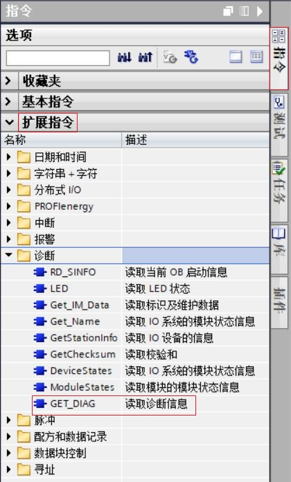  
图6\. 读取诊断信息指令

2.读取诊断信息指令的使用。

**说明：**GET_DIAG指令可以用来读取硬件组件的诊断信息。例如：读取S7-1200 CPU的诊断信息。

* 通过LADDR参数，来选择硬件组件。
    
* 通过MODE参数，可以选择要读取的诊断信息。
    
* 通过DIAG参数，根据不同的MODE参数，输出不同的诊断信息。如表2所示：
    

表2 GET_DIAG指令的MODE参数和DIAG参数对应关系

| MODE | 说明  | DIAG | CNT_DIAG |
| --- | --- | --- | --- |
| 0   | 以 DWORD 格式输出硬件组件所有支持的诊断信息，其中位 X=1 表示支持模式 X。 | DWORD 数据类型的位：  * 位 0 = 1：支持 MODE 0。 * 位 1 = 1：支持 MODE 1。 * 位 2 = 1：支持 MODE 2。 * 位 3 到 31：不相关  MODE=0 时，S7-1200 CPU 将忽略参数 LADDR。 | 0   |
| 1   | 输出所寻址硬件组件的诊断状态。 | 结构 DIS：  * MaintenanceState * ComponentStateDetail * OwnState * IOState * OperatingState | 0   |
| 2   | 输出所寻址硬件对象中所有从属组件的状态。 | 结构 DNN：  * SubordinateState * SubordinateIOState * DNNmode | 0   |

当参数MODE=1时，参数DIAG以结构 DIS 输出诊断信息。此时，在变量声明中输入系统数据类型“DIS”作为数据类型。结构DIS的内容如表3所示：

表3 结构DIS中各参数的含义

| 参数  | 数据类型 | 值   | 说明  | 参数构成规则 |
| --- | --- | --- | --- | --- |
| MaintenanceState | DWORD | 枚举  |     | MaintenanceState 取决于 ComponentStateDetail。 |
| 0   | 良好  | * ComponentStateDetail 的位 15 始终为 1。 * ComponentStateDetail 的位 11 到 14 的值可以是 0 或 1。 * ComponentStateDetail 的位 3 可以是 1。 * ComponentStateDetail 的所有其它位均为 0。 |
| 1   | 硬件组件已禁用。 | * 如果 ComponentStateDetail 的位 16 为 1      * 如果 ComponentStateDetail 的位 17 为 1 |
| 2   | -   | -   |
| 3   | -   | -   |
| 4   | -   | -   |
| 5   | 需要维护 | 如果 ComponentStateDetail 的位 4 为 1 |
| 6   | 要求维护 | 如果 ComponentStateDetail 的位 5 为 1 |
| 7   | 错误  | 如果 ComponentStateDetail 的位 6 为 1 |
| 8   | 上一级硬件组件的状态为“未知/错误” | * 如果 ComponentStateDetail 的位 11 到 14 的值为 3 * 如果 ComponentStateDetail 的位 7 到 10 的值为 3 或 4 |
| 9   | -   | -   |
| 10  | 输入/输出不可用。 | * 如果 ComponentStateDetail 的位 11 到 14 的值为 2 * 如果 ComponentStateDetail 的位 7 到 10 的值为 1 或 2 * 如果 ComponentStateDetail 的位 18 为 1 * 如果 ComponentStateDetail 的位 19 为 1 |
| ComponentStateDetail | DWORD | 位数组 | 状态：  * 位 0 到 15：硬件组件的状态 * 位 16 到 31：CPU 的状态 | -   |
| 0 到 2（枚举） | 其它信息：  * 0：无其它信息 * 1：不允许传送 | -   |
| 3   | 位 3 = 1：至少一个合格诊断可用 | -   |
| 4   | 位 4 = 1：至少一个通道或组件需要维护 | -   |
| 5   | 位 5 = 1：至少一个通道或组件需要维护 | -   |
| 6   | 位 6 = 1：至少一个通道或组件错误 | -   |
| 7 到 10（枚举） | * 0：硬件组件可用 * 1：无 I/O 访问 * 2：硬件组件不可访问 * 3：硬件组件不可访问 * 4：硬件组件不可访问 | -   |
| 11 到 14（枚举） | * 0：元素正确。 * 1：该元素将替代为一个兼容元素。 * 2：该元素将替代为一个非兼容元素（该元素可访问，但尚未就绪无法操作）。 * 3：该元素不存在。 | -   |
| 15  | 预留（始终为“1”）。 | -   |
| 16 到 31 | CPU 生成的模块状态信息：  * 第 16 位 = 1：子模块或模块已禁用 * 第 17 位 = 1：激活 CiR 操作 * 第 18 位 = 1：输入不可用 * 第 19 位 = 1：输出不可用 * 第 20 位 = 1：诊断缓冲区溢出 * 第 21 位 = 1：诊断不可用 * 第 22 位 = 1： 部分设备故障（带有 PNIO，可用于共享设备） * 第 23 到 31 位 ：预留（始终为 0） | -   |
| OwnState | UINT | 枚举  | 维护状态 | OwnState 取决于 MaintenanceState。 |
| 0   | 良好  | 如果 MaintenanceState 的值为 0。 |
| 1   | 禁用  | 如果 MaintenanceState 的值为 1。 |
| 2   | 需要维护 | 如果 MaintenanceState 的值为 5。 |
| 3   | 要求维护 | 如果 MaintenanceState 的值为 6。 |
| 4   | 错误  | 如果 MaintenanceState 的值为 7。 |
| 5   | 不可访问 | 如果 MaintenanceState 的值为 8。 |
| 6   | 诊断状态未知 | 未返回诊断事件的组件的默认值。 |
| 7   | 输入/输出不可用。 | 如果 MaintenanceState 的值为 10。 |
| IOState | WORD | 位数组 | 硬件组件的 I/O 状态 | 可设置一个或多个位。  IOState 取决于 ComponentStateDetail。 |
| 位 0 = 1 | 良好  | * ComponentStateDetail 的位 15 始终为 1。 * ComponentStateDetail 的位 11 到 14 的值可以是 0 或 1。 * ComponentStateDetail 的位 3 可以是 1。 * ComponentStateDetail 的所有其它位均为 0。  如果位 0 = 1，则位 1 到 5 和位 7 = 0。 |
| 位 1 = 1 | 禁用  | * 如果 ComponentStateDetail 的位 16 为 1 * 如果 ComponentStateDetail 的位 17 为 1  如果位 1 = 1，则所有其它位均为 0。 |
| 位 2 = 1 | 需要维护 | 如果 ComponentStateDetail 的位 4 为 1 |
| 位 3 = 1 | 要求维护 | 如果 ComponentStateDetail 的位 5 为 1 |
| 位 4 = 1 | 错误  | 如果 ComponentStateDetail 的位 6 为 1 |
| 位 5 = 1 | 硬件组件无法访问。 | * 如果 ComponentStateDetail 的位 11 到 14 的值为 3      * 如果 ComponentStateDetail 的位 7 到 10 的值为 3 或 4       如果位 5 = 1，则所有其它位均为 0。 |
| 位 6 = 1： | 至少一个合格诊断可用 | 如果 ComponentStateDetail 的位 3 为 1。  在这种情况下，将位 0、2 或 3 置位。 |
| 位 7 = 1： | I/O 数据不可用 | * 如果 ComponentStateDetail 的位 11 到 14 的值为 2 * 如果 ComponentStateDetail 的位 7 到 10 的值为 1 或 2 * 如果 ComponentStateDetail 的位 18 为 1 * 如果 ComponentStateDetail 的位 19 为 1 |
| 位 8 到 15 | 预留（始终为“0”） | -   |
| OperatingState | UINT | 枚举  |     | -   |
| 0   | 不支持 \- 对于 I/O 模块，OperatingState 的值始终为“0”。 | -   |
| 1   | STOP / 固件更新 | -   |
| 2   | STOP / 存储器复位 | -   |
| 3   | STOP / 自启动 | -   |
| 4   | STOP | -   |
| 5   | 存储器复位 | -   |
| 6   | 启动  | -   |
| 7   | -   | -   |
| 8   | RUN | -   |
| 9   | RUN-Redundant | -   |
| 10  | HOLD | -   |
| 11  | -   | -   |
| 12  | -   | -   |
| 13  | DEFECT（注：仅在诊断缓冲区条目中可见） | -   |
| 14  | -   | -   |
| 15  | 断电（注：仅在诊断缓冲区条目中可见） | -   |
| 16  | CiR | -   |
| 17  | STOP，且无 ODIS | -   |
| 18  | RUN ODIS | -   |
| 19  | PgmTest | -   |
| 20  | RunPgmTest（备用 CPU 处于测试模式时主 CPU 的状态） | -   |
| 21  | Run-Syncup（只有主 CPU 处于SYNCUP 系统状态） | -   |
| 22  | SYNCUP（仅备用 CPU 处于 SYNCUP 系统状态） | -   |
| 31  | 伙伴 CPU 的状态未知（如，伙伴 CPU 不可用） | -   |
| 32  | -   | -   |
| 33  | STOP 系统状态 | -   |
| 34  | 预留  | -   |
| 35  | STARTUP 系统状态 | -   |
| 36  | 预留  | -   |
| 37  | RUN-Solo 系统状态 | -   |
| 38  | SYNCUP 系统状态 | -   |
| 39  | 预留  | -   |
| 40  | RUN-Redundant 系统状态 | -   |

**示例：**在全局DB中创建三个变量和一个"Diag"结构(数据类型为DIS)，用来保存数据，如图7所示：

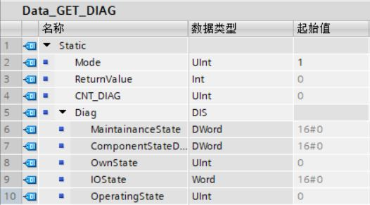  
图7\. 在全局DB中创建变量

在OB1中调用GET_DIAG指令，并连接参数，其中参数LADDR指向CPU的硬件标识符(在"PLC变量->系统常量"中，名称为"Local~Common")，如图8所示：

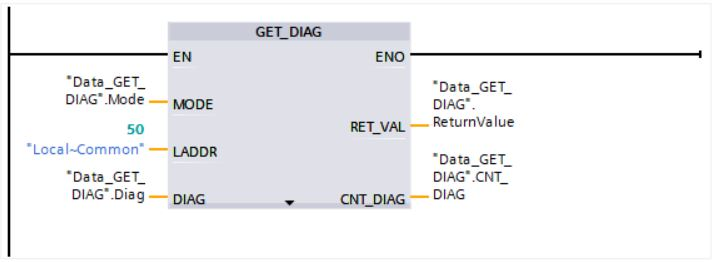  
图8\. 在OB1中调用GET_DIAG指令

根据参数MODE("Mode")的值"1"，有以下几点说明：

* 指令将读取(CPU的)所寻址硬件对象的状态。
    
* 在参数DIAG("Diag")中，诊断信息将在结构(DIS数据类型)中输出。
    

要了解诊断信息，必须将十六进制值转换为二进制代码。通过参数DIAG("Diag")，指示以下信息：

* MaintenanceState：根据值"6"，表示CPU要求维护。
    
* ComponentStateDetail：根据十六进制值"0000_8020"，位15已激活(预留，始终为"1")，位5已激活(至少一个通道或组件需要维护)。
    
* OwnState：根据值"3"，要求维护。
    
* IOState：根据十六进制值"0008"，要求维护。
    
* OperatingState：输出"0"。
    

输出参数RET\_VAL("ReturnValue")用于指示处理无错误。通过输出参数CNT\_DIAG("CNT_DIAG")，指示参数DETAIL的"0"诊断详情已输出。 如图9所示：

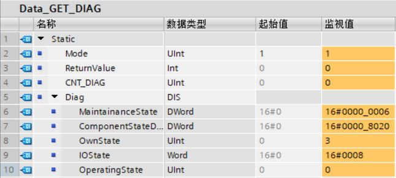  
图9\. GET_DIAG指令执行结果

## 读取数据记录

1\. 读取数据记录指令的调用，如图10所示。

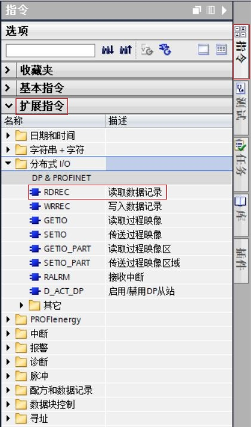  
图10\. 读取数据记录指令

2\. 读取数据记录指令的使用。

**说明：**RDREC读取数据记录指令，可以从使用ID寻址的模块中读取编号为INDEX的数据记录。模块必须是位于分布式模块（PROFIBUS DP、PROFINET IO、AS-i）。

* 使用参数 ID 选择从中读取数据记录的模块，使用模块的硬件标识符，在"PLC 变量 -> 系统常量“中。例如：ET200SP分布式IO 的 DQ模块，将显示为数据类型为"Hw\_SubModule"的 IO\_device\_1~DQ\_16x24VDC\_0\_5A\_ST\_1。
    
* 使用 INDEX 参数，可选择模块待读取的数据记录。例如：”16#E00A“，表示读取 IO 设备的诊断数据记录。
    
* 使用 MLEN 指定要读取的最大数据记录字节数。如果参数 MLEN 选择了长度”0“，则会在参数 RECORD 中写入完整的数据记录。
    
* 目标区域 RECORD用来保存数据记录，在参数 RECORD 中使用的结构（例如：组态、数据类型和长度）取决于由哪个模块读取哪条数据记录。
    
* 输出参数 VALID 的值为 TRUE，表示数据记录已成功传送到目标区域 RECORD 中。此时，输出参数 LEN 包含所读取数据的字节长度。
    
* 如果在数据记录的传送过程中发生错误，输出参数 ERROR 置 ”1“。输出参数 STATUS 中包含错误信息。
    

**示例：**本例中，IO控制器为S7-1200 CPU1215C，带有 DQ 模块的 IO 设备 (ET 200SP IM 155-6 PN HF) 导致线路断路。使用该 IO 设备前端模块的硬件 ID，使用数据记录16#E00A 进行通道诊断。

在全局DB中创建七个变量和一个数组，用来保存数据。 如图11所示：

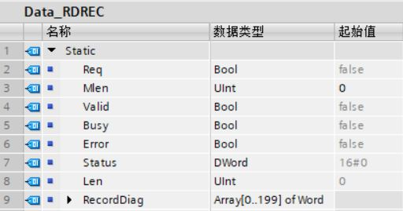  
图11\. 在全局DB中创建变量

在OB1中调用RDREC指令，连接参数，在"PLC变量->系统常量"中的 &lt;IO\_Device~Head&gt; 条目，读取 IO 设备前端模块的硬件 ID（数据类型为“Hw\_SubModule”），使用数据记录16#E00A 进行通道诊断，

如图12所示：

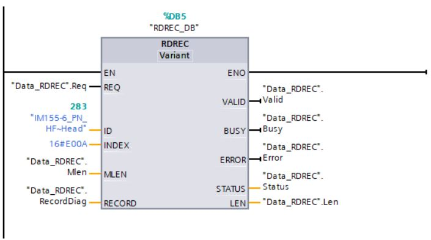

图12\. 在OB1中调用RDREC指令

当RDREC指令出错时要存储错误状态，可连接MW100("Status")变量，如图13所示：

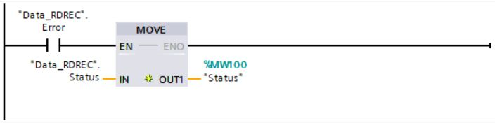  
图13\. 在OB1中调用MOVE指令

诊断数据记录的结构16#E00A，版本号BlockVersion=16#0100，如表4所示：

表4 数据记录结构一

| 名称  | 长度  |
| --- | --- |
| BlockType | 2 bytes |
| BlockLength | 2 bytes |
| BlockVersion | 2 bytes |
| SlotNumber | 2 bytes |
| SubslotNumber | 2 bytes |
| ChannelNumber | 2 bytes |
| ChannelProperties | 2 bytes |
| USI | 2 bytes |
| USI=16#8000 |     |
| ChannelNumber | 2 bytes |
| ChannelProperties | 2 bytes |
| ChannelErrorType | 2 bytes |
| USI=16#8002 |     |
| ChannelNumber | 2 bytes |
| ChannelProperties | 2 bytes |
| ChannelErrorType | 2 bytes |
| ExtChannelErrorType | 2 bytes |
| ExtChannelAddValue | 4 bytes |
| USI=16#0000-16#7FFF |     |
| vendor-specific | X bytes |

诊断数据记录的结构16#E00A，版本号BlockVersion=16#0101，如表5所示：

表5 数据记录结构二

| 名称  | 长度  |
| --- | --- |
| BlockType | 2 bytes |
| BlockLength | 2 bytes |
| BlockVersion | 2 bytes |
| API | 4 bytes |
| SlotNumber | 2 bytes |
| SubslotNumber | 2 bytes |
| ChannelNumber | 2 bytes |
| ChannelProperties | 2 bytes |
| USI | 2 bytes |
| USI=16#8000 |     |
| ChannelNumber | 2 bytes |
| ChannelProperties | 2 bytes |
| ChannelErrorType | 2 bytes |
| USI=16#8002 |     |
| ChannelNumber | 2 bytes |
| ChannelProperties | 2 bytes |
| ChannelErrorType | 2 bytes |
| ExtChannelErrorType | 2 bytes |
| ExtChannelAddValue | 4 bytes |
| USI=16#0000-16#7FFF |     |
| vendor-specific | X bytes |

输入参数 REQ("Req")返回信号状态"TRUE"时，启动指令RDREC。RDREC指令将通过输入参数ID(本例中为"283"，表示 IO 设备前端模块的硬件 ID)，调用该模块。通过输入参数INDEX(本例中为"16#E00A")，

系统将使用数据记录16#E00A 进行通道诊断，并通过参数RECORD("RecordDiag")进行保存。

通过输出参数LEN("Len")，可存储所读取数据记录的长度。根据输入参数MLEN("Mlen")的值，值为"0"时，待读取的数据记录信息将不受限制。

在执行过程中，输出参数BUSY("Busy")将置位为"TRUE"；VALID("Valid")将置位为"FALSE"。在执行完成后，将输出成功读取的结果("Valid"到"TRUE")。并在输出参数STATUS("Status")处，显示该块的状态，

如果值为"16#0000_0000"，表示过程成功执行且无任何错误。如图14所示：

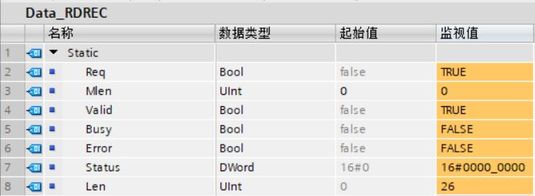  
图14\. RDREC指令执行结果

此外，数据记录16#E00A中包含以下信息：

* BlockType("RecordDiag\[0\]")：16#0010，表示诊断记录；
    
* BlockLength("RecordDiag\[1\]")：16#0016，表示包含诊断记录的连续字节数为22个字节；
    
* BlockVersion("RecordDiag\[2\]")：16#0101，表示版本号为16#0101；
    
* API("RecordDiag\[3\]和RecordDiag\[4\]")：0，表示应用程序进程标识符，标准API为0；
    
* SlotNumber("RecordDiag\[5\]")：16#0002，表示插槽号为2；
    
* SubslotNumber("RecordDiag\[6\]")：16#0001，表示子模块为1；
    
* ChannelNumber("RecordDiag\[7\]")：16#8000，表示子模块级别上的诊断；
    
* ChannelProperties("RecordDiag\[8\]")：16#0800，表示诊断未决；
    
* USI("RecordDiag\[9\]")：16#8000，表示用户结构标识符；
    
* ChannelNumber("RecordDiag\[10\]")：16#0003，表示通道3发生故障。
    
* ChannelProperties("RecordDiag\[11\]")：16#4801，表示输出位信号诊断未决。
    
* ChannelErrorType("RecordDiag\[12\]")：16#0006，表示断路故障。
    

参数RECORD("RecordDiag")中显示了数据记录信息，如图15所示：

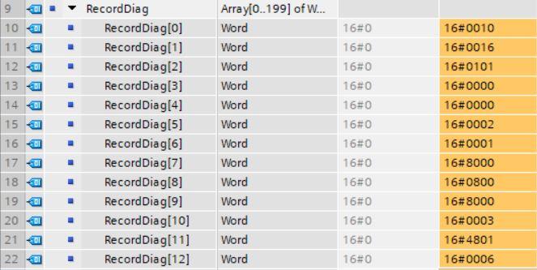

图15\. RDREC指令执行结果(数据记录信息"RecordDiag")

## 接收中断

1\. 接收中断指令的调用，如图16所示。

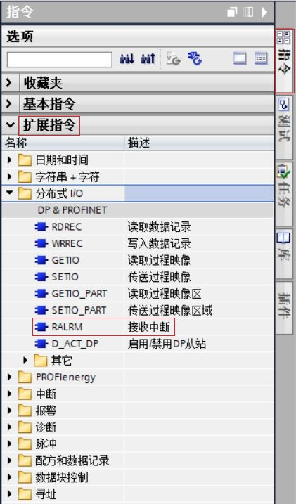  
图16\. 接收中断指令

2\. 接收中断指令的使用。

**说明：**RALRM接收中断指令，可以从I/O模块(集中式组态)或DP从站/PROFINET IO设备的模块中接收带有所有相关信息的中断，并在输出参数中输出该信息。

* 输出参数中的信息包括所调用 OB 的信息。例如：输出信息包含诊断错误中断OB82的启动信息和管理信息。
    
* 目标范围 AINFO 中的数据结构包含标头信息和附加中断信息。附加中断信息取决于格式标识符，例如：格式标识符16#8000表示通道诊断。
    

* RALRM指令可以在三种操作模式中调用（MODE 参数），如表6所示：
    

表6 RALRM指令的参数MODE

| MODE | RALRM |
| --- | --- |
| 0   | 表示输出参数 ID 中触发中断并将输出参数 NEW 设置为 TRUE 的组件。 |
| 1   | 写入所有输出参数，而不考虑触发中断的组件。 |
| 2   | 检查输入参数 F_ID 中指定的组件是否已触发中断。  * 如果没有触发，则 NEW = FALSE * 如果已触发，则 NEW = TRUE 且已写入所有其它输出参数。 |

**示例：**创建一个输入模块，在"PLC变量->系统常量"中，读取输入模块的硬件标识符。并通过输入参数F\_ID("F\_ID")存储该硬件标识符。

为了产生一个中断，该输入通道需选择"断路"选项。该选项位于"模块参数->通道模板->输入"中。如图17所示：

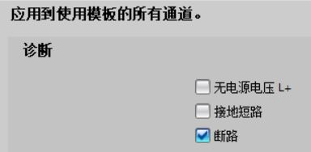

图17 组态输入模块的诊断信息

在全局DB中创建七个变量，和结构"Tinfo"和"Ainfo"进行数据存储，创建数据类型为"TI_DiagnosticInterrupt"的结构"Tinfo"，如图18所示：

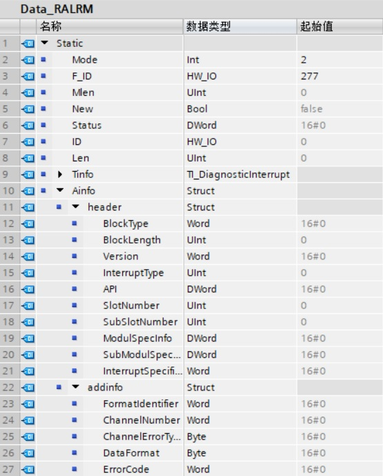  
图18\. 在全局DB中创建变量

创建诊断错误中断OB82，如图19所示：

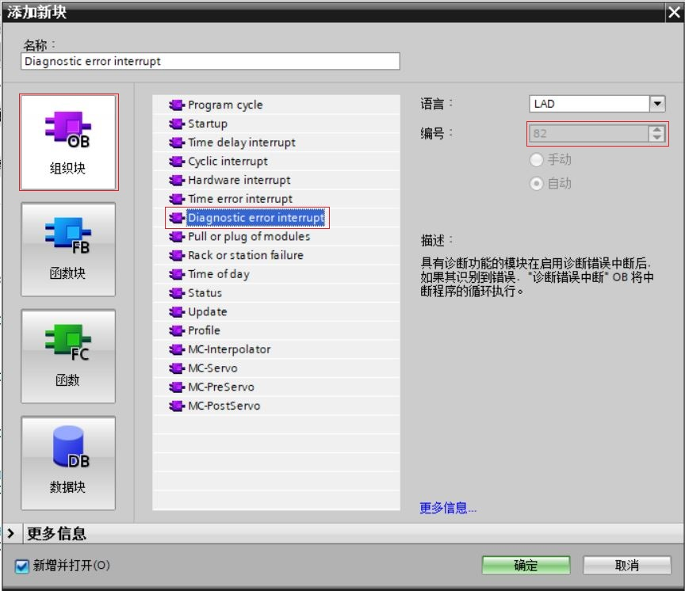

图19\. 创建OB82

在OB82中调用RALRM指令，并连接参数，如图20所示：

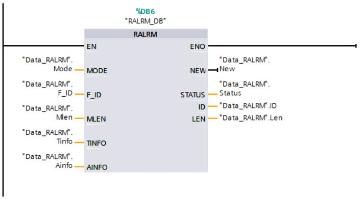  
图20\. 在OB82中调用RALRM指令

发生断路故障时，输入模块将生成一个中断。之后，将调用诊断错误中断OB82，并启动指令RALRM。

RALRM指令将通过输入参数F\_ID("F\_ID")调用该输入模块。指令RALRM将根据输入参数MODE("Mode")的值"2"，检查中断是否由该输入模块产生。如果中断来自该输入模块("F_ID"和"ID"相同)，

则输出参数NEW("New")将置位为"TRUE"，并通过参数TINFO("Tinfo")和AINFO("Ainfo")保存该中断信息。生成该中断的模块硬件标识符将显示在输出参数ID("ID")处。已接收到的中断信息长度

将记录在输出参数LEN("Len")中。根据输入参数MLEN("Mlen")的值，值为"0"时，待读取AINFO("Ainfo")的信息将不受限制。并在输出参数STATUS("Status")处，显示该块的状态，

如果值为"16#0000_0000"，表示过程成功执行且无任何错误。如图21所示：

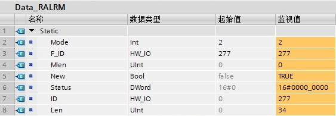  

图21.RALRM指令执行结果

OB82的启动信息和管理信息均存储在参数TINFO("Tinfo")中。生成的中断包含以下信息：

OB82启动信息：

* OB82使用优化启动信息("SI_Format"和值"254")。
    

OB82管理信息：

* 读取状态为"错误"(参见"IO_State"的值)的输入模块(参见"LADDR")。
    
* 最近记录的通道"0"的中断(参见"Channel"的值)。
    
* 最近记录的站"1"的中断(参见"address"的值)。
    
* 从站的配置文件(参见"slv_prfl"的值)。

* 由组态的分布式模块触发的中断(参见"intr_type"的值)。如图22所示：
    

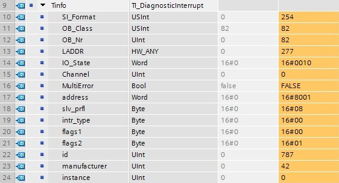

图22.TINFO参数的详细信息

有关中断的标头信息和附加信息，均存储在参数AINFO("Ainfo")中。生成的中断包含以下信息：

* 所用OB是一个诊断中断OB("InterruptType"，值为"1")。
    
* 系统报告模块在插槽"2"("SlotNumber")处和子模块插槽"1"处发生中断("SubSlotNumber")。
    
* 对于子模块("InterruptSpecifier"，值为"16#A89C")，为中断指示符。
    
* 在本示例中，使用通道诊断的结构("FormatIdentifier"，值为"16#8000")。
    
* 触发该中断的组件通道编号将分配给该子模块("ChannelNumber"，值为"16#0000")。

* 诊断输入通道的一个到达错误("ChannelErrorType"，值为"16#28")。
    
* 所用的数据格式为一个位("DataFormat"，值为"16#01")。

* 诊断一个断路故障("ErrorCode"，值为"16#0006")。如图23所示：
    

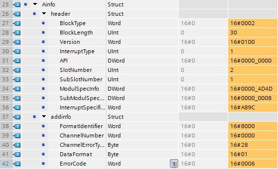

图23.AINFO参数的详细信息

注：AINFO变量建议使用非优化数据块，如使用优化块，需要使用BYTE类型的数组，以免数据发生错乱。

## 生成用户诊断报警

1\. 生成用户诊断报警指令的调用，如图24所示。

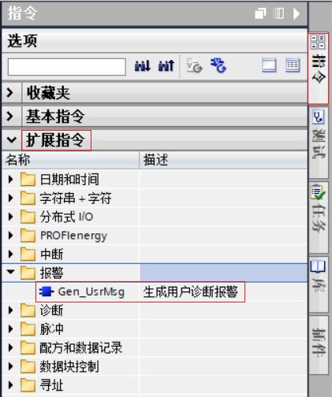  
图24\. 生成用户诊断报警指令

2\. 生成用户诊断报警指令的使用。

**说明：**Gen_UsrMsg生成用户诊断报警指令，可以生成在诊断缓冲区中输入的报警。

* 可以使用 Mode 参数选择生成到达的报警还是离去的报警。
    
    * 当 Mode = 1 时：创建到达的报警。
    * 当 Mode = 2 时：创建离去的报警。
    * 无论生成到达的报警还是离去的报警，报警始终具有”仅信息“属性。

* 条目在诊断缓冲区中同时创建，而报警将进行异步传送。
    
* 如果指令在执行过程中出错，则将在参数 RET_VAL 处输出错误信息。
    

**示例：**在全局DB中创建五个变量和一个"AssocValues"结构(数据类型为AssocValues)，用来保存数据，如图25所示：

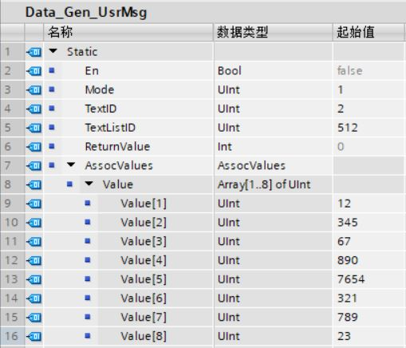  
图25\. 在全局DB中创建变量

在OB1中调用Gen_UsrMsg指令，并连接参数，如图26所示：

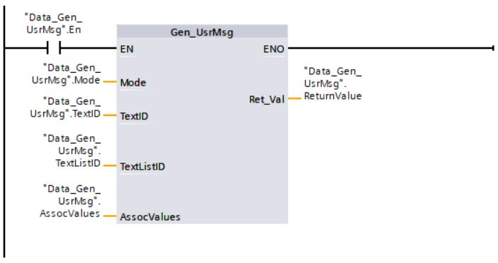  
图26\. 在OB1中调用Gen_UsrMsg指令

使用"PLC报警文本列表->文本列表"条目为报警创建文本列表和文本列表条目。在参数TextListID("TextListID")中应用文本列表的ID。在参数TextID("TextID")中应用文本列表条目的ID(范围...)。

分配报警参数，如图27所示：

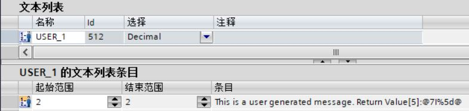  
图27\. 分配报警参数

如果常开触点("En")的信号状态为"TRUE"，则执行"Gen_UsrMsg"指令。根据参数Mode("Mode")的值，生成到达的报警。使用参数TextListID("TextListID")和TextID("TextID")使指令指向待输出的报警。使用参数

AssocValues("AssocValues")传送报警的关联值。

生成报警时，将按下列方式解释报警文本中包含的字符串"@7I%5d@"：

* 编号为"7"的关联值以INT数据类型读取。该编号对应于"AssocValues"结构的参数Value\[5\]。
    
* 关联值将作为一个十进制数输出。十进制数被限制为五位数。
    

通过输出参数 Ret_Val("ReturnValue")，值为"0"，指示该指令的处理无错误。如图28所示：

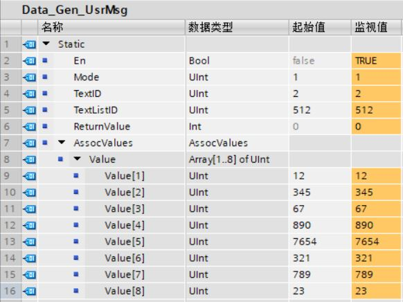

图28\. Gen_UsrMsg指令执行结果

要输出报警，对于S7-1200系列的CPU，请打开条目"在线与诊断->诊断缓冲区"，如图29所示：

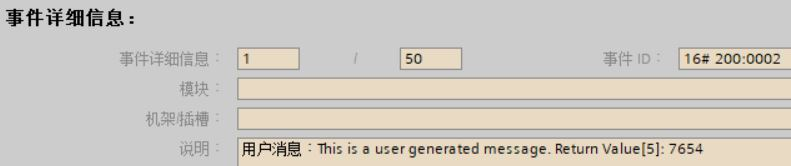

图29\. 诊断缓冲区中输入的报警

**注：关于诊断指令的更多信息请参考TIA STEP7 V16软件中的帮助文档。**

## 常见问题

 **通过"LED"指令读取扩展模块的指示灯状态报错？**

在设备视图中组态S7-1200的扩展模块SM1231 AI4(订货号：6ES7 231-4HD32-0XB0)，硬件标识符为279。通过"LED"指令诊断扩展模块SM1231 AI4的DIAG指示灯的状态，输出参数RET_VAL("ReturnValue")

为-32622，如图30所示。该输出对应16#8092，表示由参数LADDR寻址的硬件组件不会返回所需信息。因此，无法通过"LED"指令诊断扩展模块SM1231 AI4。

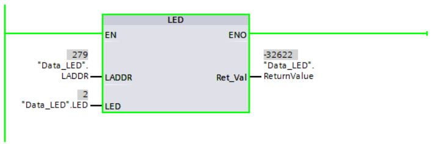

图30\. "LED"指令执行结果

 **S7-1200 CPU可以同时激活多少个RDREC/WRREC指令？**

最多可以同时使用四条RDREC指令和四条WRREC指令。

 **RALRM指令必须要在中断OB中调用吗？**

由于要检查的I/O中断，因此仅在CPU操作系统启动的中断OB内调用RALRM指令。如果在启动事件不是I/O中断的OB中调用RALRM指令，则该指令将在其输出中提供相应精简的信息。

需要确保在不同OB中调用RALRM指令时使用不同的背景数据块。

 **使用Gen_UsrMsg指令如何定义文本列表中的相关值？**

在文本列表条目中，可通过添加以下信息定义相关值：@&lt;关联值的数量&gt;&lt;元素类型&gt;&lt;格式规范&gt;@，如图31所示：

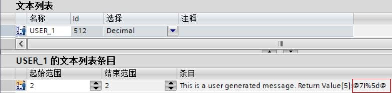

图31\. 文本列表中定义相关值

相关值中的&lt;元素类型&gt;可以通过下表定义，如图32所示：

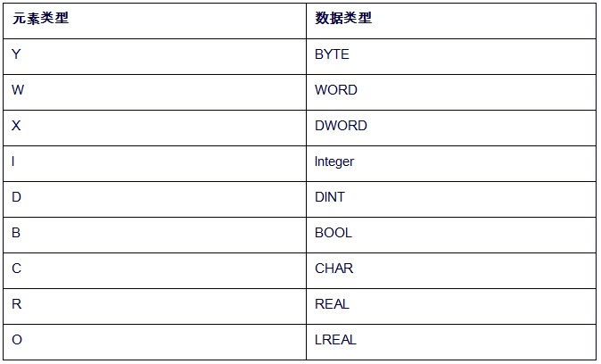

图32\. 相关值中的&lt;元素类型&gt;

相关值中的&lt;格式规范&gt;可以通过下表定义，如图33所示：

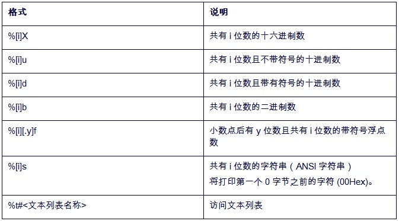

图33\. 相关值中的&lt;格式规范&gt;