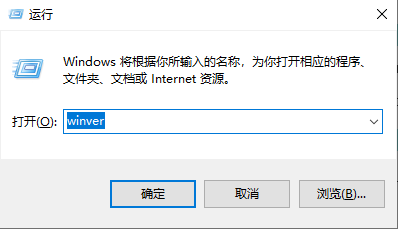
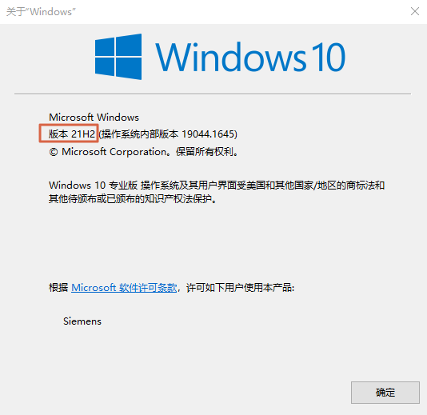
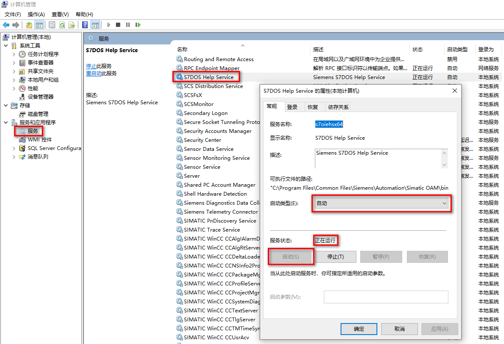
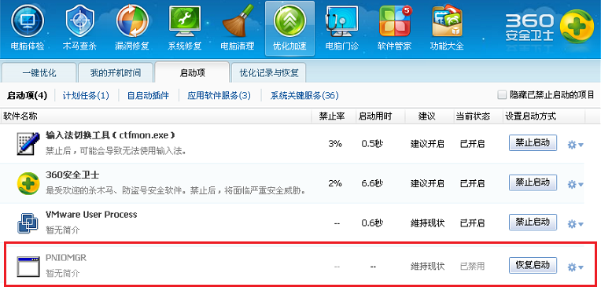
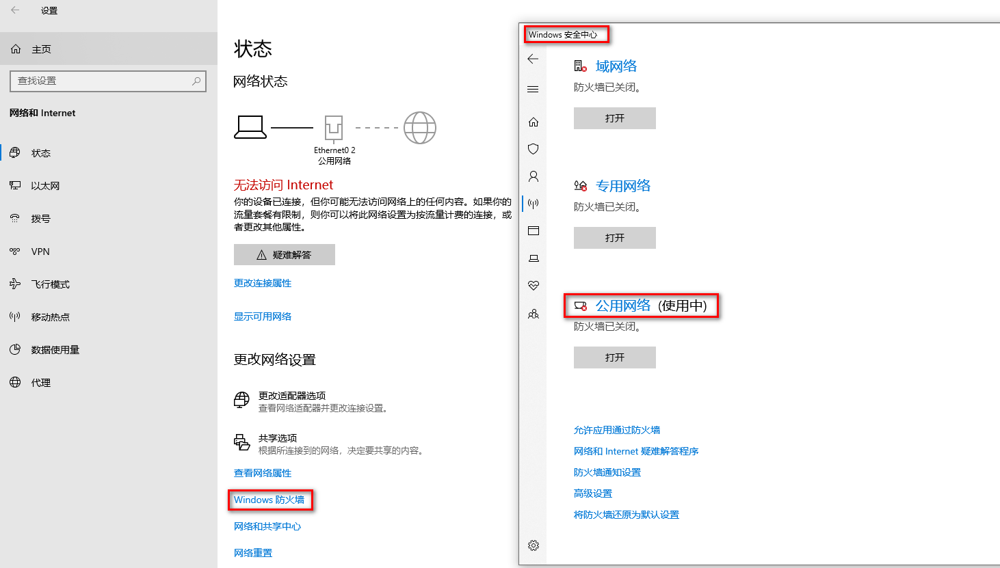

# 04-通过 TIA 博途软件无法搜索到 CPU 的解决办法

产生此问题的原因有很多，比如安装了360安全卫士、金山卫士以及 QQ
管家等第三方杀毒软件；或者 Windows 操作系统非完整版操作系统，例如安装了
GHOST 版本的操作系统，其他定制化的操作系统。

可按照如下步骤逐一检查：

## 检查操作系统兼容性

西门子对每个主要软件都会进行官方的兼容性测试过，其中重要一项是和 Windows
操作系统的兼容性，需要根据软件版本和 Windows
版本核对，如果不匹配，可能会有问题。

每个版本软件安装条件参见[链接](../07-Program/install.md)。

有些时候需要安装 TIA Portal
更新包才满足兼容性，尽量安装，下载地址参见[链接](../01-resource/08-online_download.md)。

对于 Windows 10
这种有很多小版本的操作系统尤为需要注意，可以通过以下方法查看操作系统具体版本。

通过 Windows+R 快捷键，调出运行窗口，输入"winver"，如图 1 所示。

{width="398" height="229"}

图 1 运行窗口

在弹出页面可以查看具体小版本，如图 2 所示红框。

{width="534" height="519"}

图 2 版本

## 检查硬件连接

网络电缆是否连接好，在 CPU 本体打开底部端子块的盖子可以看到 PROFINET
LED，Link （绿色）点亮指示连接成功。

如果使用了第三方交换机，需要交换机支持 DCP 协议（通过 DCP 发现 PROFINET
设备并提供基本设置），可以尝试不经过交换机连接 CPU 测试。

## 检查计算机管理中的服务

在计算机管理的服务中，找到 SIMATIC S7DOS HELP SERVICE 或者 S7DOS HELP
SERVICE 等服务，需要确保该服务为自动状态并且已经启动，如图 3 所示。

{width="1178" height="805"}

图 3 检查服务

## 检查西门子软件进程是否被禁用

检查 360 安全卫士、金山卫士以及 QQ
管家等软件是否对操作系统的启动进程进行了优化设置，是否禁用了西门子软件所需的应用进程。

例如：如图 4 所示，PNIOMGR 进程不能被禁用，如果禁用将导致搜索不到
CPU。需要恢复启动该进程，并重启再次电脑测试。

{width="764" height="384"}

图 4 进程

可以手动启动该进程。PNIOMGR 进程默认存放路径 C:\\Program Files\\Common
Files\\Siemens\\Automation\\Simatic OAM\\bin。

## 关闭防火墙

关闭所使用的网络的防火墙，确认防火墙是否允许西门子软件通过防火墙，如图 5
所示。

{width="1462" height="831"}

图 5 防火墙

以上方法都无法奏效的情况下，可以考虑修复安装博途软件，更换操作系统或者电脑测试。
