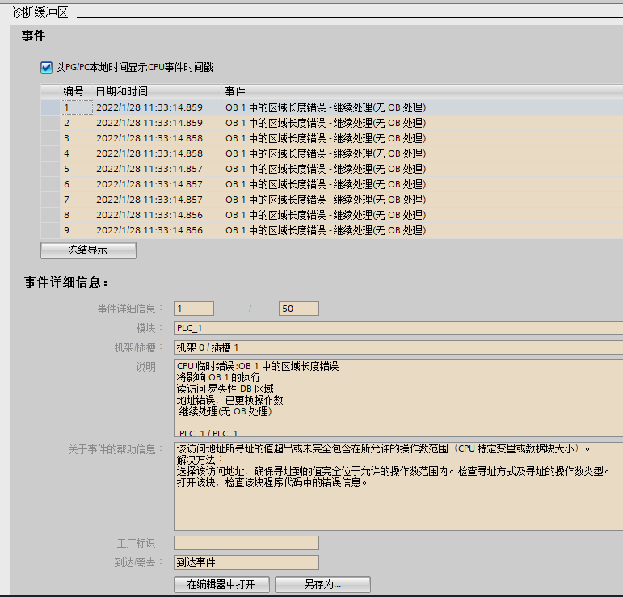
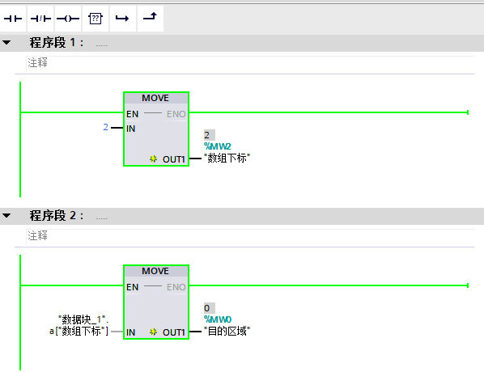
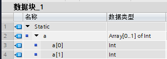

### 为什么 CPU 诊断缓冲区报错"区域长度错误"

如图 1 所示，CPU
诊断缓冲区报错报错"区域长度错误"，发生此类错误的原因是，访问地址所寻址的值超出或未完全包含在所允许的操作数范围（CPU
特定变量或数据块大小）。

{width="771" height="739"}

图 1. "区域长度错误"

可以点击诊断缓冲区下方的"在编辑器中打开"按钮，跳转到发生错误的程序段，如图
2 所示。

在程序段 2 中，通过对数组下标赋值的方式间接寻址数组中的元素，在程序段 1
中为数组下标赋值为 2。

在数据块的声明中，数组只声明了 2 个数组元素，下标为 0-1，下标为 2
超出了数据块中声明变量的范围，故报故障"区域长度错误"。

可以修改数组下标或者修改数据块中数组元素的个数，保证数据访问的范围在允许的范围内。

{width="598" height="460"}

图 2. 出错的程序段位置

{width="339" height="120"}

图 3. 数组的声明

此类错误在间接寻址访问变量时易出现，需要编程人员确保访问地址所寻址的值不超出操作数范围。
