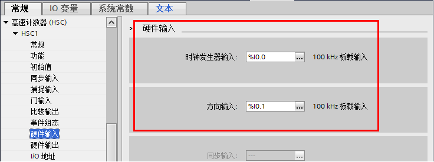
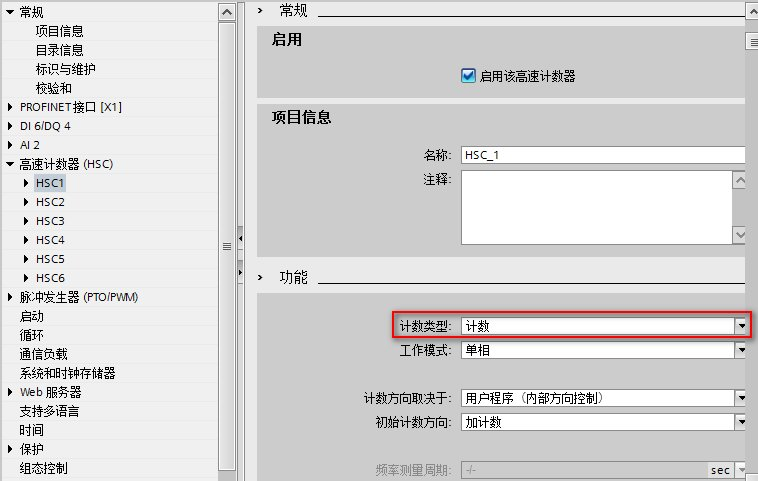
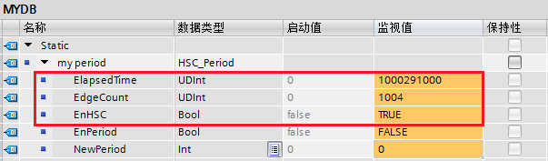
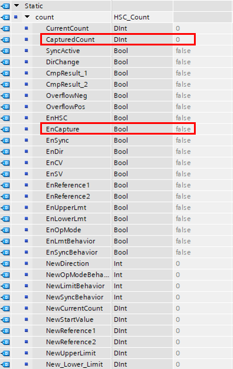
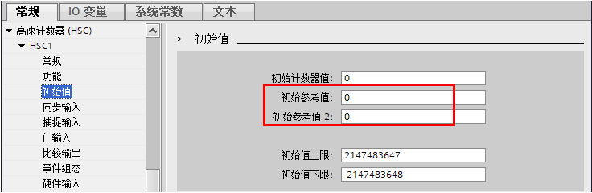

# 01 高速计数器介绍

本文将从几部分阐述 S7-1200 最新版固件（V4.2 版本及以后）的高速计数器资源及功能，链接如下：

[资源](01-HSC.md#资源)

[基础使用](01-HSC.md#基础使用)

[指令编程](01-HSC.md#指令编程)

[其他功能](01-HSC.md#其他功能)

## 资源

S7-1200 CPU 本体提供了最多 6 路高速计数器，其独立于 CPU 的扫描周期进行计数。其中 CPU1217C 可测量的脉冲频率最高为 1 MHz（差分信号），其它型号的 S7-1200 CPU 可测量到的单相脉冲频率最高为 100 kHz，A/B 相最高为 80 kHz。如果使用信号板还可以测量单相脉冲频率高达 200kHz 的信号，A/B 相最高为 160 kHz。

S7-1200 CPU 和信号板具有可组态的硬件输入地址，因此可测量到的高速计数器频率与高速计数器号无关，而与所使用的 CPU 和信号板的硬件输入地址有关。

表 1 和表 2 显示了 CPU 集成输入点与信号板可用于高速计数器的信息。

|     |     |     |     |
| --- | --- | --- | --- |
| **CPU** | **CPU 输入通道** | **单相或两相模式** | **A/B 相正交模式** |
| CPU1211C | Ia.0—Ia.5 | 100 kHz | 80 kHz |
| CPU1212(F)C | Ia.0—Ia.5 | 100 kHz | 80 kHz |
| Ia.6—Ia.7 | 30 kHz | 20 kHz |
| CPU1214(F)C、CPU1215(F)C | Ia.0—Ia.5 | 100 kHz | 80 kHz |
| Ia.6—Ib.5 | 30 kHz | 20 kHz |
| CPU1217C | Ia.0—Ia.5 | 100 kHz | 80 kHz |
| Ia.6—Ib.1 | 30 kHz | 20 kHz |
| Ib.2—Ib.5 (Ib.2+,Ib.2- 到 Ib.5+,Ib.5-） | 1 MHz | 1 MHz |

表 1\. CPU 集成点输入的最大频率

|     |     |     |     |     |     |
| --- | --- | --- | --- | --- | --- |
| 信号板类型 |     | 订货号 | **信号板输入通道** | **单相或两相模式** | **A/B 相正交模式** |
| DI  | 4×24VDC | 6ES7221-3BD30-0XB0 | Ie.0—Ie.3 | 200 kHz | 160 kHz |
| 4×5VDC | 6ES7221-3AD30-0XB0 | Ie.0—Ie.3 | 200 kHz | 160 kHz |
| DI/DQ | 2DI/2×24VDC | 6ES7223-0BD30-0XB0 | Ie.0—Ie.1 | 30 kHz | 20 kHz |
| 2DI/2×24VDC | 6ES7223-3BD30-0XB0 | Ie.0—Ie.1 | 200 kHz | 160 kHz |
| 2DI/2×5VDC | 6ES7223-3AD30-0XB0 | Ie.0—Ie.1 | 200 kHz | 160 kHz |

表 2\. 信号板信息

表 2 中的 5V 信号都是集电极开路信号，不是 5V 差分信号。

高速计数器所需要的同步输入、硬件门、捕捉输入、比较输出只能使用本体或者信号板的输入输出点。

如果希望使用更多的高速计数器，或者连接 SSI 绝对值编码器，可以通过分布式的方式扩展例如 ET200SP 的高速计数器模块，这种方式不占用 S7-1200 高速计数器任何资源。

对于 CPU V4.2 版本以前的高速计数器，资源和功能请参见[链接](03-HSC_Archive.md)。

有关编码器的相关知识请参考以下链接

 按住 Shift 键时用鼠标点击下列链接，打开新浏览器窗口。

[**https://support.industry.siemens.com/cs/cn/zh/view/79192303**](https://support.industry.siemens.com/cs/cn/zh/view/79192303)

## 基础使用

在 S7-1200 的硬件组态中，可以配置高速计数器的参数，其中组态成计数模式、频率模式、周期模式需要在这里配置，如图 1 所示。如果是用于闭环运动控制，则此处无需配置。

图 1\. 基础组态

①激活高速计数器

②设置计数类型：计数模式、频率模式、周期模式

③设置运行模式：单相、两相位、A/B 计数器、A/B 计数器四倍频，值得注意的是组态 A/B 计数器四倍频会使得计数值变为组态 A/B 计数器的 4 倍，但频率相比组态 A/B 计数器不会发生变化

④计数方向：取决于用户程序（通过指令修改），还是外部输入，该功能只与单相计数有关

⑤初始计数方向：正向、反向

⑥频率测量周期：与频率模式、周期模式有关，只能选择 1s、0.1s、0.01s，一般情况下当脉冲频率比较高时选择更小的测量周期可以更新的更加及时，当脉冲频率比较低时选择更大的测量周期可以测量的更准确。

然后在设置使用的硬件输入点，如图 2 所示。

图 2\. 组态输入

:::{attention}
对于高速计数器的相关硬件输入点，一般情况下需要设置其滤波时间，具体参见常见问题[链接](04-FAQ.md#a)。
:::

输入点接线与普通 DI 点接线相同，具体参考[链接](../../06-IO/02-DIDO/01-wiring.md)。

在 I/O 地址处查看高速计数器起始地址，默认情况下，HSC1 为 1000，HSC2 为 1004，HSC3 为 1008，HSC4 为 1012，HSC5 为 1016，HSC6 为 1020，如图 3 所示。

如果组态计数模式、频率模式，可以在不使用指令情况下直接读取计数值与频率值。

图 3\. I/O 地址

在程序中读取基于起始地址的有符号双整数变量即为计数值或者频率值（单位：Hz），一般使用立即读取方式，这样数值更准确，如图 4 所示。

图 4\. 编程

如果组态为计数模式，则计数启动后，计数值使用组态中的初始计数值开始计数，如图 5 所示。

图 5\. 初始计数值

当计数正方向达到上限后再继续从下限开始正方向计数，当计数反方向达到下限后再继续从上限开始反方向计数，参考图 5 下方红框设置的上下限。

## 指令编程

## 指令基本介绍

在 TIA Portal 软件集成的工艺指令文件夹中可以找到 CTRL\_HSC\_EXT 与 CTRL_HSC 指令，如图 6 所示。

图 6\. 指令文件夹

其中 CTRL\_HSC\_EXT 指令支持所有功能，例如门功能、同步功能、捕捉功能、计数、频率测量、周期测量、修改参数等。

而 CTRL_HSC 指令是从 S7-1200 V1.0 版本就开始支持的旧指令，只支持修改计数方向、参考值、当前值、频率测量周期等参数的功能。

如果只需要计数或者测量频率，以及硬件门、复位计数值为零、比较输出等基本功能，而其他功能都不使用，可以只组态，然后去读取相应计数器地址即可，无需调用指令。

如果除基本功能以外，还需要修改计数方向、参考值、当前值、频率测量周期等参数，可以使用旧指令 CTRL_HSC，该指令使用更为简单。

如果有更多功能需求，则必须使用 CTRL\_HSC\_EXT 指令。

具体比较参考表 3。

|     | 无指令调用 | CTRL_HSC | CTRL\_HSC\_EXT |
| --- | --- | --- | --- |
| 计数测量 | 直接读地址 | 直接读地址 | 支持  |
| 频率测量 | 直接读地址 | 直接读地址 | 支持  |
| 周期测量 |     |     | 支持  |
| 软件门 |     |     | 支持  |
| 硬件门 | 硬件操作 | 硬件操作 | 硬件操作 |
| 同步计数值到零 | 硬件操作 | 硬件操作 | 支持  |
| 同步计数值到零以外的值 |     |     | 支持  |
| 捕捉功能 |     |     | 支持  |
| 比较输出 | 硬件操作 | 硬件操作 | 硬件操作 |
| 修改当前计数值 |     | 支持  | 支持  |
| 外部修改计数方向 | 硬件操作 | 硬件操作 | 硬件操作 |
| 软件修改计数方向 |     | 支持  | 支持  |
| 修改参考值 1 |     | 支持  | 支持  |
| 修改频率更新周期 |     | 支持  | 支持  |
| 修改计数同步值 |     |     | 支持  |
| 修改参考值 2 |     |     | 支持  |
| 修改计数溢出限值 |     |     | 支持  |
| 修改计数溢出行为 |     |     | 支持  |
| 事件组态 | 支持  | 支持  | 支持  |

表 3\. 指令调用比较

CTRL\_HSC\_EXT 与 CTRL_HSC 指令如图 6 所示。

图 7\. 指令

CTRL\_HSC\_EXT 指令各参数含义请参考表 4。CTRL_HSC 指令各参数含义请参考表 5。

|     |     |     |     |
| --- | --- | --- | --- |
| 参数  | 声明  | 数据类型 | 描述  |
| HSC | IN  | HW_HSC | 高速计数器硬件标识符 |
| CTRL | IN_OUT | Variant | 连接 HSC 参数，支持 HSC\_Count、HSC\_Frequency 和 HSC_Period 数据类型变量，具体使用参见后文介绍 |
| DONE | OUT | Bool | =1 表示已完成 |
| BUSY | OUT | Bool | 始终为 0 |
| ERROR | OUT | Bool | =1 表示错误 |
| STATUS | OUT | Word | 执行条件代码 |

表 4\. CTRL\_HSC\_EXT 各参数含义

|     |     |     |     |
| --- | --- | --- | --- |
| 参数  | 声明  | 数据类型 | 描述  |
| HSC | IN  | HW_HSC | 高速计数器硬件标识符 |
| DIR | IN  | Bool | True：使能新方向 |
| CV  | IN  | Bool | True：使能新起始值 |
| RV  | IN  | Bool | True：使能新参考值 |
| PERIODE | IN  | Bool | True：使能新频率测量周期 |
| NEW_DIR | IN  | Int | 新方向 1：=正向；-1 ：=反向 |
| NEW_CV | IN  | DInt | 新高速计数器起始值 |
| NEW_RV | IN  | DInt | 新高速计数器参考值 |
| NEW_PERIODE | IN  | Int | 新高速计数器频率测量周期，只能是以下三个数值之一  * 1000 = 1 秒 * 100 = 0.1 秒 * 10 = 0.01 秒 |
| BUSY | OUT | Bool | 始终为 0 |
| STATUS | OUT | Word | 执行条件代码 |

表 5\. CTRL_HSC 各参数含义

其中 HSC 参数高速计数器硬件标识符，需要在 PLC 变量表 > 系统常量找到对应标识符，如图 8 所示。

图 8\. 硬件标识符

## CTRL\_HSC\_EXT 指令-计数实现举例

1\. CPU 硬件组态，启用高速计数器，计数类型选择计数，工作模式选择单相，如图 9 所示。

图 9\. 计数组态

2\. 建立数据块，并建立数据类型为 HSC_Count 的变量，如图 10 所示。

 HSC_Count 数据类型在 DB 块的数据类型中无法选择，需要完整输入后输入回车才会出现。

图 10\. HSC_Count

3\. 在 OB1 里调用指令块 CTRL\_HSC\_EXT，如图 11 所示。

图 11\. 调用 CTRL\_HSC\_EXT

4\. CPU 高速计数器通道接入脉冲信号，如图 12 所示，通过程序对高速计数器软件门信号 EnHSC 信号置位，即可在 CurrentCount 处监控到计数值。

图 12\. 监控计数值

:::{attention}
将 HSC 配置成计数模式时调用 CTRL\_HSC/CTRL\_HSC_EXT 指令不是必须的。只要在硬件配置里使能并组态高速计数器即可正常计数，默认情况下 ID1000 的值即为 HSC1 的计数值。
:::

## CTRL\_HSC\_EXT 指令-频率测量实现举例

1\. CPU 硬件组态，启用高速计数器，计数类型选择频率，设定频率测量周期，如图 13 所示。

图 13\. 频率组态

2\. 建立数据块，并建立数据类型为 HSC_Frequency 的变量，如图 14 所示。

 HSC_Frequency 数据类型在 DB 块的数据类型中无法选择，需要完整输入后输入回车才会出现。

图 14\. HSC_Frequency

3\. 在 OB1 里调用指令块 CTRL\_HSC\_EXT，如图 15 所示。

图 15\. 调用 CTRL\_HSC\_EXT

4\. CPU 高速计数器通道接入脉冲信号，如图 16 所示，通过程序对高速计数器软件门信号 EnHSC 信号置位，即可在 Frequency 处监控到频率值。

图 16\. 监控频率值

:::{attention}
将 HSC 配置成频率模式时调用 CTRL\_HSC/CTRL\_HSC_EXT 指令不是必须的。只要在硬件配置里使能并组态高速计数器即可正常计数，默认情况下 ID1000 的值即为 HSC1 的频率值。
:::

## CTRL\_HSC\_EXT 指令-周期测量实现举例

1\. CPU 硬件组态，启用高速计数器，计数类型选择周期，设定频率测量周期，如图 17 所示。

图 17\. 频率组态

2\. 建立数据块，并建立数据类型为 HSC_Period 的变量，如图 18 所示。

 HSC_Period 数据类型在 DB 块的数据类型中无法选择，需要完整输入后输入回车才会出现。

图 18\. HSC_Period

3\. 在 OB1 里调用指令块 CTRL\_HSC\_EXT，如图 19 所示。

图 19\. 调用 CTRL\_HSC\_EXT

4\. CPU 高速计数器通道接入脉冲信号，如图 20 所示，通过程序对高速计数器软件门信号 EnHSC 信号置位，可以在线监控数据块的数据变化。

图 20\. 监控数值

根据周期计算公式，

脉冲周期 = ElapsedTime/EdgeCount = 1000291000/1004 = 996305 ns ≈ 0.001 s

由此可以得出所测量的脉冲信号周期为 0.001 秒。

## 其他功能

高速计数器还支持其他功能，包括：

* 门功能
* 同步功能
* 捕捉功能
* 比较功能
* 事件组态
* 变量修改

## 门功能

许多应用需要根据其他事件的情况来开启或关闭计数程序。出现这类情况时，便会通过内部门功能来开启或关闭计数。每个高速计数器通道有两个门：软件门和硬件门。这些门的状态将决定内部门的状态参见表 6 所示。

| 硬件门 | 软件门 | 内部门 |
| --- | --- | --- |
| 打开/未组态 | 打开/未编程 | 打开  |
| 打开/未组态 | 关闭  | 关闭  |
| 关闭  | 打开/未编程 | 关闭  |
| 关闭  | 关闭  | 关闭  |

表 6\. 内部门状态

如果硬件门处于打开状态或尚未进行组态，并且软件门处于打开状态或没有编写 CTRL\_HSC\_EXT 指令，则内部门会打开。如果内部门打开，则开始计数。如果内部门关闭，则会忽略计数脉冲，且停止计数。如图 21 所示。

:::{attention}
内部门关闭之后再打开，计数器将继续之前的数值计数，而并非从初始计数值开始计数。
:::

图 21\. 内部门与计数器值

硬件门组态，如图 22 所示。

图 22\. 硬件门组态

软件门编程

当使用 CTRL\_HSC\_EXT 指令时，需要根据测量类型新建数据类型为 HSC\_Count 、HSC\_Frequency 或 HSC\_Period 的变量连接在指令的 CTRL 接口，软件门即为该变量中的 EnHSC，如图 23 所示为 HSC\_Count 的 EnHSC。HSC\_Frequency 和 HSC\_Period 的 EnHSC 请参考图 14 和 18。

图 23\. 软件门

:::{attention}

硬件门功能仅可用在组态计数模式的 HSC 时使用。在"周期"和"频率"模式下，内部门的状态与软件门的状态相同。
:::

**软件门功能仅在使用 CTRL\_HSC\_EXT 指令时有效，当不使用该指令时相当于软件门已打开。**

## 同步功能

同步功能通过外部输入信号给计数器设置为起始值。可通过执行 CTRL\_HSC\_EXT 指令对起始值进行更改。这样，用户可以将当前计数值与起始值通过外部输入信号进行值同步，同步示例如图 24 所示。

该功能仅在计数模式下使用。

:::{attention}
即使内部门没有打开也将同步。
:::

图 24\. 同步示例

硬件组态，如图 25 所示。

图 25\. 同步输入组态

软件部分，两种情况：

1\. 不调用 CTRL\_HSC\_EXT 指令

此时同步信号电平满足组态条件，计数值将修改为 0 即初始计数值，但是无法修改该初始计数值。

2\. 调用 CTRL\_HSC\_EXT 指令

需要新建数据类型为 HSC_Count 的变量连接在指令的 CTRL 接口，同步输入的使能 EnSync 需要置位，然后同步信号电平满足组态条件时就可以实现同步功能，计数值将修改为初始计数值，默认为 0。变量如图 26 所示。

图 26\. 同步使能信号

如果需要修改初始计数值，使用 CTRL\_HSC\_EXT 可以通过将变量 EN_SV 置位，为变量 NewStartValue 赋值新的初始计数值，即修改了初始计数值。这样同步功能将计数值同步为新的初始计数值，变量如图 27 所示。

图 27\. 修改初始值

:::{attention}
CPU 启动后第一次计数时值为组态页面中的“初始计数器值”，参考图 5 上方红框。该“初始计数器值”仅用于此时，与同步功能无关。
:::

## 捕捉功能

可使用捕捉功能通过外部输入信号来保存当前计数值。需要通过执行 CTRL\_HSC\_EXT 指令才可实现。

该功能仅在计数模式下使用。

如图 28 所示组态捕捉功能在上升沿上进行捕捉的示例。

图 28\. 捕捉示例

捕捉外部输入组态，如图 29 所示。

图 29\. 捕捉输入组态

使用 CTRL\_HSC\_EXT 指令时，需要根据测量类型新建数据类型为 HSC_Count 连接在指令的 CTRL 接口，捕捉输入的使能 EnCapture 需要置位，然后捕捉信号电平满足组态条件时，当前计数值捕捉到变量 CapturedCount 即实现了捕捉功能，如图 30 所示。

图 30\. 捕捉位及捕捉值

:::{attention}

必须调用 CTRL\_HSC\_EXT 指令获取捕捉计数值，在内部门关闭后捕捉功能仍然有效。输入点功能仅可用在组态计数模式的 HSC 时使用。

:::

## 比较功能

启用"比较"输出值功能会生成一个可组态脉冲，每次发生组态的事件时便会产生脉冲。如果正在输出脉冲期间又发生了组态的事件，则该事件不会产生新的脉冲。如图 31 所示比较功能的示例。

图 31\. 比较功能示例

比较功能参考值组态，如图 32 所示。

图 32\. 参考值组态

比较输出组态，如图 33 所示。

图 33\. 比较输出

:::{attention}
需要更改参考计数值除了更改组态外还可以通过 CTRL\_HSC（只支持参考值 1） 与 CTRL\_HSC_EXT 指令更改，如果需要由参考计数 1 改为参考计数 2，只能通过组态来更改。 **输出功能仅可在组态计数模式时使用**。
:::

## 事件组态

如果需要在高速计数器的某些情况下，迅速做出反应，可以使用高速计数器的事件功能，该功能将触发相应的硬件中断，在硬件中断中编写相关工艺程序实现迅速反应。

S7-1200 高速计数器支持三种事件：

* 计数值等于参考值 1（仅支持计数模式）
* 同步事件（仅支持计数模式）
* 方向信号改变（仅支持单相模式外部方向信号）

如图 34 所示了组态页面。

图 34\. 事件组态

使用哪一个事件则激活该事件以及对应硬件中断，然后在中断中编写程序，示例参见[链接](02-Sample.md)。

## 修改参数

如果要修改高速计数器的参数，例如修改当前计数值，必须使用指令才可以，CTRL\_HSC\_EXT 与 CTRL_HSC 指令支持修改的参数不同，具体参考表 7。

|     | CTRL_HSC | CTRL\_HSC\_EXT |
| --- | --- | --- |
| 修改当前计数值 | 支持  | 支持  |
| 软件修改计数方向 | 支持  | 支持  |
| 修改参考值 1 | 支持  | 支持  |
| 修改频率更新周期 | 支持  | 支持  |
| 修改计数同步值 |     | 支持  |
| 修改参考值 2 |     | 支持  |
| 修改计数溢出限值 |     | 支持  |
| 修改计数溢出行为 |     | 支持  |

表 7\. 参数修改比较

对于 CTRL_HSC 指令，修改参数比较简单，直接在指令输入端控制即可。每个参数有值和控制位两个参数，对参数值进行修改，然后对控制位置位即可修改相关参数。

如表 8 所示，前四个参数时控制位，后四个参数是前四个对应的参数值。以修改计数值为例，只需在 NEW_CV 赋值希望的修改的计数值，然后对 CV 置位即可修改完成，但是要注意如果 CV 一直是高电平，此时计数值会保持为修改的计数值无法计数，所以通常使用沿指令触发控制位。

|     |     |     |
| --- | --- | --- |
| 参数  | 数据类型 | 描述  |
| DIR | Bool | True：使能新方向 |
| CV  | Bool | True：使能新起始值 |
| RV  | Bool | True：使能新参考值 1 |
| PERIODE | Bool | True：使能新频率测量周期 |
| NEW_DIR | Int | 新方向 1：=正向；-1 ：=反向 |
| NEW_CV | DInt | 新高速计数器起始值 |
| NEW_RV | DInt | 新高速计数器参考值 1 |
| NEW_PERIODE | Int | 新高速计数器频率测量周期，只能是以下三个数值之一  * 1000 = 1 秒 * 100 = 0.1 秒 * 10 = 0.01 秒 |

表 8\. CTRL_HSC 指令修改参数

对于 CTRL\_HSC\_EXT 指令，需要根据测量类型新建数据类型为 HSC\_Count 、HSC\_Frequency 或 HSC_Period 的变量连接在指令的 CTRL 接口，需要修改的参数就在这三个变量中。

其中 HSC\_Frequency 与 HSC\_Period 只能修改频率更新周期，如图 35 所示。在 NewPeriod 中赋值新的频率更新周期，然后对 EnPeriod 置位即可修改完成，和前述相同，通常使用沿指令触发 EnPeriod 位。

注意：该值只能修改为 1000（对应 1000ms）、100（对应 100ms）、10（对应 10ms）。

图 35\. 修改频率更新周期

对于 HSC_Count，可以修改的参数很多，具体详见表 9。思路和上面的 NewPeriod 相同，在参数值处修改变量，然后对相关控制位进行置位，通常使用沿指令触发控制位。

| 元素  | 数据类型 | 说明  |
| --- | --- | --- |
| EnDir | Bool | 新计数方向 NewDirection 控制位 |
| EnCV | Bool | 新当前计数值 NewCurrentCount 控制位 |
| EnSV | Bool | 新同步起始值 NewStartValue 控制位 |
| EnReference1 | Bool | 新参考值 1 NewReference1 控制位 |
| EnReference2 | Bool | 新参考值 2 NewReference2 控制位 |
| EnUpperLmt | Bool | 新计数上限值 NewUpperLimit 控制位 |
| EnLowerLmt | Bool | 新计数下限值 New\_Lower\_Limit 控制位 |
| EnOpMode | Bool | 新溢出行为 NewOpModeBehavior 控制位 |
| EnLmtBehavior | Bool | 溢出时新计数值 NewLimitBehavior 控制位 |
| EnSyncBehavior | Bool | 暂时不使用 |
| NewDirection | Int | 新计数方向：1 = 加计数；-1 = 减计数 |
| NewOpModeBehavior | Int | 新溢出行为：1 = 停止计数（内部门关闭打开才能继续计数）；2 = 继续计数 |
| NewLimitBehavior | Int | 溢出时新计数值：1 = 计数相反方向限值；2 = 同步起始值（未修改时为 0 ，修改后为生效的 NewStartValue） |
| NewSyncBehavior | Int | 暂时不使用 |
| NewCurrentCount | DInt | 新当前计数值 |
| NewStartValue | DInt | 新同步起始值 |
| NewReference1 | DInt | 新参考值 1 |
| NewReference2 | DInt | 新参考值 2 |
| NewUpperLimit | DInt | 新计数上限值 |
| New\_Lower\_Limit | DInt | 新计数下限值 |

表 9\. 修改 HSC_Count 参数

具体修改实例可以参见[链接](02-Sample.md)。
