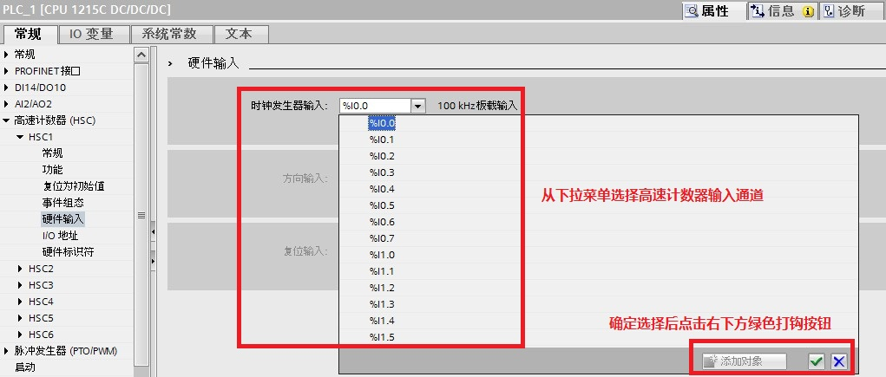

# 04 高速计数器常见问题

:::{seealso}  如何在高速计数器断电或停机后实现数据保持?

答： 有两种方法，分别使用 CTRL\_HSC 指令和 CTRL\_HSC_EXT 指令。
:::

首先配置高速计数器：

|     |     |
| --- | --- |
| 1   | 在设备视图>HSC_1>属性>常规，启用该高速计数器。    图 01 |
| 2   | 在设备视图>HSC_1>属性>功能，定义计数类型为计数。    图 02 |
| 3   | 在设备视图>HSC_1>属性>I/O 地址，使用缺省地址 1000 作为高速计数器地址。    图 03 |

方法1：使用 CTRL_HSC 指令

|     |     |
| --- | --- |
| 1   | 添加一个新的 DB 命名为 DB HSC retain，并且创建一个 DInt 数据元素，命名为 HSC\_1 用于保存高速计数器的值。为了实现这个功能，HSC\_1 通过勾选保持项实现数据保持。    图 04 |
| 2   | 插入 Cyclic interrupt （循环中断），设置中断时间为 10 ms (也可以根据需要改变这个时间）。然后在循环中断中将高速计数器的值 ID1000:P 送到 "DB HSC retain".HSC_1 中。这样，高速计数器的值每 10ms 送到 DB 中保存。    图 05 |
| 3   | 创建 Startup（启动OB），并且编程将保存的数值 "DB HSC retain".HSC\_1 送到 NEW\_CV，并且置位 CV 位。使得在 CPU 启动时，保存的值被设置成当前值。    图 06 |
| 4   | 在 OB1 中编程 CTRL_HSC ，再将保存的值设为当前值后，复位 CV 位。    图07 |

方法2：使用 CTRL\_HSC\_EXT 指令

|     |     |
| --- | --- |
| 1   | 添加一个新的 DB 命名为 DB HSC retain，并且创建一个 DInt 数据元素，命名为 HSC\_1 用于保存高速计数器的值。为了实现这个功能，HSC\_1 通过勾选保持项实现数据保持。此外创建系统数据类型 HSC\_Count 的变量 Static\_1 用于 CTRL\_HSC\_EXT 指令。    图 08 |
| 2   | 插入 Cyclic interrupt （循环中断），设置中断时间为 10 ms (也可以根据需要改变这个时间）。然后在循环中断中将高速计数器的值 ID1000:P 送到 "DB HSC retain".HSC_1 中。这样，高速计数器的值每 10ms 送到 DB 中保存。    图 09 |
| 3   | 创建 Startup（启动OB），并且编程将保存的数值 "DB HSC retain".HSC_1 送到新当前值且置位触发条件和高速计数器的软件门，使得在 CPU 启动时，保存的值被设置成当前值。    图 10 |
| 4   | 在 OB1 中编程 CTRL\_HSC\_EXT ，将保存的值设为当前值后，复位触发位。    图 11 |

:::{seealso} 
![][def] 为什么 S7-1200 高速计数器只能检测到低频率的脉冲信号？

答： 在 S7-1200 CPU 和 SB 信号板的属性中，数字量输入通道的输入滤波器默认设置值为 6.4 millisec，该输入滤波时间对应的高速计数器能检测到的最大频率为 78Hz。

因此如果使用该默认值，且 S7-1200 CPU 或 SB 信号板接入的高速输入脉冲超过 78Hz，则 S7-1200 CPU 或 SB 信号板过滤掉该频率的输入脉冲。

要正确使用 S7-1200 CPU 和 SB 信号板高速计数功能，需要根据实际接入的高速输入脉冲最大频率，在"属性—常规—数字量输入通道设置"输入滤波器时间。

V4.0 或更高版本的 S7-1200 CPU 和 SB 信号板，每个数字量输入点都可设置输入滤波器时间， 如下图 12、13 所示：
:::

图 12\. 设置 S7-1200 CPU 输入滤波器时间

图 13\. 设置 SB 信号板输入滤波器时间

下表 1 显示了输入滤波器时间和可检测到的最大输入频率：

|     |     |
| --- | --- |
| 输入滤波器时间 | 可检测到的最大输入频率 |
| 0.1 microsec | 1MHz |
| 0.2 microsec | 1MHz |
| 0.4 microsec | 1MHz |
| 0.8 microsec | 625kHz |
| 1.6 microsec | 312kHz |
| 3.2 microsec | 156kHz |
| 6.4 microsec | 78kHz |
| 10 microsec | 50kHz |
| 12.8 microsec | 39kHz |
| 20 microsec | 25kHz |
| 0.05 millisec | 10kHz |
| 0.1 millisec | 5kHz |
| 0.2 millisec | 2.5kHz |
| 0.4 millisec | 1.25kHz |
| 0.8 millisec | 625Hz |
| 1.6 millisec | 312Hz |
| 3.2 millisec | 156Hz |
| 6.4 millisec | 78Hz |
| 10 millisec | 50Hz |
| 12.8 millisec | 39Hz |
| 20 millisec | 25Hz |

表 1 输入滤波器时间和可检测到的最大输入频率

:::{seealso} 
![][def] 高速计数器的计数范围是什么?

答： 高速计数器的默认计数范围是 -2{sup}`31` ~ 2{sup}`31`-1。当向上计数到最大值 2{sup}`31`-1 时，会跳回到 -2{sup}`31`；当向下计数到最小值 -2{sup}`31` 时，会跳回 2{sup}`31`-1。
:::

:::{seealso} 
![][def] 断电停机或复位后，高速计数器的值会复位到什么值？

答： CPU 断电或重启后，高速计数器的值会复位到硬件组态的初始值；如果执行了外部复位，高速计数器的值默认会复位为 0，如果在程序中修改了起始值，将会复位为修改的起始值。
:::

:::{seealso} 
![][def] 不编写 CTRL_HSC，高速计数器是否可以计数？

答： 只要在硬件配置里使能并组态了高速计数器，不编写 CTRL\_HSC，高速计数器就可以正常计数。CTRL\_HSC 只是完成参数写入的功能。
:::

:::{seealso} 
![][def] 为什么高速计数器的数值不增加，总是停在一个固定的值？

答： 如果编程了 CTRL\_HSC，当置位 CV 将 NEW\_CV 写入当前值后，CV 位不会自动复位为 0，这时程序会一直将 NEW\_CV 写入当前值，导致高速计数器不继续计数而保持在固定的 NEW\_CV 值。因此必须编程复位 CV，才能避免该错误的发生。 同理，如果编程了 CTRL\_HSC\_EXT ，然后 HSC_Count 中的元素 EnCV 始终置位，这时程序会一直将 NewCurrentCount 写入当前值，导致高速计数器不继续计数而保持在固定的 NewCurrentCount 值。所以控制位通常使用沿触发，或者指令调用发生在硬件中断中。
:::

:::{seealso} 
![][def] 为什么 CTRL_HSC 的 "STATUS" 会返回 "80C0" 多次访问高速计数器错误？

答： 如果高速计数器用做内部的运动控制的计数，则CTRL_HSC 的 "STATUS" 就会返回 "80C0" 多次访问高速计数器错误。
:::

:::{seealso} 
![][def] S7-1200 的高速计数器输入通道是否固定？

答： 早期固件版本的高速计数器输入通道是固定的。

V4.0 或更高版本的 S7-1200 的高速计数器输入通道可以在其属性中更改。如图 14 所示：
:::

图 14\. 更改高速计数器输入通道

:::{seealso} ![][def] S7-1200 CPU 最多支持多少个高速计数器？

答： 早期固件版本的 S7-1200 CPU 中，CPU1211C 最多支持 3 个单相的高速计数器，CPU1212C 最多支持 4 个单相的高速计数器，CPU1214C 和 CPU1215C 最 多支持 6 个单相的高速计数器。

V4.0 或更高版本的所有型号的 S7-1200 CPU 都支持最多 6 个单相高速计数器。

需要注意的是 V4.0 或更高版本的 S7-1200 CPU 有默认的高速计数器通道地址，而 CPU 1211C 数字量输入地址仅有 6 个，为 I0.0-I0.5，CPU 1212C 数字量输入地址仅有 8 个，为 I0.0-I0.7。

因此如果需要使用 CPU1211C 的 HSC4，HSC5， HSC6 或 CPU1212C 的 HSC5，HSC6，则需要更改其硬件输入地址到有效的范围才能正常使用。以 CPU1211C 举例，如图 15、16、17 所示：
:::

图 15\. 更改 HSC4 的硬件输入地址

图 16\. 更改 HSC5 的硬件输入地址

图 17\. 更改 HSC6 的硬件输入地址

[def]: ../../img/home/FAQ.png