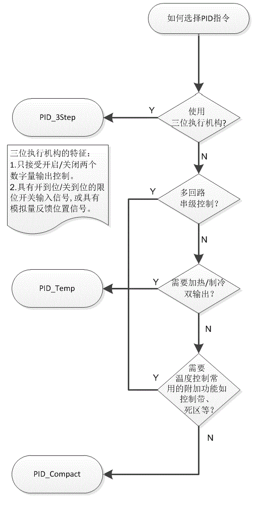

# 如何选择 PID 指令

S7-1200 PID 功能有三条指令可供选择， 分别为 

- [PID_Compact](02-PID_Compact/index.md)
- [PID_3Step](03-PID_3STEP/01-instruction.md)
- [PID_Temp](04-PID_Temp/index.md)

用户需要根据实际需求选择 PID 指令， 选择方法如下图 ：

{width="505" height="1000"}

