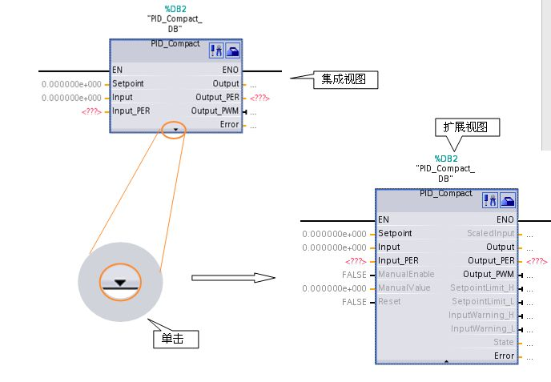
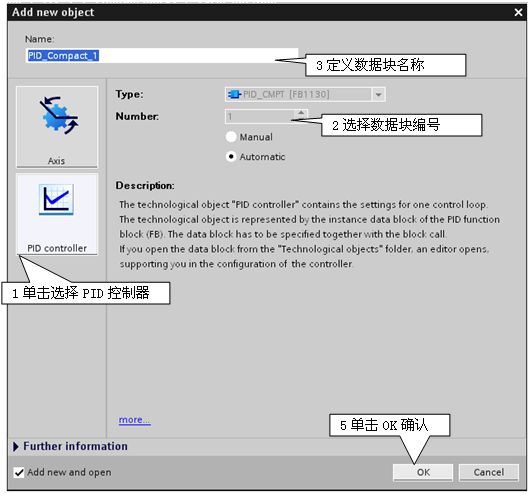
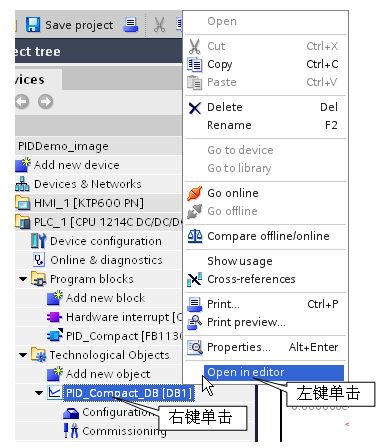

# PID 参数

## S7-1200 PID Compact V1 指令介绍

PID指令块的参数分为两部分，输入参数与输出参数，指令块的视图分为扩展视图与集成视图，在不同的视图下所能看见的参数是不一样的，在集成视图中可看到的参数为最基本的默认参数，如给定值，反馈值，输出值等定义这些参数可实现控制器最基本的控制功能，而在扩展视图中，可看到更多的相关参数，如手自动切换，高低限报警等，使用这些参数可使控制器具有更丰富的功能。如图 1

图1 PID指令块

表1 输入参数

|     |     |     |
| --- | --- | --- |
| 参数  | 数据类型 | 描述  |
| Setpoint | REAL | 自动模式下的给定值 |
| Input | REAL | 实数类型反馈值 |
| Input_PER | WORD | 整数类型反馈值，可用于连接模拟量外设输入 |
| ManualEnable | BOOL | 0到1 上升沿 = "手动模式"   1到0 下降沿 = "自动模式" |
| ManualValue | REAL | 手动模式下的输出值 |
| Reset | BOOL | 复位控制器与错误 |

  
表2 输出参数

|     |     |     |
| --- | --- | --- |
| 参数  | 数据类型 | 描述  |
| ScaledInput | REAL | 当前的输入值 |
| Output | REAL | 实数类型输出值 |
| Output_PER | WORD | 整数类型输出值 |
| Output_PWM | BOOL | PWM输出 |
| SetpointLimit_H | BOOL | 当给定值大于高限时置 |
| SetpointLimit_L | BOOL | 当给定值小于低限时置 |
| InputWarning_H | BOOL | 当反馈值超过高限报警时置 |
| InputWarning_L | BOOL | 当反馈值低于低限报警时置 |
| State | INT | 控制器状态0=Inactive,1=SUT,2=TIR,3=Automatic,4=Manual |

  
表3 State状态

|     |     |
| --- | --- |
| State状态 | 描述  |
| 0 := Inactive（未激活） | \- 第一次下载   -有错误或PLC出于停机状态   \- Reset = TRUE（复位端激活） |
| 1 :Start Up整定方式   2 :Tuning in Run整定方式 | \- 相对应的调试过程进行中 |
| 3 := Automatic Mode自动模式   4 := Manual Mode手动模式 | 0 到1 上升沿 使能 "Manual mode"（手动模式）   1到0 下降沿 使能"Automatic mode（自动模式） |

表4 错误代码

|     |     |
| --- | --- |
| 错误代号(W#32#...) | 描述  |
| 0000 0000 | 无错误. |
| 0000 0001 | 实际值超过组态限制 |
| 0000 0002 | 参数 "Input_PER" 端有非法值 |
| 0000 0004 | “运行自整定”模式中发生错误.反馈值的震荡无法被保持 |
| 0000 0008 | “启动自整定”模式发生错误. 反馈值太接近与给定值 |
| 0000 0010 | 自整定时设定值改变 |
| 0000 0020 | 在运行启动自整定模式时，PID控制器处于自动状态，此状态无法运行启动自整定 |
| 0000 0040 | “运行自整定”发生错误. |
| 0000 0080 | 输出的设定值限制未正确组态 |
| 0000 0100 | 非法参数导致自整定错误 |
| 0000 0200 | 反馈参数数据值非法   数据值超出表示范围(值小于 -1e12 或大于 1e12)   数据值格式非法 |
| 0000 0400 | 输出参数数据值非法   数据值超出表示范围(值小于 -1e12 或 大于1e12)   数据值格式非法 |
| 0000 0800 | 采样时间错误指令块被OB1调用或循环中断块的中断时间被修改了 |
| 0000 1000 | 设定值参数数据非法，数据值超出表示范围(数据值小于 -1e12 或大于 1e12)   数据值格式非法 |

## 工艺对象背景数据块

工艺对象数据块存储了控制器所有相关的参数

添加工艺对象数据块：

Project tree→Technological Objects→Add new object，在弹出的对话框中定义如图 2

图2 添加工艺对象数据块

打开工艺对象数据块：

选择Project tree→Technological Objects→PID\_Compact\_DB。如图2

图2 打开工艺对象数据块

工艺对象数据块主要分5部分：1 static 2 sBackUp 3 sPid\_Calc 4 sPid\_Cmpt 5 sRet

**1 表5 Static 参数**

|     |     |     |     |
| --- | --- | --- | --- |
| Static | 名称  | 数据类型 | 描述  |
|     | sd_VersionID | DWORD | 控制器版本(eg. 1.0.0.9) |
|     | sb_GetCycleTime | BOOL | 开始自动预估采样时间 |
|     | sb_EnCyclEstimation | BOOL | 使能预估采样时间 |
|     | sb_EnCyclMonitoring | BOOL | 使能监视采样时间 |
|     | sb_RunModeByStartup | BOOL | 在复位或上电后保持上一次状态或保持Inactive未激活状态 |
|     | si_Unit | INT | 反馈量单位 |
|     | si_Type | INT | 控制器类型 |
|     | sd_Warning | DWORD | 警示信息 |

**2 表6 sBackUp参数**

|     |     |     |     |
| --- | --- | --- | --- |
| sBackUp | 名称  | 数据类型 | 从上一次整定开始已保存的参数 |
|     | r_Gain | REAL | 已保存的增益 |
|     | r_Ti | REAL | 已保存的积分时间 |
|     | r_Td | REAL | 已保存的微分时间 |
|     | r_A | REAL | 已保存存的微分滤波系数 |
|     | r_B | REAL | 已保存的比例部分在直接/反馈路径的权重 |
|     | r_C | REAL | 已保存的微分部分在直接/反馈路径的权重 |
|     | r_Cycle | REAL | 已保存的控制器采样时间 |

**3 表7 sPid_Calc参数**

|     |     |     |     |
| --- | --- | --- | --- |
| sPid_Calc | 名称  | 数据类型 | 描述  |
|     | r_Cycle | REAL | 采样时间 |
|     | b_RunIn | BOOL | 强制在设定点运行 |
|     | b_CalcParamSUT | BOOL | 重新计算启动整定参数 |
|     | b_CalcParamTIR | BOOL | 重新计算运行整定参数 |
|     | i_CtrlTypeSUT | INT | 起始整定模式(0-CHR PID,1-CHR PI) |
|     | i_CtrlTypeTIR | INT | 运行整定模式 (0-2-A PID auto/fast/slow,3-ZN PID,4-ZN PI,5-ZN P) |

**4 表8 sPid_Cmpt参数**

|     |     |     |     |
| --- | --- | --- | --- |
| sPid_Cmpt | 名称  | 数据类型 | 描述  |
|     | r\_Sp\_Hlm | REAL | 设定值高限 |
|     | r\_Sp\_Llm | REAL | 设定值低限 |
|     | r\_Pv\_Norm\_IN\_1 | REAL | 输入量程化低限 |
|     | r\_Pv\_Norm\_IN\_2 | REAL | 输入量程化高限 |
|     | r\_Pv\_Norm\_OUT\_1 | REAL | 输出量程化低限 |
|     | r\_Pv\_Norm\_OUT\_2 | REAL | 输出量程化高限 |
|     | r\_Lmn\_Hlm | REAL | 输出高限 |
|     | r\_Lmn\_Llm | REAL | 输出低限 |
|     | b\_Input\_PER_On | BOOL | 激活从外设输入的反馈值 |
|     | b_LoadBackUp | BOOL | 回复上一次的参数备份PID参数 |
|     | b_InvCtrl | BOOL | 使能反向 |
|     | r\_Lmn\_Pwm_PPTm | REAL | PWM 最小开时间 |
|     | r\_Lmn\_Pwm_PBTm | REAL | PWM 最小关时间 |
|     | r\_Pv\_Hlm | REAL | 反馈高限 |
|     | r\_Pv\_Llm | REAL | 反馈低限 |
|     | r\_Pv\_HWrn | REAL | 反馈报警高限 |
|     | r\_Pv\_LWrn | REAL | 反馈报警低限 |

**5 表9 sRet参数**

|     |     |     |     |
| --- | --- | --- | --- |
| sRet | 名称  | 数据类型 | 描述  |
|     | i_Mode | INT | 设置控制器模式 (0=Inactive（未激活）,1=SUT（启动整定模式）,2=TIR（运行整定模式）,3=Automatic（自动模式）,4=Hand（手动模式） |
|     | r\_Ctrl\_Gain | REAL | 当前增益 |
|     | r\_Ctrl\_Ti | REAL | 当前积分时间 |
|     | r\_Ctrl\_Td | REAL | 当前微分时间 |
|     | r\_Ctrl\_A | REAL | 当前微分部分滤波系数 |
|     | r\_Ctrl\_B | REAL | 在直接反馈路径中的比例加权 |
|     | r\_Ctrl\_C | REAL | 在直接反馈路径中的微分加权 |
|     | r\_Ctrl\_Cycle | REAL | 当前采样时间 |