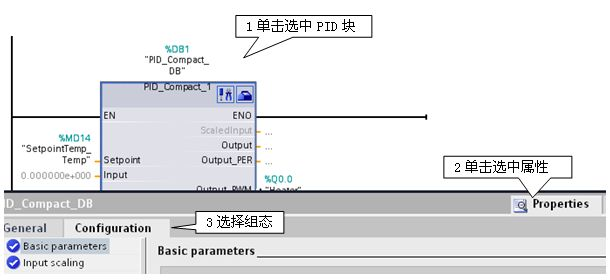
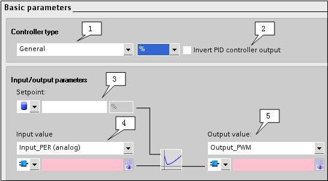
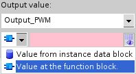
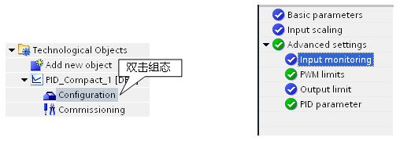
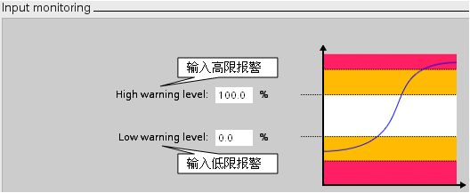
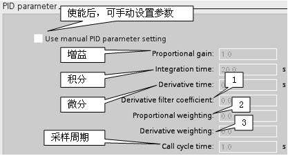

# PID Compact V1 组态步骤

在使用PID控制器前需要对其进行组态设置，共分为基本参数组态与高级参数组态两部分。

## 基本参数组态

在进行基本参数组态前，需要先添加循环中断，并在循环中断中添加PID_Compact指令块。

在循环中断块中，点击PID指令块，选择属性，选择组态，可进入基本参数组态，定义控制器的输入输出，给定值等参数，如图1所示。\
{width="610" height="280"}\

图1 进入参数组态\

PID基本参数组态如图2所示。

{width="546" height="301"}\

图2 PID基本参数组态\
\
1 Controller
Type(控制器类型)：这里可选择控制对象的类型，如温度控制器，压力控制器，默认为以百分比为单位的通用控制器，这里的选择会影响后面参数的单位，但不会影响控制器的P，I，D数值。\
2 激活此选项会使控制器变为反作用PID，如应用在降温系统中。\
3 Setpoint（给定值）：自动模式下的给定值。\
点击下拉列表，可定义控制器给定值源\
\
{width="199" height="82"}\
\
图3 给定值源选择

Value from instance data block:给定值来自背景数据块。\
Value at the function block：给定值来自功能块。

4 Input Value（反馈值） ：\
{width="199" height="72"}\

图4 反馈值类型选择

Input_PER(analog)：使用外设模拟量输入。\
Input：使用从用户程序而来的反馈值。

{width="201" height="111"}\
\
图5 反馈值源选择

Value from instance data block：反馈值来自从背景数据块。\
Value at the function block：反馈值来自功能块。

5 Output Value（输出值）：\
{width="197" height="88"}\

图6 输出值类型选择

Output_PER:模拟量输出形式。\
Output：输出至用户程序。\
Output_PWM：使用PWM输出。\

{width="198" height="108"}

图7 输出值源选择

Value from instance data block：输出值来自从背景数据块。\
Value at the function block：输出值来自功能块。\
\

进入Project tree（项目树）→Technological Objects(工艺对象)
→PID_Compact_1\[DB1\] →Configuration，如图8

{width="508" height="180"}

图8 进入基本参数组态

反馈值量程化组态如图9

{width="534" height="308"}\
\
图9 反馈值量程化组态

此界面用于量程化输入值\
1与6为一组，用于配置输入量程上限，1为物理量的实际最大值，6为模拟量输入的最大值\
4与5为一组，用于配置输入量程下限，4为物理量的实际最小值，5为模拟量输入的最小值\
2与3分别为用户设置的高低限制，当反馈值达到高限或低限时，系统将停止PID的输出。\

## 高级参数组态

Input monitoring输入监控组态如图10。

{width="528" height="217"}\
\
图10 输入监控\
\
当反馈值达到高限或低限时，PID指令块会给出相应的报警位。

PWM limits组态如图11。

{width="353" height="98"}

图11 PWM Limits\
1为PWM输出时，一个脉冲周期内最小接通时间。\
2为PWM输出时，一个脉冲周期内最小关断时间。

PID parameter（PID参数)组态如图12。

{width="417" height="226"}\
\
图12 PID参数

1：微分滤波系数：即微分环节的延迟时间，可在D值不变的情况下，用于降低控制器对高频干扰的敏感度

2：比例权重：即设定值进入比例环节的比重，可在P值不变的情况下，用于减少系统设定值阶跃引起的超调

3：微分权重：即设定值进入微分环节的比重，
可在D值不变的情况下，用于抑制系统在设定值阶跃时引起的输出突变
