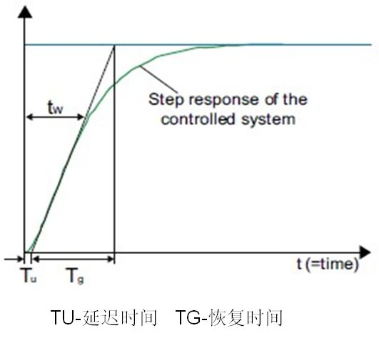
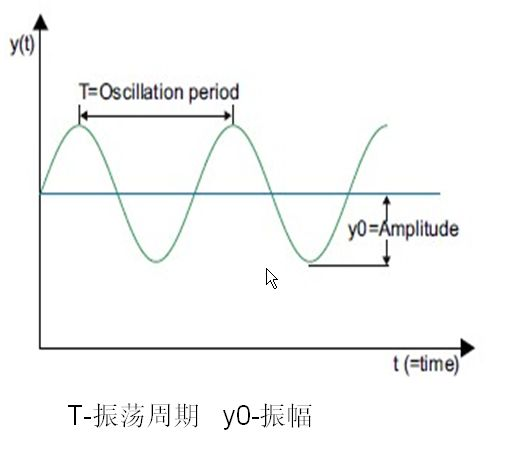
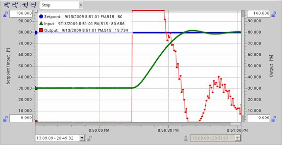
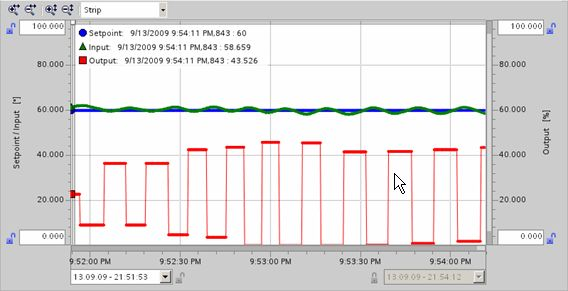
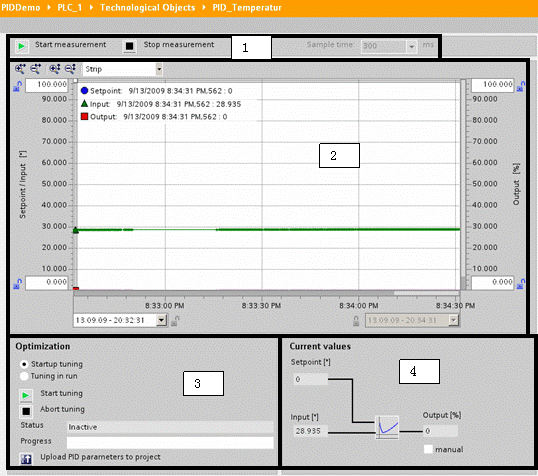
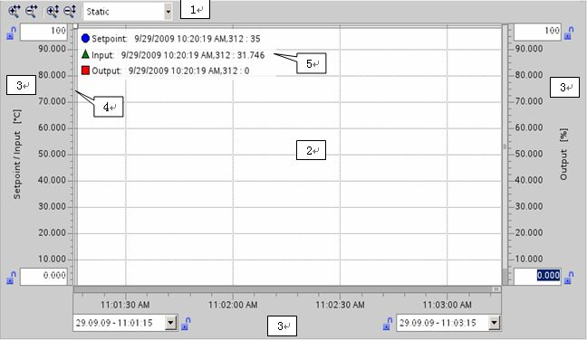
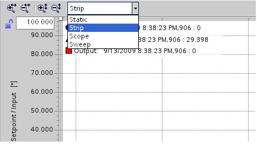
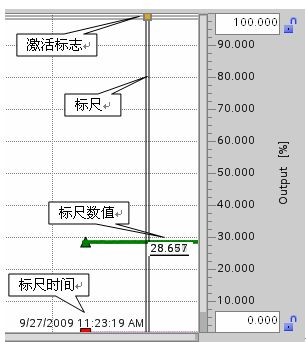
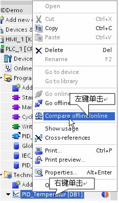
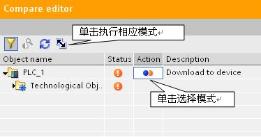

# PID 自整定

PID控制器能够正常运行，需要符合实际运行系统及工艺要求的参数设置，但由于每套系统都不完全一样，所以，每套系统的控制参数也不相同，用户可自己手动调试，通过参数访问方式，修改对应的PID参数，在调试面板中观察曲线图。也可使用系统提供的参数自整定功能，PID自整定是按照一定的数学算法，通过外部输入信号，激励系统，并根据系统的反应方式，来确定PID参数。S7-1200
提供了两种整定方式。启动自整定与运行中自整定。

## Start Up（启动自整定）

整定算法将定义阶跃响应的时间常数，并在拐点处应用正切计算，得到TU,
TG,控制器将依据这些参数等到优化后的P,I,D等参数。

{width="531" height="481"}

图1. 启动自整定

## **应用条件：**

①\| 设定值 -- 反馈值 \| \> 0.3 \* \| 输入高限 -- 输入低限 \|\
②\| 设定值 -- 反馈值 \| \> 0.5 \* \| 给定值 \|\
③指令块的状态应为"Manual Mode"（手动模式） 或 "Inactive
Mode"（未激活模式）\
\
**参数设置：**\
\
可通过参数访问的模式打开工艺对象数据块，选择参数"sPid_Calc.i_CtrlTypeSUT"。用于启动自整定时选择PID或PI控制器。CHR为Chien,
Hrones and Reswick的缩写，一种整定算法。\
sPid_Calc.i_CtrlTypeSUT:启动自整定模式选择\
0=CHR PID\
1=CHR PI

## Tune in Run（运行中整定）

优化算法会逐渐增大比例系数，直到被控量开始振荡

{width="507" height="450"}

图2. 运行自整定

## **应用条件**

①"PID_Compact" 指令块必须在 "Manual Mode"（手动模式）, "Inactive Mode"
（未激活模式）或 "Automatic Mode"（自动模式）\
②假如执行时满足Start Up（启动自整定)的条件，则会先执行Start
Up（启动自整定)，结束后再执行Tune In
Run（运行中整定），若不满足启动整定的条件则进入运行中整定\
\|③\
设定值 -- 反馈值 \| \< 0.3 \* \| 输入高限 -- 输入低限 \|\
\|设定值 -- 反馈值 \| \> 0.5 \* \| 给定值 \|\

**参数设置**

可通过参数访问的模式打开工艺对象数据块，选择参数
"sPid_Calc.i_CtrlTypeTIR"用于运行整定时选择算法。A
(高级PID整定)算法，此算法可选择系统响应速度auto(自动)，fast（快速），slow（慢速）；ZN算法，ZN为Ziegler
Nichols缩写。其中ZN算法又可分为PID,PI,P三种整定类型。\
sPid_Calc.i_CtrlTypeTIR:运行自整定模式选择\
\
0=A PID auto\
1=A PID fast\
2=A PID slow\
3=ZN PID\
4=ZN PI\
5 ZN P

**实际整定效果：**

启动自整定

{width="570" height="294"}

图3. 启动自整定曲线图

运行中自整定

{width="568" height="291"}

图4. 运行自整定曲线图

## 调试面板说明

### 调试面板结构

{width="538" height="476"} 

图5. 调节面板

1\. 调试面板控制区\
\
Start measurement（启动测量功能）\
Stop measurement（停止测量功能）\
Sample Time（采样时间）：这里指调试面板测量功能的采样时间。\
\
2. 趋势显示\
\
此区以曲线方式显示设定值，反馈值及输出值。\
\
3. 优化区\
\
此区用于选择整定方式及显示整定状态。\
Startup Tuning（启动整定方式）\
Tuning in run（运行中整定方式）\
Start Tuning（使能整定）\
Abort Tuning（退出整定）\
Staus（状态）\
Process（整定进程）\
Upload PID parameters to
project（上载参数到项目）：将已整定好的PID参数从CPU上载到项目。\
\
4. 当前值显示\
\
用户在此区域可监视给定，反馈，输出值，并可手动强制输出值，点击Manual前的方框，用户就可在Output栏内入百分比形式的输出值

### 趋势显示面板

趋势显示面板使用说明\
\
{width="648" height="376"}

图6. 趋势显示面板\
\
1. 显示模式的选择\
\
2. 趋势视图\
\
3. 移动和缩放轴的区域\
\
4. 标尺\
\
5. 在标尺中的趋势值：Setpoint（给定值），Input（反馈值），Output(输出值)

显示模式可在如图..所示中点击下拉菜单进行选择

{width="435" height="244"}

图7. 显示模式选择

Strip：条状 (连续显示)

新趋势值从右侧输入视图，以前的视图卷动到左侧，时间轴不移动。

Scope：示波图 (跳跃区域显示)

新趋势的值从左到右进行输入，当到达右边趋势视图，监视区域移动一个视图宽度到右侧
时间轴在监视区域限制内可以移动。

Sweep：扫动 (旋转显示)

新的趋势值以旋转方式在趋势图中显示，趋势的值从左到右输出，上一次旋转显示被覆盖，时间轴不动。

Static：静态 (静态区域显示)

趋势的写入被中断，新趋势的记录在背景中执行，时间轴移动横整个以前的记录时期。

### 使用标尺

使用一个或多个标尺分析趋势曲线的离散值。\
移动鼠标到趋势区域的左边并注意鼠标指示的变化，拖动垂直的标尺到需要分析的测量的趋势。趋势输出在标尺的左侧，标尺的时间显示在标尺的底端。激活标尺的趋势值显示在测量值与标尺交点处。如果多个标尺拖动到趋势区域，各自的上一个标尺被激活。激活的标尺由相应颜色符号显示，通过点击可以重新激活一个停滞的标尺。使用快捷键
ALT+点击移出不需要的标尺，如图8。

{width="306" height="342"}

图8. 标尺

## 上传参数

由于自整定过程是在 CPU
内部进行的，整定后的参数并不在项目中，所以需要上传参数到项目。点击调试面板下部的"Upload
PID parameters to project"按钮，将参数上传到项目。

{width="409" height="208"}

图9. 上传参数\
\
上传参数时要保证软件与CPU之间的在线连接，并且调试模板要在测量模式，即能实时监控状态值，点击上传按钮后，PID工艺对象数据块会显示与CPU中的值不一致，因为此时项目中工艺对象数据块的初始值与CPU中的不一致，可将此块重新下载，右键单击弹出菜单，选择在线比较，进入在线比较编辑器，将模式设为"Download
to device（下载到设备）"，点击执行，完成参数同步，如图10。\
\
{width="233"
height="398"}{width="374" height="197"}

图10. 下载参数到设备
