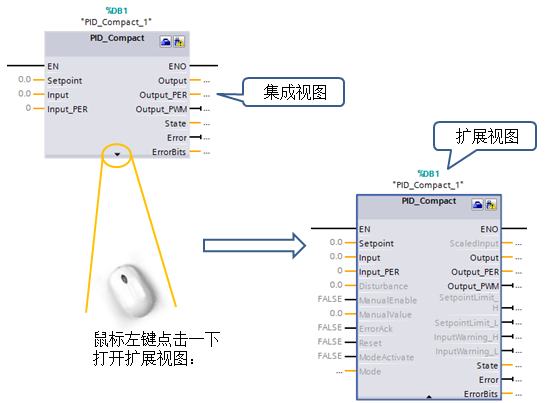

# PID Compact V2 参数

PID 指令块的参数分为两部分，输入参数与输出参数。其指令块的视图分为扩展视图与集成视图，在不同的视图下所能看见的参数是不一样的，在集成视图中可看到的参数为最基本的默认参数，如给定值，反馈值，输出值等。定义这些参数可实现控制器最基本的控制功能，而在扩展视图中，可看到更多的相关参数，如手自动切换，模式切换等，使用这些参数可使控制器具有更丰富的功能。如图 1 所示：  
  
图1、PID 指令块的集成视图和扩展视图

## **PID Compact** 输入输出参数介绍

PID_Compact V2 的输入参数包括 PID 的设定值，过程值，手自动切换，故障确认，模式切换和 PID 重启参数，如表 1 所示：

表1.输入参数

|     |     |     |
| --- | --- | --- |
| **参数** | **数据类型** | **说明** |
| Setpoint | REAL | PID 控制器在自动模式下的设定值 |
| Input | REAL | PID 控制器的反馈值（工程量） |
| Input_PER | INT | PID 控制器的反馈值（模拟量） |
| Disturbance | REAL | 扰动变量或预控制值。 |
| ManualEnable | BOOL | 出现 FALSE -> TRUE 上升沿时会激活“手动模式”，与当前 Mode 的数值无关。   当 ManualEnable = TRUE，无法通过 ModeActivate 的上升沿或使用调试对话框来更改工作模式。   出现 TRUE -> FALSE 下降沿时会激活由 Mode 指定的工作模式。 |
| ManualValue | REAL | 用作手动模式下的 PID 输出值，须满足 Config.OutputLowerLimit < ManualValue < Config.OutputUpperLimit 。 |
| ErrorAck | BOOL | FALSE -> TRUE 上升沿时，错误确认，清除已经离开的错误信息。 |
| Reset | BOOL | 重新启动控制器：   FALSE -> TRUE 上升沿， 切换到“未激活”模式，同时复位 ErrorBits 和 Warnings，清除积分作用（保留 PID 参数） 。   只要 Reset = TRUE，PID_Compact 便会保持在“未激活”模式下 (State = 0)。   TRUE -> FALSE 下降沿，PID_Compact 将切换到保存在 Mode 参数中的工作模式。 |
| ModeActivate | BOOL | FALSE -> TRUE 上升沿，PID_Compact 将切换到保存在 Mode 参数中的工作模式。 |

 **注意：如果使用 Reset 复位错误会重启 PID 控制器，建议使用 ErrorAck 来复位错误代码。**

PID_Compact V2 的输出参数包括 PID 的输出值（REAL、模拟量、PWM），标定的过程值，限位报警（设定值、过程值），PID 的当前工作模式，错误状态及错误代码，如表 2 所示：

表2.输出参数

|     |     |     |
| --- | --- | --- |
| **参数** | **数据类型** | **说明** |
| ScaledInput | REAL | 标定的过程值 |
| Output | REAL | PID 的输出值 （REAL 形式） |
| Output_PER | INT | PID 的输出值（模拟量） |
| Output_PWM | BOOL | PID 的输出值（脉宽调制） |
| SetpointLimit_H | BOOL | 如果 SetpointLimit_H = TRUE，则说明达到了设定值的绝对上限 (Setpoint ≥ Config.SetpointUpperLimit)。 |
| SetpointLimit_L | BOOL | 如果 SetpointLimit_L = TRUE，则说明已达到设定值的绝对下限 (Setpoint ≤ Config.SetpointLowerLimit)。 |
| InputWarning_H | BOOL | 如果 InputWarning_H = TRUE，则说明过程值已达到或超出警告上限。 |
| InputWarning_L | BOOL | 如果 InputWarning_L = TRUE，则说明过程值已达到或低于警告下限。 |
| State | INT | State 参数显示了 PID 控制器的当前工作模式。 可使用输入参数 Mode 和 ModeActivate 处的上升沿更改工作模式:   State = 0：未激活   State = 1：预调节   State = 2：精确调节   State = 3：自动模式   State = 4：手动模式   State = 5：带错误监视的替代输出值 |
| Error | BOOL | 如果 Error = TRUE，则此周期内至少有一条错误消息处于未决状态。 |
| ErrorBits | DWORD | ErrorBits 参数显示了处于未决状态的错误消息。通过 Reset 或 ErrorAck 的上升沿来保持并复位 ErrorBits。 |

 **注意：**

**1.若 PID 控制器未正常工作，请先检查 PID 的输出状态 State 来判断 PID 的当前工作模式，并检查错误信息。** 
 
**2.当错误出现时 Error=1，错误离开后 Error=0，ErrorBits 会保留错误信息。可通过编程清除错误离开后 ErrorBits 保留的错误信息。**

PID\_Compact V2 的输入输出参数 Mode 指定了 PID\_Compact 将转换到的工作模式，具有断电保持特性，由沿激活切换工作模式，如表 3 所示：

表3.输入输出参数

|     |     |     |
| --- | --- | --- |
| **参数** | **数据类型** | **说明** |
| Mode | INT | 在 Mode 上，指定 PID_Compact 将转换到的工作模式:   State = 0：未激活   State = 1：预调节   State = 2：精确调节   State = 3：自动模式   State = 4：手动模式   工作模式由以下沿激活：   ModeActivate 的上升沿   Reset 的下降沿   ManualEnable 的下降沿   如果 RunModeByStartup = TRUE，则冷启动 CPU |

 **注意：当 ManualEnable = TRUE，无法通过 ModeActivate 的上升沿或使用调试对话框来更改工作模式。**

当PID出现错误时，通过捕捉 Error 的上升沿，将 ErrorBits 传送至全局地址，从而获得 PID 的错误信息，如表 4 所示。

表4.错误代码定义

|     |     |
| --- | --- |
| **错误代码   （DW#16#----）** | **说明** |
| 0000 | 没有任何错误 |
| 0001 | 参数 “Input” 超出了过程值限值的范围，正常范围应为 Config.InputLowerLimit < Input < Config.InputUpperLimit 。 |
| 0002 | 参数 “Input_PER” 的值无效。 请检查模拟量输入是否有处于未决状态的错误。 |
| 0004 | 精确调节期间出错。 过程值无法保持振荡状态。 |
| 0008 | 预调节启动时出错。 过程值过于接近设定值。 启动精确调节。 |
| 0010 | 调节期间设定值发生更改。可在 CancelTuningLevel 变量中设置允许的设定值波动。 |
| 0020 | 精确调节期间不允许预调节。 |
| 0080 | 预调节期间出错。 输出值限值的组态不正确，请检查输出值的限值是否已正确组态及其是否匹配控制逻辑。 |
| 0100 | 精确调节期间的错误导致生成无效参数。 |
| 0200 | 参数 “Input” 的值无效： 值的数字格式无效。 |
| 0400 | 输出值计算失败。 请检查 PID 参数。 |
| 0800 | 采样时间错误： 循环中断 OB 的采样时间内没有调用 PID_Compact。 |
| 1000 | 参数 “Setpoint” 的值无效，值的数字格式无效。 |
| 10000 | ManualValue 参数的值无效，值的数字格式无效。 |
| 20000 | 变量 SubstituteOutput 的值无效，值的数字格式无效。这时，PID_Compact 使用输出值下限作为输出值。 |
| 40000 | Disturbance 参数的值无效，值的数字格式无效。 |

 **注意：如果多个错误同时处于待决状态，将通过二进制加法显示 ErrorBits 的值。 例如，显示 ErrorBits = 0003h 表示错误 0001h 和 0002h 同时处于待决状态。**