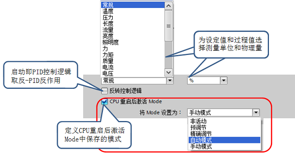

# PID Compact V2 组态

使用 PID 功能，必须先添加循环中断，**需要在循环中断中添加 PID_Compact 指令。**在循环中断的属性中，可以修改其循环时间。  
  
图1.添加循环中断后在属性界面修改其循环时间

因为程序执行的扫描周期不相同，一定要在循环中断里调用 PID 指令。  
**注意：为保证以恒定的采样时间间隔执行 PID 指令，必须在循环 OB 中调用。**

在“指令 > 工艺 \> PID 控制 > Compact PID（注意版本选择） > PID\_Compact”下，将 PID\_Compact 指令添加至循环中断。  
  
图2.在循环中断中添加 PID_Compact 指令

当添加完 PID\_Compact 指令后，在项目树 > 工艺对象文件夹中，会自动关联出 PID\_Compact_x\[DBx\]，包含其组态界面和调试功能。  
  
图3.工艺对象中关联生成 PID_Compact

使用 PID 控制器前，需要对其进行组态设置，分为基本设置、过程值设置、高级设置等部分。  
  
图4.PID_Compact 组态界面

## 基本设置

**1、基本设置--控制器类型**  
a. 为设定值、过程值和扰动变量选择物理量和测量单位。  
b. 正作用：随着 PID 控制器的偏差增大，输出值增大。 反作用：随着PID控制器的偏差增大，输出值减小。PID_Compact 反作用时，可以勾选“反转控制逻辑”；或者用负比例增益。  
c. 要在 CPU 重启后切换到“模式”(Mode) 参数中保存的工作模式，请勾选“在 CPU 重启后激活模式”。  
  
图5\. PID_Compact > 基本设置 > 控制器类型

**2、基本设置--定义 Input/Output 参数**  
定义 PID 过程值和输出值的内容，选择 PID_Compact 输入、输出变量的引脚和数据类型。  
  
图6\. PID_Compact > 基本设置 > 定义 Input/Output

## 过程值设置

**1、过程值设置--过程值限值**  
必须满足过程值下限<过程值上限。如果过程值超出限值，就会出现错误 (ErrorBits = 0001h)。  
  
图7\. 设置过程值限值

**2、过程值设置--过程值标定**  
a. 当且仅当在 Input/Output 中输入选择为 “Input_PER” 时，才可组态过程值标定。  
b. 如果过程值与模拟量输入值成正比，则将使用上下限值对来标定 Input_PER。  
c. 必须满足范围的下限<上限。  
   
图8\. 进行过程值标定

## **高级设置**

**1、高级设置--过程值监视**  
a. 过程值的监视限值范围需要在过程值限值范围之内。  
b. 过程值超过监视限值，会输出警告。过程值超过过程值限值，PID输出报错，切换工作模式。  
  
图9.设置过程监控值设置，与过程值限对比

**2、高级设置-- PWM 限制**  
输出参数 Output 中的值被转换为一个脉冲序列，该序列通过脉宽调制在输出参数 Output\_PWM 中输出。在 PID 算法采样时间内计算 Output，在采样时间 PID\_Compact 内输出 Output_PWM。  
  
图10.PID_Compact 的 PWM 输出原理

a. 为最大程度地减小工作频率并节省执行器，可延长最短开/关时间。  
b. 如果要使用 “Output” 或 “Output_PER”，则必须分别为最短开关时间组态值 0.0。  
c. 脉冲或中断时间永远不会小于最短开关时间。例如，在当前 PID 算法采样周期中，如果输出小于最短接通时间将不输出脉冲，如果输出大于（PID 算法采样时间-最短关闭时间） 则整个周期输出高电平。  
d. 在当前 PID 算法采样周期中，因小于最短接通时间未能输出脉冲的，会在下一个 PID 算法采样周期中累加和补偿由此引起的误差。  
**最短开/关时间只影响输出参数 Output_PWM，不用于 CPU 中集成的任何脉冲发生器。**

示例：PID\_Compact 采样时间=100ms；PID 算法采样时间=1000ms；最短开启时间=200 ms（即已组态的最小接通脉冲为 PID\_Compact 的 20%），若此时 PID 输出恒定为 15%。  
则在第一个周期内不输出脉冲，在第二个周期内将第一个周期内未输出的脉冲累加到第二个周期的脉冲，依次输出。如图 11 所示。  
  
图11.PWM 最小开/关时间影响示例图

**3、高级设置--输出值限值**  
a. 在“输出值的限值”窗口中，以百分比形式组态输出值的限值。 无论是在手动模式还是自动模式下，都不要超过输出值的限值。  
b. 手动模式下的设定值 ManualValue，必须介于输出值的下限 （Config.OutputLowerLimit） 与输出值的上限 （ Config.OutputUpperLimit ）之间的值。  
c. 如果在手动模式下指定了一个超出限值范围的输出值，则 CPU 会将有效值限制为组态的限值。  
d. PID\_compact 可以通过组态界面中输出值的上限和下限修改限值。最广范围为 -100.0 到 100.0，如果采用 Output\_PWM 输出时限制为 0.0 到 100.0 。  
  
图12.过程监控值设置和过程值限对比

**4、高级设置--对错误的响应**  
a. 在 PID Compact V1 时，如果 PID 控制器出现错误，PID 会自动切换到“未激活”模式。在 PID_Compact V2 时，可以预先设置错误响应时 PID 的输出状态，如图 13 所示。以便在发生错误时，控制器在大多数情况下均可保持激活状态。  
b. 如果控制器频繁发生错误，建议检查 Errorbits 参数并消除错误原因。  
  
图13.PID 组态高级设置_对错误的响应

根据错误代码来分析错误原因。根据组态界面所设置的“对错误的响应”，不同错误的响应状态也不一样，如下表所示：

|     |     |     |     |
| --- | --- | --- | --- |
|     | **非活动** | **错误待定时的当前值** | **错误未决时的替代输出值** |
| 0001H   0800H   40000H | 对于所有错误，PID 均输出 0.0，Error=1，会切换到 “未激活”模式（State=0）。     当错误离开后，可通过 Reset 的下降沿或者 ModeActive 的上升沿来切换工作模式。 | 自动模式下出现错误 PID Compact 仍保持自动模式（State=3），Error=1，输出错误发生前的最后一个有效值。错误离开后 Error=0、错误代码保留、PID_Compact 从自动模式开始运行。 |  / |
| 0002H   0200H   0400H   1000H | |  / | 自动模式下出现错误 PID Compact 切换到“带错误监视的替代输出值”模式（State=5），Error=1，输出组态的替换输出值。错误离开后 Error=0、错误代码保留、PID_Compact 从自动模式开始运行。 |
| 0004H   0008H   0010H   0080H   0100H | |在调节过程中出现错误时，PID_Compact 取消调节模式，直接切换到Mode 参数中保存的工作模式运行。 |   / |
| 0020H | |精确调节期间无法再启动预调节，则 PID_Compact 的 Error=1、State 保持不变，即保持在精确调节模式。 |   / |
| 10000H | |手动模式下发生错误则继续使用手动值作为输出，Error=1、State 保持不变。 | 如果手动值无效（10000H）则输出组态的替换输出值。当 ManualValue 中指定有效值后，则 Error=0、PID_Compact 便会将其作为输出值。 |
| 20000H ||   / | 自动模式下发生错误需要输出替代值时，如果替代输出值无效则 PID Compact 切换到“带错误监视的替代输出值”模式（State=5），并输出输出值的下限。 错误离开后 PID_Compact 切换回自动模式。 |

**5、高级设置--手动输入 PID 参数**  
a. 在 PID Compact 组态界面可以修改 PID 参数，通过此处修改的参数对应工艺对象背景数据块 > Static > Retain > PID 参数。  
b. 通过组态界面修改参数需要重新下载组态并重启 PLC。建议直接对工艺对象背景数据块进行操作。  
  
图14.PID 组态高级设置_手动输入 PID 参数

[具体应用“在PID Compact组态界面里手动输入PID参数，为什么重新下载后新的参数不起作用？”](04-FAQ.md)

## **工艺对象背景数据块**

PID Compact 指令的背景数据块属于工艺对象数据块，打开方式：选择项目树 > 工艺对象 > PID\_Compact\_x\[DBy\]，操作步骤如图所示：  
  
图15.打开 PID Compact 工艺对象数据块

工艺对象数据块主要分10 部分：1-Input，2-Output，3-Inout，4-Static，5-Config，6-CycleTime，7-CtrlParamsBackUp，8-PIDSelfTune，9-PIDCtrl，10-Retain.其中1,2,3 这部分参数在 PID_Compact 指令中有参数引脚。  
工艺对象数据块的属性为优化的块访问，即以符号进行寻址。

常用的 PID 参数：比例增益、积分时间、微分时间，见工艺对象数据块 > Static > Retain 中，如图所示：  
  
图16.PIC Compact 工艺对象数据块中的 PID 参数

## **工艺对象背景数据块**的常见问题

通过触摸屏或第三方设备，如何设置 PID Compact 的参数：如比例增益、积分时间、微分时间？

第三方上位机或触摸屏，多数不能直接访问 S7-1200 中符号寻址的变量。这种情况下，可以使用绝对地址的变量与 PID_Compact 工艺对象数据块中的增益、积分、微分的变量之间做数据传送。只需要在第三方设备的用户画面中，访问对应的绝对地址变量即可。PID 参数修改后实时生效，不需要重启 PID 控制器和 PLC。如图 17 所示：

1.触摸屏访问的变量是绝对地址寻址，工艺对象背景数据块里对应变量是符号寻址。  
2.设置绝对地址变量的保持性，实现断电数据保持。  
3.通过指令实现绝对地址与符号地址变量的数据传送。

  
图17.第三方设备访问并设置 PID 增益积分微分