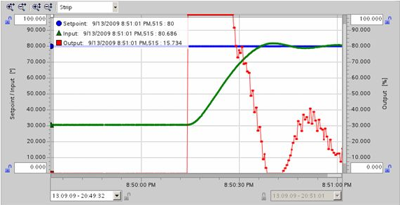
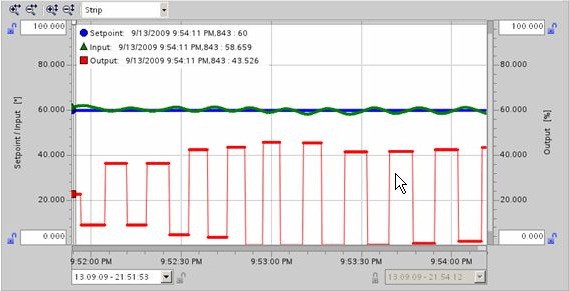
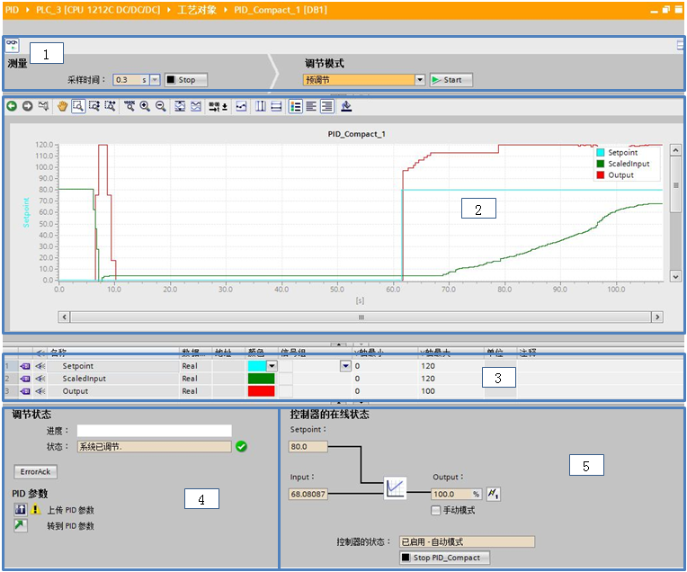
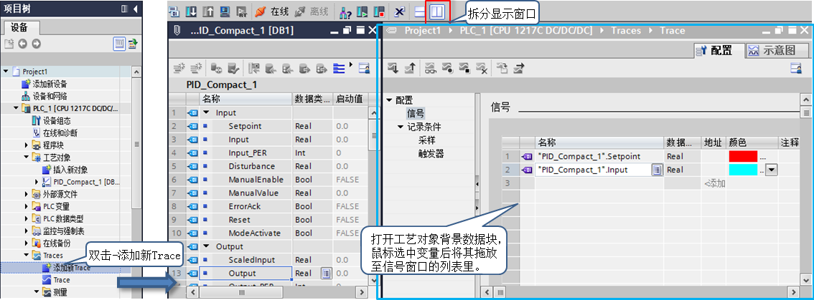

# PID Compact V2 自整定

PID 控制器能否正常运行，需要符合实际运行系统及工艺要求的参数设置。由于每套系统都不完全一样，所以，每套系统的控制参数也不相同。用户可通过参数访问方式手动调试，在调试面板中观察曲线图后修改对应的 PID 参数。也可使用系统提供的参数自整定功能，PID 自整定是按照一定的数学算法，通过外部输入信号，激励系统，并根据系统的反应方式来确定 PID 参数。

**S7-1200 PID 不支持仿真功能。S7-1200 提供了两种整定方式，预调节、精确调节。**可在执行预调节和精确调节时获得最佳 PID 参数。

## **预调节**

预调节功能可确定对输出值跳变的过程响应，并搜索拐点。根据受控系统的最大上升速率与时间计算 PID 参数。过程值越稳定，PID 参数就越容易计算，结果的精度也会越高。只要过程值的上升速率明显高于噪声，就可以容忍过程值的噪声。最可能的情况是处于工作模式“未激活”和“手动模式”下。 重新计算前会备份 PID 参数。

启动预调节的必要条件：

* 已在循环中断 OB 中调用 “PID_Compact” 指令。
* ManualEnable = FALSE 且 Reset = FALSE
* PID_Compact 处于下列模式之一：“未激活”、“手动模式”或“自动模式”。
* 设定值和过程值均处于组态的限值范围内。
* | 设定值 – 过程值 | \> 0.3 * | 过程值上限 – 过程值下限 |
* | 设定值 – 过程值 | \> 0.5 * | 设定值 |

**预调节：利用输出值的跳变启动预调节过程**

  
图1\. 启动自整定曲线图

如果执行预调节时未产生错误消息，则 PID 参数已调节完毕。PID\_Compact 将切换到自动模式并使用已调节的参数。在电源关闭以及重启 CPU 期间，已调节的 PID 参数保持不变。如果无法实现预调节，PID\_Compact 将切换到“**未激活**”模式。

## 精确调节

精确调节将使过程值出现恒定受限的振荡。将根据此振荡的幅度和频率为操作点调节 PID 参数。 所有 PID 参数都根据结果重新计算。精确调节得出的 PID 参数通常比预调节得出的 PID 参数具有更好的主控和扰动特性。PID_Compact 将自动尝试生成大于过程值噪声的振荡。 过程值的稳定性对精确调节的影响非常小。 重新计算前会备份 PID 参数。  
  
启动精确调节的必要条件：

* 已在循环中断 OB 中调用 “PID_Compact” 指令。
* ManualEnable = FALSE 且 Reset = FALSE
* PID_Compact 处于下列模式之一：“未激活”、“手动模式”或“自动模式”。
* 设定值和过程值均处于组态的限值范围内。
* 在操作点处，控制回路已稳定。过程值与设定值一致时，表明到达了操作点。
* 不能被干扰。|

**精确调节：在稳定状态下，将围绕过程值的操作点生成恒定受限的振荡**

  
图2\. 运行自整定曲线图

可以在“未激活”、“自动”或“手动”模式下启动精确调节。 如果希望通过控制器调节来改进现有 PID 参数，建议**自动模式**下启动精确调节。  
如果已执行精确调节且没有错误，则 PID 参数已得到优化。 PID\_Compact 切换到自动模式，并使用优化的参数。 在电源关闭以及重启 CPU 期间，优化的 PID 参数保持不变。 如果“精确调节”期间出错，PID\_Compact 将切换到“**未激活**”模式。

## **PID Compact V2 调试面板**

通过路径：项目树 \> PLC 项目 > 工艺对象 > PID_Compact > 调试打开整定界面，如图 3 所示：

  
图3.PID Compact 调试面板

1.采样时间：选择调试面板测量功能的采样时间；启动：激活 PID Compact 趋势采集功能。调节模式：选择整定方式；启动：激活调节模式。  
2.实时趋势图显示：以曲线方式显示 Setpoint（给定值），Input（反馈值），Output (输出值)。  
3.标尺：更改趋势中曲线颜色和标尺中的最大/最小值。  
4.调节状态：显示进度条与调节状态。当调节完成后，整定出的参数会实时更新至工艺对象背景数据块 > Retain > PID 参数中。  
a. ErrorAck：确认警告和错误，点击时 ErrorAck=Ture，释放时 ErrorAck=False。  
b. 上传 PID 参数：将调节出的参数更新至初始值  
c. 转到 PID 参数：转换到组态界面 > 高级设置 > PID 参数  
d. 若当进度条达或控制器调节功能看似受阻时，请单击“调节模式”中（上图部分 1）的 “Stop” 图标。检查工艺对象的组态，必要时请重新启动控制器调节功能。  
5.可监视给定，反馈，输出值的在线状态，并可手动强制输出值。Stop PID_Compact：禁用 PID 控制器至非活动状态。

上传参数时要保证软件与 CPU 之间的在线连接，并且调试模板要在测量模式，即能实时监控状态值，点击上传按钮后，PID 工艺对象数据块会显示与 CPU 中的值不一致，因为此时项目中工艺对象数据块的初始值与 CPU 中的不一致，可将此块重新下载。

## **PID Compact V2 调试的常见问题**

如何观察 PID 控制器的运行趋势？

**1.使用博途软件的 Traces 功能**  
a. 建立 Trace 轨迹，在项目树 > Traces > 添加新 Trace  
b. Trace > 配置窗口 > 信号 > 添加变量，窗口拆分显示后使用拖放操作添加“信号”  
c. 设置采样时间和触发记录的模式，具体操作请参见本书 Traces 功能介绍

  
图4.Trace配置界面添加监控变量

**2.使用 PID 调试面板**  
a. 调试面板可以启动预调节和精确调节，并观察 PID 控制器参数的运行曲线。  
b. 若不启动调节功能，仅启用在线测量功能，仍然可以观察运行曲线，但不可直接记录导出测量曲线。  
c. 在实时趋势图显示界面，鼠标右键点击 > 添加曲线至轨迹 > 测量中，即 Traces 功能。

**3.连接给定、反馈、输出值的变量至上位机等软件，采用上位机等的趋势功能进行采集。**