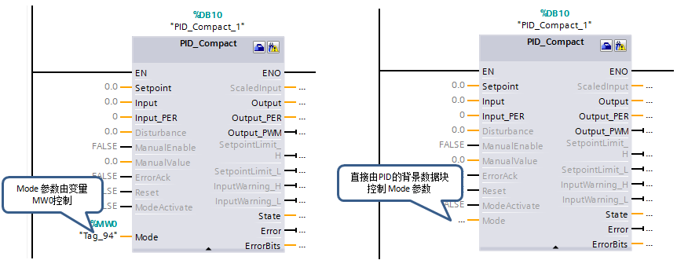

# PID Compact V2 常见问题

**S7-1200 的 PID 功能支持仿真吗？**

S7-1200 固件版本 V4.0 以上，TIA V13 SP1 以上，使用 S7-PLCSIM V13 SP1 可以仿真 PLC 的程序，但**不支持工艺功能（高速计数器、运动控制、PID 调节）的仿真。**

**S7-1200 系列 PLC 最多能实现多少 PID 回路的控制？**

严格上说并没有具体数量的限制，实际应用中由以下因素决定数量：  
1.CPU 的存储区的占用情况，及支持 DB 块数量的限制。  
2.在循环中断里调用 PID 指令，需要保证中断里执行指令的时间远小于该中断的循环时间。

**当出现过程值超限错误时，如何使 PID 控制器不停止运行？**

1.在PID Compact V1版本时，当过程值超限，PID 会自动切换到“未激活”模式，Error 报错。通过错误位上升沿捕捉错误代码是 0001H（参数 “Input” 超出了过程值限值的范围），可以通过以下途径避免：  
① 在工艺对象 PID 的组态界面，修改过程值的限值，进行适当放大。  
② 程序中对反馈值进行比较，必须满足限值范围的再传送给 Input。可以在比较的过程中做个超限后的报警。

在 PID_Compact V2 > 组态 > 高级设置 > 对错误的响应中，可以预先设置发生错误时 PID 的输出状态。以便在发生错误时，控制器在大多数情况下均可保持激活状态。以“反馈值超限”的错误为例，设置“对错误的响应”的不同模式，查看 PID 控制器的状态变化：  
① 对错误的响应 \> 将 Output 设置为“非活动”，错误发生时，PID 会自动切换到“未激活”模式，Error 报错。错误离开后，工作模式仍处于“未激活”模式。

  
图1.“非活动”错误响应_出现错误时 PID 控制器不活动

② 对错误的响应 \> 将 Output 设置为“错误待定时的当前值”或“错误未决时的替代输出值”，错误发生时，PID 会仍处于“自动”模式，Error 报错，输出为 0.0。错误离开后，切换到“自动”模式正常运行。

  
图2.“错误未决”错误响应_出现错误时 PID 控制器保留自动模式

[具体“组态错误的响应区别与非活动时，控制器的状态及输出值的变化”](02-Config.htm)

**如何进行 PID Compact 的故障复位？**

当 PID Compact 发生错误时 Error=1 且 ErrorBits 显示错误信息，当错误离开后，Error=0 且 ErrorBits 会保留错误信息。

|     |     |
| --- | --- |
| Error | 如果 Error = TRUE，则此周期内至少有一条错误消息处于未决状态。 |
| ErrorBits | ErrorBits 参数显示错误消息。通过 Reset 或 ErrorAck 的上升沿来复位 ErrorBits。 |

如果错误一直存在无法消除时，建议检查错误信息排除故障。Reset 沿变化能够重启控制器，因此不建议使用 Reset 来清除错误信息。**通过 ErrorAck 的上升沿可以清除已经离开的错误信息，包括 ErrorBits 和 Warning**。

|     |     |
| --- | --- |
| ErrorAck | FALSE -> TRUE 上升沿时，错误确认，清除已经离开的错误信息。 |
| Reset | 重新启动控制器：   FALSE -> TRUE 上升沿， 切换到“未激活”模式，同时将复位 ErrorBits 和 Warnings，清除积分作用（保留 PID 参数） 。   只要 Reset = TRUE，PID_Compact 便会保持在“未激活”模式下 (State = 0)。   TRUE -> FALSE 下降沿，PID_Compact 将切换到保存在 Mode 参数中的工作模式。 |

**如何切换 PID Compact 控制器的工作模式？**

若 PID 控制器未正常工作，请先检查 PID 的输出状态 State 来判断 PID 控制器的当前工作模式：

|     |     |
| --- | --- |
| State | State 参数显示了 PID 控制器的当前工作模式。 可使用输入参数 Mode 和 ModeActivate 处的上升沿更改工作模式:   State = 0：未激活   State = 1：预调节   State = 2：精确调节   State = 3：自动模式   State = 4：手动模式   State = 5：带错误监视的替代输出值 |

Mode 和 ModeActive 的上升沿组合、ManualEnable 的下降沿、Reset 的下降沿都可以切换 PID 控制器的工作模式，为操作简便建议**采用 ManualEnable 进行手/自动模式切换**。

|     |     |
| --- | --- |
| ManualEnable | 出现 FALSE -> TRUE 上升沿时会激活“手动模式”，与当前 Mode 的数值无关。   当 ManualEnable = TRUE，无法通过 ModeActivate 的上升沿或使用调试对话框来更改工作模式。   出现 TRUE -> FALSE 下降沿时会激活由 Mode 指定的工作模式。ManualValue 为手动模式下的 PID 输出值。 |
| ModeActivate | FALSE -> TRUE 上升沿，PID_Compact 将切换到保存在 Mode 参数中的工作模式。 |
| Reset | 重新启动控制器：   FALSE -> TRUE 上升沿， 切换到“未激活”模式，同时将复位 ErrorBits 和 Warnings，清除积分作用（保留 PID 参数） 。   只要 Reset = TRUE，PID_Compact 便会保持在“未激活”模式下 (State = 0)。   TRUE -> FALSE 下降沿，PID_Compact 将切换到保存在 Mode 参数中的工作模式。 |

如何切换 PID_Compact 手动/自动状态可参考以下流程图：

**如何实现 PID Compact 手/自动模式的无扰切换？**

PID 自动/手动控制，就是看控制系统的输出是由 PID 控制器自动控制，还是由操作人员手动控制。在进行 PID 自动/手动切换时，如果要求保持控制输出的无扰动切换，需要在编程时注意：  
1.PID Compact 手动到自动的模式切换，就是无扰的。  
2.PID Compact 自动到手动的模式切换，需要保证切换至手动模式前，PID 回路的输出仍然是切换前的输出值。切换完成后，操作人员可以修改手动设定值。

  
图3.编写自动切换到手动时无扰的程序

**在 PID Compact 组态界面里手动输入 PID 参数，为什么重新下载后新的参数不起作用？**

激活“手动输入”后可以在此对话框中修改 PID 参数，须**重新下载 PID 组态**。因为工艺对象背景数据块的数据结构未发生变化，需要 **CPU 从 STOP 到 RUN 后才生效**。

  
图4.PID 组态界面_启动手动输入 PID 参数

**在 PID Compact 组态界面设置了 CPU 重启后的工作模式，为什么重新启动 PLC 后不起作用？**

  
图5.设置 CPU 重启后激活的 PID 工作模式

组态界面设置的 CPU 重启后激活的工作模式，属于组态功能直接作用于工艺对象的背景数据块。这要求 **PID Compact 指令中的 Mode 参数不使用其他变量控制**，如图 6（右侧）。

  
图6.PID 指令中的 Mode 参数控制

当 CPU 从 STOP 到 RUN 后，系统根据组态界面的设置会自动往工艺对象数据块里的 Mode 参数赋值，使得 PID 控制器切换至设置的重启模式。

**已经在循环中断 OB30 中调用 PID Compact，为什么运行时 PID 控制器报错 “16#0800H” ？（循环中断 OB 的采样时间内没有调用 PID_Compact）**

在循环中断里调用 PID Compact 的 EN 参数中使用控制变量，若当 PID 控制器已经在自动运行模式后，禁用 EN 处控制变量，则会报错“16#0800H” ：循环中断 OB 的采样时间内没有调用 PID_Compact。

在循环中断里恒调用 PID 指令，EN 参数不允许串接任何条件。通过程序来控制参数，从而改变 PID 的运行模式：  
1\. PID Compact V1 时，使用 PID 工艺对象背景 DB 中，sRet 里的 i_Mode 参数来控制 PID 的工作模式。  
2\. PID Compact V2 时，使用其 Mode 和 ModeActive 来控制 PID 的工作模式（如 Mode=0，PID 未激活）。

**如何修改 PID Compact 的 Output 值的限值范围？ManualValue 的范围是多少？**

1\. 在“输出值的限值”窗口中，以百分比形式组态输出值的限值。 无论是在手动模式还是自动模式下，PID 的输出 Output 都不允许超过限值范围。  
2\. 手动模式下的设定值 ManualValue，必须介于输出值的下限 （Config.OutputLowerLimit 默认值 0.0） 与输出值的上限 （ Config.OutputUpperLimit 默认值 100.0）之间的值。  
3\. ”错误未决时的输出替代值“也须在设置限值的范围内。如果修改了输出值的限值范围，未修改错误响应里的输出替代值，若替代值在限值范围外，则组态错误。

  
图7.PID Compact 输出值限值设置

**如何通过第三方设备，实现 PID 的预调节/精确调节功能？**  
  
图8.第三方设备上启动 PID 调节模式且可恢复参数

1.在第三方设备上设置 Mode 和 ModeActive，State，ErrorBits 、LoadBackUp等变量（绝对地址）访问 PID 背景 DB 块变量。[请参见”工艺对象背景数据块的应用“](02-Config.htm)  
2.通过控制模式=1、2 来启动预调节或精确调节，沿指令触发 ModeActive，PID 控制器进入调节模式。  
3.可以查看输出参数 State 来判断 PID 控制器的当前工作状态。调节成功后，控制器将切换到自动模式。如果精确调节未成功，则工作模式的切换取决于 ActivateRecoverMode。  
4.PID 调节成功后自动将调节前的参数备份至 “CtrlParamsBackUp”，调节出的参数更新至“CtrlParams”。如果需要恢复整定前的参数，将 “LoadBackUp”=1,参数恢复后该参数自动变回 0。