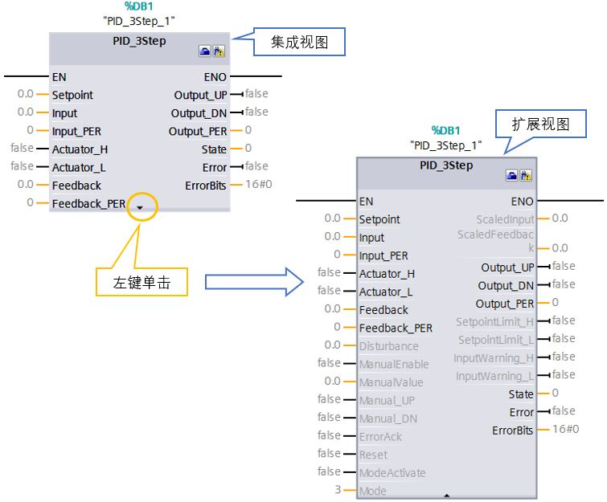
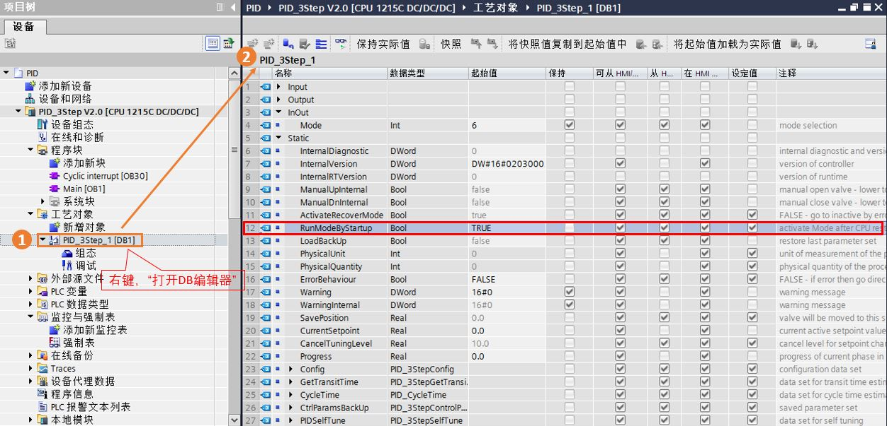

# PID_3Step V2 参数

PID\_3Step 与 PID\_Compact 的指令参数类似也分为以下主要两部分：输入参数与输出参数。其指令块的视图也包含集成视图与扩展视图，在不同的视图下所能看见的参数是不一样的。在集成视图中可看到的参数为最基本的默认参数，如给定值，反馈值，输出值等。定义这些参数可实现控制器最基本的控制功能，而在扩展视图中，可看到更多的相关参数，如手自动切换，模式切换等，使用这些参数可使控制器具有更丰富的功能。如图1 所示：

图1 PID_3Step V2 指令块的集成视图和扩展视图  

## PID_3Step V2 输入输出参数

PID_3Step V2 的输入参数包括 PID 的设定值，过程值，手自动切换，故障确认，模式切换和 PID 重启参数，如表1 所示：

表1 PID_3Step V2 的输入参数

|     |     |     |
| --- | --- | --- |
| **参数** | **数据类型** | **说明** |
| Setpoint | REAL | PID 控制器在自动模式下的设定值 |
| Input | REAL | PID 控制器的过程值（工程量） |
| Input_PER | INT | PID 控制器的过程值（模拟量） |
| Actuator_H | BOOL | 执行器上限位 |
| Actuator_L | BOOL | 执行器下限位 |
| Feedback | REAL | 执行器位置反馈（工程量） |
| Feedback_PER | INT | 执行器位置反馈 （模拟量） |
| Disturbance | REAL | 扰动变量或预控制值 |
| ManualEnable | BOOL | 为TRUE时，切换到手动模式；   由TRUE变为FALSE时，将切换到保存在 Mode 参数中的工作模式。 |
| ManualValue | REAL | 手动模式下的 PID 输出值（调节类执行器） |
| Manual_UP | BOOL | 执行器打开（开关类执行器） |
| Manual_DN | BOOL | 执行器关闭（开关类执行器） |
| ErrorAck | BOOL | ErrorAck由FALSE 变为TRUE 时，错误确认，清除已经离开的错误信息。 |
| Reset | BOOL | 重新启动控制器，PID输出、积分作用清零、不论错误是否离开都会清除错误。 |
| ModeActivate | BOOL | 由FALSE 变为TRUE 时，PID_3Step 将切换到保存在将切换到保存在 Mode 参数中的工作模式。 |

PID_3Step V2 的输出参数包括 PID 的输出值（数字量、模拟量），标定的过程值，限位报警（设定值、过程值），PID 的当前工作模式，错误状态及错误代码，如表2 所示：

表2 PID_3Step V2 的输出参数

|     |     |     |
| --- | --- | --- |
| **参数** | **数据类型** | **说明** |
| ScaledInput | REAL | 标定后的过程值 |
| ScaledFeedback | REAL | 标定后的位置反馈 |
| Output_UP | BOOL | 执行器打开数字量输出（开关类执行器） |
| Output_DN | BOOL | 执行器关闭数字量输出（开关类执行器） |
| Output_PER | INT | PID 控制器的模拟量输出值（调节类执行器） |
| SetpointLimit_H | BOOL | 为TRUE时设定值达到上限   Setpoint≥Config.SetpointUpperLimit |
| SetpointLimit_L | BOOL | 为TRUE时设定值达到下限   Setpoint≤Config.SetpointLowerLimit |
| InputWarning_H | BOOL | 为TRUE时过程值已达到或超出警告上限 |
| InputWarning_L | BOOL | 为TRUE时过程值已达到或超出警告下限 |
| State | INT | PID 控制器的当前工作模式:   State= 0：未激活   State= 1：预调节   State= 2：精确调节   State= 3：自动模式   State= 4：手动模式   State= 5：逼近替代输出值   State= 6：转换时间测量   State= 7：错误监视   State= 8：在监视错误的同时逼近替代输出值   State= 10：无停止位信号的手动模式 |
| Error | BOOL | 为TRUE时，表示此周期内至少有一条错误消息处于未决状态。 |
| ErrorBits | DWORD | 输出错误代码 |

PID_3Step V2 的输入输出参数 Mode 指定了 PID_3Step 将转换到的工作模式，具有断电保持特性，由沿激活切换工作模式，如表3 所示：

表3 输入输出参数

|     |     |     |
| --- | --- | --- |
| **参数** | **数据类型** | **说明** |
| Mode | INT | 指定 PID_3Step将转换到的工作模式:   Mode= 0：未激活   Mode= 1：预调节   Mode= 2：精确调节   Mode= 3：自动模式   Mode= 4：手动模式   Mode= 6：转换时间测量   Mode= 10：无停止位信号的手动模式  工作模式由以下沿激活：   ModeActivate 的上升沿   Reset 的下降沿   ManualEnable 的下降沿 |

**『注意』 当 ManualEnable = TRUE，无法通过 ModeActivate 的上升沿或使用调试对话框来更改工作模式。**

若 RunModeByStartup = TRUE，则 CPU 启动后以保存在 Mode 参数中的工作模式启动。若 RunModeByStartup = FALSE，则CPU 启动后仍保持“未激活”模式下。 RunModeByStartup为PID_3Step 背景 DB 块内静态变量，默认值为TRUE，变量在 DB 块内具体位置，如图2 所示。

图2 PID_3Step V2 背景 DB 块参数

当PID出现错误时，通过捕捉 Error 的上升沿，将 ErrorBits 传送至全局地址，从而获得 PID 的错误信息，如表4 所示。

表4 参数ErrorBits V2

|     |     |
| --- | --- |
| **ErrorBits**  **(DW#16#...)** | **说明** |
| 0000 | 没有任何错误。 |
| 0001 | 参数“Input”超出了过程值限值的范围。Input > Config.InputUpperLimit 或 Input < Config.InputLowerLimit |
| 0002 | 参数“Input_PER”的值无效。请检查模拟量输入是否有处于未决状态的错误。 |
| 0004 | 精确调节期间出错。过程值无法保持振荡状态。 |
| 0010 | 调节期间设定值发生更改。可在 CancelTuningLevel 变量中设置允许的设定值波动。 |
| 0020 | 精确调节期间不允许预调节。 |
| 0080 | 预调节期间出错。未正确组态输出值限制或实际值未按预期响应。 |
| 0100 | 精确调节期间的错误导致生成无效参数。 |
| 0200 | 参数“Input”的值无效：值的数字格式无效。 |
| 0400 | 输出值计算失败。请检查 PID 参数。 |
| 0800 | 采样时间错误：未在周期中断 OB 的采样时间内调用 PID_3Step。 |
| 1000 | 参数“Setpoint”的值无效：值的数字格式无效。 |
| 2000 | Feedback_PER 参数的值无效。 |
| 4000 | Feedback 参数的值无效。值的数字格式无效。 |
| 8000 | 数字位置反馈出现错误。Actuator\_H = TRUE 和 Actuator\_L = TRUE。 |
| 10000 | ManualValue 参数的值无效。值的数字格式无效。 |
| 20000 | 变量 SavePosition 的值无效。值的数字格式无效。 |
| 40000 | Disturbance 参数的值无效。值的数字格式无效。 |

**『注意』如果多个错误同时处于待决状态，将通过二进制加法显示 ErrorBits 的值。**例如，显示 ErrorBits = 0003h 表示错误 0001h 和 0002h 同时处于待决状态。

如果存在位置反馈，则 PID_3Step 使用 ManualValue 作为手动模式下的输出值。Errorbits = 10000h 除外。