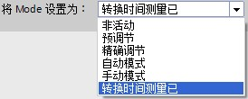
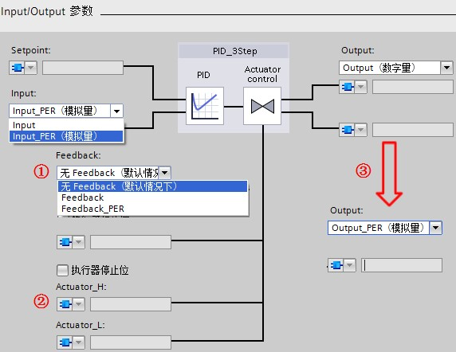
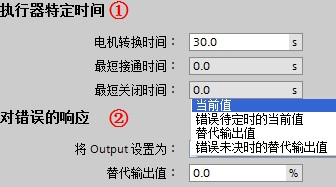
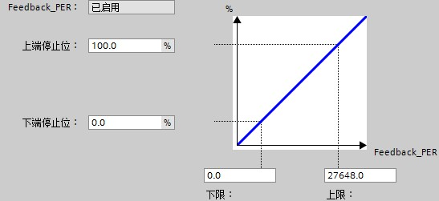
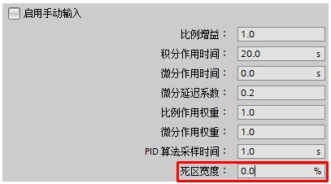
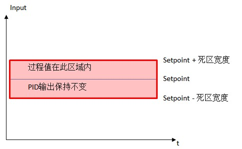

### S7-1200 PID_3Step V2 组态步骤

PID_3Step
连续采集在控制回路内测量的过程值并将其与设定值进行比较，根据所生成的控制偏差来计算输出值，通过该输出值，过程值可以尽可能快速且稳定地到达设定值。PID_3Step
可以输出模拟量，也可以输出两个开关量实现三步控制，常应用在控制电动阀的正反转来控制流量、压力等场合。三步控制参考表1
。

表1 PID_3Step 三步控制

  --------------- --------------- --------------- --------------- --------------- ------------------------
  **模式**        **Manual_UP**   **Manual_DN**   **Output_UP**   **Output_DN**   **结果**

  Mode=4\         1               0               1               0               沿打开状态方向移动阀门
  （手动模式）\                                                                   

                  0               1               0               1               沿关闭状态方向移动阀门

                  1               1               0               0               停止移动阀门
  --------------- --------------- --------------- --------------- --------------- ------------------------

PID_3Step 可组态以下三种控制器：\

-   带位置反馈的三步进控制器

-   不带位置反馈的三步进控制器

-   具有模拟量输出值的阀门控制器

PID_3Step 指令的调用与 PID_Compact 调用方法相同，详细可见 S7-1200 PID
Compact V2
组态步骤章节：[链接](../02-PID_Compact/03-PID_V2/02-Config.htm)。\

在使用 PID_3Step 控制器之前，需要在PID
工艺对象中对其进行组态设置，主要分为：基本设置、过程值设置、执行器设置、高级设置。\

### 基本设置

**1 控制器类型**\
控制器类型设置与 PID_Compact V2 设置基本相同，详细可见 S7-1200 PID
Compact V2 组态步骤 章节。PID_3Step
增加了\"转换时间测量\"模式，用来检测执行器从关到开所需的行程时间，如图1
所示。\
{width="274" height="110"}\
图1 PID_3Step 模式设置\
**2 Input / Output 参数**\
可以选择过程值、PID输出的类型及执行器反馈信号选择等参数，如图2 所示。\
{width="572" height="442"}\
图2 PID_3Step Input / Output 类型设置\
①执行器反馈信号类型选择：\
无Feedback：没有执行器位置反馈信号\
Feedback：输入标定后的执行器模拟量反馈信号；\
Feedback_PER：输入未标定的执行器模拟量反馈信号。\
②勾选\"执行器停止位\"以激活上、下限位功能：\
\"Actuator_H\"：执行器上限停止位\
\"Actuator_L\"：执行器下限停止位\
③PID输出类型选择：\
Output（数字量）：PID数字量输出 Output_UP / Output_DN；Output_UP
沿打开状态方向移动阀门，Output_DN 沿关闭状态方向移动阀门。\
Output_PER（模拟量）：PID模拟量输出值范围0～27648。通过连续信号（如
0\...10 V 或 4\...20 mA）控制该执行器。Output_PER
的值与阀门的目标位置相对应，例如，当阀门打开 50% 时 Output_PER = 13824。

**『注意』**当选择PID输出为模拟量时，PID_3Step 与 PID_Compact
的自动调节和抗积分饱和功能略有不同。PID_3Step
会将因电机转换时间所致的模拟量输出值对过程的延迟影响考虑在内。如果相关电机转换时间并未影响过程（如使用电磁阀），即PID输出值直接且完全影响过程，建议使用
PID_Compact。\

### 过程值设置

过程值设置选项卡与 PID_Compact V2 一致，详细可见 S7-1200 PID Compact V2
组态步骤 章节。

### 执行器设置

**1 执行器**\
设置电机转换时间、最小关断时间及最小接通时间，以防止执行器被损坏。如图3
所示。\
{width="336" height="187"}\
图3 PID_3step 执行器设置\
①\"执行器特定时间\"：\
\"电机转换时间\"：执行器动作从下限停止位到上限停止位所需的时间（以秒为单位）；\
\"最短接通时间\"和\"最短关闭时间\"与 PID_Compact V2 设置相同。\
②\"对错误的响应\"与 PID_Compact V2 一致，详细可见 S7-1200 PID Compact V2
组态步骤 章节。\
**2 输出值限制**\
当选择输出类型为Output_PER，则PID_3Step 的输出限制将被激活，与
PID_Compact V2 一致，详细可见 S7-1200 PID Compact V2 组态步骤 章节。\
**3 反馈标定**\
当启用执行器模拟量阀位反馈时，可通过阀位开度的模拟量反馈信号标定阀门的实际开度，如图4
所示。\
{width="547" height="251"}\
图4 PID_3Step 阀门反馈标定\

### 高级设置

**1 过程值监视**\
过程值监视与 PID_Compact V2 一致，详细可见 S7-1200 PID Compact V2
组态步骤 章节。\
**2 PID参数**\
PID参数与 PID_Compact
V2相比，增加了死区功能。在控制系统中，执行机构如果动作频繁，会导致小幅震荡造成机械磨损，很多控制系统允许被控量在一定范围内存在误差，该误差称为PID的死区。其大小称为死区宽度，参数如图5
所示。\
{width="407" height="226"}\
图5 PID_3Step PID参数设置\
当过程值满足如下公式时，SP --\"死区宽度\"＜ PV ＜ SP
+\"死区宽度\"时，PID停止调节保持输出不变。如图6 所示。\
{width="485" height="298"}\
图6 PID_3Step 死区控制

**『注意』死区宽度指定死区的大小。如果死区宽度为 0.0，则死区关闭。**
