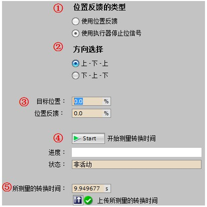
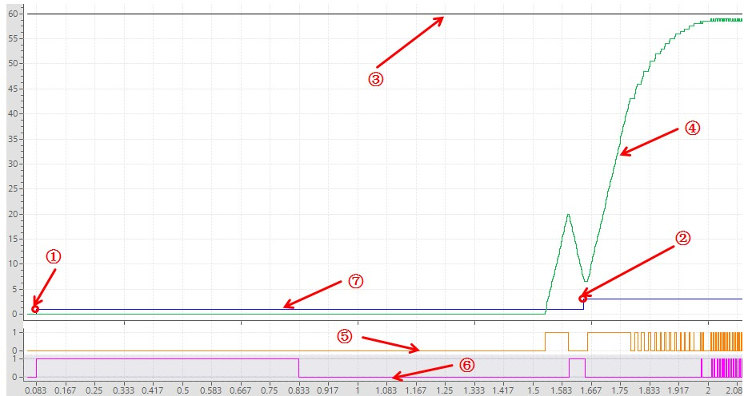
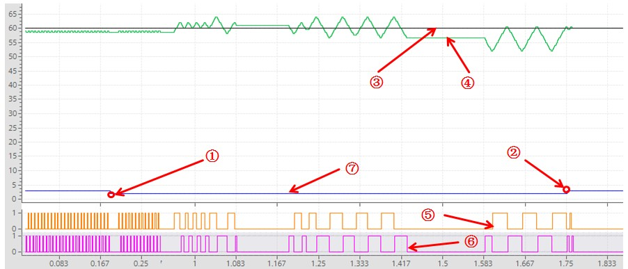

### S7-1200 PID_3Step V2 自整定功能

PID_3Step 的预调节、精确调节与 PID_Compact V2
类似。由于支持开关类执行器位置反馈，所以可以测量电机的转换时间。

### 电机转换时间

电机转换时间是执行器动作从下限停止位到上限停止位所需的时间。简单点说，也就是执行器从全关到全开所需的时间。\
PID_3Step
要求电机转换时间尽可能准确，以便获得良好的控制效果。如果使用提供位置反馈或停止位信号的执行器，则可在调试期间测量电机转换时间。测量期间，不考虑输出值的限值，执行器可行进至上限位或下限位。电机转换时间可使用调试面板进行测量，如图1
所示。\
{width="412" height="413"}\
图1 PID_3Step 电机转换时间测量\
①\"位置反馈类型\"：与Input/Output选项卡中的\"Feedback\"和\"执行器停止位\"设置相关；\
②\"方向选择\"：执行器运行轨迹；\
③\"目标位置\"：到达此位置时结束测量转换时间；\
④开始测量按钮及测量状态；\
⑤显示\"所测量的转换时间\"，可通过\"上传所测量的转换时间\"将测量结果上传至项目。\
如果位置反馈或停止位信号均不可用，则无法测量电机转换时间，可以在组态界面内设置人工测量出的电机转换时间。\

### 预调节

PID_3Step 支持模拟量输出与数字量输出，模拟量输出的预调节曲线与
PID_Compact V2 相同，数字量输出的预调节曲线如图2 所示。

启动预调节的必要条件如下：\
1. 已在循环中断OB中调用 PID_3Step；\
2. ManualEnable= FALSE 且 Reset= FALSE；\
3. 已对电机转换时间进行了设置与测量；\
4. PID_3Step 处于以下模式之一：\"未激活\"、\"手动模式\"、\"自动模式\"；\
5. 设定值和过程值均处于组态的限值范围内；\
{width="935" height="496"}\
图2 PID_3Step 数字量输出预调节曲线\
①开始整定State=1；②整定完成State =3；③设定值曲线；\
④过程值曲线；⑤Output_UP；⑥Output_DN；⑦State曲线

如果执行预调节时未产生错误消息，则 PID 参数已调节完毕。PID_3Step
将切换到自动模式并使用已调节的参数。在电源关闭以及重启 CPU
期间，已调节的 PID 参数保持不变。

如果无法实现预调节，PID_3Step 将根据已组态的响应对错误作出反应。

### 精确调节

PID_3Step 数字量输出精确调节曲线，如图3 所示。

启动精确调节的必要条件如下：\
1. 已在循环中断OB中调用 PID_3Step 指令；\
2. ManualEnable= FALSE 且 Reset= FALSE；\
3. 已对电机转换时间进行了设置与测量；\
4. PID_3Step 处于以下模式之一：\"未激活\"、\"手动模式\"、\"自动模式\"；\
5. 设定值和过程值均处于组态的限值范围内；\
6. 在操作点处，控制回路已稳定。
过程值与设定值一致时，表明到达了操作点；\
7. 不能被干扰。\
{width="902" height="387"}\
图3 PID_3Step数字量输出精确调节曲线\
①开始整定State=2；②整定完成State =3；③设定值曲线；\
④过程值曲线；⑤Output_UP；⑥Output_DN；⑦State曲线

如果在精确调节期间未产生错误，则 PID 参数已调节完毕。PID_3Step
将切换到自动模式并使用已调节的参数。在电源关闭以及重启 CPU
期间，已调节的 PID 参数保持不变。

如果精确调节期间出现错误，PID_3Step 将根据已组态的响应对错误作出反应。

### PID_3Step V2 调试面板

PID_3Step 调试面板与 PID_Compact V2 一致，详细可见 S7-1200 PID Compact
V2 自整定功能章节：[链接](../02-PID_Compact/03-PID_V2/03-Tuning.htm)。
