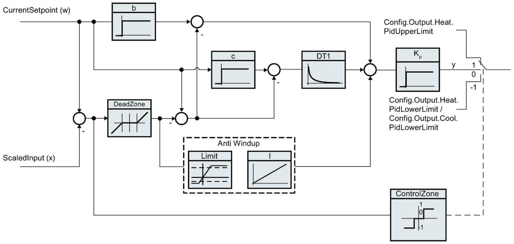

# PID_Temp 参数 

## PID_Temp 指令介绍

PID\_Temp 提供了集成自整定功能的连续 PID 控制器。PID\_Temp 专为温度控制而设计，适用于加热或加热/制冷应用。 为此提供了两路输出，分别用于加热和制冷。

PID\_Temp 还可以用于其它控制任务。PID\_Temp 可以级联，可以在手动或自动模式下使用。

PID_Temp 提供了自整定比例、积分和微分参数的功能。

PID_Temp 具有抗积分饱和功能并且能够对比例作用和微分作用进行加权。

PID 算法方框图如图 1 所示：

图 1\. PID_Temp 算法方框图

PID 算法根据如图 2 所示公式工作（不激活控制区和死区功能的情况），参数详见表 1 所示。

图 2\. 计算公式

| 符号  | 说明  | PID_Temp 指令的关联参数 |
| --- | --- | --- |
| y   | PID 算法的输出值 |     |
| Kp  | 比例增益 | Retain.CtrlParams.Heat.Gain   Retain.CtrlParams.Cool.Gain   CoolFactor |
| s   | 拉普拉斯运算符 |     |
| b   | 比例作用权重 | Retain.CtrlParams.Heat.PWeighting   Retain.CtrlParams.Cool.PWeighting |
| w   | 设定值 | CurrentSetpoint |
| x   | 过程值 | ScaledInput |
| TI  | 积分作用时间 | Retain.CtrlParams.Heat.Ti   Retain.CtrlParams.Cool.Ti |
| TD  | 微分作用时间 | Retain.CtrlParams.Heat.Td   Retain.CtrlParams.Cool.Td |
| a   | 微分作用延迟系数   （微分延迟 TI = a × TD） | Retain.CtrlParams.Heat.TdFiltRatio   Retain.CtrlParams.Cool.TdFiltRatio |
| c   | 微分作用权重 | Retain.CtrlParams.Heat.DWeighting   Retain.CtrlParams.Cool.DWeighting |
| DeadZone | 死区宽度 | Retain.CtrlParams.Heat.DeadZone   Retain.CtrlParams.Cool.DeadZone |
| ControlZone | 控制区宽度 | Retain.CtrlParams.Heat.ControlZone   Retain.CtrlParams.Cool.ControlZone |

表 1\. PID 参数

**比例增益**

* 该值用于指定控制器的比例增益。PID_Temp 不支持负比例增益或PID反作用，只支持 PID 正作用，也就是说过程值会随着 PID 输出值的增大而增大。

**积分作用时间**

* 积分作用时间用于确定积分作用的时间特性。积分作用时间越大，积分作用越小。如果不使用积分，则把积分作用时间设为 0.0 。

**微分作用时间**

* 微分作用时间用于确定微分作用的时间特性。微分作用时间越大，微分作用越大。如果不使用微分，则把微分作用时间设为 0.0 。

**微分延迟系数**

* 微分延迟系数用于延迟微分作用的生效。
* 微分延迟 = 微分作用时间 × 微分延迟系数。

**比例作用权重**

* 用于当设定值发生变化时弱化比例作用。
* 比例作用权重允许使用 0.0 到 1.0 之间的值。
    * 当比例作用权重 = 1.0：设定值变化时的比例作用完全有效
    * 当比例作用权重 = 0.0：设定值变化时的比例作用无效
* 当过程值变化时，比例作用始终完全有效。

**微分作用权重**

* 用于当设定值发生变化时弱化微分作用。
* 微分作用权重允许使用 0.0 到 1.0 之间的值。
    * 当微分作用权重 = 1.0：设定值变化时的微分作用完全有效
    * 当微分作用权重 = 0.0：设定值变化时的微分作用无效
* 当过程值变化时，微分作用始终完全有效。

## PID_Temp 指令视图

PID 指令块的参数分为两部分，输入参数与输出参数。其指令块的视图分为扩展视图与集成视图，在不同的视图下所能看见的参数是不一样的，如图 3 所示。

* 集成视图：参数为最基本的默认参数，如给定值，反馈值，输出值等。定义这些参数可实现控制器最基本的控制功能。
* 扩展视图：包含更多的相关参数，如手自动切换，模式切换等，使用这些参数可使控制器具有更丰富的功能。

图 3\. 集成视图和扩展视图

## 输入输出参数介绍

PID_Temp 的输入参数包括 PID 的设定值，过程值，手自动切换，故障确认，模式切换和 PID 重启等参数，如表 2 所示：

| 参数  | 数据类型 | 说明  |
| --- | --- | --- |
| Setpoint | Real | PID 控制器在自动模式下的设定值 |
| Input | Real | PID 控制器的反馈值（工程量） |
| Input_PER | Int | PID 控制器的反馈值（模拟量） |
| Disturbance | Real | 扰动变量或预控制值 |
| ManualEnable | Bool | * 出现 FALSE -> TRUE 上升沿时会激活“手动模式”，与当前 Mode 的数值无关。 * 当 ManualEnable = TRUE，无法通过 ModeActivate 的上升沿或使用调试对话框来更改工作模式。 * 出现 TRUE -> FALSE 下降沿时会激活由 Mode 指定的工作模式。 |
| ManualValue | Real | 该值在手动模式下使用，用作 PID 输出值（PidOutputSum）。标定后的输出值取决于输出标定的设置。  当激活制冷输出时：  * 正的手动值对应加热输出值 * 负的手动值对应制冷输出值  取值范围必须满足：  * 当禁用制冷输出时： Config.Output.Heat.PidUpperLimit ≥ ManualValue ≥ Config.Output.Heat.PidLowerLimit * 当激活制冷输出时： Config.Output.Heat.PidUpperLimit ≥ ManualValue ≥ Config.Output.Cool.PidLowerLimit |
| ErrorAck | Bool | FALSE -> TRUE 上升沿时，错误确认，清除已经离开的错误信息。 |
| Reset | Bool | * 重新启动控制器：     * FALSE -> TRUE 上升沿， 切换到"未激活"模式，同时复位 ErrorBits 和 Warnings，清除积分作用（保留 PID 参数） 。     * 只要 Reset = TRUE，PID_Temp 便会保持在"未激活"模式下 (State = 0)。     * TRUE -> FALSE 下降沿，PID_Temp 将切换到保存在 Mode 参数中的工作模式。 |
| ModeActivate | Bool | FALSE -> TRUE 上升沿，PID_Temp 将切换到保存在 Mode 参数中的工作模式。 |

表 2\. 输入参数

PID_Temp 的输出参数包括 PID 的加热和制冷输出值（REAL、模拟量、PWM），标定的过程值，限位报警（设定值、过程值），PID 的当前工作模式，错误状态及错误代码，如表 3 所示：

| 参数  | 数据类型 | 说明  |
| --- | --- | --- |
| ScaledInput | Real | 标定的过程值 |
| OutputHeat | Real | PID 的加热输出值 （REAL 形式） |
| OutputCool | Real | PID 的制冷输出值 （REAL 形式） |
| OutputHeat_PER | Int | PID 的加热输出值（模拟量） |
| OutputCool_PER | Int | PID 的制冷输出值（模拟量） |
| OutputHeat_PWM | Bool | PID 的加热输出值（脉宽调制） |
| OutputCool_PWM | Bool | PID 的制冷输出值（脉宽调制） |
| SetpointLimit_H | Bool | 如果 SetpointLimit_H = TRUE，则说明达到了设定值的绝对上限 (Setpoint ≥ Config.SetpointUpperLimit) 或者   Setpoint ≥ Config.InputUpperLimit。   设定值上限是 Config.SetpointUpperLimit 和 Config.InputUpperLimit 中的较小值。 |
| SetpointLimit_L | Bool | 如果 SetpointLimit_L = TRUE，则说明已达到设定值的绝对下限 (Setpoint ≤ Config.SetpointLowerLimit) 或者   Setpoint ≤ Config.InputLowerLimit。   设定值下限是 Config.SetpointLowerLimit 和 Config.InputLowerLimit 中的较大值。 |
| InputWarning_H | Bool | 如果 InputWarning_H = TRUE，则说明过程值已达到或超出警告上限 (ScaledInput ≥ Config.InputUpperWarning)。 |
| InputWarning_L | Bool | 如果 InputWarning_L  = TRUE，则说明过程值已达到或低于警告下限 (ScaledInput ≤ Config.InputLowerWarning)。 |
| State | Int | State 参数显示了 PID 控制器的当前工作模式。 可使用输入参数 Mode 和 ModeActivate 处的上升沿更改工作模式。  * State = 0：未激活 * State = 1：预调节 * State = 2：精确调节 * State = 3：自动模式 * State = 4：手动模式 * State = 5：带错误监视的替代输出值 |
| Error | Bool | 如果 Error = TRUE，则此周期内至少有一条错误消息处于未决状态。 |
| ErrorBits | DWord | ErrorBits 参数显示了处于未决状态的错误消息。 ErrorBits 具有保持性，通过 Reset 或 ErrorAck 的上升沿来复位。 |

表 3\. 输出参数

:::{attention}
1.  若 PID 控制器未正常工作，请先检查 PID 的输出状态 State 来判断 PID 的当前工作模式，并检查错误信息。
2.  当错误出现时 Error = 1，错误离开后 Error = 0，ErrorBits 会保留错误信息。可通过编程清除错误离开后 ErrorBits 保留的错误信息。
:::

PID_Temp 的输入输出参数如表 4 所示：

| 参数  | 数据类型 | 说明  |
| --- | --- | --- |
| Mode | Int | 指定 PID_Temp 将转换到的工作模式，具有断电保持特性，由信号边沿触发：  * Mode = 0：未激活 * Mode = 1：预调节 * Mode = 2：精确调节 * Mode = 3：自动模式 * Mode = 4：手动模式  工作模式由以下参数激活：  * 当 ManualEnable = FALSE 时，在 ModeActivate 的上升沿，会激活由 Mode 指定的工作模式 * 当 ManualEnable = FALSE 时，在 Reset 的下降沿，会激活由 Mode 指定的工作模式 * 在 ManualEnable 的下降沿，会激活由 Mode 指定的工作模式 * 如果 RunModeByStartup = TRUE，则在重新启动 CPU 后，会激活由 Mode 指定的工作模式  对于预调节和精确调节，通过 Heat.EnableTuning 和 Cool.EnableTuning 指定针对的是加热还是制冷进行调节。 |
| Master | DWord | 级联控制的接口  如果是作为级联中的从控制器 (Config.Cascade.IsSlave = TRUE)，则把对应的主控制器的 Slave 参数分配分配从控制器的 Master 参数。   使用此接口与主控制器交换关于从控制器的工作模式、限值和替代设定值的信息。   注意，在同一个循环中断 OB 中，必须先调用主控制器，再调用从控制器。  各个位的功能：  * 位 0 至 15：未使用 * 位 16 至 23：限值计数器：       输出值受限制的从控制器会使此计数器递增。 主控制器将根据已组态的从控制器数 (Config.Cascade.CountSlaves) 和抗积分饱和模式 (Config.Cascade.AntiWindUpMode) 作出相应反应。 * 位 24：从控制器的自动模式： 如果所有从控制器均处于自动模式，则为 TRUE * 位 25：从控制器的替代设定值： 如果从控制器已激活替代设定值 (SubstituteSetpointOn = TRUE)，则为 TRUE |
| Slave | DWord | 级联控制的接口  使用此接口与主控制器交换关于从控制器的工作模式、限值和替代设定值的信息。 |

表 4\. 输入输出参数

:::{attention}
当 ManualEnable = TRUE，无法通过 ModeActivate 的上升沿或使用调试对话框来更改工作模式。
当 PID 出现错误时，通过查询 ErrorBits 获得 PID 的错误信息，如表 5 所示。
:::

| 错误代码（DW#16#） | 说明  |
| --- | --- |
| 00000000 | 没有任何错误 |
| 00000001 | 参数 "Input" 超出了过程值限值的范围，正常范围应为 Config.InputLowerLimit < Input < Config.InputUpperLimit 。 |
| 00000002 | 参数 "Input_PER" 的值无效。请检查模拟量输入是否有处于未决状态的错误。 |
| 00000004 | 精确调节期间出错。过程值无法保持振荡状态。 |
| 00000008 | 预调节启动时出错。过程值过于接近或大于设定值。启动精确调节。 |
| 00000010 | 调节期间设定值发生更改。可在 CancelTuningLevel 变量中设置允许的设定值波动。 |
| 00000020 | 精确调节期间不允许预调节。 |
| 00000040 | 预调节期间出错。制冷无法减小过程值。 |
| 00000100 | 精确调节期间的错误导致生成无效参数。 |
| 00000200 | 参数 "Input"的值无效：值的数字格式无效。 |
| 00000400 | 输出值计算失败。请检查 PID 参数。 |
| 00000800 | 采样时间错误：循环中断 OB 的采样时间内没有调用 PID_Temp。 |
| 00001000 | 参数 "Setpoint"或 "SubstituteSetpoint"的值无效，值的数字格式无效。 |
| 00010000 | ManualValue 参数的值无效，值的数字格式无效。 |
| 00020000 | 变量 SubstituteOutput 的值无效，值的数字格式无效。这时，PID_Temp 使用输出值下限作为输出值。 |
| 00040000 | Disturbance 参数的值无效，值的数字格式无效。 |
| 00200000 | 级联中的主控制器出错：Slaves 未处于自动模式，或已激活替代设定值，妨碍了主控制器的调节。 |
| 00400000 | 在制冷过程处于激活状态时不允许对加热过程进行预调节。 |
| 00800000 | 过程值必须接近设定值才能启动预调节制冷。 |
| 01000000 | 调节启动时出错：Heat.EnableTuning 和 Cool.EnableTuning 未设置或与组态不匹配。 |
| 02000000 | 预调节制冷出错：要求已经成功完成预调节加热。 |
| 04000000 | 启动精确调节时出错：Heat.EnableTuning 和 Cool.EnableTuning 不能同时设置。 |
| 08000000 | 计算 PID 参数时出错，导致生成无效的参数。无效参数被丢弃，原始 PID 参数保持不变。 |

表 5\. 错误代码定义

:::{attention}
如果多个错误同时处于待决状态，将通过二进制加法显示 ErrorBits 的值。 例如，显示 ErrorBits = 00000003H 表示错误 00000001H 和 00000002H 同时处于待决状态。
:::