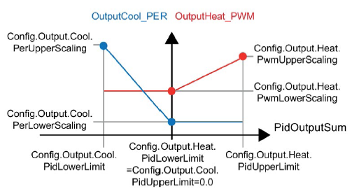

### PID_Temp 组态步骤 {#pid_temp-组态步骤 .STYLE1}

可以使用工艺对象对 PID_Temp
进行组态和调试，下面通过一个例子说明组态和调试过程。

这是一个针对某种物质的温度调节系统，通过一个加热阀和一个冷却阀来调节温度，加热阀采用模拟量控制的比例阀，冷却阀采用数字量输出控制的开关阀，如图
1 所示。

{width="15" height="15"}注意：

S7-1200 PID 功能不支持仿真功能。只能通过真实 CPU 组态下载程序。

{width="630" height="350"}

图 1. PID_Temp 温度调节系统

使用 PID 功能，需要在循环中断 OB 中调用 PID_Temp
指令，所以要先添加循环中断 OB。在循环中断 OB
的属性中，可以修改其循环时间，如图 2 所示。

{width="1058" height="450"}

图 2. 添加循环中断后在属性界面修改其循环时间

{width="15"
height="15"}注意：为保证以恒定的时间间隔执行 PID 指令，必须在循环中断 OB
中调用。

在"指令 \> 工艺 \> PID 控制 \> Compact PID"下，将 PID_Temp
指令添加至循环中断 OB，如图 3 所示。

{width="658" height="330"}

图 3. 在循环中断 OB 中添加 PID_Temp 指令

当添加完 PID_Temp 指令后，在项目树 \>
工艺对象文件夹中，会自动关联出对应背景 DB 的工艺对象，如图 4 所示的
PID_Temp_1\[DB1\]，包含组态和调试功能。

{width="810" height="619"}

图 4. 工艺对象中关联生成 PID_Temp

使用 PID
控制器前，需要对其进行组态设置。双击工艺对象下的组态进入组态界面，分为基本设置、过程值设置、输出设置以及高级设置等部分，如图
5 所示。

{width="774" height="546"}

图 5. PID_Temp 组态界面

### 基本设置

1、基本设置\--控制器类型

设置控制器类型，如图 6 所示。

a\.
为设定值、过程值选择物理量和测量单位。设定值和过程值将以该测量单位显示。

b\. 要在 CPU 重启后切换到"模式"（Mode） 参数中保存的工作模式，请勾选"在
CPU 重启后激活模式"。

{width="422" height="165"}

图 6. 设置控制器类型

本例子中物理量选择温度，单位选择 ℃。

2、基本设置\--设置 Input/Output 参数

选择 PID 过程值和输出值的方式，如图 7 所示。

如果过程值与模拟量输入值成正比，则可以选择 Input_PER， PID_Temp
会将该模拟量输入值标定为过程值的物理量。

如果程序里已经把模拟量输入值标定到过程值，或者由于过程值与模拟量输入值并不成正比，需要编写处理程序进行转换，则选择
Input。

本例中采用直接使用模拟量输入，选择 Input_PER。

{width="916" height="411"}

图 7. 选择 Input/Output

PID_Temp 提供以下形式的输出值。
根据执行器的类型选择要使用的输出值，参考图 7 所示蓝框与紫框。

-   OutputHeat

> 加热输出值（REAL形式）：如果需要通过用户程序来处理加热的输出值，例如，由于执行器响应为非线性等原因。

-   OutputHeat_PER

> 模拟量加热输出值： 通过模拟量输出触发加热执行器，并使用连续信号（如
> 0\...10V、4\...20 mA）控制加热执行器。

-   OutputHeat_PWM

> 脉宽调制加热输出值： 通过数字量输出控制加热执行器。
> 脉宽调制可生成不同的 ON 和 OFF 时间。

-   OutputCool

> 制冷输出值（REAL形式）：如果需要通过用户程序来处理制冷的输出值，例如，由于执行器响应为非线性等原因。

-   OutputCool_PER

> 模拟量制冷输出值： 通过模拟量输出触发制冷执行器，并使用连续信号（如
> 0\...10V、4\...20 mA）控制制冷执行器。

-   OutputCool_PWM

> 脉宽调制制冷输出值： 通过数字量输出控制制冷执行器。
> 脉宽调制可生成不同的 ON 和 OFF 时间。

本例加热选择 OutputHeat_PER，制冷选择 OutputCool_PWM。

如果需要制冷输出，则选择"激活制冷"，参考图 7 所示绿框。

-   选择"激活制冷"时，PID 算法的输出值 （PidOutputSum）
    将在标定后在加热输出中输出。

-   不选"激活制冷"时，PID 算法的正输出值 （PidOutputSum）
    将在标定后在加热输出中输出。 PID
    算法的负输出值则在标定后在制冷输出中输出。

本例中需要用到制冷输出，所以选中\"激活制冷\"。

2、基本设置\--级联

级联设置用于做 PID 串级控制，如图 8
所示，具体设置方法参见[链接](04-Cascade.html)。

本例中不做级联设置。

{width="409" height="157"}

图 8. 设置级联

### 过程值设置

1、过程值设置\--过程值限值

为过程值指定绝对上限和绝对下限，作为受控系统的限值，如图 9
所示。必须满足过程值下限\<过程值上限。如果过程值超出限值，就会出现错误
（ErrorBits = 00000001H）。

{width="587" height="262"}

图 9. 设置过程值限值

本例中假设过程值的绝对上限是120°，绝对下限是0°。

2、过程值设置\--过程值标定

设置过程值标定，如图 10 所示。

a\. 当且仅当在 Input/Output 中输入选择为 "Input_PER"
时，才可组态过程值标定。

b\. 如果过程值与模拟量输入值成正比，则将使用上下限值对来标定 Input_PER。

c\. 必须满足范围的下限\<上限。

{width="661" height="383"}

图 10. 进行过程值标定

假设模拟量采用 0-10V 的输入信号，对应 0-200℃ 的量程，那么 Input_PER
的下限和上限分别是 0 和 27648，标定的过程值下限和上限分别是 0℃ 和 200℃。

### 输出设置

**1、输出设置\--输出的基本设置**

1）加热/制冷

在基本设置中激活制冷时，此处参数才可进行设置。该参数用于设置制冷 PID
参数的计算方式，有两种方式，如图 11 所示。

-   切换加热/制冷的PID参数
    -   采用单独的制冷 PID 参数。
    -   适用于加热执行器和制冷执行器的时间响应和增益都不同的情况。
    -   可对制冷进行预调节和精确调节。
-   加热/制冷的系数（制冷系数在下方单独设置）
    -   结合加热过程的 PID 参数和制冷系数来计算制冷参数。
    -   适用于加热执行器和制冷执行器的时间响应相似但增益不同的情况。
    -   无法对制冷进行预调节和精确调节，只能执行加热调节。

{width="686" height="135"}

图 11. 制冷参数方式设置

本例中选择切换加热/制冷的 PID 参数方式。

2）对错误的响应

可以预先设置错误响应时 PID
的输出状态，以便在发生错误时，控制器在大多数情况下均可保持激活状态，如图
12 所示。

{width="671" height="89"}

图 12. 对错误的响应

对错误的响应中，PidOutputSum 设置可以有三个选项：

-   非活动
-   错误待定时的当前值
-   错误未决时的替代输出值

选择不同的错误响应方式，出现不同的错误时，PID指令的行为不尽相同，如表 1
所示。

+-----------------+-----------------+-----------------+-----------------+
| ErrorBits       | 非活动          | 错误            | 错误未决        |
| （DW#16#\...）  |                 | 待定时的当前值  | 时的替代输出值  |
+=================+=================+=================+=================+
| 00000001        | 对              | :::             |                 |
|                 | 于所有错误，PID |  {align="left"} |                 |
|                 | 均输出          | 1.              |                 |
|                 | 0.0，Error =    |  如果在自动模式 |                 |
|                 | 1，会切换到     | 下出现错误，则  |                 |
|                 | \"未激          |     PID_Temp    |                 |
|                 | 活\"模式（State |                 |                 |
|                 | = 0）。         |  保持自动模式。 |                 |
|                 |                 | 2.              |                 |
|                 | 当错误          |  如果在手动模式 |                 |
|                 | 离开后，可通过  | 下出现错误，则  |                 |
|                 | Reset           |     PID_Temp    |                 |
|                 | 的下降沿或者    |                 |                 |
|                 | ModeActive      |  保持手动模式。 |                 |
|                 | 的上升沿来      | 3.  如果在预调  |                 |
|                 | 切换工作模式。  | 节或精确调节模  |                 |
|                 |                 | 式出现错误，则  |                 |
|                 |                 |     PID_Temp    |                 |
|                 |                 |     切换到 Mode |                 |
|                 |                 |     参数中保    |                 |
|                 |                 | 存的工作模式。  |                 |
|                 |                 | :::             |                 |
+-----------------+-----------------+-----------------+-----------------+
| 00000800        |                 |                 |                 |
+-----------------+-----------------+-----------------+-----------------+
| 00040000        |                 |                 |                 |
+-----------------+-----------------+-----------------+-----------------+
| 08000000        |                 |                 |                 |
+-----------------+-----------------+-----------------+-----------------+
| 00000002        |                 | :::             | :::             |
|                 |                 |  {align="left"} |  {align="left"} |
|                 |                 | 1.              | 1.              |
|                 |                 |  如果在自动模式 |  如果在自动模式 |
|                 |                 | 下出现错误，则  | 下出现错误，则  |
|                 |                 |     PID_Tem     |     PID_Tem     |
|                 |                 | p切换到\"带错误 | p切换到\"带错误 |
|                 |                 | 监视的替代输出  | 监视的替代输出  |
|                 |                 | 值\"模式（State | 值\"模式（State |
|                 |                 |     =           |     =           |
|                 |                 |     5），Error  |     5），Error  |
|                 |                 |     =           |     =           |
|                 |                 |     1，         |     1，输出     |
|                 |                 | 输出错误发生前  | 组态的替换输出  |
|                 |                 | 的最后一个有效  | 值。错误离开后  |
|                 |                 | 值。错误离开后  |     Error =     |
|                 |                 |     Error =     |     0，错误代码 |
|                 |                 |     0，错误代码 | 保留，PID_Temp  |
|                 |                 | 保留，PID_Temp  |     切          |
|                 |                 |     切          | 换回自动模式。  |
|                 |                 | 换回自动模式。  | 2.              |
|                 |                 | 2.              |  如果在手动模式 |
|                 |                 |  如果在手动模式 | 下出现错误，则  |
|                 |                 | 下出现错误，则  |     PID_Temp    |
|                 |                 |     PID_Temp    |                 |
|                 |                 |                 |  保持手动模式。 |
|                 |                 |  保持手动模式。 | 3.  如果在预调  |
|                 |                 | 3.  如果在预调  | 节或精确调节模  |
|                 |                 | 节或精确调节模  | 式出现错误，则  |
|                 |                 | 式出现错误，则  |     PID_Temp    |
|                 |                 |     PID_Temp    |     切换到 Mode |
|                 |                 |     切换到 Mode |     参数中保    |
|                 |                 |     参数中保    | 存的工作模式。  |
|                 |                 | 存的工作模式。  | :::             |
|                 |                 | :::             |                 |
+-----------------+-----------------+-----------------+-----------------+
| 00000200        |                 |                 |                 |
+-----------------+-----------------+-----------------+-----------------+
| 00000400        |                 |                 |                 |
+-----------------+-----------------+-----------------+-----------------+
| 00001000        |                 |                 |                 |
+-----------------+-----------------+-----------------+-----------------+
| 00000004        |                 | :::             |                 |
|                 |                 |  {align="left"} |                 |
|                 |                 | 在调            |                 |
|                 |                 | 节过程中出现错  |                 |
|                 |                 | 误时，PID_Temp  |                 |
|                 |                 | 取消调节模      |                 |
|                 |                 | 式，直接切换到  |                 |
|                 |                 | Mode            |                 |
|                 |                 | 参数中保存的    |                 |
|                 |                 | 工作模式运行。  |                 |
|                 |                 | :::             |                 |
+-----------------+-----------------+-----------------+-----------------+
| 00000008        |                 |                 |                 |
+-----------------+-----------------+-----------------+-----------------+
| 00000010        |                 |                 |                 |
+-----------------+-----------------+-----------------+-----------------+
| 00000040        |                 |                 |                 |
+-----------------+-----------------+-----------------+-----------------+
| 00000100        |                 |                 |                 |
+-----------------+-----------------+-----------------+-----------------+
| 00200000        |                 |                 |                 |
+-----------------+-----------------+-----------------+-----------------+
| 00400000        |                 |                 |                 |
+-----------------+-----------------+-----------------+-----------------+
| 00800000        |                 |                 |                 |
+-----------------+-----------------+-----------------+-----------------+
| 01000000        |                 |                 |                 |
+-----------------+-----------------+-----------------+-----------------+
| 02000000        |                 |                 |                 |
+-----------------+-----------------+-----------------+-----------------+
| 04000000        |                 |                 |                 |
+-----------------+-----------------+-----------------+-----------------+
| 00000020        |                 | :::             |                 |
|                 |                 |  {align="left"} |                 |
|                 |                 | 精确            |                 |
|                 |                 | 调节期间无法再  |                 |
|                 |                 | 启动预调节，则  |                 |
|                 |                 | PID_Temp 的     |                 |
|                 |                 | Error =         |                 |
|                 |                 | 1、State        |                 |
|                 |                 | 保持            |                 |
|                 |                 | 不变，即保持在  |                 |
|                 |                 | 精确调节模式。  |                 |
|                 |                 | :::             |                 |
+-----------------+-----------------+-----------------+-----------------+
| 00010000        |                 | :::             |                 |
|                 |                 |  {align="left"} |                 |
|                 |                 | 如果是在手动模  |                 |
|                 |                 | 式下发生错误，  |                 |
|                 |                 | 则输出组态的替  |                 |
|                 |                 | 换输出值。Error |                 |
|                 |                 | = 1、State      |                 |
|                 |                 | 保持不变。在    |                 |
|                 |                 | ManualValue     |                 |
|                 |                 | 中指定一个有效  |                 |
|                 |                 | 值后，PID_Temp  |                 |
|                 |                 | 会立即将其用作  |                 |
|                 |                 | PID 输出值。    |                 |
|                 |                 | :::             |                 |
+-----------------+-----------------+-----------------+-----------------+
| 00020000        |                 | :::             | :::             |
|                 |                 |  {align="left"} |  {align="left"} |
|                 |                 | 如果是在        | 自动模式下发生  |
|                 |                 | 手动模式下同时  | 错误需要输出替  |
|                 |                 | 发生手动值无效  | 代值时，如果替  |
|                 |                 | （10000H）、替  | 代输出值无效则  |
|                 |                 | 换输出值无效（  | PID_Temp        |
|                 |                 | 20000H），则输  | 切换到\"带错误  |
|                 |                 | 出输出值下限。  | 监视的替代输出  |
|                 |                 | :::             | 值\"模式（State |
|                 |                 |                 | =               |
|                 |                 |                 | 5），并         |
|                 |                 |                 | 输出输出值的下  |
|                 |                 |                 | 限。错误离开后  |
|                 |                 |                 | PID_Temp        |
|                 |                 |                 | 切              |
|                 |                 |                 | 换回自动模式。  |
|                 |                 |                 | :::             |
+-----------------+-----------------+-----------------+-----------------+

表 1. 错误响应方式

如果控制器频繁报错，建议检查 Errorbits 参数并消除错误。

**2、输出值限值和标定**

这里是用于输出值的标定和上下限值设置，如图 13 所示。

PID_Temp 根据 PID 算法对偏差进行计算，得出 PID 输出值
（PidOutputSum），然后将 PID 输出值
（PidOutputSum）标定到加热和制冷的各个形式的输出值（OutputHeat，
OutputHeat_PER， OutputHeat_PWM， OutputCool， OutputCool_PER，
OutputCool_PWM）。

{width="802" height="569"}

图 13. 设置输出值限值和标定

如果禁用制冷，PID 输出值将限制在 PID 加热输出值的上下限之间，如图 14
所示。

{width="399" height="239"}

图 14. 禁用制冷方式的输出值限制

如果激活制冷，PID 输出值将限制在 PID 制冷输出值的下限和 PID
加热输出值的上限之间，如图 15 所示。

{width="503" height="280"}

图 15. 激活制冷方式的输出值限制

本例中假设通过 0-10V 的电压信号控制加热阀，那么标定如图 16
所示。其中，图 16 左边部分在输出限值和标定 \>
OutputperHeat_PER/OutputperCool_PER 中设置；图 16
右边部分在输出限值和标定 \> OutputperHeat_PWM/OutputperCool_PWM 中设置。

{width="725" height="322"}

图 16. 本例输出值标定

### 高级设置

**1、高级设置\--过程值监视**

在"过程值监视"（Process value monitoring）
组态窗口中，组态过程值的警告上限和下限，如图 17 所示。

a\. 过程值的警告限值范围需要在过程值限值范围之内。

b\. 如果过程值高于警告上限，则输出参数 InputWarning_H = TRUE。

c\. 如果过程值低于警告下限，则输出参数 InputWarning_L = TRUE。

{width="610" height="282"}

图 17. 过程监控值设置

如果过程值超过过程值限值，PID 输出报错。

下面举例说明 PID_Temp 对于分别超出过程值限制范围和警告范围的响应方式。

假设限制范围如下：

-   过程值上限 = 98℃
-   警告上限 = 90℃
-   警告下限 = 10℃
-   过程值下限 = 0℃

PID_Temp 将按表 2 方式响应：

  过程值                InputWarning_H   InputWarning_L   Error   ErrorBits
  --------------------- ---------------- ---------------- ------- -----------
  \> 98 °C              TRUE             FALSE            TRUE    00000001H
  ≤ 98° C 且 \> 90° C   TRUE             FALSE            FALSE   00000000H
  ≤ 90° C 且 ≥ 10° C    FALSE            FALSE            FALSE   00000000H
  \< 10° C 且 ≥ 0° C    FALSE            TRUE             FALSE   00000000H
  \< 0° C               FALSE            TRUE             TRUE    00000001H

表 2. 报警

**2、高级设置\-- PWM 限制**

PID 输出值 PidOutputSum 在标定后通过脉宽调制转换成脉冲串在
OutputHeat_PWM 或 OutputCool_PWM 输出参数中输出。

\"PID 算法的采样时间\"是两次计算 PID
输出值之间的时间。该采样时间用作脉宽调制的周期。

PID_Temp 采样时间是调用 PID_Temp 指令的循环中断 OB 的循环时间。

脉冲持续时间与 PID 输出值成比例并且是 PID_Temp 采样时间的整数倍。

PWM 输出信号的精度由脉宽调制的周期与 PID_Temp 采样时间的比率决定。

PWM 输出原理如图 18 所示：

{width="678" height="400"}

① PID_Temp 采样时间 = 100 ms

② 加热的 PID 算法采样时间 = 1000 ms

③ 脉冲持续时间 = 300 ms （前 3 个 PID_Temp 采样时间 OutputHeat_PWM 输出
"TRUE"）

④ 中断时间 = 700 ms （后 7 个 PID_Temp 采样时间 OutputHeat_PWM 输出
"FALSE"）

图 18. PID_Temp 的 PWM 输出原理

为最大程度地减小工作频率并节省执行器，可以分别为加热和制冷设置最短开/关时间，如图
19 所示。

{width="542" height="151"}

图 19. 设置 PWM 限制

如果已在基本设置中选择 OutputHeat/OutputCool 或
OutputHeat_PER/OutputCool_PER
作为输出，最短开启时间和最短关闭时间将不起作用，并且也无法更改这两个时间。

脉冲持续或中断时间不会小于最短开关时间。

-   如果输出小于最短接通时间将不输出脉冲。
-   如果输出大于（PID 算法采样时间-最短关闭时间），
    则整个周期输出高电平。

在当前 PID 算法采样周期中，因小于最短接通时间未能输出脉冲的，会在下一个
PID 算法采样周期中累加和补偿由此引起的误差。

例如：PID_Temp 采样时间 = 100ms；PID 算法采样时间 = 1000ms；最短开启时间
= 200 ms（即已组态的最小接通脉冲为 PID_Temp 的 20%），若此时 PID
输出恒定为 15%。

则在第一个周期内不输出脉冲。在第二个周期内，将第一个周期内未输出的脉冲累加到第二个周期的脉冲，依次输出。如图
20 所示。

{width="638" height="396"}

① PID_Temp 采样时间

② 加热的 PID 算法采样时间

⑤ 最短接通时间

图 20. PWM 最小开/关时间影响示例图

如果使用 OutputHeat_PWM 或 OutputCool_PWM 时， PID
算法采样时间作为脉宽调制的周期时间过大，则可在
Config.Output.Heat.PwmPeriode 或 Config.Output.Cool.PwmPeriode
参数中定义存在偏差的稍短周期时间来改善过程值的平滑度，如图 21 所示。

如果 PID 算法的采样时间不是 PwmPeriode 的整数倍，则在 PID 算法采样时间内
PWM 的最后一个周期都将相应延长。

{width="755" height="569"}

① PID_Temp 采样时间 = 100.0 ms（调用循环中断 OB
的周期时间，CycleTime.Value 变量）

② PID 算法采样时间 = 2000.0 ms（Retain.CtrlParams.Heat.Cycle 变量）

③ 加热的 PWM 时间 = 600.0 ms（Config.Output.Heat.PwmPeriode 变量）

图 21. PwmPeriode 参数原理

**3、高级设置\--手动输入 PID 参数**

在 PID Temp 组态界面可以手动修改 PID 参数，如图 22
所示。通过此处修改的参数对应工艺对象背景数据块 \> Static \> Retain \>
CtrlParams 中的 PID 参数。

通过组态界面离线方式修改的是参数的起始值，需要重新下载并重启 PLC
才生效。建议通过在线方式进行操作，详见常见问题 ["如何修改 PID
参数的实际值？"](05-FAQ.html#a)。

{width="648" height="334"}

图 22. PID 组态高级设置_手动输入 PID 参数

PID
基本参数说明详见前面指令介绍部分，温度控制相关参数死区宽度和控制区宽度说明如下。

1）死区宽度

如果过程值受到噪声影响，则噪声也会对输出值产生影响。为了减少输出值不必要的波动，可以设置死区。

如果已在基本设置中禁用了制冷，或使用了制冷系数，则死区对称地位于\"设定值 -
死区宽度（加热）\"和\"设定值 + 死区宽度（加热）\"之间，如图 23 所示。

当 -死区宽度（加热） \<= Setpoint-Input \<=
死区宽度（加热），则经过死区计算后的偏差值 = 0。

{width="450" height="328"}

图 23. 禁用制冷或使用制冷系数方式的死区范围

如果已在基本设置中激活了制冷，并且在输出设置中将 PID
参数切换选作加热/制冷方法，则死区位于\"设定值 -
死区宽度（加热）\"和\"设定值 + 死区宽度（制冷）\"之间，如图 24 所示。

当 -死区宽度（制冷） \<= Setpoint-Input \<=
死区宽度（加热），则经过死区计算后的偏差值 = 0。

{width="503" height="328"}

图 24. 激活制冷并采用切换加热/制冷的 PID 参数方式的死区范围

{width="15" height="15"}注意：

-   死区宽度不能通过自整定进行自动计算，只能通过手动设置。
-   如果将死区宽度设置为 0.0，则禁用死区。
-   如果比例作用权重或微分作用权重不等于
    1.0，则即使在死区内，设定值的变化也会影响输出值。
-   无论权重如何，死区内的过程值变化都不会影响输出值。

2）控制区宽度

温度控制系统是一个有明显滞后特性的对象，这给实际的调节过程带来了很多的问题，最显著的问题就是在过程值偏离设定值较大时，调节过程过于缓慢，而在接近设定值时又容易出现较大的超调。针对这种情况，可以采用控制区功能加以改善。

-   如果过程值处于设定值附近的控制区之外，控制器将输出最小输出值或最大输出值。这意味着，过程值会更快地趋近设定值。
-   如果过程值位于设定值附近的控制区之内，则输出值通过 PID
    算法进行计算。

如果已在基本设置中禁用了制冷，或使用了制冷系数，则控制区对称地位于\"设定值 -
控制区宽度（加热）\"和\"设定值 + 控制区宽度（加热）\"之间，如图 25
所示。

当禁用制冷时：

-   如果 Input \> Setpoint + 控制区宽度（加热），则 PidOutputSum =
    加热输出值下限

-   如果 Input \< Setpoint - 控制区宽度（加热），则 PidOutputSum =
    加热输出值上限

-   如果 Setpoint - 控制区宽度（加热）\<= Input \<= Setpoint +
    控制区宽度（加热）,则 PidOutputSum 根据 PID 算法正常计算

当激活制冷并使用制冷系数时：

-   如果 Input \> Setpoint + 控制区宽度（加热），则 PidOutputSum =
    制冷输出值下限

-   如果 Input \< Setpoint - 控制区宽度（加热），则 PidOutputSum =
    加热输出值上限

-   如果 Setpoint - 控制区宽度（加热）\<= Input \<= Setpoint +
    控制区宽度（加热）,则 PidOutputSum 根据 PID 算法正常计算

{width="737" height="487"}

图 25. 禁用制冷或使用制冷系数方式的控制区

如果已在基本设置中激活了制冷，并且在输出设置中选择切换加热/制冷的 PID
参数，则控制区位于\"设定值 - 控制区宽度（加热）\"和\"设定值 +
控制区宽度（制冷）\"之间，如图 26 所示。

-   如果 Input \> Setpoint + 控制区宽度（制冷），则 PidOutputSum =
    制冷输出值下限

-   如果 Input \< Setpoint - 控制区宽度（加热），则 PidOutputSum =
    加热输出值上限

-   如果 Setpoint - 控制区宽度（加热）\<= Input \<= Setpoint +
    控制区宽度（制冷）,则 PidOutputSum 根据 PID 算法正常计算

{width="722" height="487"}

图 26. 激活制冷并采用切换加热/制冷的 PID 参数方式的控制区

{width="15" height="15"}注意：

-   如果将控制区宽度设置为默认值 3.402822e+38，则禁用控制区。
-   只有将 \"PID（温度）\"
    选作加热或制冷过程的控制器结构时，才会在预调节过程中自动设置加热或制冷的控制区宽度。

**4、高级设置\--调节规则**

调节规则用于选择自整定 PID
参数的结构，可分别指定适用于加热和制冷的调节规则，如图 27 所示。

{width="620" height="102"}

图 27. 调节规则

-   PID（温度）
    -   在预调节和精确调节期间计算 PID 参数。
    -   预调节专门用于温度控制过程，可生成更慢、更为渐近的控制响应，与
        \"PID\" 选项相比过调很少。
    -   精确调节与 \"PID\" 选项相同。
    -   只有选择此选项后，预调节期间才会自动确定控制区宽度。
-   PID
    -   在预调节和精确调节期间计算 PID 参数。
-   PI
    -   在预调节和精确调节期间计算 PI 参数。
