### PID_Temp 级联控制 {#pid_temp-级联控制 .STYLE1}

级联控制可以在一定范围内降低扰动的影响。
级联的条件是受控系统可分为具有自身测量变量的子系统。

-   在级联控制中，多个控制回路相互嵌套。
-   主控制器的输出作为从控制器的设定值。
-   受控系统的设定值在最外层主控制器指定。
-   最内层从控制器的输出值作用于执行器。

PID_Temp 具有以下专用于级联控制系统的功能：

-   指定替代设定值
-   在主从控制器间交换状态信息（如当前操作模式）
-   不同的抗积分饱和模式（主控制器对其从控制器限值的响应）

以下以巧克力融化装置为例，介绍 PID_Temp 的级联控制。

这个装置通过一个执行器来加热水温，再把水温通过容器传递给巧克力，从而达到控制巧克力温度的目的。
级联控制关系如图 1 所示：

{width="859" height="388"}

图 1. 级联控制示例

PID_Temp_1 作为主控制器将巧克力温度 (TempChocolate) 的过程值与用户在
Setpoint 参数中指定的设定值进行比较。其输出值 OutputHeat 构成从控制器
PID_Temp_2 的设定值。

PID_Temp_2 作为从控制器将水浴温度 (TempWater)
的过程值与此设定值进行比较。其输出值直接作用于加热水温的执行器。

### 创建程序

1、创建循环中断 OB ，如图 2 所示。

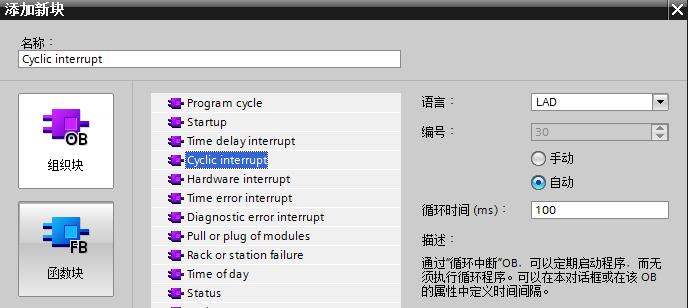{width="689" height="308"}

图 2. 添加循环中断后在属性界面修改其循环时间

2、调用 PID_Temp

在同一循环中断 OB 中，必须先调用主控制器，再调用从控制器。

首先调用指定用户设定值的最外层主控制器。

随后调用设定值由最外层主控制器指定的从控制器，依此类推。

最后调用输出到执行器的最内层从控制器。

在此例中，先调用 PID_Temp_1， 再调用 PID_Temp_2，如图 3 所示。

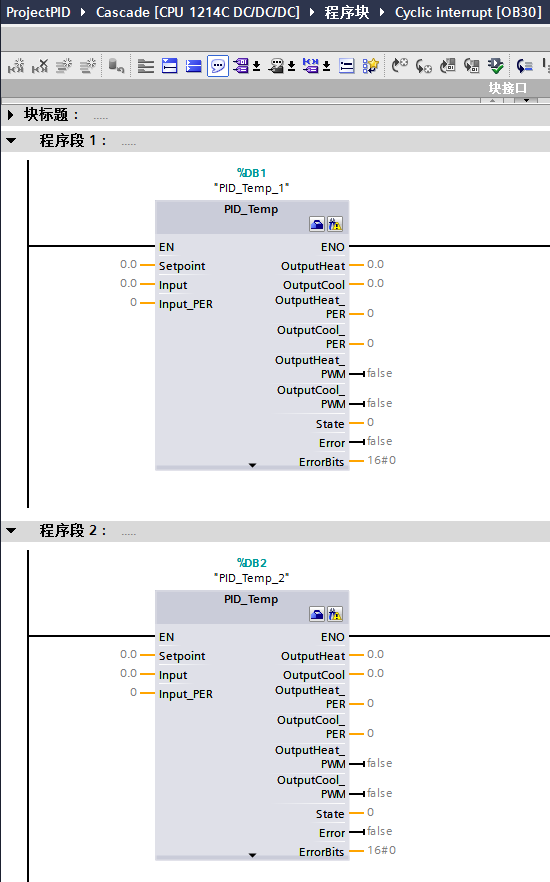{width="550" height="882"}

图 3. 在循环中断 OB 中添加 PID_Temp 指令

### 组态参数

#### 组态主控制器

1、设定值、过程值和输出值的变量互连，如图 4 所示。

主控制器的设定值是受控系统的目标值，在这里是巧克力的目标温度，创建了一个控制变量
TempSetpoint。

主控制器的过程值是最外层的过程值，在这里是巧克力的实际温度
TempChocolate，这里假设 TempChocolate 已经经过程序标定，所以直接连接到
Input。

主控制器的输出值作为从控制器的设定值，在这里通过从控制器设定值来连接。

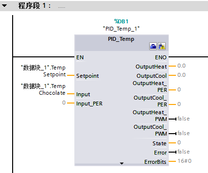{width="428" height="356"}

图 4. 连接实际变量

2、在项目树里的工艺对象下双击组态进入组态界面，如图 5 所示。

{width="168" height="99"}

图 5. 进入组态界面

3、在基本设置里分别把输入输出分别改为 Input 和 OutputHeat，如图 6 所示。

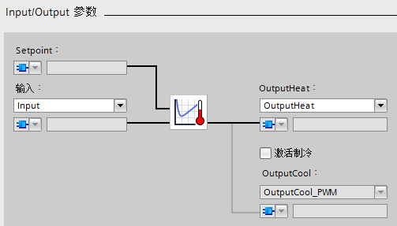{width="503" height="287"}

图 6. 设置 Input/Output

4、在级联界面里，勾选控制器为主站，表示作为主控制器，从站数量表示直接从该主控制器接收设定值的从属从控制器数量，在这里是
1 个，如图 7 所示。

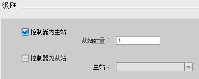{width="405" height="162"}

图 7. 设置级联参数

5、进入过程值限制界面，这里假设巧克力控制温度的绝对范围是
0-100℃，设置如图 8 所示。

{width="590" height="265"}

图 8. 设置过程值限值

6、进入输出值限制和标定界面，这里假设从控制器的水温控制范围是
0-90℃，由于主控制器的输出值是作为从控制器的设定值，所以这里的输出值限值也是
0-90，如图 9 所示。

{width="349" height="341"}

图 9. 设置输出值限值

7、进入 PID
参数的调节规则界面，在这里选择自整定参数的控制器结构，为了避免噪声引起的系统波动，这里选择
PI 结构，如图 10 所示。

{width="628" height="64"}

图 10. 设置调节规则

#### 组态从控制器

1、设定值、过程值和输出值的变量互连

在从控制器的 PID_Temp
指令上点击右键，并选择\"属性\"选项，将转到巡视窗口，如图 11 所示。

{width="1264" height="508"}

图 11. 进入巡视窗口

在巡视窗口里，进入级联界面，选中控制器是从站，并在主站选项里选择
PID_Temp_1，如图 12 所示。

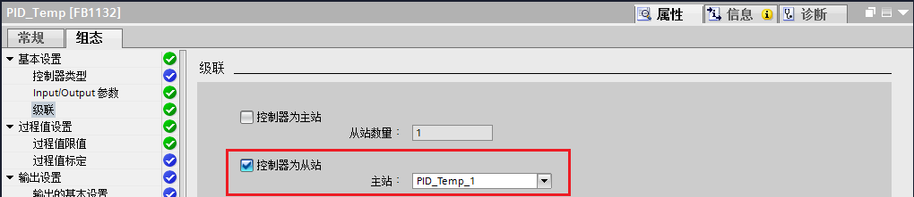{width="1020" height="221"}

图 12. 设置级联关系，关联主从控制器参数

回到调用从控制器 PID_Temp 指令处，就能看到 Setpoint 和 Master
参数自动关联了 PID_Temp_1 的 OutputHeat 和 Slave 变量，如图 13 所示。

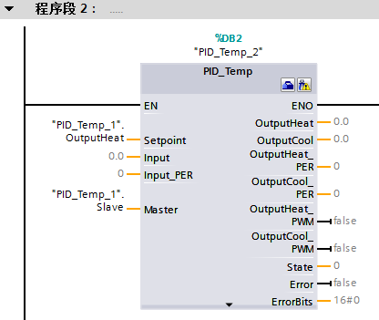{width="416" height="351"}

图 13. 关联主从控制器参数

从控制器的过程值是水的实际温度 TempWater，这里假设 TempWater
已经经过程序标定，所以直接连接到 Input。

从控制器的输出值是加热水温的执行器，这里创建了一个控制变量
HeatActor，假设后续经过程序标定后输出，如图 14 所示。

{width="473" height="370"}

图 14. 连接过程值变量

2、在项目树里的工艺对象下双击组态进入组态界面，在基本设置里分别把输入输出分别改为
Input 和 OutputHeat，如图 15 所示。

{width="503" height="287"}

图 15. 设置 Input/Output

3、进入过程值限制界面，这里假设水温度的绝对范围是 0-100℃，设置如图 16
所示。

{width="590" height="265"}

图 16. 设置过程值限值

4、进入 PID 参数的调节规则界面，这里也选择 PI 结构，如图 17 所示。

{width="628" height="64"}

图 17. 设置调节规则

### 调试

编译和加载程序后，可启动级联控制系统的调试过程。

调试时，从最内层的从控制器开始，然后逐步向外调试，直到达到最外层的主控制器。

在这里，采用自整定功能，首先调试 PID_Temp_2，然后调试 PID_Temp_1。

#### 调节从控制器

调节 PID_Temp
时要求设定值恒定。因此，激活从控制器的替代设定值以调节从控制器，或通过相应的手动值将相关主控制器设置为手动模式。这样可以确保从控制器的设定值在调节过程中保持恒定。

1、在项目树里的工艺对象下双击调试进入调试界面，如图 18 所示。

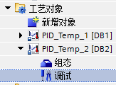{width="163" height="120"}

图 18. 工艺对象里的调试操作

2、点击测量里的 Start 按钮进行曲线采样，方便监视调节过程。如图 19 所示。

{width="328" height="92"}

图 19. 转至在线监控

3、在控制器的在线状态里选中
Subst.Setpoint（替代设定值），并输入设定值，这里假设工作点温度是
70℃，然后点击发送按钮，如图 20 所示。

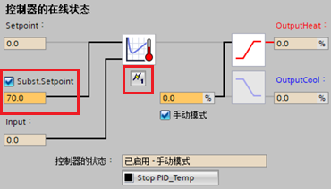{width="370" height="212"}

图 20. 设置设定值

4、调节模式选择预调节加热，点击 Start
启动调节，这时可以看到调节进度条在变化，当进度条完成时，调节状态显示系统已调节，如图
21 所示。

{width="584" height="268"}

图 21. 启动预调节

5、调节模式选择精确调节加热，点击 Start
启动调节，这时可以看到调节进度条在变化，当进度条完成时，调节状态显示系统已调节，如图
22 所示。

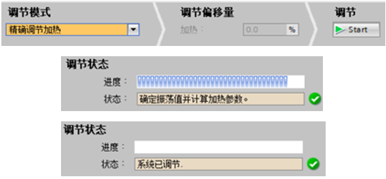{width="563" height="261"}

图 22. 启动精确调节

6、点击上传 PID 参数，把参数传递到离线项目的 PID 初始值。如图 23 所示。

{width="191" height="96"}

图 23. 上传 PID 参数

7、回到工艺对象，可以看到 PID_Temp_2 显示在线离线不一致，如图 24
所示。这是因为上一步里上传了 PID
参数到离线项目，这时为了保持一致，需要下载一下这个工艺对象。

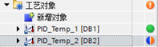{width="197" height="59"}

图 24. 工艺对象在线离线不一致

8、把之前选中的 Subst.Setpoint（替代设定值）取消，如图 25 所示。

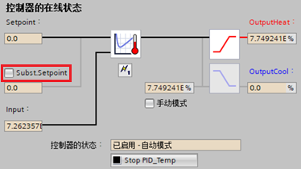{width="374" height="210"}

图 25. 取消替代设定值

#### 调节主控制器

为使主控制器对该过程产生影响或执行调节，必须将所有下游从控制器置于自动模式，且必须禁用这些从控制器的替代设定值。

主控制器会通过用于在主从控制器间（Master 参数和 Slave
参数）进行信息交换的接口对这些条件进行判断，并在 AllSlaveAutomaticState
和 NoSlaveSubstituteSetpoint 变量中显示当前状态。

相应的状态消息会在调试编辑器中输出。

1、在项目树里的工艺对象下双击调试进入调试界面，点击测量里的 Start
按钮进行曲线采样，方便监视调节过程。

2、在监控表里修改设定值，这里假设工作点温度是 60℃，如图 26 所示。

{width="583" height="105"}

图 26. 设置设定值

3、按照调节从控制器中的第 4-7 步来调节主控制器。
