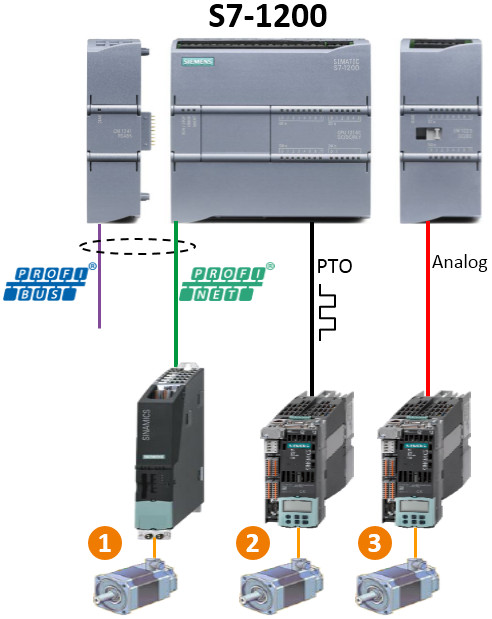
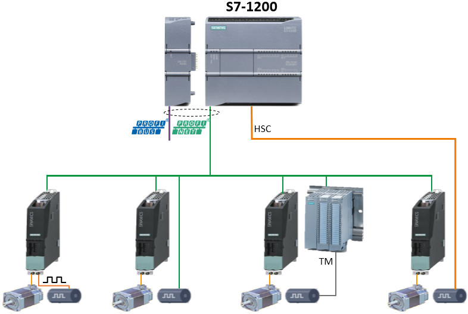
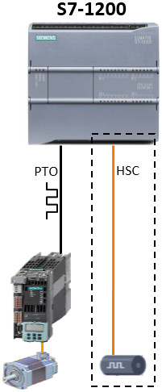
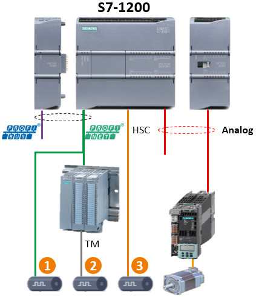

# 01 运动控制简介

S7-1200 运动控制根据连接驱动方式不同，分成三种控制方式，如图 1 所示：

1.  **PROFIdrive**：S7-1200 PLC通过基于 PROFIBUS/PROFINET 的 PROFIdrive
    方式与支持 PROFIdrive 的驱动器连接，进行运动控制。
2.  **PTO**：S7-1200 PLC 本体通过发送 PTO
    脉冲的方式控制驱动器，可以是脉冲+方向、A/B
    正交、也可以是正/反脉冲的方式。
3.  **模拟量**：S7-1200 PLC 通过输出模拟量来控制驱动器。

{width="492" height="619"}

图 1. 连接方式

## 常用文档使用链接

-   [轴资源链接](02-Resource.md)
-   [基本组态链接](03-Basic_Config.md)
-   [闭环控制组态链接](05-Close_Loop/01-Close_Loop_Param.md)
-   [运动控制指令链接](06-Instruction/01-Intro.md)
-   [常见问题链接](08-FAQ/01-FAQ.md)
-   [调试面板使用链接](07-Debug/01-Debug.md)
-   [诊断页面使用链接](07-Debug/02-Diag.md)

## 运动控制\--PROFIdrive 控制方式

PROFIdrive 是通过 PROFIBUS DP 和 PROFINET IO
连接驱动装置和编码器的标准化驱动技术配置文件。 

支持 PROFIdrive 配置文件的驱动装置都可根据 PROFIdrive
标准进行连接。控制器和驱动装置/编码器之间通过各种 PROFIdrive
消息帧进行通信。

每个消息帧都有一个标准结构。可根据具体应用，选择相应的消息帧。通过
PROFIdrive 消息帧，可传输控制字、状态字、设定值和实际值。

这种控制方式可以实现闭环控制。最常见的应用是使用标准报文 3，连接 V90
PN、S120、S210 等。

连接方式如图 2 所示。

固件 V4.1 开始的 S7-1200 CPU
才具有 PROFIdrive 的控制方式。

S7-1200
可以通过分布式的方式连接 ET200SP 的 TM PTO2 模块，或者连接 ET200MP 的 TM
PTO 4 模块使用脉冲控制驱动器，这也属于 PROFIdrive 控制方式，并非 PTO
方式。

此外通过 PROFIdrive
还可以通过分布式的方式连接控制 ET200SP 的 TM Drive
系列的模块（例如：F-TM ServoDrive ST、F-TM ServoDrive HF、F-TM StepDrive
ST 等）。

{width="786" height="528"}

图 2. PROFIdrive 连接

## 运动控制\--PTO 控制方式

PTO 的控制方式是所有版本的 S7-1200 CPU 都有的控制方式，该控制方式由 CPU
本体向轴驱动器发送高速脉冲信号（以及方向信号）来控制轴的运行。

这种控制方式是开环控制，如图 3 所示。

{width="201" height="486"}

图 3. PTO 连接

## 运动控制\--模拟量控制方式

固件 V4.1 开始的 S7-1200 PLC 的另外一种运动控制方式是模拟量控制方式。

以 CPU1215C 为例，本机集成了 2 个 AO 点，如果用户只需要 1 或 2
轴的控制，则不需要扩展模拟量模块。然而，CPU1214C 这样的
CPU，本机没有集成 AO
点，如果用户想采用模拟量控制方式，则需要扩展模拟量模块。

模拟量控制方式也是一种闭环控制方式，编码器信号有 3 种方式反馈到 S7-1200
CPU 中，如图 4 所示。

{width="423" height="490"}

图 4. 模拟量控制连接

## 运动控制组态步骤简介

1.  在 TIA Portal 软件中对 S7-1200 CPU 进行硬件组态；
2.  插入轴工艺对象，设置参数，下载项目；
3.  使用"调试面板"进行调试；**『说明』**S7-1200
    运动控制功能的调试面板是一个重要的调试工具，使用该工具的节点是在编写控制程序前，用来测试轴的硬件组件以及轴的参数是否正确。
4.  调用"工艺"程序进行编程序，并调试，最终完成项目的编写。
