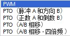

# 03 基本组态配置

## 硬件组态

本文档以DC/DC/DC 类型的S7-1200为例进行说明。在Portal 软件中插入S7-1200
CPU（DC输出类型），在"设备视图"中配置PTO。

1\. 进入CPU"常规"属性，设置"脉冲发生器"。如下图所示：

{width="675" height="576"}

2\.
常规：启用脉冲发生器，可以给该脉冲发生器起一个名字，也可以不做任何修改采用以Portal软件默认名字；可以对该脉冲发生器添加注释。

{width="508" height="249"}

3\. 参数分配：脉冲的信号类型。

{width="546" height="194"}

PTO脉冲输出有四种方式，如图所示：

{width="141" height="73"}

其中，**PTO（脉冲A和方向B）**：这种方式是比较常见的"脉冲+方向"方式，其中A点用来产生高速脉冲串，B点用来控制轴运动的方向。如下图所示。

{width="505" height="314"}

**PTO（正数A和倒数B）：**在这种方式下，当A点产生脉冲串，B点为底电平，则电机正转；相反，如果A为底电平，B产生脉冲串，则电机反转。如下如所示。

{width="516" height="254"}

**PTO（A/B相移）**：也就是常见的AB正交信号，当A相超前B相1/4周期时，电机正转；相反，当B相超前A相1/4周期时，电机反转。
如下图所示：

-   信号 A 超前信号 B 90° ⇒ 正转
-   信号 B 超前信号 A 90° ⇒ 反转

**PTO（A/B相移-四倍频）：**检测AB正交信号两个输出脉冲
的上升沿和下降沿。 一个脉冲周期有四沿两相（A 和
B）。因此，输出中的脉冲频率会减小到四分之一。如下图所示：

{width="629" height="592"}

4\. 硬件输出：根据第3步"脉冲选项"的类型，脉冲的硬件输出也相应不同。

{width="529" height="248"}

5\.
根据上面的例子，控制方式为脉冲+方向，则脉冲硬件输出的配置如上图所示。①为"脉冲输出"点，可以根据实际硬件分配情况改成其它Q点；②为"方向输出"点，也可以根据实际需要修改成其它Q点。③可以取消方向输出，这样修改后该控制方式变成了单脉冲（没有方向控制）。

6\. 硬件标识符：该PTO通道的硬件标识符是软件自动生成的，不能修改。

{width="509" height="98"}

## 添加工艺对象TO

无论是开环控制还是闭环控制方式，每一个轴都需要添加一个轴"工艺对象"，通过下图的步骤来添加轴工艺对象。

{width="975" height="725"}

轴工艺对象有两个：TO_PositioningAxis和TO_CommandTable。每个轴都至少需要插入一个工艺对象。（工艺对象TO_CommandTable将在后面进行介绍。）

{width="1100" height="627"}

①每个轴添加了工艺对象之后，都会有三个选项：组态、调试和诊断。其中，"组态"用来设置轴的参数，包括"基本参数"和"扩展参数"。如②所示。\
③每个参数页面都有状态标记，提示用户轴参数设置状态：

{width="17"
height="17"}参数配置正确，为系统默认配置，用户没有做修改；

{width="17"
height="17"}参数配置正确，不是系统默认配置，用户做过修改；

{width="17"
height="17"}参数配置没有完成或是有错误；

{width="17"
height="16"}参数组态正确，但是有报警，比如只组态了一侧的限位开关。

## 轴工艺对象组态

轴组态页面链接：

-   [基本参数-常规](04-Open_Loop/01-Position_TO/01-general.md)
-   [基本参数-驱动器](04-Open_Loop/01-Position_TO/02-drive.md)
-   [扩展参数-机械](04-Open_Loop/01-Position_TO/03-mech.md)
-   [扩展参数-位置限制](04-Open_Loop/01-Position_TO/04-limit.md)
-   [扩展参数-动态](04-Open_Loop/01-Position_TO/05-dynamic.md)
-   [扩展参数-回原点](04-Open_Loop/01-Position_TO/06-home.md)
-   [参数视图](04-Open_Loop/01-Position_TO/07-view.md)

## 命令表工艺对象组态

命令表页面链接：

-   [组态命令表](04-Open_Loop/02-Command_TO/01-intro.md)
-   [命令表中的命令](04-Open_Loop/02-Command_TO/02-command.md)
-   [命令表其他属性](04-Open_Loop/02-Command_TO/03-property.md)
-   [背景 DB 块](04-Open_Loop/02-Command_TO/04-instance.md)
-   [参数视图](04-Open_Loop/02-Command_TO/05-view.md)
-   [指令](04-Open_Loop/02-Command_TO/06-instruction.md)
