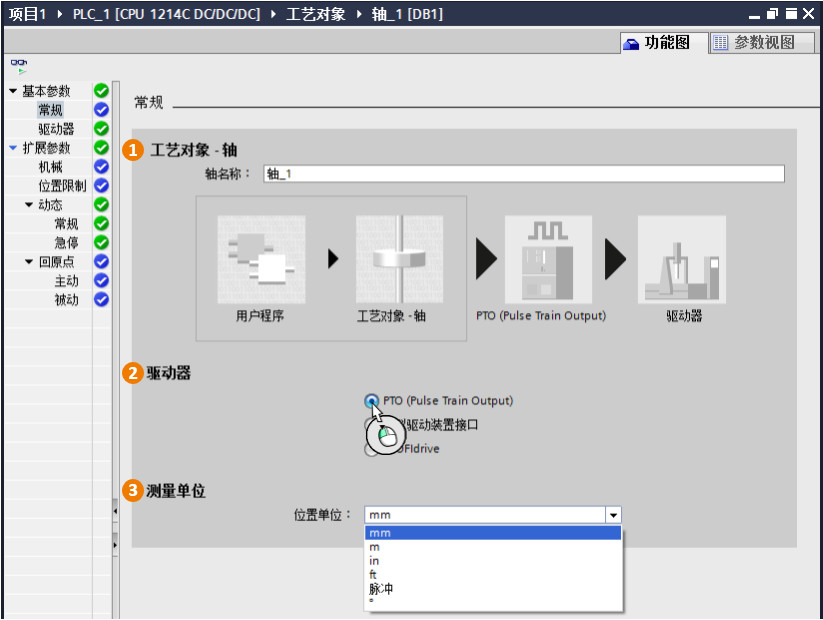

### [PTO]{#_Toc}控制方式\--工艺对象TO参数组态

添加了"工艺对象：轴\"后，可以在下图右上角看到工艺对象包含两种视图："功能图"和"参数视图"。

### [功能图\--基本参数]{#_Toc428444729}\--常规

如下图所示，基本参数中的"常规"参数包括"轴名称"，"驱动器"和"测量单位"。

{width="823" height="620"}

**①轴名称**：定义该工艺轴的名称，用户可以采用系统默认值，也可以自行定义。\
**②驱动器**：选择通过PTO（CPU输出高速脉冲）的方式控制驱动器\
**③测量单位**：Portal
软件提供了几种轴的测量单位，包括：脉冲，距离和角度。距离有mm（毫米）、m（米）、in（英寸inch）、ft（英尺foot）；角度是º（360度）。\
如果是线性工作台，一般都选择线性距离：mm（毫米）、m（米）、in（英寸inch）、ft（英尺foot）为单位；旋转工作台可以选择º（360度）。不管是什么情况，用户也可以直接选择脉冲为单位。

**『注意』**测量单位是很重要的一个参数，后面轴的参数和指令中的参数都是基于该单位进行设定的。
