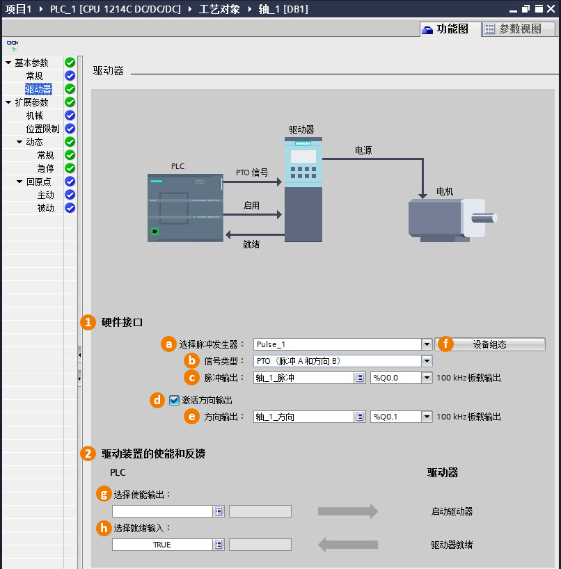

### [功能图\--基本参数]{#_Toc428444730}\--驱动器

选择PTO的方式控制驱动器，需要进行配置脉冲输出点等参数。

{width="806" height="818"}

**①硬件接口：**

> **a** **选择脉冲发生器**：选择在"设备视图"中已组态的PTO。\
> **b**
> **信号类型**：分成4种（前面已介绍过），根据驱动器信号类型进行选择。在这里以PTO（脉冲A和方向B）为例进行说明。\
> **c**
> **脉冲输出**：根据实际配置，自由定义脉冲输出点；或是选择系统默认脉冲输出点。\
> **d**
> **激活方向输出**：是否使能方向控制位。如果在b步，选择了PTO（正数A和倒数B）或是PTO（A/B相移）或是PTO（A/B相移-四倍频），则该处是灰色的，用户不能进行修改。如下图所示：
>
> {width="562" height="577"}
>
> **e**
> **方向输出**：根据实际配置，自由定义方向输出点；或是选择系统默认方向输出点。也可以去掉方向控制点，在这种情况下，用户可以选择其他输出点作为驱动器的方向信号。\
> **f**
> **设备组态**：点击该按钮可以跳转到"设备视图"，方便用户回到CPU设备属性修改组态。

**②驱动装置的使能和反馈**

> **g**
> **选择使能输出**：步进或是伺服驱动器一般都需要一个使能信号，该使能信号的作用是让驱动器通电。在这里用户可以组态一个DO点作为驱动器的使能信号。当然也可以不配置使能信号，这里为空。\
> **h**
> **选择就绪输入**："就绪信号"指的是：如果驱动器在接收到驱动器使能信号之后准备好开始执行运动时会向 
> CPU 发送"驱动器准备就绪"(Drive ready)
> 信号。这时，在?处可以选择一个DI点作为输入PLC的信号；如果驱动器不包含此类型的任何接口，则无需组态这些参数。
> 这种情况下，为准备就绪输入选择值 TRUE。
