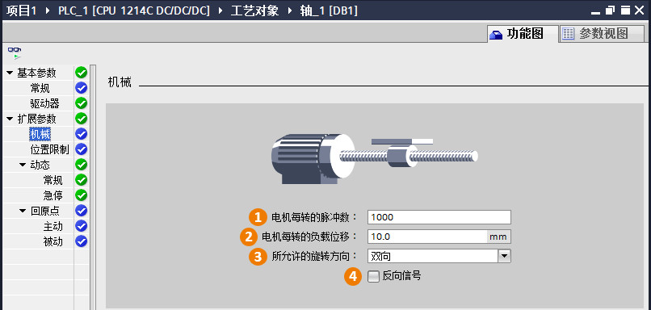

### [功能图\--扩展参数]{#_Toc428444731}\--机械

扩展参数\--机械主要设置轴的脉冲数与轴移动距离的参数对应关系。

{width="806" height="384"}

**①电机每转的脉冲数**：这是非常重要的一个参数，表示电机旋转一周需要接收多少个脉冲。该数值是根据用户的电机参数进行设置的。\
**②电机每转的负载位移**：这也是一个很重要的参数，表示电机每旋转一周，机械装置移动的距离。比如，某个直线工作台，电机每转一周，机械装置前进1mm，则该设置设置成1.0mm.

**『注意』**如果用户在前面的"测量单位"中选择了"脉冲"，则②处的参数单位就变成了"脉冲"，表示的是电机每转的脉冲个数，在这种情况下①和②的参数一样。

**③所允许的旋转方向**：有三种设置：双向、正方向和负方向。表示电机允许的旋转方向。如果尚未在"PTO（脉冲
A 和方向
B）"模式下激活脉冲发生器的方向输出，则选择受限于正方向或负方向。\
**④反向信号**：如果使能反向信号，效果是当PLC端进行正向控制电机时，电机实际是反向旋转。
